# dayu_widgets

Components for PySide

主要参考了 [AntDesign](https://ant.design/) 组件库，其他参考了 [iView](https://www.iviewui.com/) 组件库，微信基础组件。

更多在此基础上的组件插件：

* [dayu_widgets_tag](https://github.com/muyr/dayu_widgets_tag):  [中文](https://muyr.github.io/dayu_widgets_tag/#/zh-cn/) | [EN](https://muyr.github.io/dayu_widgets_tag/#/)
* [dayu_widgets_log](https://github.com/muyr/dayu_widgets_log):  [中文](https://muyr.github.io/dayu_widgets_log/#/zh-cn/) | [EN](https://muyr.github.io/dayu_widgets_log/#/)
* [dayu_widgets_overlay](https://github.com/FXTD-ODYSSEY/dayu_widgets_overlay)

提供**亮色(light)** 和 **暗色(dark)** 两种主题，每种主题可以设置主题颜色。
以下截图以：

* 亮色 #1890ff
* 暗色 #fa8c16

## General


### MPushButton(<- QPushButton)


### MLabel (<- QLabel)
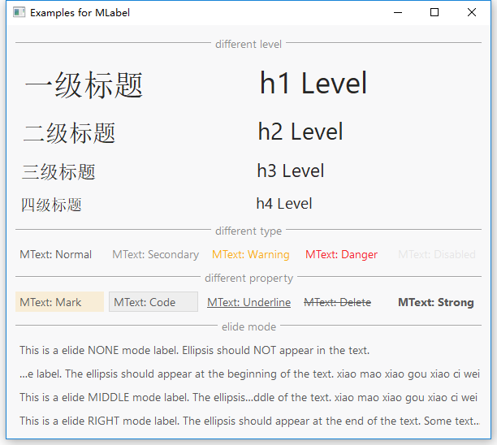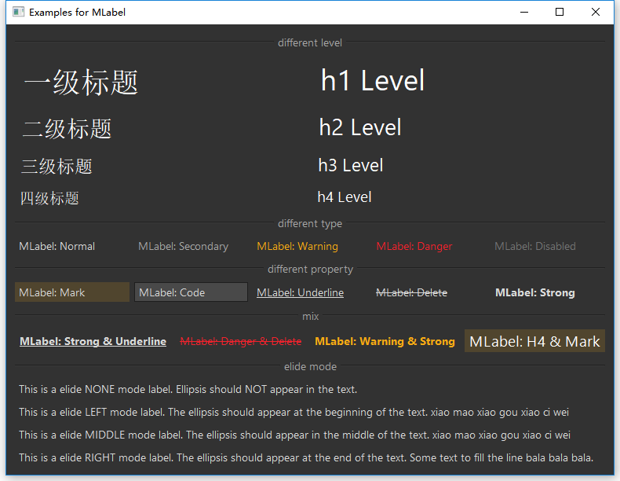

### MLoading (<- QWidget)
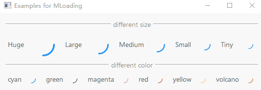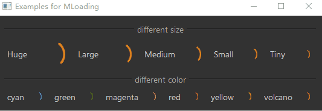

### MToolButton (<- QToolButton)
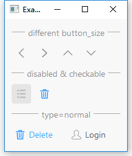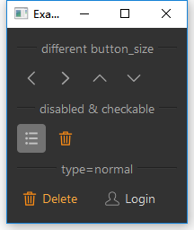

## Navigation


### MBreadcrumb (<- QWidget)
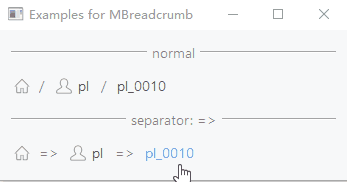

### MMenuTabWidget (<- QWidget)
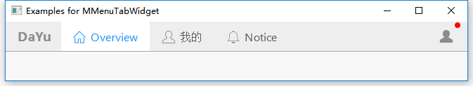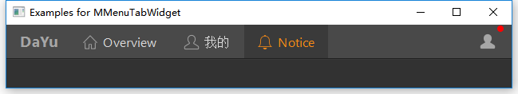

### MPage (<- QWidget)


## Data Entry


### MCheckBox <- QCheckBox
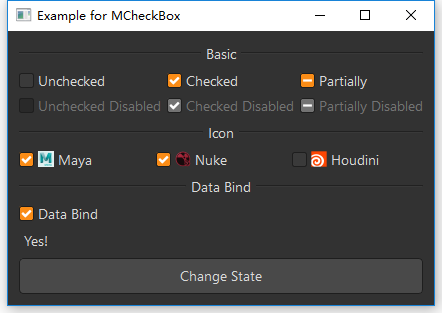

### MClickBrowserFilePushButton <- MPushButton
### MClickBrowserFileToolButton <- MToolButton
### MClickBrowserFolderPushButton <- MPushButton
### MClickBrowserFolderToolButton <- MToolButton
### MDragFileButton <- MToolButton
### MDragFolderButton <- MToolButton
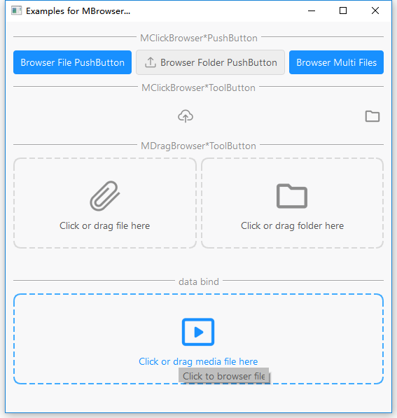

### MLineEdit <- QLineEdit
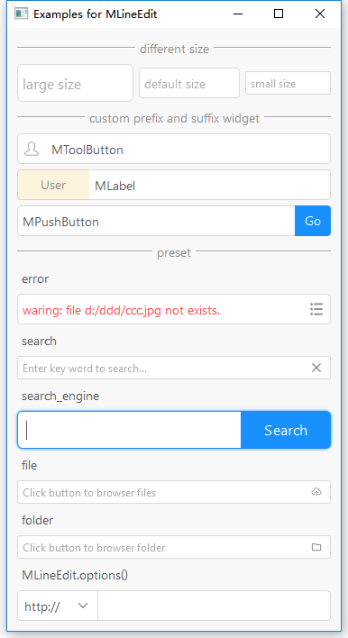

### MRadioButton <- QRadioButton


### MSwitch <- QRadioButton
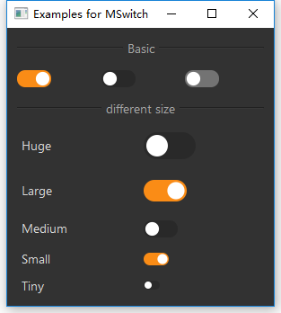

### MSilder <- QSlider
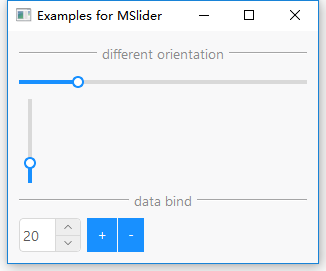

### MSpinBox <- QSpinBox
### MDoubleSpinBox  <- QDoubleSpinBox
### MDateTimeEdit <- QDateTimeEdit
### MDateEdit <- QDateEdit
### MTimeEdit <- QTimeEdit
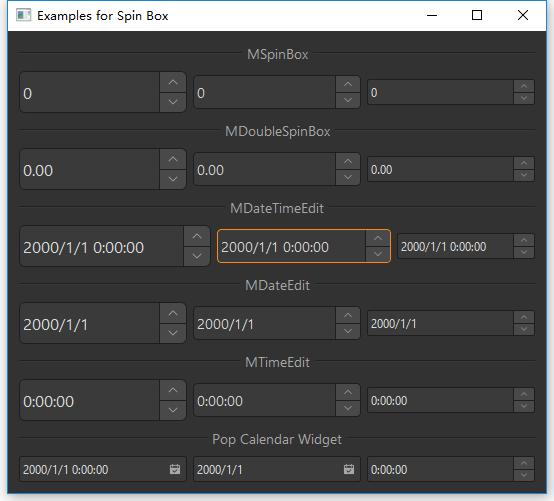


## Data Display


### MAvatar <- QLabel


### MBadge <- QWidget


### MCarousel <- QGraphicsView
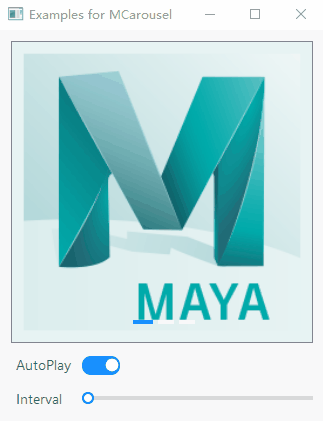

### MCard <- QWidget


### MCollapse <- QWidget


### MLineTabWidget <- QWidget
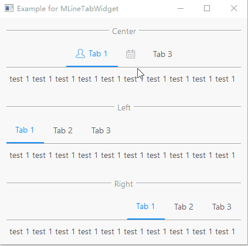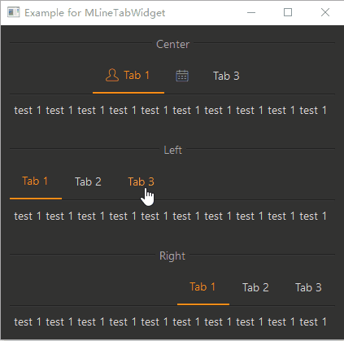

### MTag <- QLabel
### MCheckableTag <- QCheckBox
### MNewTag <- QWidget
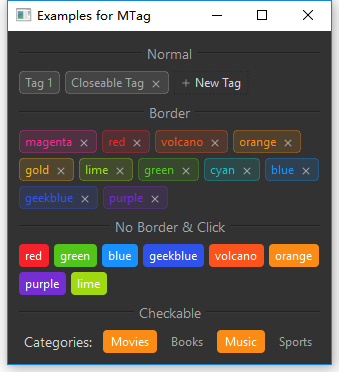


## Feedback


### MAlert <- QWidget
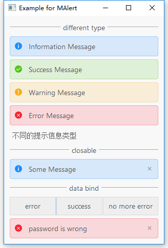

### MDrawer <- QWidget


### MMessage <- QWidget
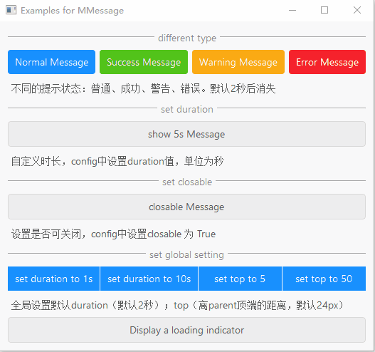

### MProgressBar <- QProgressBar


### MProgressCircle <- QProgressBar


### MToast <- QWidget
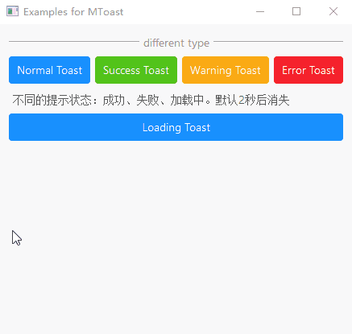

## Other

### MDivider <- QWidget
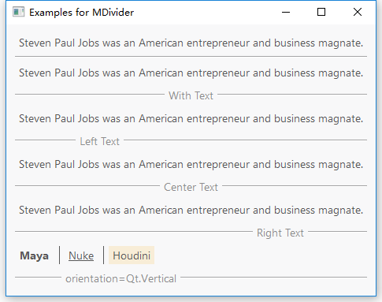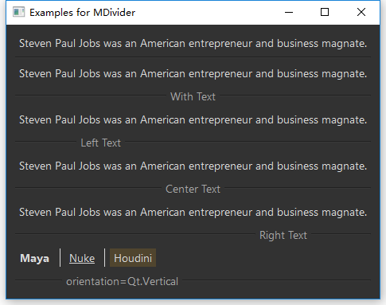


# 如何贡献代码

## 安装poetry
``shell
pip install poetry
``
## 安装依赖
```shell
poetry install
```

## 运行单元测试
```shell
poetry run pytest
```

## 运行 black检查
```shell
poetry run black dayu_widgets
```
## 运行isort
```shell
poetry run isort dayu_widgets
```

## 提交代码
```shell
poetry run cz commit
```