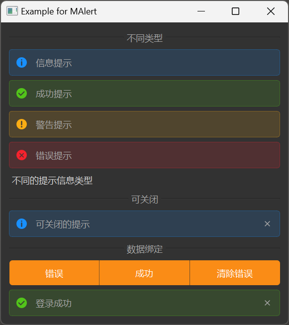

# MAlert

MAlert is an alert component used to display important prompt information. It supports four different types of alerts, can include icons and text content, and can be set to be closable.

## Import

```python
from dayu_widgets.alert import MAlert
```

## Examples

### Basic Usage

MAlert can create different types of alerts, including information, success, warning, and error.

```python
from dayu_widgets.alert import MAlert

# Create an information alert
info_alert = MAlert(text="This is an information message").info()

# Create a success alert
success_alert = MAlert(text="This is a success message").success()

# Create a warning alert
warning_alert = MAlert(text="This is a warning message").warning()

# Create an error alert
error_alert = MAlert(text="This is an error message").error()
```

### Closable Alert

MAlert supports creating closable alerts that users can remove by clicking the close button.

```python
from dayu_widgets.alert import MAlert

# Create a closable alert
closable_alert = MAlert(text="This is a closable message").info().closable()
```

### Hide Icon

MAlert displays an icon by default, which can be hidden using the `set_show_icon` method.

```python
from dayu_widgets.alert import MAlert

# Create an alert without an icon
alert = MAlert(text="This is a message without an icon").info()
alert.set_show_icon(False)
```

### Dynamically Change Content

The content of MAlert can be dynamically changed, and when the content is empty, the alert will automatically hide.

```python
from dayu_widgets.alert import MAlert

# Create an alert
alert = MAlert(text="This is a warning message").warning()

# Change the content
alert.set_dayu_text("Content has been changed")

# Clear the content (will automatically hide)
alert.set_dayu_text("")
```

### Data Binding

MAlert can be used with MFieldMixin for data binding.

```python
# Import third-party modules
from qtpy import QtWidgets

# Import local modules
from dayu_widgets.alert import MAlert
from dayu_widgets.field_mixin import MFieldMixin
from dayu_widgets.push_button import MPushButton
import functools


class AlertBindExample(QtWidgets.QWidget, MFieldMixin):
    def __init__(self, parent=None):
        super(AlertBindExample, self).__init__(parent)
        self._init_ui()

    def _init_ui(self):
        # Create alert
        data_bind_alert = MAlert(parent=self)
        data_bind_alert.set_closable(True)

        # Register field and bind
        self.register_field("msg", "")
        self.register_field("msg_type", MAlert.InfoType)
        self.bind("msg", data_bind_alert, "dayu_text")
        self.bind("msg_type", data_bind_alert, "dayu_type")

        # Create buttons
        error_button = MPushButton(text="Show Error").danger()
        success_button = MPushButton(text="Show Success").success()
        clear_button = MPushButton(text="Clear Message")

        # Connect button click events
        error_button.clicked.connect(functools.partial(self.slot_change_alert, "Password is wrong", MAlert.ErrorType))
        success_button.clicked.connect(functools.partial(self.slot_change_alert, "Login success", MAlert.SuccessType))
        clear_button.clicked.connect(functools.partial(self.slot_change_alert, "", MAlert.InfoType))

        # Create layout
        button_lay = QtWidgets.QHBoxLayout()
        button_lay.addWidget(error_button)
        button_lay.addWidget(success_button)
        button_lay.addWidget(clear_button)

        main_lay = QtWidgets.QVBoxLayout()
        main_lay.addLayout(button_lay)
        main_lay.addWidget(data_bind_alert)
        self.setLayout(main_lay)

    def slot_change_alert(self, alert_text, alert_type):
        """Change the content and type of the alert"""
        self.set_field("msg_type", alert_type)
        self.set_field("msg", alert_text)
```

### Complete Example



Here's a complete example demonstrating various uses of MAlert:

```python
# Import built-in modules
import functools

# Import third-party modules
from qtpy import QtWidgets

# Import local modules
from dayu_widgets.alert import MAlert
from dayu_widgets.button_group import MPushButtonGroup
from dayu_widgets.divider import MDivider
from dayu_widgets.field_mixin import MFieldMixin
from dayu_widgets.label import MLabel


class AlertExample(QtWidgets.QWidget, MFieldMixin):
    def __init__(self, parent=None):
        super(AlertExample, self).__init__(parent)
        self.setWindowTitle("Example for MAlert")
        self._init_ui()

    def _init_ui(self):
        main_lay = QtWidgets.QVBoxLayout()
        self.setLayout(main_lay)
        main_lay.addWidget(MDivider("different type"))
        main_lay.addWidget(MAlert(text="Information Message", parent=self).info())
        main_lay.addWidget(MAlert(text="Success Message", parent=self).success())
        main_lay.addWidget(MAlert(text="Warning Message", parent=self).warning())
        main_lay.addWidget(MAlert(text="Error Message", parent=self).error())

        closable_alert = MAlert("Some Message", parent=self).closable()

        main_lay.addWidget(MLabel("Different types of alert messages"))
        main_lay.addWidget(MDivider("closable"))
        main_lay.addWidget(closable_alert)
        main_lay.addWidget(MDivider("data bind"))
        self.register_field("msg", "")
        self.register_field("msg_type", MAlert.InfoType)

        data_bind_alert = MAlert(parent=self)
        data_bind_alert.set_closable(True)

        self.bind("msg", data_bind_alert, "dayu_text")
        self.bind("msg_type", data_bind_alert, "dayu_type")
        button_grp = MPushButtonGroup()
        button_grp.set_button_list(
            [
                {
                    "text": "error",
                    "clicked": functools.partial(self.slot_change_alert, "password is wrong", MAlert.ErrorType),
                },
                {
                    "text": "success",
                    "clicked": functools.partial(self.slot_change_alert, "login success", MAlert.SuccessType),
                },
                {
                    "text": "no more error",
                    "clicked": functools.partial(self.slot_change_alert, "", MAlert.InfoType),
                },
            ]
        )
        main_lay.addWidget(button_grp)
        main_lay.addWidget(data_bind_alert)
        main_lay.addStretch()

    def slot_change_alert(self, alert_text, alert_type):
        self.set_field("msg_type", alert_type)
        self.set_field("msg", alert_text)


if __name__ == "__main__":
    # Import local modules
    from dayu_widgets import dayu_theme
    from dayu_widgets.qt import application

    with application() as app:
        test = AlertExample()
        dayu_theme.apply(test)
        test.show()
```

## API

### Constructor

```python
MAlert(text="", parent=None, flags=QtCore.Qt.Widget)
```

| Parameter | Description | Type | Default Value |
| --- | --- | --- | --- |
| `text` | Alert text | `str` | `""` |
| `parent` | Parent widget | `QWidget` | `None` |
| `flags` | Window flags | `Qt.WindowFlags` | `QtCore.Qt.Widget` |

### Class Constants

| Constant | Description | Value |
| --- | --- | --- |
| `InfoType` | Information type | `"info"` |
| `SuccessType` | Success type | `"success"` |
| `WarningType` | Warning type | `"warning"` |
| `ErrorType` | Error type | `"error"` |

### Methods

| Method | Description | Parameters | Return Value |
| --- | --- | --- | --- |
| `set_closable(closable)` | Set whether the alert is closable | `closable`: Boolean | None |
| `set_show_icon(show_icon)` | Set whether to show the icon | `show_icon`: Boolean | None |
| `set_dayu_text(value)` | Set the alert text | `value`: Text content | None |
| `get_dayu_text()` | Get the alert text | None | `str` |
| `set_dayu_type(value)` | Set the alert type | `value`: Type value | None |
| `get_dayu_type()` | Get the alert type | None | `str` |
| `info()` | Set to information type | None | `self` |
| `success()` | Set to success type | None | `self` |
| `warning()` | Set to warning type | None | `self` |
| `error()` | Set to error type | None | `self` |
| `closable()` | Set to closable | None | `self` |

### Properties

| Property | Description | Type | Default Value |
| --- | --- | --- | --- |
| `dayu_text` | Alert text | `str` | `""` |
| `dayu_type` | Alert type | `str` | `InfoType` |

## Frequently Asked Questions

### How to create different types of alerts?

You can create different types of alerts using MAlert's class methods:

```python
from dayu_widgets.alert import MAlert

# Create an information alert
info_alert = MAlert(text="This is an information message").info()

# Create a success alert
success_alert = MAlert(text="This is a success message").success()

# Create a warning alert
warning_alert = MAlert(text="This is a warning message").warning()

# Create an error alert
error_alert = MAlert(text="This is an error message").error()
```

### How to create a closable alert?

You can create a closable alert using the `closable()` method or the `set_closable(True)` method:

```python
from dayu_widgets.alert import MAlert

# Using the closable() method
closable_alert_1 = MAlert(text="This is a closable message").info().closable()

# Using the set_closable(True) method
closable_alert_2 = MAlert(text="This is a closable message").info()
closable_alert_2.set_closable(True)
```

### How to hide the alert icon?

You can hide the alert icon using the `set_show_icon(False)` method:

```python
from dayu_widgets.alert import MAlert

# Create an alert without an icon
alert = MAlert(text="This is a message without an icon").info()
alert.set_show_icon(False)
```

### How to dynamically change the content and type of an alert?

You can dynamically change the content and type of an alert using the `set_dayu_text` and `set_dayu_type` methods:

```python
from dayu_widgets.alert import MAlert

# Create an alert
alert = MAlert(text="This is an information message").info()

# Change the content
alert.set_dayu_text("Content has been changed")

# Change the type
alert.set_dayu_type(MAlert.WarningType)

# Or use class methods to change the type
alert.warning()
```

### When does an alert automatically hide?

An alert automatically hides when its content is empty:

```python
from dayu_widgets.alert import MAlert

# Create an alert
alert = MAlert(text="This is a warning message").warning()

# Clear the content (will automatically hide)
alert.set_dayu_text("")
```
