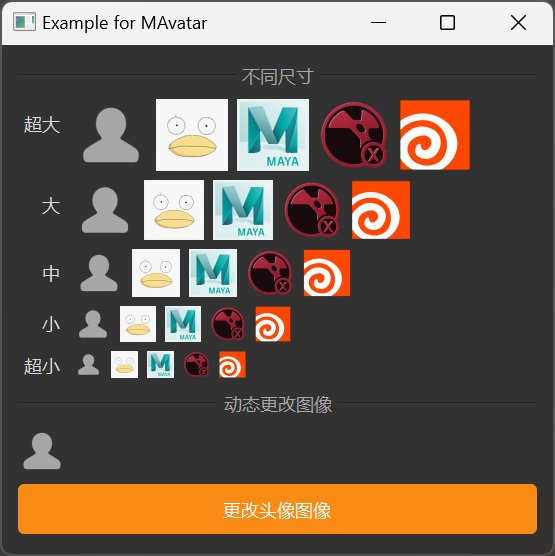

# MAvatar

MAvatar is an avatar component used to display images of people or objects. It provides different size options and supports setting custom images.

## Import

```python
from dayu_widgets.avatar import MAvatar
```

## Examples

### Basic Usage

MAvatar can create a simple avatar component that displays a default user icon.

```python
from dayu_widgets.avatar import MAvatar

# Create a default avatar
avatar = MAvatar()
```

### Setting an Image

MAvatar can set a custom image using the `set_dayu_image` method.

```python
from dayu_widgets.avatar import MAvatar
from dayu_widgets.qt import MPixmap

# Create an avatar with a custom image
avatar = MAvatar()
avatar.set_dayu_image(MPixmap("avatar.png"))
```

### Different Sizes

MAvatar supports different sizes, which can be set using class methods or the `set_dayu_size` method.

```python
from dayu_widgets.avatar import MAvatar
from dayu_widgets.qt import MPixmap
from dayu_widgets import dayu_theme

# Create avatars of different sizes using class methods
avatar_huge = MAvatar.huge()
avatar_large = MAvatar.large()
avatar_medium = MAvatar.medium()
avatar_small = MAvatar.small()
avatar_tiny = MAvatar.tiny()

# Set size using the set_dayu_size method
avatar = MAvatar()
avatar.set_dayu_size(dayu_theme.large)
```

### Different Sizes with Images

MAvatar's class methods also support directly setting an image.

```python
from dayu_widgets.avatar import MAvatar
from dayu_widgets.qt import MPixmap

# Create avatars of different sizes with images
avatar_large = MAvatar.large(MPixmap("avatar.png"))
avatar_small = MAvatar.small(MPixmap("app-maya.png"))
```

### Dynamically Changing the Image

MAvatar can dynamically change its image.

```python
# Import third-party modules
from qtpy import QtWidgets

# Import local modules
from dayu_widgets.avatar import MAvatar
from dayu_widgets.field_mixin import MFieldMixin
from dayu_widgets.push_button import MPushButton
from dayu_widgets.qt import MPixmap


class AvatarExample(QtWidgets.QWidget, MFieldMixin):
    def __init__(self, parent=None):
        super(AvatarExample, self).__init__(parent)
        self._init_ui()

    def _init_ui(self):
        # Create avatar and image list
        self.avatar = MAvatar()
        self.pix_map_list = [
            None,
            MPixmap("avatar.png"),
            MPixmap("app-maya.png"),
            MPixmap("app-nuke.png"),
            MPixmap("app-houdini.png"),
        ]

        # Register field and bind
        self.register_field("image", None)
        self.bind("image", self.avatar, "dayu_image")

        # Create button
        button = MPushButton(text="Change Avatar Image").primary()
        button.clicked.connect(self.slot_change_image)

        # Create layout
        main_lay = QtWidgets.QVBoxLayout()
        main_lay.addWidget(self.avatar)
        main_lay.addWidget(button)
        self.setLayout(main_lay)

    def slot_change_image(self):
        """Set the Avatar image randomly."""
        # Import built-in modules
        import random

        self.set_field("image", random.choice(self.pix_map_list))
```

### Complete Example



Here's a complete example demonstrating various uses of MAvatar:

```python
# Import third-party modules
from qtpy import QtCore
from qtpy import QtWidgets

# Import local modules
from dayu_widgets import dayu_theme
from dayu_widgets.avatar import MAvatar
from dayu_widgets.divider import MDivider
from dayu_widgets.field_mixin import MFieldMixin
from dayu_widgets.label import MLabel
from dayu_widgets.push_button import MPushButton
from dayu_widgets.qt import MPixmap


class AvatarExample(QtWidgets.QWidget, MFieldMixin):
    def __init__(self, parent=None):
        super(AvatarExample, self).__init__(parent)
        self.setWindowTitle("Example for MAvatar")
        self._init_ui()

    def _init_ui(self):
        main_lay = QtWidgets.QVBoxLayout()
        main_lay.addWidget(MDivider("different size"))

        size_list = [
            ("Huge", MAvatar.huge),
            ("Large", MAvatar.large),
            ("Medium", MAvatar.medium),
            ("Small", MAvatar.small),
            ("Tiny", MAvatar.tiny),
        ]

        self.pix_map_list = [
            None,
            MPixmap("avatar.png"),
            MPixmap("app-maya.png"),
            MPixmap("app-nuke.png"),
            MPixmap("app-houdini.png"),
        ]
        form_lay = QtWidgets.QFormLayout()
        form_lay.setLabelAlignment(QtCore.Qt.AlignRight)

        for label, cls in size_list:
            h_lay = QtWidgets.QHBoxLayout()
            for image in self.pix_map_list:
                avatar_tmp = cls(image)
                h_lay.addWidget(avatar_tmp)
            h_lay.addStretch()
            form_lay.addRow(MLabel(label), h_lay)
        main_lay.addLayout(form_lay)

        self.register_field("image", None)
        main_lay.addWidget(MDivider("different image"))
        avatar = MAvatar()
        self.bind("image", avatar, "dayu_image")
        button = MPushButton(text="Change Avatar Image").primary()
        button.clicked.connect(self.slot_change_image)

        main_lay.addWidget(avatar)
        main_lay.addWidget(button)
        main_lay.addStretch()
        self.setLayout(main_lay)

    def slot_change_image(self):
        """Set the Avatar image random by data bind."""
        # Import built-in modules
        import random

        self.set_field("image", random.choice(self.pix_map_list))


if __name__ == "__main__":
    # Import local modules
    from dayu_widgets import dayu_theme
    from dayu_widgets.qt import application

    with application() as app:
        test = AvatarExample()
        dayu_theme.apply(test)
        test.show()
```

## API

### Constructor

```python
MAvatar(parent=None, flags=QtCore.Qt.Widget)
```

| Parameter | Description | Type | Default Value |
| --- | --- | --- | --- |
| `parent` | Parent widget | `QWidget` | `None` |
| `flags` | Window flags | `Qt.WindowFlags` | `QtCore.Qt.Widget` |

### Methods

| Method | Description | Parameters | Return Value |
| --- | --- | --- | --- |
| `set_dayu_size(value)` | Set the avatar size | `value`: Size value | None |
| `get_dayu_size()` | Get the avatar size | None | `int` |
| `set_dayu_image(value)` | Set the avatar image | `value`: QPixmap object or None | None |
| `get_dayu_image()` | Get the avatar image | None | `QPixmap` |

### Class Methods

| Method | Description | Parameters | Return Value |
| --- | --- | --- | --- |
| `huge(image=None)` | Create a huge size avatar | `image`: QPixmap object or None | `MAvatar` instance |
| `large(image=None)` | Create a large size avatar | `image`: QPixmap object or None | `MAvatar` instance |
| `medium(image=None)` | Create a medium size avatar | `image`: QPixmap object or None | `MAvatar` instance |
| `small(image=None)` | Create a small size avatar | `image`: QPixmap object or None | `MAvatar` instance |
| `tiny(image=None)` | Create a tiny size avatar | `image`: QPixmap object or None | `MAvatar` instance |

### Properties

| Property | Description | Type | Default Value |
| --- | --- | --- | --- |
| `dayu_image` | The avatar image | `QPixmap` | Default user icon |
| `dayu_size` | The avatar size | `int` | `dayu_theme.default_size` |

## Frequently Asked Questions

### How to set a custom image?

You can set a custom image using the `set_dayu_image` method or the `dayu_image` property:

```python
from dayu_widgets.avatar import MAvatar
from dayu_widgets.qt import MPixmap

# Using the set_dayu_image method
avatar = MAvatar()
avatar.set_dayu_image(MPixmap("avatar.png"))

# Using the dayu_image property
avatar = MAvatar()
avatar.setProperty("dayu_image", MPixmap("avatar.png"))
```

### How to set the avatar size?

You can set the avatar size using the `set_dayu_size` method, the `dayu_size` property, or class methods:

```python
from dayu_widgets.avatar import MAvatar
from dayu_widgets import dayu_theme

# Using the set_dayu_size method
avatar = MAvatar()
avatar.set_dayu_size(dayu_theme.large)

# Using the dayu_size property
avatar = MAvatar()
avatar.setProperty("dayu_size", dayu_theme.large)

# Using class methods
avatar = MAvatar.large()
```

### How is image scaling handled?

MAvatar automatically scales the image to fit the avatar size while maintaining the image's aspect ratio. If the image is empty or invalid, a default user icon will be displayed.

### How to use MAvatar with other components?

MAvatar can be used with other components, for example, with MBadge:

```python
from dayu_widgets.avatar import MAvatar
from dayu_widgets.badge import MBadge
from dayu_widgets.qt import MPixmap

# Create an avatar with a badge
avatar = MAvatar.large(MPixmap("avatar.png"))
badge = MBadge.dot(True, widget=avatar)
```
