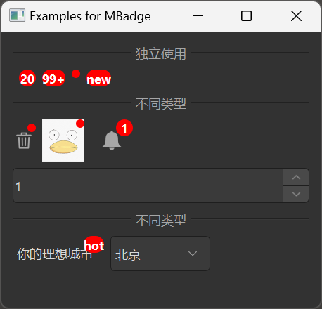

# MBadge

MBadge is a badge component used to display notification numbers, text, or status dots. It typically appears in the top-right corner of notification icons, avatars, or buttons to display the number of unread messages or to draw the user's attention to certain content.

## Import

```python
from dayu_widgets.badge import MBadge
```

## Examples

### Basic Usage

MBadge can be used standalone or to wrap other components.

```python
from dayu_widgets.badge import MBadge

# Create a standalone badge displaying a number
badge_count = MBadge.count(20)

# Create a standalone badge displaying a dot
badge_dot = MBadge.dot(True)

# Create a standalone badge displaying text
badge_text = MBadge.text("new")
```

### Wrapping Other Components

MBadge can wrap other components to display a badge in their top-right corner.

```python
from dayu_widgets.badge import MBadge
from dayu_widgets.tool_button import MToolButton
from dayu_widgets.avatar import MAvatar
from dayu_widgets.qt import MPixmap

# Create a button with a dot badge
button = MToolButton().svg("trash_line.svg")
badge_button = MBadge.dot(True, widget=button)

# Create an avatar with a dot badge
avatar = MAvatar.large(MPixmap("avatar.png"))
badge_avatar = MBadge.dot(True, widget=avatar)

# Create a button with a count badge
button_alert = MToolButton().svg("alert_fill.svg").large()
badge_count = MBadge.count(5, widget=button_alert)
```

### Number Badge

MBadge can display a number, and when the number exceeds a set maximum value, it will be displayed as "max+".

```python
from dayu_widgets.badge import MBadge
from dayu_widgets.tool_button import MToolButton

# Create a button with a count badge
button = MToolButton().svg("alert_fill.svg").large()
badge = MBadge.count(99, widget=button)

# Set the maximum value to 10, when the number exceeds 10, it will be displayed as "10+"
badge.set_dayu_overflow(10)
badge.set_dayu_count(15)  # Will be displayed as "10+"
```

### Text Badge

MBadge can display text, such as "new", "hot", etc.

```python
from dayu_widgets.badge import MBadge
from dayu_widgets.label import MLabel
from dayu_widgets.combo_box import MComboBox
from dayu_widgets.menu import MMenu

# Create a label with a text badge
label = MLabel("Your Ideal City  ")
badge_hot = MBadge.text("hot", widget=label)

# Create a dropdown menu
menu = MMenu(parent=self)
menu.set_data(["Beijing", "Shanghai", "Guangzhou", "Shenzhen"])
select = MComboBox()
select.set_menu(menu)

# Place the label and dropdown menu together
layout = QtWidgets.QHBoxLayout()
layout.addWidget(badge_hot)
layout.addWidget(select)
```

### Dynamically Changing the Badge

The state of MBadge can be dynamically changed.

```python
from dayu_widgets.badge import MBadge
from dayu_widgets.tool_button import MToolButton
from dayu_widgets.spin_box import MSpinBox

# Create a button with a dot badge
button = MToolButton().svg("trash_line.svg")
badge = MBadge.dot(True, widget=button)

# Hide the dot when the button is clicked
button.clicked.connect(lambda: badge.set_dayu_dot(False))

# Create a button with a count badge
button_alert = MToolButton().svg("alert_fill.svg").large()
badge_count = MBadge.count(1, widget=button_alert)

# Create a spin box to change the badge number
spin_box = MSpinBox()
spin_box.setRange(0, 9999)
spin_box.valueChanged.connect(badge_count.set_dayu_count)
spin_box.setValue(1)
```

### Complete Example



Here's a complete example demonstrating various uses of MBadge:

```python
# Import third-party modules
from qtpy import QtWidgets

# Import local modules
from dayu_widgets import dayu_theme
from dayu_widgets.avatar import MAvatar
from dayu_widgets.badge import MBadge
from dayu_widgets.combo_box import MComboBox
from dayu_widgets.divider import MDivider
from dayu_widgets.field_mixin import MFieldMixin
from dayu_widgets.label import MLabel
from dayu_widgets.menu import MMenu
from dayu_widgets.qt import MPixmap
from dayu_widgets.spin_box import MSpinBox
from dayu_widgets.tool_button import MToolButton


class BadgeExample(QtWidgets.QWidget, MFieldMixin):
    def __init__(self, parent=None):
        super(BadgeExample, self).__init__(parent)
        self.setWindowTitle("Examples for MBadge")
        self._init_ui()

    def _init_ui(self):
        standalone_lay = QtWidgets.QHBoxLayout()
        standalone_lay.addWidget(MBadge.count(0))
        standalone_lay.addWidget(MBadge.count(20))
        standalone_lay.addWidget(MBadge.count(100))
        standalone_lay.addWidget(MBadge.dot(True))
        standalone_lay.addWidget(MBadge.text("new"))
        standalone_lay.addStretch()

        button = MToolButton().svg("trash_line.svg")
        avatar = MAvatar.large(MPixmap("avatar.png"))
        button_alert = MToolButton().svg("alert_fill.svg").large()
        badge_1 = MBadge.dot(True, widget=button)
        badge_2 = MBadge.dot(True, widget=avatar)
        badge_3 = MBadge.dot(True, widget=button_alert)
        button.clicked.connect(lambda: badge_1.set_dayu_dot(False))

        spin_box = MSpinBox()
        spin_box.setRange(0, 9999)
        spin_box.valueChanged.connect(badge_3.set_dayu_count)
        spin_box.setValue(1)

        self.register_field("button1_selected", "Beijing")
        menu1 = MMenu(parent=self)
        menu1.set_data(["Beijing", "Shanghai", "Guangzhou", "Shenzhen"])
        select1 = MComboBox()
        select1.set_menu(menu1)
        self.bind("button1_selected", select1, "value", signal="sig_value_changed")

        badge_hot = MBadge.text("hot", widget=MLabel("Your Ideal City  "))

        sub_lay1 = QtWidgets.QHBoxLayout()
        sub_lay1.addWidget(badge_1)
        sub_lay1.addWidget(badge_2)
        sub_lay1.addWidget(badge_3)
        sub_lay1.addStretch()

        sub_lay2 = QtWidgets.QHBoxLayout()
        sub_lay2.addWidget(badge_hot)
        sub_lay2.addWidget(select1)
        sub_lay2.addStretch()

        main_lay = QtWidgets.QVBoxLayout()
        main_lay.addWidget(MDivider("use standalone"))
        main_lay.addLayout(standalone_lay)
        main_lay.addWidget(MDivider("different type"))
        main_lay.addLayout(sub_lay1)
        main_lay.addWidget(spin_box)
        main_lay.addWidget(MDivider("different type"))
        main_lay.addLayout(sub_lay2)
        main_lay.addStretch()
        self.setLayout(main_lay)


if __name__ == "__main__":
    # Import local modules
    from dayu_widgets.qt import application

    with application() as app:
        test = BadgeExample()
        dayu_theme.apply(test)
        test.show()
```

## API

### Constructor

```python
MBadge(widget=None, parent=None)
```

| Parameter | Description | Type | Default Value |
| --- | --- | --- | --- |
| `widget` | Widget to wrap | `QWidget` | `None` |
| `parent` | Parent widget | `QWidget` | `None` |

### Methods

| Method | Description | Parameters | Return Value |
| --- | --- | --- | --- |
| `get_dayu_overflow()` | Get the overflow number | None | `int` |
| `set_dayu_overflow(num)` | Set the overflow number | `num`: Maximum number to display | None |
| `get_dayu_dot()` | Get whether the dot is shown | None | `bool` |
| `set_dayu_dot(show)` | Set whether to show the dot | `show`: Whether to show | None |
| `get_dayu_count()` | Get the current count | None | `int` |
| `set_dayu_count(num)` | Set the current count | `num`: Count value | None |
| `get_dayu_text()` | Get the current text | None | `str` |
| `set_dayu_text(text)` | Set the current text | `text`: Text content | None |

### Class Methods

| Method | Description | Parameters | Return Value |
| --- | --- | --- | --- |
| `dot(show=False, widget=None)` | Create a dot badge | `show`: Whether to show the dot<br>`widget`: Widget to wrap | `MBadge` instance |
| `count(count=0, widget=None)` | Create a count badge | `count`: Count value<br>`widget`: Widget to wrap | `MBadge` instance |
| `text(text="", widget=None)` | Create a text badge | `text`: Text content<br>`widget`: Widget to wrap | `MBadge` instance |

### Properties

| Property | Description | Type | Default Value |
| --- | --- | --- | --- |
| `dayu_overflow` | Overflow number | `int` | `99` |
| `dayu_dot` | Whether to show the dot | `bool` | `False` |
| `dayu_count` | Current count | `int` | `None` |
| `dayu_text` | Current text | `str` | `None` |

## Frequently Asked Questions

### How to create a standalone badge?

You can create standalone badges using MBadge's class methods:

```python
from dayu_widgets.badge import MBadge

# Create a badge displaying a number
badge_count = MBadge.count(20)

# Create a badge displaying a dot
badge_dot = MBadge.dot(True)

# Create a badge displaying text
badge_text = MBadge.text("new")
```

### How to display a badge on a component?

You can wrap a component by passing the `widget` parameter to MBadge's class methods:

```python
from dayu_widgets.badge import MBadge
from dayu_widgets.tool_button import MToolButton

# Create a button
button = MToolButton().svg("alert_fill.svg")

# Display a dot on the button
badge = MBadge.dot(True, widget=button)

# Display a number on the button
badge = MBadge.count(5, widget=button)

# Display text on the button
badge = MBadge.text("new", widget=button)
```

### How to set the maximum value for a count badge?

You can set the maximum value for a count badge using the `set_dayu_overflow` method:

```python
from dayu_widgets.badge import MBadge

# Create a count badge
badge = MBadge.count(100)

# Set the maximum value to 99, when the number exceeds 99, it will be displayed as "99+"
badge.set_dayu_overflow(99)

# Set the maximum value to 10, when the number exceeds 10, it will be displayed as "10+"
badge.set_dayu_overflow(10)
```

### How to dynamically change the badge state?

You can dynamically change the badge state using MBadge's methods:

```python
from dayu_widgets.badge import MBadge
from dayu_widgets.tool_button import MToolButton

# Create a button with a dot badge
button = MToolButton().svg("trash_line.svg")
badge = MBadge.dot(True, widget=button)

# Hide the dot
badge.set_dayu_dot(False)

# Show the dot
badge.set_dayu_dot(True)

# Show a count
badge.set_dayu_count(5)

# Show text
badge.set_dayu_text("new")
```
