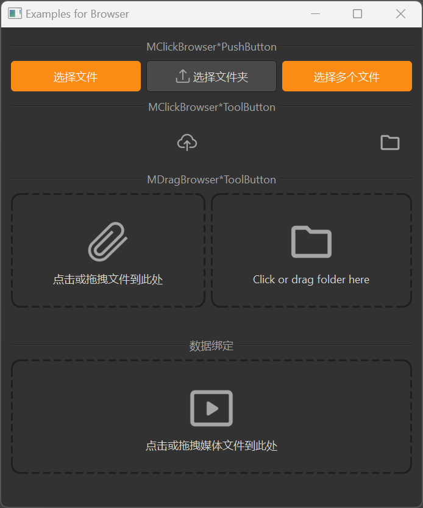

# Upload

The Upload component provides various ways to upload files and folders, including click-to-select and drag-and-drop. It is based on Qt's file dialog and drag-and-drop functionality, providing a more attractive style and better interaction experience.

## Import

```python
from dayu_widgets.browser import MClickBrowserFilePushButton
from dayu_widgets.browser import MClickBrowserFileToolButton
from dayu_widgets.browser import MClickBrowserFolderPushButton
from dayu_widgets.browser import MClickBrowserFolderToolButton
from dayu_widgets.browser import MDragFileButton
from dayu_widgets.browser import MDragFolderButton
```

## Examples

### Click to Select Files

MClickBrowserFilePushButton and MClickBrowserFileToolButton provide click-to-select file functionality.

```python
from dayu_widgets.browser import MClickBrowserFilePushButton
from dayu_widgets.browser import MClickBrowserFileToolButton
from dayu_widgets.label import MLabel

# Create a file selection button
file_button = MClickBrowserFilePushButton(text="Select File")

# Create a label to display the selected file path
file_label = MLabel()
file_button.sig_file_changed.connect(file_label.setText)

# Create a file selection tool button
file_tool_button = MClickBrowserFileToolButton()
file_tool_button.sig_file_changed.connect(file_label.setText)
```

### Click to Select Folders

MClickBrowserFolderPushButton and MClickBrowserFolderToolButton provide click-to-select folder functionality.

```python
from dayu_widgets.browser import MClickBrowserFolderPushButton
from dayu_widgets.browser import MClickBrowserFolderToolButton
from dayu_widgets.label import MLabel

# Create a folder selection button
folder_button = MClickBrowserFolderPushButton(text="Select Folder")

# Create a label to display the selected folder path
folder_label = MLabel()
folder_button.sig_folder_changed.connect(folder_label.setText)

# Create a folder selection tool button
folder_tool_button = MClickBrowserFolderToolButton()
folder_tool_button.sig_folder_changed.connect(folder_label.setText)
```

### Multiple File Selection

MClickBrowserFilePushButton and MClickBrowserFileToolButton support multiple file selection.

```python
from dayu_widgets.browser import MClickBrowserFilePushButton
from dayu_widgets.label import MLabel

# Create a multiple file selection button
multi_file_button = MClickBrowserFilePushButton(text="Select Multiple Files", multiple=True)

# Create a label to display the number of selected files
file_count_label = MLabel()
multi_file_button.sig_files_changed.connect(lambda files: file_count_label.setText("Selected {} files".format(len(files))))
```

### Drag and Drop Files

MDragFileButton provides drag-and-drop file upload functionality.

```python
from dayu_widgets.browser import MDragFileButton
from dayu_widgets.label import MLabel

# Create a drag-and-drop file button
drag_file_button = MDragFileButton(text="Click or drag file here")

# Create a label to display the selected file path
file_label = MLabel()
drag_file_button.sig_file_changed.connect(file_label.setText)
```

### Drag and Drop Folders

MDragFolderButton provides drag-and-drop folder upload functionality.

```python
from dayu_widgets.browser import MDragFolderButton
from dayu_widgets.label import MLabel

# Create a drag-and-drop folder button
drag_folder_button = MDragFolderButton()

# Create a label to display the selected folder path
folder_label = MLabel()
drag_folder_button.sig_folder_changed.connect(folder_label.setText)
```

### File Filters

MClickBrowserFilePushButton, MClickBrowserFileToolButton, and MDragFileButton support file filters.

```python
from dayu_widgets.browser import MClickBrowserFilePushButton
from dayu_widgets.browser import MDragFileButton

# Create a button that only selects image files
image_button = MClickBrowserFilePushButton(text="Select Image")
image_button.set_dayu_filters([".jpg", ".png", ".gif"])

# Create a drag-and-drop button that only accepts video files
video_button = MDragFileButton(text="Click or drag video file here")
video_button.set_dayu_svg("media_line.svg")
video_button.set_dayu_filters([".mov", ".mp4", ".avi"])
```

### Custom Icons

MDragFileButton and MDragFolderButton support custom icons.

```python
from dayu_widgets.browser import MDragFileButton
from dayu_widgets.browser import MDragFolderButton

# Create a drag-and-drop file button with a custom icon
custom_file_button = MDragFileButton(text="Click or drag file here")
custom_file_button.set_dayu_svg("attachment_line.svg")

# Create a drag-and-drop folder button with a custom icon
custom_folder_button = MDragFolderButton()
custom_folder_button.set_dayu_svg("folder_fill.svg")
```

### Data Binding

Upload components can be used with MFieldMixin for data binding.

```python
# Import third-party modules
from qtpy import QtWidgets

# Import local modules
from dayu_widgets.browser import MDragFileButton
from dayu_widgets.field_mixin import MFieldMixin
from dayu_widgets.label import MLabel


class UploadBindExample(QtWidgets.QWidget, MFieldMixin):
    def __init__(self, parent=None):
        super(UploadBindExample, self).__init__(parent)
        self._init_ui()

    def _init_ui(self):
        # Create a drag-and-drop file button
        file_button = MDragFileButton(text="Click or drag media file here")
        file_button.set_dayu_svg("media_line.svg")
        file_button.set_dayu_filters([".mov", ".mp4"])

        # Create a label
        file_label = MLabel()
        file_label.set_elide_mode(QtCore.Qt.ElideRight)

        # Register field and bind
        self.register_field("current_file", "")
        self.bind("current_file", file_button, "dayu_path", signal="sig_file_changed")
        self.bind("current_file", file_label, "text")

        # Create layout
        main_lay = QtWidgets.QVBoxLayout()
        main_lay.addWidget(file_button)
        main_lay.addWidget(file_label)
        self.setLayout(main_lay)
```

### Complete Example



Here's a complete example demonstrating various uses of Upload components:

```python
# Import third-party modules
from qtpy import QtCore
from qtpy import QtWidgets

# Import local modules
from dayu_widgets.browser import MClickBrowserFilePushButton
from dayu_widgets.browser import MClickBrowserFileToolButton
from dayu_widgets.browser import MClickBrowserFolderPushButton
from dayu_widgets.browser import MClickBrowserFolderToolButton
from dayu_widgets.browser import MDragFileButton
from dayu_widgets.browser import MDragFolderButton
from dayu_widgets.divider import MDivider
from dayu_widgets.field_mixin import MFieldMixin
from dayu_widgets.label import MLabel
from dayu_widgets.qt import MIcon


class BrowserExample(QtWidgets.QWidget, MFieldMixin):
    def __init__(self, parent=None):
        super(BrowserExample, self).__init__(parent)
        self.setWindowTitle("Examples for Browser")
        self._init_ui()

    def _init_ui(self):
        browser_1 = MClickBrowserFilePushButton(text="Browser File PushButton").primary()
        browser_2 = MClickBrowserFolderPushButton(text="Browser Folder PushButton")
        browser_2.setIcon(MIcon("upload_line.svg"))
        browser_3 = MClickBrowserFilePushButton(text="Browser Multi Files", multiple=True).primary()
        lay_1 = QtWidgets.QHBoxLayout()
        lay_1.addWidget(browser_1)
        lay_1.addWidget(browser_2)
        lay_1.addWidget(browser_3)

        browser_4 = MClickBrowserFileToolButton().huge()
        label_4 = MLabel()
        label_4.set_elide_mode(QtCore.Qt.ElideMiddle)
        browser_4.sig_file_changed.connect(label_4.setText)

        browser_5 = MClickBrowserFolderToolButton().huge()
        label_5 = MLabel()
        label_5.set_elide_mode(QtCore.Qt.ElideMiddle)
        browser_5.sig_folder_changed.connect(label_5.setText)

        lay_2 = QtWidgets.QHBoxLayout()
        lay_2.addWidget(label_4)
        lay_2.addWidget(browser_4)
        lay_2.addWidget(label_5)
        lay_2.addWidget(browser_5)

        browser_6 = MDragFileButton(text="Click or drag file here")
        browser_6.set_dayu_svg("attachment_line.svg")
        label_6 = MLabel()
        label_6.set_elide_mode(QtCore.Qt.ElideMiddle)
        browser_6.sig_file_changed.connect(label_6.setText)

        browser_7 = MDragFolderButton()
        label_7 = MLabel()
        label_7.set_elide_mode(QtCore.Qt.ElideRight)
        browser_7.sig_folder_changed.connect(label_7.setText)

        lay_3 = QtWidgets.QGridLayout()
        lay_3.addWidget(browser_6, 2, 0)
        lay_3.addWidget(browser_7, 2, 1)
        lay_3.addWidget(label_6, 3, 0)
        lay_3.addWidget(label_7, 3, 1)

        browser_8 = MDragFileButton(text="Click or drag media file here", multiple=False)
        browser_8.set_dayu_svg("media_line.svg")
        browser_8.set_dayu_filters([".mov", ".mp4"])
        browser_8_label = MLabel()
        browser_8_label.set_elide_mode(QtCore.Qt.ElideRight)
        self.register_field("current_file", "")
        self.bind("current_file", browser_8, "dayu_path", signal="sig_file_changed")
        self.bind("current_file", browser_8_label, "text")

        main_lay = QtWidgets.QVBoxLayout()
        main_lay.addWidget(MDivider("MClickBrowser*PushButton"))
        main_lay.addLayout(lay_1)
        main_lay.addWidget(MDivider("MClickBrowser*ToolButton"))
        main_lay.addLayout(lay_2)
        main_lay.addWidget(MDivider("MDragBrowser*ToolButton"))
        main_lay.addLayout(lay_3)
        main_lay.addWidget(MDivider("data bind"))
        main_lay.addWidget(browser_8)
        main_lay.addWidget(browser_8_label)
        main_lay.addStretch()
        self.setLayout(main_lay)


if __name__ == "__main__":
    # Import local modules
    from dayu_widgets import dayu_theme
    from dayu_widgets.qt import application

    with application() as app:
        test = BrowserExample()
        dayu_theme.apply(test)
        test.show()
```

## API

### MClickBrowserFilePushButton

#### Constructor

```python
MClickBrowserFilePushButton(text="Browser", multiple=False, parent=None)
```

| Parameter | Description | Type | Default Value |
| --- | --- | --- | --- |
| `text` | Button text | `str` | `"Browser"` |
| `multiple` | Whether to support multiple file selection | `bool` | `False` |
| `parent` | Parent widget | `QWidget` | `None` |

#### Methods

| Method | Description | Parameters | Return Value |
| --- | --- | --- | --- |
| `get_dayu_filters()` | Get file filters | None | `list` |
| `set_dayu_filters(value)` | Set file filters | `value`: List of file extensions | None |
| `get_dayu_path()` | Get current path | None | `str` |
| `set_dayu_path(value)` | Set current path | `value`: Path string | None |

#### Signals

| Signal | Description | Parameters |
| --- | --- | --- |
| `sig_file_changed` | Triggered when a single file is selected | `str`: File path |
| `sig_files_changed` | Triggered when multiple files are selected | `list`: List of file paths |

### MClickBrowserFileToolButton

#### Constructor

```python
MClickBrowserFileToolButton(multiple=False, parent=None)
```

| Parameter | Description | Type | Default Value |
| --- | --- | --- | --- |
| `multiple` | Whether to support multiple file selection | `bool` | `False` |
| `parent` | Parent widget | `QWidget` | `None` |

#### Methods

Same as MClickBrowserFilePushButton.

#### Signals

Same as MClickBrowserFilePushButton.

### MClickBrowserFolderPushButton

#### Constructor

```python
MClickBrowserFolderPushButton(text="Browser", multiple=False, parent=None)
```

| Parameter | Description | Type | Default Value |
| --- | --- | --- | --- |
| `text` | Button text | `str` | `"Browser"` |
| `multiple` | Whether to support multiple folder selection | `bool` | `False` |
| `parent` | Parent widget | `QWidget` | `None` |

#### Methods

| Method | Description | Parameters | Return Value |
| --- | --- | --- | --- |
| `get_dayu_path()` | Get current path | None | `str` |
| `set_dayu_path(value)` | Set current path | `value`: Path string | None |

#### Signals

| Signal | Description | Parameters |
| --- | --- | --- |
| `sig_folder_changed` | Triggered when a single folder is selected | `str`: Folder path |
| `sig_folders_changed` | Triggered when multiple folders are selected | `list`: List of folder paths |

### MClickBrowserFolderToolButton

#### Constructor

```python
MClickBrowserFolderToolButton(multiple=False, parent=None)
```

| Parameter | Description | Type | Default Value |
| --- | --- | --- | --- |
| `multiple` | Whether to support multiple folder selection | `bool` | `False` |
| `parent` | Parent widget | `QWidget` | `None` |

#### Methods

Same as MClickBrowserFolderPushButton.

#### Signals

Same as MClickBrowserFolderPushButton.

### MDragFileButton

#### Constructor

```python
MDragFileButton(text="", multiple=False, parent=None)
```

| Parameter | Description | Type | Default Value |
| --- | --- | --- | --- |
| `text` | Button text | `str` | `""` |
| `multiple` | Whether to support multiple file selection | `bool` | `False` |
| `parent` | Parent widget | `QWidget` | `None` |

#### Methods

| Method | Description | Parameters | Return Value |
| --- | --- | --- | --- |
| `get_dayu_filters()` | Get file filters | None | `list` |
| `set_dayu_filters(value)` | Set file filters | `value`: List of file extensions | None |
| `get_dayu_path()` | Get current path | None | `str` |
| `set_dayu_path(value)` | Set current path | `value`: Path string | None |
| `get_dayu_multiple()` | Get whether multiple selection is supported | None | `bool` |
| `set_dayu_multiple(value)` | Set whether multiple selection is supported | `value`: Boolean | None |
| `set_dayu_svg(path)` | Set SVG icon | `path`: SVG filename | None |

#### Signals

| Signal | Description | Parameters |
| --- | --- | --- |
| `sig_file_changed` | Triggered when a single file is selected | `str`: File path |
| `sig_files_changed` | Triggered when multiple files are selected | `list`: List of file paths |

### MDragFolderButton

#### Constructor

```python
MDragFolderButton(multiple=False, parent=None)
```

| Parameter | Description | Type | Default Value |
| --- | --- | --- | --- |
| `multiple` | Whether to support multiple folder selection | `bool` | `False` |
| `parent` | Parent widget | `QWidget` | `None` |

#### Methods

| Method | Description | Parameters | Return Value |
| --- | --- | --- | --- |
| `get_dayu_path()` | Get current path | None | `str` |
| `set_dayu_path(value)` | Set current path | `value`: Path string | None |
| `get_dayu_multiple()` | Get whether multiple selection is supported | None | `bool` |
| `set_dayu_multiple(value)` | Set whether multiple selection is supported | `value`: Boolean | None |
| `set_dayu_svg(path)` | Set SVG icon | `path`: SVG filename | None |

#### Signals

| Signal | Description | Parameters |
| --- | --- | --- |
| `sig_folder_changed` | Triggered when a single folder is selected | `str`: Folder path |
| `sig_folders_changed` | Triggered when multiple folders are selected | `list`: List of folder paths |

## Frequently Asked Questions

### How to limit the types of files that can be selected?

You can set file filters using the `set_dayu_filters` method:

```python
from dayu_widgets.browser import MClickBrowserFilePushButton

# Create a button that only selects image files
image_button = MClickBrowserFilePushButton(text="Select Image")
image_button.set_dayu_filters([".jpg", ".png", ".gif"])
```

### How to get the path of the selected file?

You can get the path of the selected file by connecting to the `sig_file_changed` or `sig_files_changed` signal:

```python
from dayu_widgets.browser import MClickBrowserFilePushButton
from dayu_widgets.label import MLabel

# Create a file selection button
file_button = MClickBrowserFilePushButton(text="Select File")

# Create a label to display the selected file path
file_label = MLabel()
file_button.sig_file_changed.connect(file_label.setText)
```

### How to customize the icon of a drag-and-drop button?

You can customize the icon of a drag-and-drop button using the `set_dayu_svg` method:

```python
from dayu_widgets.browser import MDragFileButton

# Create a drag-and-drop file button with a custom icon
custom_file_button = MDragFileButton(text="Click or drag file here")
custom_file_button.set_dayu_svg("attachment_line.svg")
```

### How to add a file selection button to MLineEdit?

You can add a file selection button to MLineEdit using the `file` method:

```python
from dayu_widgets.line_edit import MLineEdit

# Create an input field with a file selection button
file_input = MLineEdit().file()

# Create an input field with a file selection button and file type restrictions
image_input = MLineEdit().file(filters=[".jpg", ".png", ".gif"])
```
