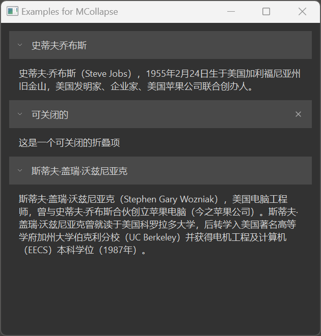

# MCollapse

MCollapse is a collapsible panel component used to collapse/expand content areas. It can collapse multiple areas or keep only one area expanded. It is suitable for grouping complex content areas, allowing users to selectively view the information they need.

## Import

```python
from dayu_widgets.collapse import MCollapse
```

## Examples

### Basic Usage

MCollapse can add collapsible sections using the `add_section` method, with each section containing a title and content widget.

```python
from dayu_widgets.collapse import MCollapse
from dayu_widgets.label import MLabel

# Create a collapse panel
collapse = MCollapse()

# Create content widget
label_1 = MLabel("This is the content of the first collapsible section")
label_1.setWordWrap(True)

# Add a collapsible section
collapse.add_section({
    "title": "Section 1",
    "expand": True,  # Expanded by default
    "widget": label_1
})
```

### Adding Multiple Sections

MCollapse can add multiple sections at once using the `add_section_list` method.

```python
from dayu_widgets.collapse import MCollapse
from dayu_widgets.label import MLabel

# Create a collapse panel
collapse = MCollapse()

# Create content widgets
label_1 = MLabel("This is the content of the first collapsible section")
label_2 = MLabel("This is the content of the second collapsible section")
label_3 = MLabel("This is the content of the third collapsible section")
label_1.setWordWrap(True)
label_2.setWordWrap(True)
label_3.setWordWrap(True)

# Add multiple sections
section_list = [
    {"title": "Section 1", "expand": True, "widget": label_1},
    {"title": "Section 2", "expand": False, "widget": label_2},
    {"title": "Section 3", "expand": False, "widget": label_3}
]
collapse.add_section_list(section_list)
```

### Closable Sections

MCollapse supports creating closable sections that users can remove by clicking the close button.

```python
from dayu_widgets.collapse import MCollapse
from dayu_widgets.label import MLabel

# Create a collapse panel
collapse = MCollapse()

# Create content widget
label = MLabel("This is a closable section")
label.setWordWrap(True)

# Add a closable section
collapse.add_section({
    "title": "Closable Section",
    "expand": True,
    "widget": label,
    "closable": True  # Set as closable
})
```

### Complete Example



Here's a complete example demonstrating various uses of MCollapse:

```python
# Import third-party modules
from qtpy import QtWidgets

# Import local modules
from dayu_widgets.collapse import MCollapse
from dayu_widgets.label import MLabel


class CollapseExample(QtWidgets.QWidget):
    def __init__(self, parent=None):
        super(CollapseExample, self).__init__(parent)
        self.setWindowTitle("Examples for MCollapse")
        self._init_ui()

    def _init_ui(self):
        label_1 = MLabel("Steve Jobs (February 24, 1955 – October 5, 2011) was an American entrepreneur, industrial designer, business magnate, media proprietor, and investor.")
        label_2 = MLabel(
            "Stephen Gary Wozniak, also known by his nickname 'Woz', is an American electronics engineer, computer programmer, philanthropist, and technology entrepreneur. In 1976, he co-founded Apple Inc., which later became the world's largest information technology company by revenue and the largest company in the world by market capitalization."
        )
        label_3 = MLabel(
            "Sir Jonathan Paul Ive KBE HonFREng RDI is a British-American industrial, product and architectural designer. Ive was the Chief Design Officer (CDO) of Apple Inc. and serves as Chancellor of the Royal College of Art."
        )
        label_1.setWordWrap(True)
        label_2.setWordWrap(True)
        label_3.setWordWrap(True)
        section_list = [
            {"title": "Steve Jobs", "expand": True, "widget": label_1},
            {
                "title": "Closable",
                "expand": True,
                "widget": MLabel("This is a closable collapse item"),
                "closable": True,
            },
            {"title": "Steve Wozniak", "expand": True, "widget": label_2},
        ]

        section_group = MCollapse()
        section_group.add_section_list(section_list)

        main_lay = QtWidgets.QVBoxLayout()
        main_lay.addWidget(section_group)
        main_lay.addStretch()
        self.setLayout(main_lay)


if __name__ == "__main__":
    # Import local modules
    from dayu_widgets import dayu_theme
    from dayu_widgets.qt import application

    with application() as app:
        test = CollapseExample()
        dayu_theme.apply(test)
        test.show()
```

## API

### MCollapse

#### Constructor

```python
MCollapse(parent=None)
```

| Parameter | Description | Type | Default Value |
| --- | --- | --- | --- |
| `parent` | Parent widget | `QWidget` | `None` |

#### Methods

| Method | Description | Parameters | Return Value |
| --- | --- | --- | --- |
| `add_section(section_data)` | Add a collapsible section | `section_data`: Section data dictionary | `MSectionItem` |
| `add_section_list(section_list)` | Add multiple collapsible sections | `section_list`: List of section data dictionaries | None |
| `remove_section(widget)` | Remove a collapsible section | `widget`: Section widget to remove | None |
| `sections()` | Get all collapsible sections | None | `List[MSectionItem]` |
| `clear()` | Clear all collapsible sections | None | None |

#### Section Data Dictionary

The section data dictionary accepted by the `add_section` and `add_section_list` methods can contain the following keys:

| Key | Description | Type | Required |
| --- | --- | --- | --- |
| `title` | Section title | `str` | Yes |
| `expand` | Whether to expand by default | `bool` | No |
| `widget` | Section content widget | `QWidget` | Yes |
| `closable` | Whether the section is closable | `bool` | No |

### MSectionItem

MSectionItem is the collapsible section item component used internally by MCollapse.

#### Methods

| Method | Description | Parameters | Return Value |
| --- | --- | --- | --- |
| `set_content(widget)` | Set the section content widget | `widget`: Content widget | None |
| `get_content()` | Get the section content widget | None | `QWidget` |
| `set_closable(value)` | Set whether the section is closable | `value`: Boolean | None |
| `set_expand(value)` | Set whether the section is expanded | `value`: Boolean | None |
| `set_title(value)` | Set the section title | `value`: Title text | None |

#### Properties

| Property | Description | Type | Default Value |
| --- | --- | --- | --- |
| `closable` | Whether the section is closable | `bool` | `False` |
| `expand` | Whether the section is expanded | `bool` | `False` |
| `title` | Section title | `str` | `""` |

## Frequently Asked Questions

### How to control the expansion and collapse of sections?

You can control the initial state of a section by setting the `expand` key in the section data dictionary, or dynamically control it using the `set_expand` method:

```python
from dayu_widgets.collapse import MCollapse
from dayu_widgets.label import MLabel

# Create a collapse panel
collapse = MCollapse()

# Add a section expanded by default
section = collapse.add_section({
    "title": "Expanded by Default",
    "expand": True,
    "widget": MLabel("This is content")
})

# Dynamically collapse the section
section.set_expand(False)

# Dynamically expand the section
section.set_expand(True)
```

### How to handle section close events?

When a user clicks the close button of a closable section, the section is automatically removed from the MCollapse. If you need to perform other operations before closing, you can connect to the section's `_close_button.clicked` signal:

```python
from dayu_widgets.collapse import MCollapse
from dayu_widgets.label import MLabel

# Create a collapse panel
collapse = MCollapse()

# Add a closable section
section = collapse.add_section({
    "title": "Closable Section",
    "expand": True,
    "widget": MLabel("This is content"),
    "closable": True
})

# Connect to the close button's click event
section._close_button.clicked.connect(lambda: print("Section about to close"))
```

### How to get all sections?

You can get all sections using the `sections()` method:

```python
from dayu_widgets.collapse import MCollapse

# Create a collapse panel and add sections
collapse = MCollapse()
# Add sections...

# Get all sections
all_sections = collapse.sections()
for section in all_sections:
    print(section.property("title"))
```

### How to clear all sections?

You can clear all sections using the `clear()` method:

```python
from dayu_widgets.collapse import MCollapse

# Create a collapse panel and add sections
collapse = MCollapse()
# Add sections...

# Clear all sections
collapse.clear()
```
