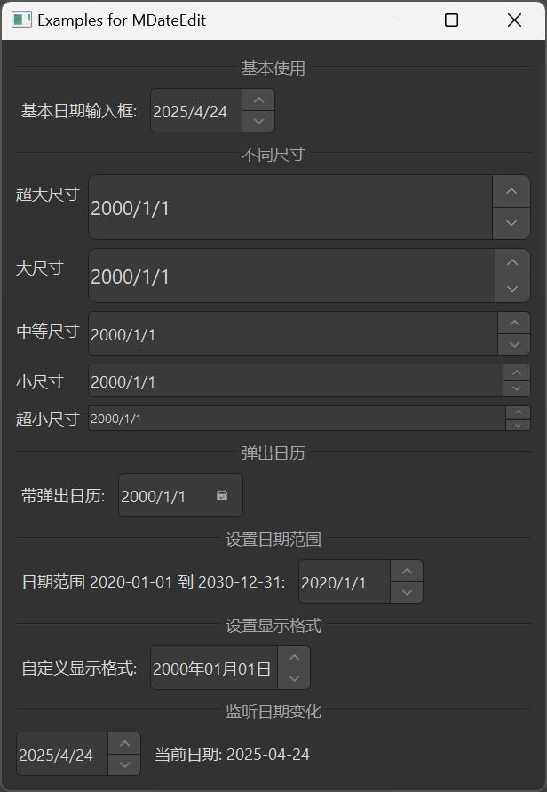

# MDateEdit

MDateEdit is a date editing component used for inputting and editing dates. It is based on Qt's QDateEdit class, providing a more attractive style and better interaction experience.

## Import

```python
from dayu_widgets.spin_box import MDateEdit
```

## Examples

### Basic Usage

MDateEdit can create a simple date input field where users can set dates by clicking the up/down buttons or by direct input.

```python
# Import built-in modules
import datetime

# Import local modules
from dayu_widgets.spin_box import MDateEdit

# Create a date input field
date_edit = MDateEdit()
date_edit.setDate(datetime.datetime.now().date())
```

### Different Sizes

MDateEdit supports different sizes, which can be set through method chaining.

```python
from dayu_widgets.spin_box import MDateEdit

# Create a huge size date input field
date_edit_huge = MDateEdit().huge()

# Create a large size date input field
date_edit_large = MDateEdit().large()

# Create a medium size date input field (default)
date_edit_medium = MDateEdit().medium()

# Create a small size date input field
date_edit_small = MDateEdit().small()

# Create a tiny size date input field
date_edit_tiny = MDateEdit().tiny()
```

### Calendar Popup

MDateEdit supports a calendar popup for easy date selection.

```python
from dayu_widgets.spin_box import MDateEdit

# Create a date input field with calendar popup
date_edit = MDateEdit()
date_edit.setCalendarPopup(True)
```

### Setting Date Range

MDateEdit supports setting date ranges.

```python
# Import built-in modules
import datetime

# Import local modules
from dayu_widgets.spin_box import MDateEdit

# Create a date input field and set range
date_edit = MDateEdit()
date_edit.setDateRange(
    datetime.date(2020, 1, 1),
    datetime.date(2030, 12, 31)
)
```

### Setting Display Format

MDateEdit supports setting display formats.

```python
from dayu_widgets.spin_box import MDateEdit

# Create a date input field and set display format
date_edit = MDateEdit()
date_edit.setDisplayFormat("yyyy-MM-dd")
```

### Listening for Date Changes

MDateEdit can listen for date changes by connecting to the `dateChanged` signal.

```python
# Import built-in modules
import datetime

# Import local modules
from dayu_widgets.spin_box import MDateEdit

# Create a date input field
date_edit = MDateEdit()
date_edit.setDate(datetime.datetime.now().date())

# Listen for date changes
date_edit.dateChanged.connect(lambda date: print("Current date:", date))
```

### Complete Example



Here's a complete example demonstrating various uses of MDateEdit:

```python
# Import built-in modules
import datetime

# Import third-party modules
from qtpy import QtWidgets

# Import local modules
from dayu_widgets.divider import MDivider
from dayu_widgets.spin_box import MDateEdit
from dayu_widgets.label import MLabel


class DateEditExample(QtWidgets.QWidget):
    def __init__(self, parent=None):
        super(DateEditExample, self).__init__(parent)
        self.setWindowTitle("Examples for MDateEdit")
        self._init_ui()

    def _init_ui(self):
        main_lay = QtWidgets.QVBoxLayout()

        # Basic usage
        main_lay.addWidget(MDivider("Basic Usage"))
        basic_lay = QtWidgets.QHBoxLayout()
        basic_date_edit = MDateEdit()
        basic_date_edit.setDate(datetime.datetime.now().date())
        basic_lay.addWidget(MLabel("Basic Date Input:"))
        basic_lay.addWidget(basic_date_edit)
        basic_lay.addStretch()
        main_lay.addLayout(basic_lay)

        # Different sizes
        main_lay.addWidget(MDivider("Different Sizes"))
        size_lay = QtWidgets.QFormLayout()
        size_lay.addRow("Huge", MDateEdit().huge())
        size_lay.addRow("Large", MDateEdit().large())
        size_lay.addRow("Medium", MDateEdit().medium())
        size_lay.addRow("Small", MDateEdit().small())
        size_lay.addRow("Tiny", MDateEdit().tiny())
        main_lay.addLayout(size_lay)

        # Calendar popup
        main_lay.addWidget(MDivider("Calendar Popup"))
        popup_lay = QtWidgets.QHBoxLayout()
        popup_date_edit = MDateEdit()
        popup_date_edit.setCalendarPopup(True)
        popup_lay.addWidget(MLabel("With Calendar Popup:"))
        popup_lay.addWidget(popup_date_edit)
        popup_lay.addStretch()
        main_lay.addLayout(popup_lay)

        # Setting date range
        main_lay.addWidget(MDivider("Setting Date Range"))
        range_lay = QtWidgets.QHBoxLayout()
        range_date_edit = MDateEdit()
        range_date_edit.setDateRange(
            datetime.date(2020, 1, 1),
            datetime.date(2030, 12, 31)
        )
        range_lay.addWidget(MLabel("Date Range 2020-01-01 to 2030-12-31:"))
        range_lay.addWidget(range_date_edit)
        range_lay.addStretch()
        main_lay.addLayout(range_lay)

        # Setting display format
        main_lay.addWidget(MDivider("Setting Display Format"))
        format_lay = QtWidgets.QHBoxLayout()
        format_date_edit = MDateEdit()
        format_date_edit.setDisplayFormat("yyyy-MM-dd")
        format_lay.addWidget(MLabel("Custom Display Format:"))
        format_lay.addWidget(format_date_edit)
        format_lay.addStretch()
        main_lay.addLayout(format_lay)

        # Listening for date changes
        main_lay.addWidget(MDivider("Listening for Date Changes"))
        date_changed_lay = QtWidgets.QHBoxLayout()
        date_changed_date_edit = MDateEdit()
        date_changed_date_edit.setDate(datetime.datetime.now().date())
        date_changed_label = MLabel("Current date: {}".format(datetime.datetime.now().date()))
        date_changed_date_edit.dateChanged.connect(
            lambda date: date_changed_label.setText("Current date: {}".format(date))
        )
        date_changed_lay.addWidget(date_changed_date_edit)
        date_changed_lay.addWidget(date_changed_label)
        date_changed_lay.addStretch()
        main_lay.addLayout(date_changed_lay)

        main_lay.addStretch()
        self.setLayout(main_lay)


if __name__ == "__main__":
    # Import local modules
    from dayu_widgets import dayu_theme
    from dayu_widgets.qt import application

    with application() as app:
        test = DateEditExample()
        dayu_theme.apply(test)
        test.show()
```

## API

### Constructor

```python
MDateEdit(date=None, parent=None)
```

| Parameter | Description | Type | Default Value |
| --- | --- | --- | --- |
| `date` | Initial date | `datetime.datetime` or `datetime.date` | `None` |
| `parent` | Parent widget | `QWidget` | `None` |

### Methods

| Method | Description | Parameters | Return Value |
| --- | --- | --- | --- |
| `set_dayu_size(value)` | Set the size of the input field | `value`: Size value | None |
| `get_dayu_size()` | Get the size of the input field | None | `int` |
| `huge()` | Set to huge size | None | `self` |
| `large()` | Set to large size | None | `self` |
| `medium()` | Set to medium size | None | `self` |
| `small()` | Set to small size | None | `self` |
| `tiny()` | Set to tiny size | None | `self` |

### Inherited Methods

MDateEdit inherits from QDateEdit, so you can use all methods of QDateEdit, such as:

- `setDate(date)`: Set the date
- `date()`: Get the date
- `setDateRange(min, max)`: Set the date range
- `setMinimumDate(date)`: Set the minimum date
- `setMaximumDate(date)`: Set the maximum date
- `setDisplayFormat(format)`: Set the display format
- `setCalendarPopup(enable)`: Set whether to show the calendar popup
- For more methods, please refer to the Qt documentation

### Signals

MDateEdit inherits from QDateEdit, so you can use all signals of QDateEdit, such as:

- `dateChanged(date)`: Triggered when the date changes
- For more signals, please refer to the Qt documentation

## Frequently Asked Questions

### How to set the date format?

You can set the date format using the `setDisplayFormat` method:

```python
from dayu_widgets.spin_box import MDateEdit

# Create a date input field
date_edit = MDateEdit()

# Set display format
date_edit.setDisplayFormat("yyyy-MM-dd")
```

The format string uses the following placeholders:

- `d`: Day (1-31)
- `dd`: Day (01-31)
- `M`: Month (1-12)
- `MM`: Month (01-12)
- `yy`: Year (00-99)
- `yyyy`: Year (0000-9999)

### How to enable the calendar popup?

You can enable the calendar popup using the `setCalendarPopup` method:

```python
from dayu_widgets.spin_box import MDateEdit

# Create a date input field
date_edit = MDateEdit()

# Enable calendar popup
date_edit.setCalendarPopup(True)
```

### How to set the date range?

You can set the date range using the `setDateRange` method:

```python
# Import built-in modules
import datetime

# Import local modules
from dayu_widgets.spin_box import MDateEdit

# Create a date input field
date_edit = MDateEdit()

# Set date range
date_edit.setDateRange(
    datetime.date(2020, 1, 1),
    datetime.date(2030, 12, 31)
)
```

You can also set the minimum and maximum dates separately:

```python
# Import built-in modules
import datetime

# Import local modules
from dayu_widgets.spin_box import MDateEdit

# Create a date input field
date_edit = MDateEdit()

# Set minimum date
date_edit.setMinimumDate(datetime.date(2020, 1, 1))

# Set maximum date
date_edit.setMaximumDate(datetime.date(2030, 12, 31))
```

### How to disable the date input field?

You can disable the date input field using the `setEnabled` method:

```python
from dayu_widgets.spin_box import MDateEdit

# Create a date input field
date_edit = MDateEdit()

# Disable the date input field
date_edit.setEnabled(False)
```
