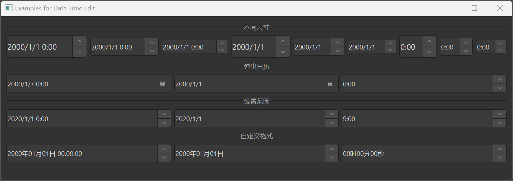

# MDateTimeEdit

MDateTimeEdit is a date-time editing component used for inputting and editing date and time. It is based on Qt's QDateTimeEdit class, providing a more attractive style and better interaction experience. Additionally, dayu_widgets provides MDateEdit and MTimeEdit components for inputting date and time respectively.

## Import

```python
from dayu_widgets.spin_box import MDateTimeEdit
from dayu_widgets.spin_box import MDateEdit
from dayu_widgets.spin_box import MTimeEdit
```

## Examples

### Basic Usage

MDateTimeEdit, MDateEdit, and MTimeEdit can create date-time, date, and time input fields.

```python
# Import built-in modules
import datetime

# Import local modules
from dayu_widgets.spin_box import MDateTimeEdit
from dayu_widgets.spin_box import MDateEdit
from dayu_widgets.spin_box import MTimeEdit

# Create a date-time input field
date_time_edit = MDateTimeEdit()
date_time_edit.setDateTime(datetime.datetime.now())

# Create a date input field
date_edit = MDateEdit()
date_edit.setDate(datetime.datetime.now().date())

# Create a time input field
time_edit = MTimeEdit()
time_edit.setTime(datetime.datetime.now().time())
```

### Different Sizes

MDateTimeEdit, MDateEdit, and MTimeEdit support different sizes, which can be set through method chaining.

```python
from dayu_widgets.spin_box import MDateTimeEdit
from dayu_widgets.spin_box import MDateEdit
from dayu_widgets.spin_box import MTimeEdit

# Create a large size date-time input field
date_time_edit_large = MDateTimeEdit().large()

# Create a medium size date input field (default)
date_edit_medium = MDateEdit().medium()

# Create a small size time input field
time_edit_small = MTimeEdit().small()
```

### Calendar Popup

MDateTimeEdit and MDateEdit support a calendar popup for easy date selection.

```python
from dayu_widgets.spin_box import MDateTimeEdit
from dayu_widgets.spin_box import MDateEdit

# Create a date-time input field with calendar popup
date_time_edit = MDateTimeEdit()
date_time_edit.setCalendarPopup(True)

# Create a date input field with calendar popup
date_edit = MDateEdit()
date_edit.setCalendarPopup(True)
```

### Setting Date-Time Range

MDateTimeEdit, MDateEdit, and MTimeEdit support setting date-time ranges.

```python
# Import built-in modules
import datetime

# Import local modules
from dayu_widgets.spin_box import MDateTimeEdit
from dayu_widgets.spin_box import MDateEdit
from dayu_widgets.spin_box import MTimeEdit

# Create a date-time input field and set range
date_time_edit = MDateTimeEdit()
date_time_edit.setDateTimeRange(
    datetime.datetime(2020, 1, 1, 0, 0, 0),
    datetime.datetime(2030, 12, 31, 23, 59, 59)
)

# Create a date input field and set range
date_edit = MDateEdit()
date_edit.setDateRange(
    datetime.date(2020, 1, 1),
    datetime.date(2030, 12, 31)
)

# Create a time input field and set range
time_edit = MTimeEdit()
time_edit.setTimeRange(
    datetime.time(9, 0, 0),
    datetime.time(18, 0, 0)
)
```

### Setting Display Format

MDateTimeEdit, MDateEdit, and MTimeEdit support setting display formats.

```python
from dayu_widgets.spin_box import MDateTimeEdit
from dayu_widgets.spin_box import MDateEdit
from dayu_widgets.spin_box import MTimeEdit

# Create a date-time input field and set display format
date_time_edit = MDateTimeEdit()
date_time_edit.setDisplayFormat("yyyy-MM-dd hh:mm:ss")

# Create a date input field and set display format
date_edit = MDateEdit()
date_edit.setDisplayFormat("yyyy-MM-dd")

# Create a time input field and set display format
time_edit = MTimeEdit()
time_edit.setDisplayFormat("hh:mm:ss")
```

### Complete Example



Here's a complete example demonstrating various uses of MDateTimeEdit, MDateEdit, and MTimeEdit:

```python
# Import built-in modules
import datetime

# Import third-party modules
from qtpy import QtWidgets

# Import local modules
from dayu_widgets.divider import MDivider
from dayu_widgets.spin_box import MDateEdit
from dayu_widgets.spin_box import MDateTimeEdit
from dayu_widgets.spin_box import MTimeEdit


class DateTimeEditExample(QtWidgets.QWidget):
    def __init__(self, parent=None):
        super(DateTimeEditExample, self).__init__(parent)
        self.setWindowTitle("Examples for Date Time Edit")
        self._init_ui()

    def _init_ui(self):
        main_lay = QtWidgets.QVBoxLayout()

        # Different sizes
        main_lay.addWidget(MDivider("Different Sizes"))
        size_lay = QtWidgets.QHBoxLayout()
        for cls in [MDateTimeEdit, MDateEdit, MTimeEdit]:
            size_lay.addWidget(cls().large())
            size_lay.addWidget(cls().medium())
            size_lay.addWidget(cls().small())
        main_lay.addLayout(size_lay)

        # Calendar popup
        main_lay.addWidget(MDivider("Calendar Popup"))
        date_time_edit = MDateTimeEdit()
        date_time_edit.setCalendarPopup(True)
        date_edit = MDateEdit()
        date_edit.setCalendarPopup(True)
        time_edit = MTimeEdit()
        time_edit.setCalendarPopup(True)
        date_lay = QtWidgets.QHBoxLayout()
        date_lay.addWidget(date_time_edit)
        date_lay.addWidget(date_edit)
        date_lay.addWidget(time_edit)
        main_lay.addLayout(date_lay)

        # Setting range
        main_lay.addWidget(MDivider("Setting Range"))
        date_time_range = MDateTimeEdit()
        date_time_range.setDateTimeRange(
            datetime.datetime(2020, 1, 1, 0, 0, 0),
            datetime.datetime(2030, 12, 31, 23, 59, 59)
        )
        date_range = MDateEdit()
        date_range.setDateRange(
            datetime.date(2020, 1, 1),
            datetime.date(2030, 12, 31)
        )
        time_range = MTimeEdit()
        time_range.setTimeRange(
            datetime.time(9, 0, 0),
            datetime.time(18, 0, 0)
        )
        range_lay = QtWidgets.QHBoxLayout()
        range_lay.addWidget(date_time_range)
        range_lay.addWidget(date_range)
        range_lay.addWidget(time_range)
        main_lay.addLayout(range_lay)

        # Custom format
        main_lay.addWidget(MDivider("Custom Format"))
        date_time_format = MDateTimeEdit()
        date_time_format.setDisplayFormat("yyyy-MM-dd hh:mm:ss")
        date_format = MDateEdit()
        date_format.setDisplayFormat("yyyy-MM-dd")
        time_format = MTimeEdit()
        time_format.setDisplayFormat("hh:mm:ss")
        format_lay = QtWidgets.QHBoxLayout()
        format_lay.addWidget(date_time_format)
        format_lay.addWidget(date_format)
        format_lay.addWidget(time_format)
        main_lay.addLayout(format_lay)

        main_lay.addStretch()
        self.setLayout(main_lay)


if __name__ == "__main__":
    # Import local modules
    from dayu_widgets import dayu_theme
    from dayu_widgets.qt import application

    with application() as app:
        test = DateTimeEditExample()
        dayu_theme.apply(test)
        test.show()
```

## API

### MDateTimeEdit

#### Constructor

```python
MDateTimeEdit(datetime=None, parent=None)
```

| Parameter | Description | Type | Default Value |
| --- | --- | --- | --- |
| `datetime` | Initial date-time | `datetime.datetime` | `None` |
| `parent` | Parent widget | `QWidget` | `None` |

#### Methods

| Method | Description | Parameters | Return Value |
| --- | --- | --- | --- |
| `set_dayu_size(value)` | Set the size of the input field | `value`: Size value | None |
| `get_dayu_size()` | Get the size of the input field | None | `int` |
| `huge()` | Set to huge size | None | `self` |
| `large()` | Set to large size | None | `self` |
| `medium()` | Set to medium size | None | `self` |
| `small()` | Set to small size | None | `self` |
| `tiny()` | Set to tiny size | None | `self` |

#### Inherited Methods

MDateTimeEdit inherits from QDateTimeEdit, so you can use all methods of QDateTimeEdit, such as:

- `setDateTime(datetime)`: Set the date-time
- `dateTime()`: Get the date-time
- `setDateTimeRange(min, max)`: Set the date-time range
- `setDisplayFormat(format)`: Set the display format
- `setCalendarPopup(enable)`: Set whether to show the calendar popup
- For more methods, please refer to the Qt documentation

### MDateEdit

#### Constructor

```python
MDateEdit(date=None, parent=None)
```

| Parameter | Description | Type | Default Value |
| --- | --- | --- | --- |
| `date` | Initial date | `datetime.datetime` or `datetime.date` | `None` |
| `parent` | Parent widget | `QWidget` | `None` |

#### Methods

Same as MDateTimeEdit, with the addition of:

- `setDate(date)`: Set the date
- `date()`: Get the date
- `setDateRange(min, max)`: Set the date range

### MTimeEdit

#### Constructor

```python
MTimeEdit(time=None, parent=None)
```

| Parameter | Description | Type | Default Value |
| --- | --- | --- | --- |
| `time` | Initial time | `datetime.datetime` or `datetime.time` | `None` |
| `parent` | Parent widget | `QWidget` | `None` |

#### Methods

Same as MDateTimeEdit, with the addition of:

- `setTime(time)`: Set the time
- `time()`: Get the time
- `setTimeRange(min, max)`: Set the time range

## Frequently Asked Questions

### How to listen for date-time changes?

You can listen for date-time changes by connecting to the corresponding signals:

```python
from dayu_widgets.spin_box import MDateTimeEdit, MDateEdit, MTimeEdit

# Create date-time input fields
date_time_edit = MDateTimeEdit()
date_edit = MDateEdit()
time_edit = MTimeEdit()

# Listen for value changes
date_time_edit.dateTimeChanged.connect(lambda datetime: print("Current date-time:", datetime))
date_edit.dateChanged.connect(lambda date: print("Current date:", date))
time_edit.timeChanged.connect(lambda time: print("Current time:", time))
```

### How to set the date-time format?

You can set the date-time format using the `setDisplayFormat` method:

```python
from dayu_widgets.spin_box import MDateTimeEdit, MDateEdit, MTimeEdit

# Create date-time input fields
date_time_edit = MDateTimeEdit()
date_edit = MDateEdit()
time_edit = MTimeEdit()

# Set display format
date_time_edit.setDisplayFormat("yyyy-MM-dd hh:mm:ss")
date_edit.setDisplayFormat("yyyy-MM-dd")
time_edit.setDisplayFormat("hh:mm:ss")
```

The format string uses the following placeholders:

- `d`: Day (1-31)
- `dd`: Day (01-31)
- `M`: Month (1-12)
- `MM`: Month (01-12)
- `yy`: Year (00-99)
- `yyyy`: Year (0000-9999)
- `h`: Hour (0-23)
- `hh`: Hour (00-23)
- `m`: Minute (0-59)
- `mm`: Minute (00-59)
- `s`: Second (0-59)
- `ss`: Second (00-59)
- `AP`: Use AM/PM display
- `ap`: Use am/pm display

### How to disable the date-time input field?

You can disable the date-time input field using the `setEnabled` method:

```python
from dayu_widgets.spin_box import MDateTimeEdit, MDateEdit, MTimeEdit

# Create date-time input fields
date_time_edit = MDateTimeEdit()
date_edit = MDateEdit()
time_edit = MTimeEdit()

# Disable the input fields
date_time_edit.setEnabled(False)
date_edit.setEnabled(False)
time_edit.setEnabled(False)
```

### How to set minimum and maximum date-time?

You can set the date-time range using the `setDateTimeRange`, `setDateRange`, and `setTimeRange` methods:

```python
# Import built-in modules
import datetime

# Import local modules
from dayu_widgets.spin_box import MDateTimeEdit, MDateEdit, MTimeEdit

# Create date-time input fields
date_time_edit = MDateTimeEdit()
date_edit = MDateEdit()
time_edit = MTimeEdit()

# Set range
date_time_edit.setDateTimeRange(
    datetime.datetime(2020, 1, 1, 0, 0, 0),
    datetime.datetime(2030, 12, 31, 23, 59, 59)
)
date_edit.setDateRange(
    datetime.date(2020, 1, 1),
    datetime.date(2030, 12, 31)
)
time_edit.setTimeRange(
    datetime.time(9, 0, 0),
    datetime.time(18, 0, 0)
)
```

You can also set the minimum and maximum values separately:

```python
# Import built-in modules
import datetime

# Import local modules
from dayu_widgets.spin_box import MDateTimeEdit, MDateEdit, MTimeEdit

# Create date-time input fields
date_time_edit = MDateTimeEdit()
date_edit = MDateEdit()
time_edit = MTimeEdit()

# Set minimum values
date_time_edit.setMinimumDateTime(datetime.datetime(2020, 1, 1, 0, 0, 0))
date_edit.setMinimumDate(datetime.date(2020, 1, 1))
time_edit.setMinimumTime(datetime.time(9, 0, 0))

# Set maximum values
date_time_edit.setMaximumDateTime(datetime.datetime(2030, 12, 31, 23, 59, 59))
date_edit.setMaximumDate(datetime.date(2030, 12, 31))
time_edit.setMaximumTime(datetime.time(18, 0, 0))
```
