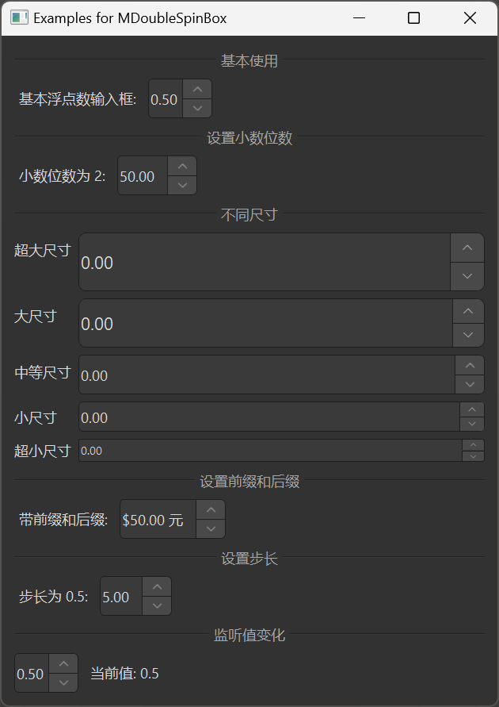

# MDoubleSpinBox

MDoubleSpinBox is a floating-point input component used for inputting decimal values. It is based on Qt's QDoubleSpinBox class, providing a more attractive style and better interaction experience.

## Import

```python
from dayu_widgets.spin_box import MDoubleSpinBox
```

## Examples

### Basic Usage

MDoubleSpinBox can create a simple floating-point input field where users can set values by clicking the up/down buttons or by direct input.

```python
from dayu_widgets.spin_box import MDoubleSpinBox

# Create a floating-point input field
double_spin_box = MDoubleSpinBox()
double_spin_box.setRange(0.0, 1.0)
double_spin_box.setValue(0.5)
double_spin_box.setSingleStep(0.1)
```

### Setting Decimal Places

MDoubleSpinBox can set the number of decimal places using the `setDecimals` method.

```python
from dayu_widgets.spin_box import MDoubleSpinBox

# Create a floating-point input field
double_spin_box = MDoubleSpinBox()
double_spin_box.setRange(0.0, 100.0)
double_spin_box.setValue(50.0)

# Set decimal places to 2
double_spin_box.setDecimals(2)
```

### Different Sizes

MDoubleSpinBox supports different sizes, which can be set through method chaining.

```python
from dayu_widgets.spin_box import MDoubleSpinBox

# Create a huge size floating-point input field
double_spin_box_huge = MDoubleSpinBox().huge()

# Create a large size floating-point input field
double_spin_box_large = MDoubleSpinBox().large()

# Create a medium size floating-point input field (default)
double_spin_box_medium = MDoubleSpinBox().medium()

# Create a small size floating-point input field
double_spin_box_small = MDoubleSpinBox().small()

# Create a tiny size floating-point input field
double_spin_box_tiny = MDoubleSpinBox().tiny()
```

### Setting Prefix and Suffix

MDoubleSpinBox can set prefix and suffix using the `setPrefix` and `setSuffix` methods.

```python
from dayu_widgets.spin_box import MDoubleSpinBox

# Create a floating-point input field
double_spin_box = MDoubleSpinBox()
double_spin_box.setRange(0.0, 100.0)
double_spin_box.setValue(50.0)

# Set prefix and suffix
double_spin_box.setPrefix("$")
double_spin_box.setSuffix(" units")
```

### Setting Step Value

MDoubleSpinBox can set the step value using the `setSingleStep` method.

```python
from dayu_widgets.spin_box import MDoubleSpinBox

# Create a floating-point input field
double_spin_box = MDoubleSpinBox()
double_spin_box.setRange(0.0, 1.0)
double_spin_box.setValue(0.5)

# Set step value to 0.1
double_spin_box.setSingleStep(0.1)
```

### Listening for Value Changes

MDoubleSpinBox can listen for value changes by connecting to the `valueChanged` signal.

```python
from dayu_widgets.spin_box import MDoubleSpinBox

# Create a floating-point input field
double_spin_box = MDoubleSpinBox()
double_spin_box.setRange(0.0, 1.0)
double_spin_box.setValue(0.5)

# Listen for value changes
double_spin_box.valueChanged.connect(lambda value: print("Current value:", value))
```

### Complete Example



Here's a complete example demonstrating various uses of MDoubleSpinBox:

```python
# Import third-party modules
from qtpy import QtWidgets

# Import local modules
from dayu_widgets.divider import MDivider
from dayu_widgets.spin_box import MDoubleSpinBox
from dayu_widgets.label import MLabel


class DoubleSpinBoxExample(QtWidgets.QWidget):
    def __init__(self, parent=None):
        super(DoubleSpinBoxExample, self).__init__(parent)
        self.setWindowTitle("Examples for MDoubleSpinBox")
        self._init_ui()

    def _init_ui(self):
        main_lay = QtWidgets.QVBoxLayout()

        # Basic usage
        main_lay.addWidget(MDivider("Basic Usage"))
        basic_lay = QtWidgets.QHBoxLayout()
        basic_spin_box = MDoubleSpinBox()
        basic_spin_box.setRange(0.0, 1.0)
        basic_spin_box.setValue(0.5)
        basic_spin_box.setSingleStep(0.1)
        basic_lay.addWidget(MLabel("Basic Floating-Point Input:"))
        basic_lay.addWidget(basic_spin_box)
        basic_lay.addStretch()
        main_lay.addLayout(basic_lay)

        # Setting decimal places
        main_lay.addWidget(MDivider("Setting Decimal Places"))
        decimals_lay = QtWidgets.QHBoxLayout()
        decimals_spin_box = MDoubleSpinBox()
        decimals_spin_box.setRange(0.0, 100.0)
        decimals_spin_box.setValue(50.0)
        decimals_spin_box.setDecimals(2)
        decimals_lay.addWidget(MLabel("Decimal Places 2:"))
        decimals_lay.addWidget(decimals_spin_box)
        decimals_lay.addStretch()
        main_lay.addLayout(decimals_lay)

        # Different sizes
        main_lay.addWidget(MDivider("Different Sizes"))
        size_lay = QtWidgets.QFormLayout()
        size_lay.addRow("Huge", MDoubleSpinBox().huge())
        size_lay.addRow("Large", MDoubleSpinBox().large())
        size_lay.addRow("Medium", MDoubleSpinBox().medium())
        size_lay.addRow("Small", MDoubleSpinBox().small())
        size_lay.addRow("Tiny", MDoubleSpinBox().tiny())
        main_lay.addLayout(size_lay)

        # Setting prefix and suffix
        main_lay.addWidget(MDivider("Setting Prefix and Suffix"))
        prefix_suffix_lay = QtWidgets.QHBoxLayout()
        prefix_suffix_spin_box = MDoubleSpinBox()
        prefix_suffix_spin_box.setRange(0.0, 100.0)
        prefix_suffix_spin_box.setValue(50.0)
        prefix_suffix_spin_box.setPrefix("$")
        prefix_suffix_spin_box.setSuffix(" units")
        prefix_suffix_lay.addWidget(MLabel("With Prefix and Suffix:"))
        prefix_suffix_lay.addWidget(prefix_suffix_spin_box)
        prefix_suffix_lay.addStretch()
        main_lay.addLayout(prefix_suffix_lay)

        # Setting step value
        main_lay.addWidget(MDivider("Setting Step Value"))
        step_lay = QtWidgets.QHBoxLayout()
        step_spin_box = MDoubleSpinBox()
        step_spin_box.setRange(0.0, 10.0)
        step_spin_box.setValue(5.0)
        step_spin_box.setSingleStep(0.5)
        step_lay.addWidget(MLabel("Step Value 0.5:"))
        step_lay.addWidget(step_spin_box)
        step_lay.addStretch()
        main_lay.addLayout(step_lay)

        # Listening for value changes
        main_lay.addWidget(MDivider("Listening for Value Changes"))
        value_changed_lay = QtWidgets.QHBoxLayout()
        value_changed_spin_box = MDoubleSpinBox()
        value_changed_spin_box.setRange(0.0, 1.0)
        value_changed_spin_box.setValue(0.5)
        value_changed_label = MLabel("Current value: 0.5")
        value_changed_spin_box.valueChanged.connect(
            lambda value: value_changed_label.setText("Current value: {}".format(value))
        )
        value_changed_lay.addWidget(value_changed_spin_box)
        value_changed_lay.addWidget(value_changed_label)
        value_changed_lay.addStretch()
        main_lay.addLayout(value_changed_lay)

        main_lay.addStretch()
        self.setLayout(main_lay)


if __name__ == "__main__":
    # Import local modules
    from dayu_widgets import dayu_theme
    from dayu_widgets.qt import application

    with application() as app:
        test = DoubleSpinBoxExample()
        dayu_theme.apply(test)
        test.show()
```

## API

### Constructor

```python
MDoubleSpinBox(parent=None)
```

| Parameter | Description | Type | Default Value |
| --- | --- | --- | --- |
| `parent` | Parent widget | `QWidget` | `None` |

### Methods

| Method | Description | Parameters | Return Value |
| --- | --- | --- | --- |
| `set_dayu_size(value)` | Set the size of the input field | `value`: Size value | None |
| `get_dayu_size()` | Get the size of the input field | None | `int` |
| `huge()` | Set to huge size | None | `self` |
| `large()` | Set to large size | None | `self` |
| `medium()` | Set to medium size | None | `self` |
| `small()` | Set to small size | None | `self` |
| `tiny()` | Set to tiny size | None | `self` |

### Inherited Methods

MDoubleSpinBox inherits from QDoubleSpinBox, so you can use all methods of QDoubleSpinBox, such as:

- `setRange(min, max)`: Set the value range
- `setValue(value)`: Set the current value
- `value()`: Get the current value
- `setDecimals(precision)`: Set the number of decimal places
- `decimals()`: Get the number of decimal places
- `setPrefix(prefix)`: Set the prefix
- `setSuffix(suffix)`: Set the suffix
- `setSingleStep(step)`: Set the single step value
- For more methods, please refer to the Qt documentation

### Signals

MDoubleSpinBox inherits from QDoubleSpinBox, so you can use all signals of QDoubleSpinBox, such as:

- `valueChanged(double)`: Triggered when the value changes
- For more signals, please refer to the Qt documentation

## Frequently Asked Questions

### How to limit the number of decimal places?

You can set the number of decimal places using the `setDecimals` method:

```python
from dayu_widgets.spin_box import MDoubleSpinBox

# Create a floating-point input field
double_spin_box = MDoubleSpinBox()
double_spin_box.setRange(0.0, 100.0)
double_spin_box.setValue(50.0)

# Set decimal places to 2
double_spin_box.setDecimals(2)
```

### How to set the step value?

You can set the step value using the `setSingleStep` method:

```python
from dayu_widgets.spin_box import MDoubleSpinBox

# Create a floating-point input field
double_spin_box = MDoubleSpinBox()
double_spin_box.setRange(0.0, 1.0)
double_spin_box.setValue(0.5)

# Set step value to 0.1
double_spin_box.setSingleStep(0.1)
```

### How to set prefix and suffix?

You can set prefix and suffix using the `setPrefix` and `setSuffix` methods:

```python
from dayu_widgets.spin_box import MDoubleSpinBox

# Create a floating-point input field
double_spin_box = MDoubleSpinBox()
double_spin_box.setRange(0.0, 100.0)
double_spin_box.setValue(50.0)

# Set prefix and suffix
double_spin_box.setPrefix("$")
double_spin_box.setSuffix(" units")
```

### How to disable the input field?

You can disable the input field using the `setEnabled` method:

```python
from dayu_widgets.spin_box import MDoubleSpinBox

# Create a floating-point input field
double_spin_box = MDoubleSpinBox()
double_spin_box.setRange(0.0, 1.0)
double_spin_box.setValue(0.5)

# Disable the input field
double_spin_box.setEnabled(False)
```
