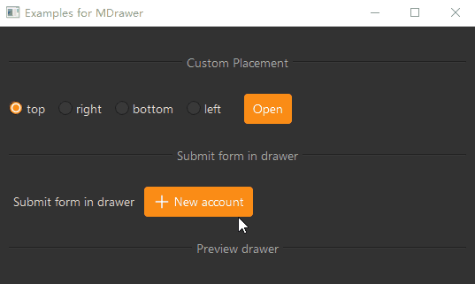

# MDrawer

MDrawer is a drawer component that slides in from the edge of the screen. It can replace modal dialogs and contain more content. It can slide in from the top, right, bottom, or left of the screen, and can contain various custom content.

## Import

```python
from dayu_widgets.drawer import MDrawer
```

## Examples

### Basic Usage

MDrawer can create a simple drawer that slides in from the edge of the screen.

```python
from dayu_widgets.drawer import MDrawer
from dayu_widgets.label import MLabel
from qtpy import QtWidgets

# Create a drawer
drawer = MDrawer("Basic Drawer", parent=self)

# Create custom content
custom_widget = QtWidgets.QWidget()
custom_lay = QtWidgets.QVBoxLayout()
custom_lay.addWidget(MLabel("Some contents..."))
custom_lay.addWidget(MLabel("Some contents..."))
custom_lay.addWidget(MLabel("Some contents..."))
custom_widget.setLayout(custom_lay)

# Set drawer content
drawer.set_widget(custom_widget)

# Show drawer
drawer.show()
```

### Different Placements

MDrawer supports sliding in from the top, right, bottom, or left of the screen.

```python
from dayu_widgets.drawer import MDrawer

# Create a drawer that slides in from the right (default)
drawer_right = MDrawer("Right Drawer", position=MDrawer.RightPos, parent=self)
# Or use method chaining
drawer_right = MDrawer("Right Drawer", parent=self).right()

# Create a drawer that slides in from the left
drawer_left = MDrawer("Left Drawer", position=MDrawer.LeftPos, parent=self)
# Or use method chaining
drawer_left = MDrawer("Left Drawer", parent=self).left()

# Create a drawer that slides in from the top
drawer_top = MDrawer("Top Drawer", position=MDrawer.TopPos, parent=self)
# Or use method chaining
drawer_top = MDrawer("Top Drawer", parent=self).top()

# Create a drawer that slides in from the bottom
drawer_bottom = MDrawer("Bottom Drawer", position=MDrawer.BottomPos, parent=self)
# Or use method chaining
drawer_bottom = MDrawer("Bottom Drawer", parent=self).bottom()
```

### Custom Size

MDrawer supports custom width or height, depending on the drawer's position.

```python
from dayu_widgets.drawer import MDrawer
from dayu_widgets.qt import get_scale_factor

# Get scale factor
scale_x, _ = get_scale_factor()

# Create a drawer with custom width
drawer = MDrawer("Custom Width", parent=self)
drawer.setFixedWidth(300 * scale_x)  # Set width to 300 pixels (considering scale factor)

# Create a drawer with custom height
drawer_top = MDrawer("Custom Height", position=MDrawer.TopPos, parent=self)
drawer_top.setFixedHeight(200 * scale_x)  # Set height to 200 pixels (considering scale factor)
```

### Adding Bottom Buttons

MDrawer supports adding buttons to the bottom, such as confirm and cancel buttons.

```python
from dayu_widgets.drawer import MDrawer
from dayu_widgets.push_button import MPushButton

# Create a drawer
drawer = MDrawer("Drawer with Bottom Buttons", parent=self)

# Create bottom buttons
cancel_button = MPushButton("Cancel")
submit_button = MPushButton("Submit").primary()

# Connect button click events
cancel_button.clicked.connect(drawer.close)
submit_button.clicked.connect(lambda: (print("Submit successful"), drawer.close()))

# Add buttons to drawer bottom
drawer.add_widget_to_bottom(cancel_button)
drawer.add_widget_to_bottom(submit_button)
```

### Form Submission Example

MDrawer is commonly used for form submission scenarios. Here's a complete form submission example:

```python
from dayu_widgets.drawer import MDrawer
from dayu_widgets.line_edit import MLineEdit
from dayu_widgets.spin_box import MSpinBox
from dayu_widgets.spin_box import MDateEdit
from dayu_widgets.push_button import MPushButton
from qtpy import QtWidgets

# Create a drawer
drawer = MDrawer("New Account", parent=self)

# Create form content
custom_widget = QtWidgets.QWidget()
custom_lay = QtWidgets.QFormLayout()
custom_lay.addRow("Name", MLineEdit())
custom_lay.addRow("Age", MSpinBox())
custom_lay.addRow("Birth", MDateEdit())
custom_widget.setLayout(custom_lay)

# Create bottom buttons
cancel_button = MPushButton("Cancel")
submit_button = MPushButton("Submit").primary()

# Connect button click events
cancel_button.clicked.connect(drawer.close)
submit_button.clicked.connect(lambda: (print("Submit successful"), drawer.close()))

# Set drawer content and bottom buttons
drawer.set_widget(custom_widget)
drawer.add_widget_to_bottom(cancel_button)
drawer.add_widget_to_bottom(submit_button)

# Set drawer width
from dayu_widgets.qt import get_scale_factor
scale_x, _ = get_scale_factor()
drawer.setFixedWidth(300 * scale_x)

# Show drawer
drawer.show()
```

### Complete Example



Here's a complete example demonstrating various uses of MDrawer:

```python
# Import third-party modules
from qtpy import QtWidgets

# Import local modules
from dayu_widgets.button_group import MRadioButtonGroup
from dayu_widgets.divider import MDivider
from dayu_widgets.drawer import MDrawer
from dayu_widgets.label import MLabel
from dayu_widgets.line_edit import MLineEdit
from dayu_widgets.push_button import MPushButton
from dayu_widgets.qt import MIcon
from dayu_widgets.qt import get_scale_factor
from dayu_widgets.spin_box import MDateEdit
from dayu_widgets.spin_box import MSpinBox


class DrawerExample(QtWidgets.QWidget):
    def __init__(self, parent=None):
        super(DrawerExample, self).__init__(parent)
        self.setWindowTitle("Examples for MDrawer")
        self._init_ui()

    def _init_ui(self):
        scale_x, _ = get_scale_factor()
        self.button_grp = MRadioButtonGroup()
        self.button_grp.set_button_list(["top", {"text": "right", "checked": True}, "bottom", "left"])

        open_button_2 = MPushButton("Open").primary()
        open_button_2.clicked.connect(self.slot_open_button_2)
        placement_lay = QtWidgets.QHBoxLayout()
        placement_lay.addWidget(self.button_grp)
        placement_lay.addSpacing(20 * scale_x)
        placement_lay.addWidget(open_button_2)
        placement_lay.addStretch()

        new_account_button = MPushButton(text="New account", icon=MIcon("add_line.svg", "#fff")).primary()
        new_account_button.clicked.connect(self.slot_new_account)
        new_account_lay = QtWidgets.QHBoxLayout()
        new_account_lay.addWidget(MLabel("Submit form in drawer"))
        new_account_lay.addWidget(new_account_button)
        new_account_lay.addStretch()

        main_lay = QtWidgets.QVBoxLayout()
        main_lay.addWidget(MDivider("Custom Placement"))
        main_lay.addLayout(placement_lay)
        main_lay.addWidget(MDivider("Submit form in drawer"))
        main_lay.addLayout(new_account_lay)

        main_lay.addWidget(MDivider("Preview drawer"))
        self.setLayout(main_lay)

    def slot_open_button_2(self):
        custom_widget = QtWidgets.QWidget()
        custom_lay = QtWidgets.QVBoxLayout()
        custom_lay.addWidget(MLabel("Some contents..."))
        custom_lay.addWidget(MLabel("Some contents..."))
        custom_lay.addWidget(MLabel("Some contents..."))
        custom_widget.setLayout(custom_lay)

        drawer = MDrawer("Basic Drawer", parent=self)
        drawer.set_dayu_position(self.button_grp.get_button_group().checkedButton().text())

        scale_x, _ = get_scale_factor()
        drawer.setFixedWidth(300 * scale_x)
        drawer.set_widget(custom_widget)
        drawer.show()

    def slot_new_account(self):
        custom_widget = QtWidgets.QWidget()
        custom_lay = QtWidgets.QFormLayout()
        custom_lay.addRow("Name", MLineEdit())
        custom_lay.addRow("Age", MSpinBox())
        custom_lay.addRow("Birth", MDateEdit())
        custom_widget.setLayout(custom_lay)

        drawer = MDrawer("New account", parent=self)
        submit_button = MPushButton("Submit").primary()
        submit_button.clicked.connect(drawer.close)
        drawer.add_widget_to_bottom(MPushButton("Cancel"))
        drawer.add_widget_to_bottom(submit_button)
        scale_x, _ = get_scale_factor()
        drawer.setFixedWidth(300 * scale_x)
        drawer.set_widget(custom_widget)
        drawer.show()


if __name__ == "__main__":
    # Import local modules
    from dayu_widgets import dayu_theme
    from dayu_widgets.qt import application

    with application() as app:
        test = DrawerExample()
        dayu_theme.apply(test)
        test.show()
```

## API

### Constructor

```python
MDrawer(title, position="right", closable=True, parent=None)
```

| Parameter | Description | Type | Default Value |
| --- | --- | --- | --- |
| `title` | Drawer title | `str` | Required |
| `position` | Drawer position | `str` | `"right"` |
| `closable` | Whether the drawer can be closed | `bool` | `True` |
| `parent` | Parent widget | `QWidget` | `None` |

### Class Constants

| Constant | Description | Value |
| --- | --- | --- |
| `LeftPos` | Left position | `"left"` |
| `RightPos` | Right position | `"right"` |
| `TopPos` | Top position | `"top"` |
| `BottomPos` | Bottom position | `"bottom"` |

### Methods

| Method | Description | Parameters | Return Value |
| --- | --- | --- | --- |
| `set_widget(widget)` | Set drawer content widget | `widget`: Content widget | None |
| `add_widget_to_bottom(widget)` | Add widget to drawer bottom | `widget`: Bottom widget | None |
| `set_dayu_position(value)` | Set drawer position | `value`: Position value | None |
| `get_dayu_position()` | Get drawer position | None | `str` |
| `left()` | Set drawer position to left | None | `self` |
| `right()` | Set drawer position to right | None | `self` |
| `top()` | Set drawer position to top | None | `self` |
| `bottom()` | Set drawer position to bottom | None | `self` |
| `show()` | Show drawer | None | None |
| `close()` | Close drawer | None | None |

### Properties

| Property | Description | Type | Default Value |
| --- | --- | --- | --- |
| `dayu_position` | Drawer position | `str` | `"right"` |

### Signals

| Signal | Description | Parameters |
| --- | --- | --- |
| `sig_closed` | Triggered when drawer is closed | None |

## Frequently Asked Questions

### How to set the position of the drawer?

You can set the position when creating the drawer using the `position` parameter, or use method chaining:

```python
from dayu_widgets.drawer import MDrawer

# Using position parameter
drawer_right = MDrawer("Right Drawer", position=MDrawer.RightPos, parent=self)
drawer_left = MDrawer("Left Drawer", position=MDrawer.LeftPos, parent=self)
drawer_top = MDrawer("Top Drawer", position=MDrawer.TopPos, parent=self)
drawer_bottom = MDrawer("Bottom Drawer", position=MDrawer.BottomPos, parent=self)

# Using method chaining
drawer_right = MDrawer("Right Drawer", parent=self).right()
drawer_left = MDrawer("Left Drawer", parent=self).left()
drawer_top = MDrawer("Top Drawer", parent=self).top()
drawer_bottom = MDrawer("Bottom Drawer", parent=self).bottom()
```

### How to set the size of the drawer?

You can use the `setFixedWidth` or `setFixedHeight` method to set the size of the drawer, depending on the drawer's position:

```python
from dayu_widgets.drawer import MDrawer
from dayu_widgets.qt import get_scale_factor

# Get scale factor
scale_x, _ = get_scale_factor()

# For left and right drawers, set width
drawer_right = MDrawer("Right Drawer", parent=self).right()
drawer_right.setFixedWidth(300 * scale_x)

# For top and bottom drawers, set height
drawer_top = MDrawer("Top Drawer", parent=self).top()
drawer_top.setFixedHeight(200 * scale_x)
```

### How to add bottom buttons to the drawer?

You can use the `add_widget_to_bottom` method to add bottom buttons:

```python
from dayu_widgets.drawer import MDrawer
from dayu_widgets.push_button import MPushButton

# Create a drawer
drawer = MDrawer("Drawer with Bottom Buttons", parent=self)

# Create bottom buttons
cancel_button = MPushButton("Cancel")
submit_button = MPushButton("Submit").primary()

# Connect button click events
cancel_button.clicked.connect(drawer.close)
submit_button.clicked.connect(lambda: (print("Submit successful"), drawer.close()))

# Add buttons to drawer bottom
drawer.add_widget_to_bottom(cancel_button)
drawer.add_widget_to_bottom(submit_button)
```

### How to listen for drawer close events?

You can connect to the drawer's `sig_closed` signal to listen for close events:

```python
from dayu_widgets.drawer import MDrawer

# Create a drawer
drawer = MDrawer("Drawer", parent=self)

# Connect close signal
drawer.sig_closed.connect(lambda: print("Drawer closed"))
```
