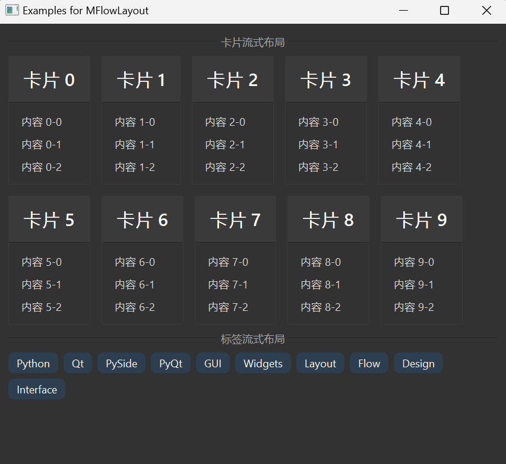

# MFlowLayout

MFlowLayout is a flow layout component that automatically arranges child widgets in a left-to-right, top-to-bottom order, wrapping to a new line when there is not enough horizontal space. This layout is ideal for interfaces that need to adapt to different widths, such as tag clouds, card lists, etc.

## Import

```python
from dayu_widgets.flow_layout import MFlowLayout
```

## Examples

### Basic Usage

MFlowLayout can be used like any other layout, simply add child widgets to the layout.

```python
from dayu_widgets.flow_layout import MFlowLayout
from dayu_widgets.label import MLabel
from qtpy import QtWidgets

# Create a flow layout
flow_layout = MFlowLayout()

# Add multiple labels
for i in range(10):
    flow_layout.addWidget(MLabel("Label {}".format(i)))

# Create a container and set the layout
container = QtWidgets.QWidget()
container.setLayout(flow_layout)
```

### Setting Spacing

MFlowLayout supports setting the spacing between widgets.

```python
from dayu_widgets.flow_layout import MFlowLayout
from dayu_widgets.push_button import MPushButton

# Create a flow layout with 20 pixels spacing
flow_layout = MFlowLayout()
flow_layout.setSpacing(20)

# Add multiple buttons
for i in range(10):
    flow_layout.addWidget(MPushButton("Button {}".format(i)))
```

### Inserting Widgets

MFlowLayout supports inserting widgets at a specific position.

```python
from dayu_widgets.flow_layout import MFlowLayout
from dayu_widgets.push_button import MPushButton

# Create a flow layout
flow_layout = MFlowLayout()

# Add multiple buttons
for i in range(5):
    flow_layout.addWidget(MPushButton("Button {}".format(i)))

# Insert a new button at index 2
flow_layout.insertWidget(2, MPushButton("Inserted Button"))
```

### Clearing the Layout

MFlowLayout supports clearing all widgets from the layout.

```python
from dayu_widgets.flow_layout import MFlowLayout
from dayu_widgets.push_button import MPushButton

# Create a flow layout
flow_layout = MFlowLayout()

# Add multiple buttons
for i in range(5):
    flow_layout.addWidget(MPushButton("Button {}".format(i)))

# Clear the layout
flow_layout.clear()
```

### Complete Example



MFlowLayout is perfect for card layouts. Here's an example using MFlowLayout with MCard:

```python
# Import third-party modules
from qtpy import QtWidgets

# Import local modules
from dayu_widgets import dayu_theme
from dayu_widgets.card import MCard
from dayu_widgets.divider import MDivider
from dayu_widgets.flow_layout import MFlowLayout
from dayu_widgets.label import MLabel
from dayu_widgets.qt import MPixmap


class FlowLayoutExample(QtWidgets.QWidget):
    def __init__(self, parent=None):
        super(FlowLayoutExample, self).__init__(parent)
        self.setWindowTitle("Examples for MFlowLayout")
        self._init_ui()

    def _init_ui(self):
        # Create a flow layout for cards
        card_layout = MFlowLayout()
        card_layout.setSpacing(20)

        # Add multiple cards
        for i in range(10):
            card = MCard(title="Card {}".format(i))
            content_widget = QtWidgets.QWidget()
            content_layout = QtWidgets.QVBoxLayout()
            content_layout.setContentsMargins(15, 15, 15, 15)
            content_widget.setLayout(content_layout)

            # Add card content
            for j in range(3):
                content_layout.addWidget(MLabel("Content {}-{}".format(i, j)))

            card.set_widget(content_widget)
            card_layout.addWidget(card)

        # Create a flow layout for tags
        tag_layout = MFlowLayout()
        tag_layout.setSpacing(10)

        # Add multiple tags
        for text in ["Python", "Qt", "PySide", "PyQt", "GUI", "Widgets", "Layout", "Flow", "Design", "Interface"]:
            label = MLabel(text)
            label.setStyleSheet("background-color: #2c3e50; color: white; padding: 5px 10px; border-radius: 10px;")
            tag_layout.addWidget(label)

        main_layout = QtWidgets.QVBoxLayout()
        main_layout.addWidget(MDivider("Card Flow Layout"))
        main_layout.addLayout(card_layout)
        main_layout.addWidget(MDivider("Tag Flow Layout"))
        main_layout.addLayout(tag_layout)
        main_layout.addStretch()
        self.setLayout(main_layout)


if __name__ == "__main__":
    # Import local modules
    from dayu_widgets import dayu_theme
    from dayu_widgets.qt import application

    with application() as app:
        test = FlowLayoutExample()
        dayu_theme.apply(test)
        test.show()
```

## API

### Constructor

```python
MFlowLayout(parent=None, margin=0, spacing=-1)
```

| Parameter | Description | Type | Default Value |
| --- | --- | --- | --- |
| `parent` | Parent widget | `QWidget` | `None` |
| `margin` | Layout margin | `int` | `0` |
| `spacing` | Spacing between widgets | `int` | `-1` |

### Methods

| Method | Description | Parameters | Return Value |
| --- | --- | --- | --- |
| `addWidget(widget)` | Add a widget to the end of the layout | `widget`: Widget to add | None |
| `insertWidget(index, widget)` | Insert a widget at a specific position | `index`: Index to insert at<br>`widget`: Widget to insert | None |
| `addItem(item)` | Add a layout item to the end of the layout | `item`: Layout item to add | None |
| `count()` | Get the number of widgets in the layout | None | `int` |
| `itemAt(index)` | Get the layout item at the specified index | `index`: Index of the layout item | `QLayoutItem` |
| `takeAt(index)` | Remove and return the widget at the specified index | `index`: Index of the widget | `QWidget` |
| `clear()` | Clear all widgets from the layout | None | None |
| `setSpacing(spacing)` | Set the spacing between widgets | `spacing`: Spacing value | None |
| `spacing()` | Get the spacing between widgets | None | `int` |

## Frequently Asked Questions

### How to make widgets in MFlowLayout have equal width?

Widgets in MFlowLayout use their sizeHint() to determine their size by default. If you want widgets to have equal width, you can set a fixed width for each widget:

```python
from dayu_widgets.flow_layout import MFlowLayout
from dayu_widgets.push_button import MPushButton

flow_layout = MFlowLayout()

for i in range(10):
    button = MPushButton("Button {}".format(i))
    button.setFixedWidth(100)  # Set fixed width
    flow_layout.addWidget(button)
```

### What's the difference between MFlowLayout, QHBoxLayout, and QVBoxLayout?

- QHBoxLayout: Arranges widgets horizontally, does not wrap automatically
- QVBoxLayout: Arranges widgets vertically, does not wrap automatically
- MFlowLayout: Arranges widgets horizontally, wraps to a new line when there is not enough space

### How to control the alignment of MFlowLayout?

MFlowLayout is left-aligned by default and currently does not support directly setting the alignment. If you need other alignments, you can nest MFlowLayout in other layouts and use addStretch() to achieve this:

```python
from dayu_widgets.flow_layout import MFlowLayout
from dayu_widgets.push_button import MPushButton
from qtpy import QtWidgets

# Create a horizontal layout
h_layout = QtWidgets.QHBoxLayout()

# Create a flow layout
flow_layout = MFlowLayout()
for i in range(5):
    flow_layout.addWidget(MPushButton("Button {}".format(i)))

# Center alignment
h_layout.addStretch()
h_layout.addLayout(flow_layout)
h_layout.addStretch()

# Right alignment
# h_layout.addStretch()
# h_layout.addLayout(flow_layout)
```

### How to add spacing in MFlowLayout?

You can use transparent QWidget as spacers:

```python
from dayu_widgets.flow_layout import MFlowLayout
from dayu_widgets.push_button import MPushButton
from qtpy import QtWidgets

flow_layout = MFlowLayout()

for i in range(5):
    flow_layout.addWidget(MPushButton("Button {}".format(i)))

    # Add spacer
    spacer = QtWidgets.QWidget()
    spacer.setFixedSize(10, 10)  # Set spacer size
    spacer.setStyleSheet("background-color: transparent;")  # Set transparent background
    flow_layout.addWidget(spacer)
```
