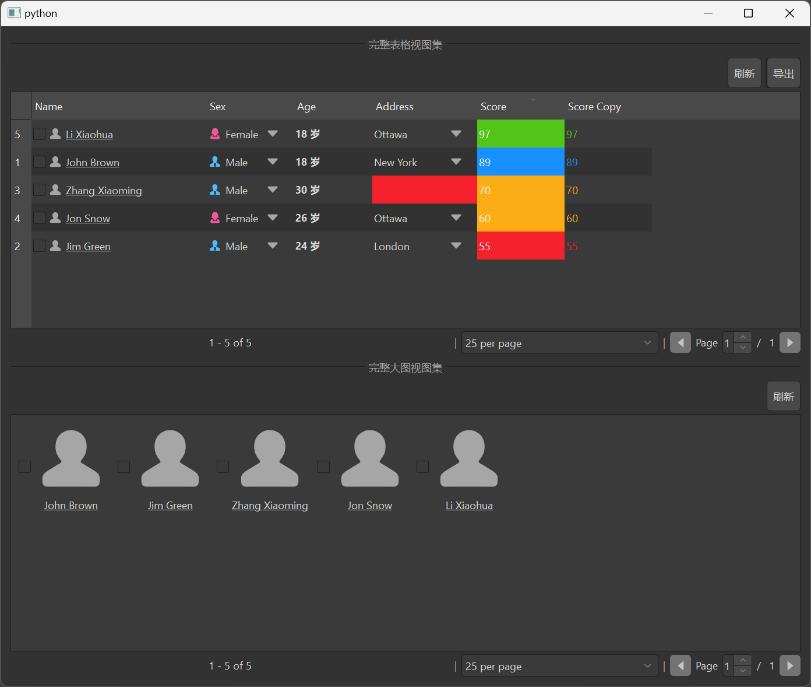

# MItemViewFullSet

MItemViewFullSet is an extended version of MItemViewSet, providing more functionality and a more complete interface. It not only includes all the functionality of MItemViewSet but also adds additional features such as a toolbar, pagination controls, and more, suitable for scenarios requiring more complex interfaces.

## Import

```python
from dayu_widgets.item_view_full_set import MItemViewFullSet
```

## Examples

### Basic Usage

MItemViewFullSet can specify the type of view to use through the `table_view` and `big_view` parameters.

```python
from dayu_widgets.item_view_full_set import MItemViewFullSet

# Create full table view set
table_view_set = MItemViewFullSet(table_view=True, big_view=False)

# Set header
table_view_set.set_header_list([
    {"key": "name", "label": "Name"},
    {"key": "age", "label": "Age"},
    {"key": "city", "label": "City"}
])

# Set data
table_view_set.setup_data([
    {"name": "John", "age": 18, "city": "New York"},
    {"name": "Jane", "age": 25, "city": "London"},
    {"name": "Bob", "age": 30, "city": "Paris"}
])
```

### Different View Types

MItemViewFullSet supports two view types: table view and big view, which can be set through the `table_view` and `big_view` parameters.

```python
from dayu_widgets.item_view_full_set import MItemViewFullSet

# Create full table view set
table_view_set = MItemViewFullSet(table_view=True, big_view=False)

# Create full big view set
big_view_set = MItemViewFullSet(table_view=False, big_view=True)

# Show both table view and big view
both_view_set = MItemViewFullSet(table_view=True, big_view=True)
```

### Enable Search Functionality

MItemViewFullSet has search functionality enabled by default, no need to call the `searchable` method.

```python
from dayu_widgets.item_view_full_set import MItemViewFullSet

# Create full table view set
table_view_set = MItemViewFullSet(table_view=True, big_view=False)

# Search functionality is enabled by default
```

### Add Toolbar Buttons

MItemViewFullSet can add toolbar buttons through the `tool_bar_append_widget` method.

```python
from dayu_widgets.item_view_full_set import MItemViewFullSet
from dayu_widgets.push_button import MPushButton

# Create full table view set
table_view_set = MItemViewFullSet(table_view=True, big_view=False)

# Add refresh button
refresh_button = MPushButton("Refresh")
refresh_button.clicked.connect(lambda: print("Refresh data"))
table_view_set.tool_bar_append_widget(refresh_button)

# Add export button
export_button = MPushButton("Export")
export_button.clicked.connect(lambda: print("Export data"))
table_view_set.tool_bar_append_widget(export_button)
```

### Set Pagination

MItemViewFullSet supports pagination functionality, which can be set through the `set_record_count` method.

```python
from dayu_widgets.item_view_full_set import MItemViewFullSet

# Create full table view set
table_view_set = MItemViewFullSet(table_view=True, big_view=False)

# Set record count
table_view_set.set_record_count(200)

# Listen for page changes
table_view_set.page_set.sig_page_changed.connect(lambda page: print("Switch to page:", page))
```

### Complete Example



Here is a complete example showing various uses of MItemViewFullSet:

```python
# Import third-party modules
from qtpy import QtWidgets

# Import local modules
from dayu_widgets import utils
from dayu_widgets.divider import MDivider
from dayu_widgets.field_mixin import MFieldMixin
from dayu_widgets.item_view_full_set import MItemViewFullSet
from dayu_widgets.push_button import MPushButton
import examples._mock_data as mock


@utils.add_settings("DaYu", "DaYuExample", event_name="hideEvent")
class ItemViewFullSetExample(QtWidgets.QWidget, MFieldMixin):
    def __init__(self, parent=None):
        super(ItemViewFullSetExample, self).__init__(parent)
        self._init_ui()

    def _init_ui(self):
        # Create full table view set
        item_view_set_table = MItemViewFullSet(table_view=True, big_view=False)
        item_view_set_table.set_header_list(mock.header_list)

        # Add toolbar buttons
        refresh_button = MPushButton("Refresh")
        refresh_button.clicked.connect(self.slot_refresh_data)
        item_view_set_table.tool_bar_append_widget(refresh_button)

        export_button = MPushButton("Export")
        export_button.clicked.connect(lambda: print("Export data"))
        item_view_set_table.tool_bar_append_widget(export_button)

        # Set record count
        item_view_set_table.set_record_count(100)
        item_view_set_table.page_set.sig_page_changed.connect(lambda page: print("Switch to page:", page))

        # Set data
        item_view_set_table.setup_data(mock.data_list)

        # Create full big view set
        item_view_set_big = MItemViewFullSet(table_view=False, big_view=True)
        item_view_set_big.set_header_list(mock.header_list)

        # Add toolbar buttons
        refresh_button2 = MPushButton("Refresh")
        refresh_button2.clicked.connect(self.slot_refresh_data)
        item_view_set_big.tool_bar_append_widget(refresh_button2)

        # Set data
        item_view_set_big.setup_data(mock.data_list)

        # Create layout
        main_lay = QtWidgets.QVBoxLayout()
        main_lay.addWidget(MDivider("Full Table View Set"))
        main_lay.addWidget(item_view_set_table)
        main_lay.addWidget(MDivider("Full Big View Set"))
        main_lay.addWidget(item_view_set_big)
        self.setLayout(main_lay)

    def slot_refresh_data(self):
        print("Refresh data")
        # Add data refresh logic here


if __name__ == "__main__":
    # Import local modules
    from dayu_widgets import dayu_theme
    from dayu_widgets.qt import application

    with application() as app:
        test = ItemViewFullSetExample()
        dayu_theme.apply(test)
        test.show()
```

## API

### Constructor

```python
MItemViewFullSet(table_view=True, big_view=False, parent=None)
```

| Parameter | Description | Type | Default |
| --- | --- | --- | --- |
| `table_view` | Whether to show table view | `bool` | `True` |
| `big_view` | Whether to show big view | `bool` | `False` |
| `parent` | Parent widget | `QWidget` | `None` |

### Methods

| Method | Description | Parameters | Return |
| --- | --- | --- | --- |
| `set_header_list(header_list)` | Set header list | `header_list`: Header list | None |
| `setup_data(data_list)` | Set data list | `data_list`: Data list | None |
| `get_data()` | Get data list | None | `list`: Data list |
| `tool_bar_append_widget(widget)` | Append widget to toolbar | `widget`: Widget to append | None |
| `tool_bar_insert_widget(widget)` | Insert widget at the beginning of toolbar | `widget`: Widget to insert | None |
| `set_record_count(total)` | Set record count | `total`: Total records | None |
| `searchable()` | Enable search functionality | None | `self` |

### Signals

| Signal | Description | Parameters |
| --- | --- | --- |
| `sig_double_clicked` | Double-click signal | `QModelIndex`: Clicked index |
| `sig_left_clicked` | Left-click signal | `QModelIndex`: Clicked index |
| `sig_current_changed` | Current item changed signal | `QModelIndex`: Current index<br>`QModelIndex`: Previous index |
| `sig_current_row_changed` | Current row changed signal | `QModelIndex`: Current row index<br>`QModelIndex`: Previous row index |
| `sig_current_column_changed` | Current column changed signal | `QModelIndex`: Current column index<br>`QModelIndex`: Previous column index |
| `sig_selection_changed` | Selection changed signal | `QItemSelection`: Current selection<br>`QItemSelection`: Previous selection |
| `sig_context_menu` | Context menu signal | `object`: Context menu object |

## FAQ

### How to set the header?

You can set the header through the `set_header_list` method, which accepts a list where each element is a dictionary containing keys such as `key` and `label`:

```python
from dayu_widgets.item_view_full_set import MItemViewFullSet

# Create full view set
item_view_set = MItemViewFullSet()

# Set header
item_view_set.set_header_list([
    {"key": "name", "label": "Name"},
    {"key": "age", "label": "Age"},
    {"key": "city", "label": "City"}
])
```

### How to set data?

You can set data through the `setup_data` method, which accepts a list where each element is a dictionary containing key-value pairs corresponding to the header:

```python
from dayu_widgets.item_view_full_set import MItemViewFullSet

# Create full view set
item_view_set = MItemViewFullSet()

# Set header
item_view_set.set_header_list([
    {"key": "name", "label": "Name"},
    {"key": "age", "label": "Age"},
    {"key": "city", "label": "City"}
])

# Set data
item_view_set.setup_data([
    {"name": "John", "age": 18, "city": "New York"},
    {"name": "Jane", "age": 25, "city": "London"},
    {"name": "Bob", "age": 30, "city": "Paris"}
])
```

### How to add toolbar buttons?

You can add toolbar buttons through the `tool_bar_append_widget` method:

```python
from dayu_widgets.item_view_full_set import MItemViewFullSet
from dayu_widgets.push_button import MPushButton

# Create full view set
item_view_set = MItemViewFullSet()

# Add refresh button
refresh_button = MPushButton("Refresh")
refresh_button.clicked.connect(lambda: print("Refresh data"))
item_view_set.tool_bar_append_widget(refresh_button)
```

### How to set pagination?

You can set record count through the `set_record_count` method:

```python
from dayu_widgets.item_view_full_set import MItemViewFullSet

# Create full view set
item_view_set = MItemViewFullSet()

# Set record count
item_view_set.set_record_count(200)

# Listen for page changes
item_view_set.page_set.sig_page_changed.connect(lambda page: print("Switch to page:", page))
```

### What's the difference between MItemViewFullSet and MItemViewSet?

MItemViewFullSet is an extended version of MItemViewSet, with the following main differences:

1. MItemViewFullSet has search functionality enabled by default, no need to call the `searchable` method
2. MItemViewFullSet adds a toolbar, allowing widgets to be added through the `tool_bar_append_widget` method
3. MItemViewFullSet supports pagination functionality, which can be set through the `set_record_count` method
4. MItemViewFullSet provides a more complete interface, suitable for scenarios requiring more complex interfaces
5. MItemViewFullSet's constructor uses `table_view` and `big_view` parameters to determine view types, rather than using a `view_type` parameter
