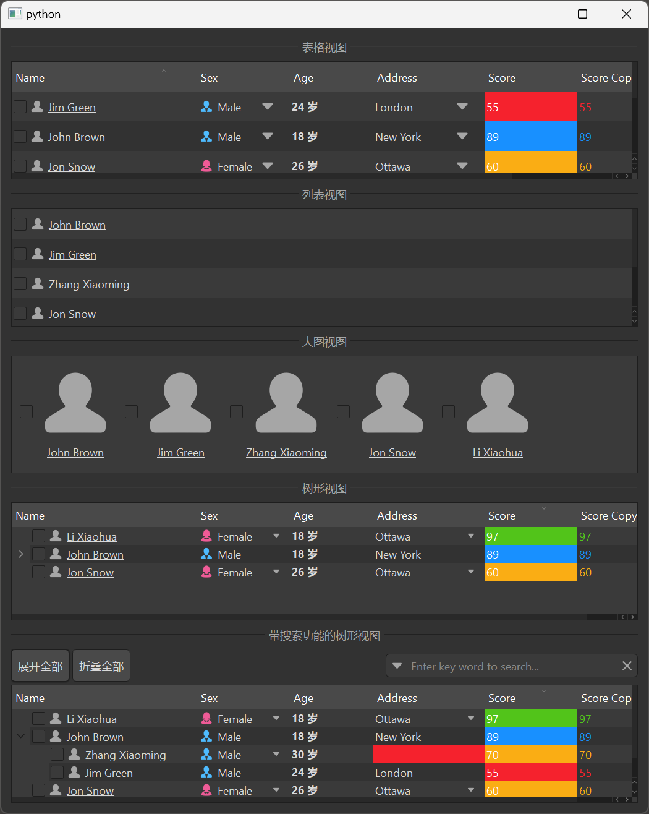

# MItemViewSet

MItemViewSet is a view set component that encapsulates view components such as MTableView, MListView, MTreeView, and MBigView, as well as model components MTableModel and MSortFilterModel, providing a unified interface to manage and display data.

## Import

```python
from dayu_widgets.item_view_set import MItemViewSet
```

## Examples

### Basic Usage

MItemViewSet can specify the type of view to use through the `view_type` parameter.

```python
from dayu_widgets.item_view_set import MItemViewSet

# Create table view set
table_view_set = MItemViewSet(view_type=MItemViewSet.TableViewType)

# Set header
table_view_set.set_header_list([
    {"key": "name", "label": "Name"},
    {"key": "age", "label": "Age"},
    {"key": "city", "label": "City"}
])

# Set data
table_view_set.setup_data([
    {"name": "John", "age": 18, "city": "New York"},
    {"name": "Jane", "age": 25, "city": "London"},
    {"name": "Bob", "age": 30, "city": "Paris"}
])
```

### Different View Types

MItemViewSet supports four view types: TableViewType, ListViewType, TreeViewType, and BigViewType.

```python
from dayu_widgets.item_view_set import MItemViewSet

# Create table view set
table_view_set = MItemViewSet(view_type=MItemViewSet.TableViewType)

# Create list view set
list_view_set = MItemViewSet(view_type=MItemViewSet.ListViewType)

# Create tree view set
tree_view_set = MItemViewSet(view_type=MItemViewSet.TreeViewType)

# Create big view set
big_view_set = MItemViewSet(view_type=MItemViewSet.BigViewType)
```

### Enable Search Functionality

MItemViewSet can enable search functionality through the `searchable` method.

```python
from dayu_widgets.item_view_set import MItemViewSet

# Create table view set
table_view_set = MItemViewSet(view_type=MItemViewSet.TableViewType)

# Enable search functionality
table_view_set.searchable()
```

### Insert Custom Widgets

MItemViewSet can insert custom widgets through the `insert_widget` method.

```python
from dayu_widgets.item_view_set import MItemViewSet
from dayu_widgets.push_button import MPushButton

# Create tree view set
tree_view_set = MItemViewSet(view_type=MItemViewSet.TreeViewType)

# Create expand and collapse buttons
expand_button = MPushButton("Expand All")
expand_button.clicked.connect(tree_view_set.item_view.expandAll)

collapse_button = MPushButton("Collapse All")
collapse_button.clicked.connect(tree_view_set.item_view.collapseAll)

# Insert custom widgets
tree_view_set.insert_widget(expand_button)
tree_view_set.insert_widget(collapse_button)
```

### Complete Example



Here is a complete example showing various uses of MItemViewSet:

```python
# Import third-party modules
from qtpy import QtWidgets

# Import local modules
from dayu_widgets import utils
from dayu_widgets.divider import MDivider
from dayu_widgets.field_mixin import MFieldMixin
from dayu_widgets.item_view_set import MItemViewSet
from dayu_widgets.push_button import MPushButton
import examples._mock_data as mock


@utils.add_settings("DaYu", "DaYuExample", event_name="hideEvent")
class ItemViewSetExample(QtWidgets.QWidget, MFieldMixin):
    def __init__(self, parent=None):
        super(ItemViewSetExample, self).__init__(parent)
        self._init_ui()

    def _init_ui(self):
        # Create table view set
        item_view_set_table = MItemViewSet(view_type=MItemViewSet.TableViewType)
        item_view_set_table.set_header_list(mock.header_list)

        # Create list view set
        item_view_set_list = MItemViewSet(view_type=MItemViewSet.ListViewType)
        item_view_set_list.set_header_list(mock.header_list)

        # Create tree view set
        item_view_set_tree = MItemViewSet(view_type=MItemViewSet.TreeViewType)
        item_view_set_tree.set_header_list(mock.header_list)

        # Create big view set
        item_view_set_thumbnail = MItemViewSet(view_type=MItemViewSet.BigViewType)
        item_view_set_thumbnail.set_header_list(mock.header_list)

        # Create tree view set with search functionality
        item_view_set_search = MItemViewSet(view_type=MItemViewSet.TreeViewType)
        item_view_set_search.set_header_list(mock.header_list)
        item_view_set_search.searchable()

        # Add expand and collapse buttons
        expand_button = MPushButton("Expand All")
        expand_button.clicked.connect(item_view_set_search.item_view.expandAll)
        coll_button = MPushButton("Collapse All")
        coll_button.clicked.connect(item_view_set_search.item_view.collapseAll)
        item_view_set_search.insert_widget(coll_button)
        item_view_set_search.insert_widget(expand_button)

        # Set tree data
        item_view_set_tree.setup_data(mock.tree_data_list)
        item_view_set_search.setup_data(mock.tree_data_list)

        # Save view list for later data update
        self.view_list = [
            item_view_set_table,
            item_view_set_list,
            item_view_set_thumbnail,
        ]

        # Bind header state
        self.bind(
            "item_view_set_example_header_state",
            item_view_set_table.item_view.header_view,
            "state",
        )

        # Create layout
        main_lay = QtWidgets.QVBoxLayout()
        main_lay.addWidget(MDivider("Table View"))
        main_lay.addWidget(item_view_set_table)
        main_lay.addWidget(MDivider("List View"))
        main_lay.addWidget(item_view_set_list)
        main_lay.addWidget(MDivider("Big View"))
        main_lay.addWidget(item_view_set_thumbnail)
        main_lay.addWidget(MDivider("Tree View"))
        main_lay.addWidget(item_view_set_tree)
        main_lay.addWidget(MDivider("Tree View with Search"))
        main_lay.addWidget(item_view_set_search)
        self.setLayout(main_lay)

        # Update data
        self.slot_update_data()

    def slot_update_data(self):
        for view in self.view_list:
            view.setup_data(mock.data_list)


if __name__ == "__main__":
    # Import local modules
    from dayu_widgets import dayu_theme
    from dayu_widgets.qt import application

    with application() as app:
        test = ItemViewSetExample()
        dayu_theme.apply(test)
        test.show()
```

## API

### Constructor

```python
MItemViewSet(view_type=None, parent=None)
```

| Parameter | Description | Type | Default |
| --- | --- | --- | --- |
| `view_type` | View type | `class` | `MItemViewSet.TableViewType` |
| `parent` | Parent widget | `QWidget` | `None` |

### Class Attributes

| Attribute | Description | Type |
| --- | --- | --- |
| `TableViewType` | Table view type | `class` |
| `ListViewType` | List view type | `class` |
| `TreeViewType` | Tree view type | `class` |
| `BigViewType` | Big view type | `class` |

### Methods

| Method | Description | Parameters | Return |
| --- | --- | --- | --- |
| `set_header_list(header_list)` | Set header list | `header_list`: Header list | None |
| `setup_data(data_list)` | Set data list | `data_list`: Data list | None |
| `get_data()` | Get data list | None | `list`: Data list |
| `searchable()` | Enable search functionality | None | `self`: Current instance |
| `insert_widget(widget)` | Insert custom widget | `widget`: Widget to insert | None |

### Signals

| Signal | Description | Parameters |
| --- | --- | --- |
| `sig_double_clicked` | Double-click signal | `QModelIndex`: Clicked index |
| `sig_left_clicked` | Left-click signal | `QModelIndex`: Clicked index |

## FAQ

### How to set the header?

You can set the header through the `set_header_list` method, which accepts a list where each element is a dictionary containing keys such as `key` and `label`:

```python
from dayu_widgets.item_view_set import MItemViewSet

# Create view set
item_view_set = MItemViewSet()

# Set header
item_view_set.set_header_list([
    {"key": "name", "label": "Name"},
    {"key": "age", "label": "Age"},
    {"key": "city", "label": "City"}
])
```

### How to set data?

You can set data through the `setup_data` method, which accepts a list where each element is a dictionary containing key-value pairs corresponding to the header:

```python
from dayu_widgets.item_view_set import MItemViewSet

# Create view set
item_view_set = MItemViewSet()

# Set header
item_view_set.set_header_list([
    {"key": "name", "label": "Name"},
    {"key": "age", "label": "Age"},
    {"key": "city", "label": "City"}
])

# Set data
item_view_set.setup_data([
    {"name": "John", "age": 18, "city": "New York"},
    {"name": "Jane", "age": 25, "city": "London"},
    {"name": "Bob", "age": 30, "city": "Paris"}
])
```

### How to get data?

You can get data through the `get_data` method:

```python
from dayu_widgets.item_view_set import MItemViewSet

# Create view set
item_view_set = MItemViewSet()

# Set data
item_view_set.setup_data([
    {"name": "John", "age": 18, "city": "New York"},
    {"name": "Jane", "age": 25, "city": "London"},
    {"name": "Bob", "age": 30, "city": "Paris"}
])

# Get data
data = item_view_set.get_data()
print(data)  # Output data list
```

### How to listen for double-click events?

You can listen for double-click events by connecting to the `sig_double_clicked` signal:

```python
from dayu_widgets.item_view_set import MItemViewSet

# Create view set
item_view_set = MItemViewSet()

# Listen for double-click events
item_view_set.sig_double_clicked.connect(lambda index: print("Double-clicked row:", index.row()))
```

### How to listen for left-click events?

You can listen for left-click events by connecting to the `sig_left_clicked` signal:

```python
from dayu_widgets.item_view_set import MItemViewSet

# Create view set
item_view_set = MItemViewSet()

# Listen for left-click events
item_view_set.sig_left_clicked.connect(lambda index: print("Clicked row:", index.row()))
```
