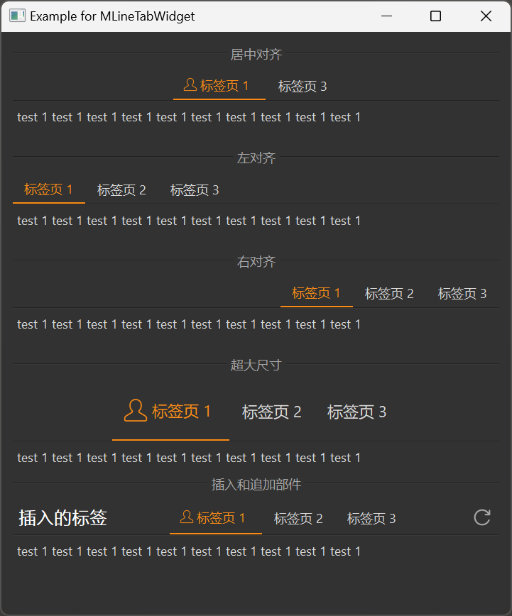

# MLineTabWidget

MLineTabWidget is an underline-style tab widget used to switch between different content areas. Its distinctive feature is a line under the tabs that clearly indicates the currently selected tab.

## Import

```python
from dayu_widgets.line_tab_widget import MLineTabWidget
```

## Examples

### Basic Usage

MLineTabWidget can add tabs using the `add_tab` method, with each tab containing a content widget and a tab data dictionary.

```python
from dayu_widgets.line_tab_widget import MLineTabWidget
from dayu_widgets.label import MLabel

# Create an underline-style tab widget
tab_widget = MLineTabWidget()

# Add tabs
tab_widget.add_tab(MLabel("This is the content of the first tab"), "Tab 1")
tab_widget.add_tab(MLabel("This is the content of the second tab"), "Tab 2")
tab_widget.add_tab(MLabel("This is the content of the third tab"), "Tab 3")

# Set the default selected tab
tab_widget.tool_button_group.set_dayu_checked(0)
```

### Tabs with Icons

MLineTabWidget supports displaying icons on tabs.

```python
from dayu_widgets.line_tab_widget import MLineTabWidget
from dayu_widgets.label import MLabel

# Create an underline-style tab widget
tab_widget = MLineTabWidget()

# Add tabs with icons
tab_widget.add_tab(MLabel("This is the content of the first tab"), {"text": "Tab 1", "svg": "user_line.svg"})
tab_widget.add_tab(MLabel("This is the content of the second tab"), {"svg": "calendar_line.svg"})
tab_widget.add_tab(MLabel("This is the content of the third tab"), "Tab 3")

# Set the default selected tab
tab_widget.tool_button_group.set_dayu_checked(0)
```

### Different Alignments

MLineTabWidget supports different alignments, which can be set through the `alignment` parameter when creating.

```python
from dayu_widgets.line_tab_widget import MLineTabWidget
from dayu_widgets.label import MLabel
from qtpy import QtCore

# Create a center-aligned tab widget (default)
tab_center = MLineTabWidget(alignment=QtCore.Qt.AlignCenter)
tab_center.add_tab(MLabel("This is the content of the first tab"), "Tab 1")
tab_center.add_tab(MLabel("This is the content of the second tab"), "Tab 2")
tab_center.add_tab(MLabel("This is the content of the third tab"), "Tab 3")
tab_center.tool_button_group.set_dayu_checked(0)

# Create a left-aligned tab widget
tab_left = MLineTabWidget(alignment=QtCore.Qt.AlignLeft)
tab_left.add_tab(MLabel("This is the content of the first tab"), "Tab 1")
tab_left.add_tab(MLabel("This is the content of the second tab"), "Tab 2")
tab_left.add_tab(MLabel("This is the content of the third tab"), "Tab 3")
tab_left.tool_button_group.set_dayu_checked(0)

# Create a right-aligned tab widget
tab_right = MLineTabWidget(alignment=QtCore.Qt.AlignRight)
tab_right.add_tab(MLabel("This is the content of the first tab"), "Tab 1")
tab_right.add_tab(MLabel("This is the content of the second tab"), "Tab 2")
tab_right.add_tab(MLabel("This is the content of the third tab"), "Tab 3")
tab_right.tool_button_group.set_dayu_checked(0)
```

### Different Sizes

MLineTabWidget supports different sizes, which can be set through the `set_dayu_size` method.

```python
from dayu_widgets.line_tab_widget import MLineTabWidget
from dayu_widgets.label import MLabel
from dayu_widgets import dayu_theme

# Create a huge size tab widget
tab_huge = MLineTabWidget()
tab_huge.set_dayu_size(dayu_theme.huge)
tab_huge.add_tab(MLabel("This is the content of the first tab"), {"text": "Tab 1", "svg": "user_line.svg"})
tab_huge.add_tab(MLabel("This is the content of the second tab"), "Tab 2")
tab_huge.add_tab(MLabel("This is the content of the third tab"), "Tab 3")
tab_huge.tool_button_group.set_dayu_checked(0)
```

### Inserting and Appending Widgets

MLineTabWidget supports inserting and appending custom widgets at both ends of the tab bar.

```python
from dayu_widgets.line_tab_widget import MLineTabWidget
from dayu_widgets.label import MLabel
from dayu_widgets.tool_button import MToolButton

# Create an underline-style tab widget
tab_widget = MLineTabWidget()
tab_widget.add_tab(MLabel("This is the content of the first tab"), {"text": "Tab 1", "svg": "user_line.svg"})
tab_widget.add_tab(MLabel("This is the content of the second tab"), "Tab 2")
tab_widget.add_tab(MLabel("This is the content of the third tab"), "Tab 3")
tab_widget.tool_button_group.set_dayu_checked(0)

# Insert a label on the left
tab_widget.insert_widget(MLabel("Inserted Label").h4())

# Append a button on the right
tab_widget.append_widget(MToolButton().svg("refresh_line.svg").icon_only())
```

### Complete Example



Here's a complete example demonstrating various uses of MLineTabWidget:

```python
# Import third-party modules
from qtpy import QtCore
from qtpy import QtWidgets

# Import local modules
from dayu_widgets import dayu_theme
from dayu_widgets.divider import MDivider
from dayu_widgets.label import MLabel
from dayu_widgets.line_tab_widget import MLineTabWidget
from dayu_widgets.tool_button import MToolButton


class LineTabWidgetExample(QtWidgets.QWidget):
    def __init__(self, parent=None):
        super(LineTabWidgetExample, self).__init__(parent)
        self.setWindowTitle("Example for MLineTabWidget")
        self._init_ui()

    def _init_ui(self):
        main_lay = QtWidgets.QVBoxLayout()

        tab_center = MLineTabWidget()
        tab_center.add_tab(MLabel("test 1 " * 10), {"text": "Tab 1", "svg": "user_line.svg"})
        tab_center.add_tab(MLabel("test 2 " * 10), {"svg": "calendar_line.svg"})
        tab_center.add_tab(MLabel("test 3 " * 10), "Tab 3")
        tab_center.tool_button_group.set_dayu_checked(0)

        tab_left = MLineTabWidget(alignment=QtCore.Qt.AlignLeft)
        tab_left.add_tab(MLabel("test 1 " * 10), "Tab 1")
        tab_left.add_tab(MLabel("test 2 " * 10), "Tab 2")
        tab_left.add_tab(MLabel("test 3 " * 10), "Tab 3")
        tab_left.tool_button_group.set_dayu_checked(0)

        tab_right = MLineTabWidget(alignment=QtCore.Qt.AlignRight)
        tab_right.add_tab(MLabel("test 1 " * 10), "Tab 1")
        tab_right.add_tab(MLabel("test 2 " * 10), "Tab 2")
        tab_right.add_tab(MLabel("test 3 " * 10), "Tab 3")
        tab_right.tool_button_group.set_dayu_checked(0)

        tab_huge = MLineTabWidget()
        tab_huge.set_dayu_size(dayu_theme.huge)
        tab_huge.add_tab(MLabel("test 1 " * 10), {"text": "Tab 1", "svg": "user_line.svg"})
        tab_huge.add_tab(MLabel("test 2 " * 10), "Tab 2")
        tab_huge.add_tab(MLabel("test 3 " * 10), "Tab 3")
        tab_huge.tool_button_group.set_dayu_checked(0)

        tab_append_insert = MLineTabWidget()
        tab_append_insert.add_tab(MLabel("test 1 " * 10), {"text": "Tab 1", "svg": "user_line.svg"})
        tab_append_insert.add_tab(MLabel("test 2 " * 10), "Tab 2")
        tab_append_insert.add_tab(MLabel("test 3 " * 10), "Tab 3")
        tab_append_insert.tool_button_group.set_dayu_checked(0)
        tab_append_insert.insert_widget(MLabel("Inserted Label").h4())
        tab_append_insert.append_widget(MToolButton().svg("refresh_line.svg").icon_only())

        main_lay.addWidget(MDivider("Center"))
        main_lay.addWidget(tab_center)
        main_lay.addSpacing(20)
        main_lay.addWidget(MDivider("Left"))
        main_lay.addWidget(tab_left)
        main_lay.addSpacing(20)
        main_lay.addWidget(MDivider("Right"))
        main_lay.addWidget(tab_right)
        main_lay.addSpacing(20)
        main_lay.addWidget(MDivider("Huge"))
        main_lay.addWidget(tab_huge)
        main_lay.addWidget(MDivider("append_widget/insert_widget"))
        main_lay.addWidget(tab_append_insert)
        main_lay.addStretch()
        self.setLayout(main_lay)


if __name__ == "__main__":
    # Import local modules
    from dayu_widgets import dayu_theme
    from dayu_widgets.qt import application

    with application() as app:
        test = LineTabWidgetExample()
        dayu_theme.apply(test)
        test.show()
```

## API

### MLineTabWidget

#### Constructor

```python
MLineTabWidget(alignment=QtCore.Qt.AlignCenter, parent=None)
```

| Parameter | Description | Type | Default Value |
| --- | --- | --- | --- |
| `alignment` | Tab bar alignment | `Qt.Alignment` | `QtCore.Qt.AlignCenter` |
| `parent` | Parent widget | `QWidget` | `None` |

#### Methods

| Method | Description | Parameters | Return Value |
| --- | --- | --- | --- |
| `append_widget(widget)` | Append a widget to the right of the tab bar | `widget`: Widget to append | None |
| `insert_widget(widget)` | Insert a widget to the left of the tab bar | `widget`: Widget to insert | None |
| `add_tab(widget, data_dict)` | Add a tab | `widget`: Content widget<br>`data_dict`: Tab data dictionary or text | None |
| `get_dayu_size()` | Get the tab size | None | `int` |
| `set_dayu_size(value)` | Set the tab size | `value`: Size value | None |

#### Properties

| Property | Description | Type | Default Value |
| --- | --- | --- | --- |
| `dayu_size` | Tab size | `int` | `dayu_theme.default` |
| `tool_button_group` | Tab button group | `MUnderlineButtonGroup` | - |
| `stack_widget` | Content area stacked widget | `MStackedWidget` | - |

#### Tab Data Dictionary

The `data_dict` parameter of the `add_tab` method can be a string or a dictionary. If it's a dictionary, it can contain the following keys:

| Key | Description | Type | Required |
| --- | --- | --- | --- |
| `text` | Tab text | `str` | No |
| `svg` | Tab icon SVG filename | `str` | No |
| `icon` | Tab icon object | `QIcon` | No |

## Frequently Asked Questions

### How to set the default selected tab?

You can set the default selected tab using the `tool_button_group.set_dayu_checked` method:

```python
from dayu_widgets.line_tab_widget import MLineTabWidget
from dayu_widgets.label import MLabel

# Create an underline-style tab widget
tab_widget = MLineTabWidget()
tab_widget.add_tab(MLabel("This is the content of the first tab"), "Tab 1")
tab_widget.add_tab(MLabel("This is the content of the second tab"), "Tab 2")
tab_widget.add_tab(MLabel("This is the content of the third tab"), "Tab 3")

# Set the second tab as the default selected tab (index starts from 0)
tab_widget.tool_button_group.set_dayu_checked(1)
```

### How to get the currently selected tab index?

You can get the currently selected tab index using the `tool_button_group.get_dayu_checked` method:

```python
from dayu_widgets.line_tab_widget import MLineTabWidget

# Create an underline-style tab widget
tab_widget = MLineTabWidget()
# Add tabs...

# Get the currently selected tab index
current_index = tab_widget.tool_button_group.get_dayu_checked()
print("Currently selected tab index:", current_index)
```

### How to listen for tab change events?

You can listen for tab change events by connecting to the `tool_button_group.sig_checked_changed` signal:

```python
from dayu_widgets.line_tab_widget import MLineTabWidget
from dayu_widgets.label import MLabel

# Create an underline-style tab widget
tab_widget = MLineTabWidget()
tab_widget.add_tab(MLabel("This is the content of the first tab"), "Tab 1")
tab_widget.add_tab(MLabel("This is the content of the second tab"), "Tab 2")
tab_widget.add_tab(MLabel("This is the content of the third tab"), "Tab 3")

# Listen for tab change events
tab_widget.tool_button_group.sig_checked_changed.connect(lambda index: print("Switched to tab:", index))
```

### How to show only icons in tabs?

If you want to show only icons without text, you can set only the `svg` or `icon` key without setting the `text` key:

```python
from dayu_widgets.line_tab_widget import MLineTabWidget
from dayu_widgets.label import MLabel

# Create an underline-style tab widget
tab_widget = MLineTabWidget()

# Add a tab with only an icon
tab_widget.add_tab(MLabel("This is content"), {"svg": "user_line.svg"})
```

### How to add custom widgets at both ends of the tab bar?

You can add custom widgets at both ends of the tab bar using the `insert_widget` and `append_widget` methods:

```python
from dayu_widgets.line_tab_widget import MLineTabWidget
from dayu_widgets.label import MLabel
from dayu_widgets.tool_button import MToolButton

# Create an underline-style tab widget
tab_widget = MLineTabWidget()
# Add tabs...

# Insert a label on the left
tab_widget.insert_widget(MLabel("Inserted Label").h4())

# Append a button on the right
tab_widget.append_widget(MToolButton().svg("refresh_line.svg").icon_only())
```
