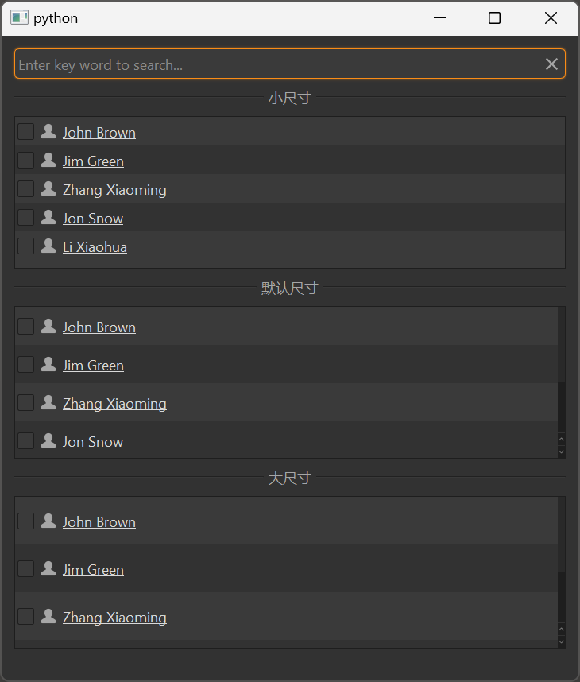

# MListView

MListView is a list view component used to display data in a list format. It is based on Qt's QListView class, providing a more attractive style and better interaction experience, supporting sorting, filtering, and more.

## Import

```python
from dayu_widgets.item_view import MListView
```

## Examples

<!-- Need to add screenshots for MListView -->


### Basic Usage

MListView needs to be used with MTableModel and MSortFilterModel to display and manage data.

```python
from dayu_widgets.item_view import MListView
from dayu_widgets.item_model import MTableModel
from dayu_widgets.item_model import MSortFilterModel

# Create model
model = MTableModel()
model.set_header_list([
    {"key": "name", "label": "Name"},
    {"key": "age", "label": "Age"},
    {"key": "city", "label": "City"}
])

# Create sort filter model
sort_filter_model = MSortFilterModel()
sort_filter_model.setSourceModel(model)

# Create list view
list_view = MListView()
list_view.setModel(sort_filter_model)
list_view.set_header_list([
    {"key": "name", "label": "Name"},
    {"key": "age", "label": "Age"},
    {"key": "city", "label": "City"}
])

# Set data
model.set_data_list([
    {"name": "John", "age": 18, "city": "New York"},
    {"name": "Jane", "age": 25, "city": "London"},
    {"name": "Bob", "age": 30, "city": "Paris"}
])
```

### Different Sizes

MListView supports different sizes, which can be set through the `size` parameter.

```python
from dayu_widgets.item_view import MListView
from dayu_widgets import dayu_theme

# Create small size list view
list_small = MListView(size=dayu_theme.small)

# Create medium size list view (default)
list_default = MListView(size=dayu_theme.medium)

# Create large size list view
list_large = MListView(size=dayu_theme.large)
```

### Set Display Column

MListView can set which column to display using the `set_show_column` method.

```python
from dayu_widgets.item_view import MListView

# Create list view
list_view = MListView()

# Set to display the "name" column
list_view.set_show_column("name")
```

### Search Filtering

MListView can be used with MLineEdit to implement search filtering.

```python
from dayu_widgets.item_view import MListView
from dayu_widgets.item_model import MTableModel
from dayu_widgets.item_model import MSortFilterModel
from dayu_widgets.line_edit import MLineEdit

# Create model and view
model = MTableModel()
sort_filter_model = MSortFilterModel()
sort_filter_model.setSourceModel(model)
list_view = MListView()
list_view.setModel(sort_filter_model)

# Create search box
search_line_edit = MLineEdit().search().small()
search_line_edit.textChanged.connect(sort_filter_model.set_search_pattern)
```

### Complete Example



Here is a complete example showing various uses of MListView:

```python
# Import third-party modules
from qtpy import QtWidgets

# Import local modules
from dayu_widgets import dayu_theme
from dayu_widgets.divider import MDivider
from dayu_widgets.field_mixin import MFieldMixin
from dayu_widgets.item_model import MSortFilterModel
from dayu_widgets.item_model import MTableModel
from dayu_widgets.item_view import MListView
from dayu_widgets.line_edit import MLineEdit
import examples._mock_data as mock


class ListViewExample(QtWidgets.QWidget, MFieldMixin):
    def __init__(self, parent=None):
        super(ListViewExample, self).__init__(parent)
        self._init_ui()

    def _init_ui(self):
        table_small = MListView(size=dayu_theme.small)
        table_default = MListView()
        table_large = MListView(size=dayu_theme.large)

        model_1 = MTableModel()
        model_1.set_header_list(mock.header_list)
        model_sort = MSortFilterModel()
        model_sort.setSourceModel(model_1)
        table_small.setModel(model_sort)
        table_default.setModel(model_sort)
        table_large.setModel(model_sort)
        model_sort.set_header_list(mock.header_list)
        table_small.set_header_list(mock.header_list)
        table_default.set_header_list(mock.header_list)
        table_large.set_header_list(mock.header_list)
        model_1.set_data_list(mock.data_list)

        line_edit = MLineEdit().search().small()
        line_edit.textChanged.connect(model_sort.set_search_pattern)

        main_lay = QtWidgets.QVBoxLayout()
        main_lay.addWidget(line_edit)
        main_lay.addWidget(MDivider("Small Size"))
        main_lay.addWidget(table_small)
        main_lay.addWidget(MDivider("Default Size"))
        main_lay.addWidget(table_default)
        main_lay.addWidget(MDivider("Large Size"))
        main_lay.addWidget(table_large)
        main_lay.addStretch()
        self.setLayout(main_lay)


if __name__ == "__main__":
    # Import local modules
    from dayu_widgets.qt import application

    with application() as app:
        test = ListViewExample()
        dayu_theme.apply(test)
        test.show()
```

## API

### Constructor

```python
MListView(size=None, parent=None)
```

| Parameter | Description | Type | Default |
| --- | --- | --- | --- |
| `size` | List size | `int` | `dayu_theme.default_size` |
| `parent` | Parent widget | `QWidget` | `None` |

### Methods

| Method | Description | Parameters | Return |
| --- | --- | --- | --- |
| `set_header_list(header_list)` | Set header list | `header_list`: Header list | None |
| `set_show_column(attr)` | Set display column | `attr`: Column key | None |
| `enable_context_menu(enable)` | Enable context menu | `enable`: Whether to enable | None |
| `slot_context_menu(point)` | Context menu slot function | `point`: Right-click position | None |

### Signals

| Signal | Description | Parameters |
| --- | --- | --- |
| `sig_context_menu` | Context menu signal | `object`: Context menu data |

### Inherited Methods

MListView inherits from QListView, so you can use all methods of QListView, such as:

- `setModel(model)`: Set data model
- `setSelectionBehavior(behavior)`: Set selection behavior
- `setSelectionMode(mode)`: Set selection mode
- For more methods, please refer to the Qt documentation

## FAQ

### How to set the header?

You can set the header through the `set_header_list` method, which accepts a list where each element is a dictionary containing keys such as `key` and `label`:

```python
from dayu_widgets.item_view import MListView

# Create list view
list_view = MListView()

# Set header
list_view.set_header_list([
    {"key": "name", "label": "Name"},
    {"key": "age", "label": "Age"},
    {"key": "city", "label": "City"}
])
```

### How to set data?

Data needs to be set through the `set_data_list` method of MTableModel:

```python
from dayu_widgets.item_view import MListView
from dayu_widgets.item_model import MTableModel
from dayu_widgets.item_model import MSortFilterModel

# Create model
model = MTableModel()
model.set_header_list([
    {"key": "name", "label": "Name"},
    {"key": "age", "label": "Age"},
    {"key": "city", "label": "City"}
])

# Create sort filter model
sort_filter_model = MSortFilterModel()
sort_filter_model.setSourceModel(model)

# Create list view
list_view = MListView()
list_view.setModel(sort_filter_model)
list_view.set_header_list([
    {"key": "name", "label": "Name"},
    {"key": "age", "label": "Age"},
    {"key": "city", "label": "City"}
])

# Set data
model.set_data_list([
    {"name": "John", "age": 18, "city": "New York"},
    {"name": "Jane", "age": 25, "city": "London"},
    {"name": "Bob", "age": 30, "city": "Paris"}
])
```

### How to implement search filtering?

You can implement search filtering through the `set_search_pattern` method of MSortFilterModel:

```python
from dayu_widgets.item_view import MListView
from dayu_widgets.item_model import MTableModel
from dayu_widgets.item_model import MSortFilterModel
from dayu_widgets.line_edit import MLineEdit

# Create model and view
model = MTableModel()
sort_filter_model = MSortFilterModel()
sort_filter_model.setSourceModel(model)
list_view = MListView()
list_view.setModel(sort_filter_model)

# Create search box
search_line_edit = MLineEdit().search().small()
search_line_edit.textChanged.connect(sort_filter_model.set_search_pattern)
```

### How to use MItemViewSet to simplify code?

MItemViewSet is a component that encapsulates MListView, MTableModel, and MSortFilterModel, which can simplify code:

```python
from dayu_widgets.item_view_set import MItemViewSet

# Create list view set
item_view_set = MItemViewSet(view_type=MItemViewSet.ListViewType)

# Set header
item_view_set.set_header_list([
    {"key": "name", "label": "Name"},
    {"key": "age", "label": "Age"},
    {"key": "city", "label": "City"}
])

# Set data
item_view_set.setup_data([
    {"name": "John", "age": 18, "city": "New York"},
    {"name": "Jane", "age": 25, "city": "London"},
    {"name": "Bob", "age": 30, "city": "Paris"}
])
```
