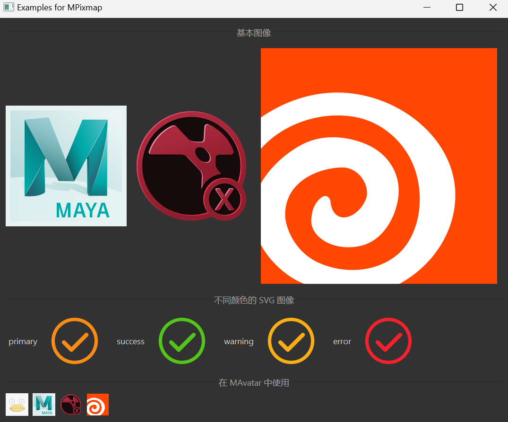

# MPixmap

MPixmap is a component for loading and managing images, based on Qt's QPixmap class, providing more convenient image loading and color management features.

## Import

```python
from dayu_widgets.qt import MPixmap
```

## Examples

### Basic Usage

MPixmap can load images in SVG or PNG format.

```python
from dayu_widgets.qt import MPixmap
from qtpy import QtWidgets

# Create an image
pixmap = MPixmap("avatar.png")

# Create an SVG image
svg_pixmap = MPixmap("success_line.svg")

# Use the image in a label
label = QtWidgets.QLabel()
label.setPixmap(pixmap)
```

### Custom Colors

MPixmap supports setting custom colors for SVG images.

```python
from dayu_widgets.qt import MPixmap
from dayu_widgets import dayu_theme

# Use hexadecimal color code
colored_pixmap = MPixmap("success_line.svg", "#1890ff")

# Use theme colors
primary_pixmap = MPixmap("success_line.svg", dayu_theme.primary_color)
success_pixmap = MPixmap("success_line.svg", dayu_theme.success_color)
warning_pixmap = MPixmap("warning_line.svg", dayu_theme.warning_color)
error_pixmap = MPixmap("error_line.svg", dayu_theme.error_color)
```

### Using with Components

MPixmap can be used with other components in dayu_widgets, such as MAvatar, MCard, etc.

```python
from dayu_widgets.qt import MPixmap
from dayu_widgets.avatar import MAvatar
from dayu_widgets.card import MCard

# Use in MAvatar
avatar = MAvatar()
avatar.set_dayu_image(MPixmap("avatar.png"))

# Use in MCard
card = MCard(title="Card Title", image=MPixmap("app-houdini.png"))
```

### Caching Mechanism

MPixmap uses a caching mechanism, where images with the same path and color are loaded only once, improving performance.

```python
from dayu_widgets.qt import MPixmap

# These two variables reference the same image object
pixmap1 = MPixmap("avatar.png")
pixmap2 = MPixmap("avatar.png")

# These two variables reference different image objects because the colors are different
colored_pixmap1 = MPixmap("success_line.svg", "#1890ff")
colored_pixmap2 = MPixmap("success_line.svg", "#52c41a")
```

### Complete Example



The following is a complete example that demonstrates various uses of MPixmap:

```python
# Import third-party modules
from qtpy import QtWidgets

# Import local modules
from dayu_widgets import dayu_theme
from dayu_widgets.avatar import MAvatar
from dayu_widgets.divider import MDivider
from dayu_widgets.field_mixin import MFieldMixin
from dayu_widgets.label import MLabel
from dayu_widgets.qt import MPixmap


class PixmapExample(QtWidgets.QWidget, MFieldMixin):
    def __init__(self, parent=None):
        super(PixmapExample, self).__init__(parent)
        self.setWindowTitle("Examples for MPixmap")
        self._init_ui()

    def _init_ui(self):
        basic_lay = QtWidgets.QHBoxLayout()

        # Basic images
        label1 = QtWidgets.QLabel()
        label1.setPixmap(MPixmap("app-maya.png"))
        basic_lay.addWidget(label1)

        label2 = QtWidgets.QLabel()
        label2.setPixmap(MPixmap("app-nuke.png"))
        basic_lay.addWidget(label2)

        label3 = QtWidgets.QLabel()
        label3.setPixmap(MPixmap("app-houdini.png"))
        basic_lay.addWidget(label3)

        basic_lay.addStretch()

        # SVG images with different colors
        color_lay = QtWidgets.QHBoxLayout()
        color_list = [
            ("primary", dayu_theme.primary_color),
            ("success", dayu_theme.success_color),
            ("warning", dayu_theme.warning_color),
            ("error", dayu_theme.error_color),
        ]

        for label_text, color in color_list:
            label = QtWidgets.QLabel()
            label.setPixmap(MPixmap("success_line.svg", color))
            color_lay.addWidget(MLabel(label_text))
            color_lay.addWidget(label)
            color_lay.addSpacing(10)

        color_lay.addStretch()

        # Using in MAvatar
        avatar_lay = QtWidgets.QHBoxLayout()

        avatar1 = MAvatar()
        avatar1.set_dayu_image(MPixmap("avatar.png"))
        avatar_lay.addWidget(avatar1)

        avatar2 = MAvatar()
        avatar2.set_dayu_image(MPixmap("app-maya.png"))
        avatar_lay.addWidget(avatar2)

        avatar3 = MAvatar()
        avatar3.set_dayu_image(MPixmap("app-nuke.png"))
        avatar_lay.addWidget(avatar3)

        avatar4 = MAvatar()
        avatar4.set_dayu_image(MPixmap("app-houdini.png"))
        avatar_lay.addWidget(avatar4)

        avatar_lay.addStretch()

        main_lay = QtWidgets.QVBoxLayout()
        main_lay.addWidget(MDivider("Basic Images"))
        main_lay.addLayout(basic_lay)
        main_lay.addWidget(MDivider("SVG Images with Different Colors"))
        main_lay.addLayout(color_lay)
        main_lay.addWidget(MDivider("Using in MAvatar"))
        main_lay.addLayout(avatar_lay)
        main_lay.addStretch()
        self.setLayout(main_lay)


if __name__ == "__main__":
    # Import local modules
    from dayu_widgets import dayu_theme
    from dayu_widgets.qt import application

    with application() as app:
        test = PixmapExample()
        dayu_theme.apply(test)
        test.show()
```

## API

### Constructor

```python
MPixmap(path, color=None)
```

| Parameter | Description | Type | Default Value |
| --- | --- | --- | --- |
| `path` | Image path, relative to the static resource directory | `str` | - |
| `color` | Image color, only effective for SVG images | `str` | `None` |

### Static Resource Path

MPixmap will look for image files in the following paths:

1. Default path: `dayu_widgets/static/`
2. Custom paths: set through `dayu_widgets.CUSTOM_STATIC_FOLDERS`

### Inherited Methods

MPixmap inherits from QPixmap, so you can use all methods of QPixmap, such as:

- `width()`: Get the image width
- `height()`: Get the image height
- `size()`: Get the image size
- `scaled()`: Scale the image
- `scaledToWidth()`: Scale the image to a specific width
- `scaledToHeight()`: Scale the image to a specific height
- For more methods, please refer to the Qt documentation

## Frequently Asked Questions

### How to use custom images?

MPixmap will look for image files in the `dayu_widgets/static/` directory by default. If you want to use custom images, you can:

1. Place the image files in the `dayu_widgets/static/` directory
2. Or set a custom path:

```python
import dayu_widgets
dayu_widgets.CUSTOM_STATIC_FOLDERS.append("path/to/your/images")
```

### How to change the color of SVG images?

MPixmap supports specifying the SVG image color when creating it:

```python
# Use hexadecimal color code
pixmap1 = MPixmap("success_line.svg", "#1890ff")

# Use theme color
pixmap2 = MPixmap("success_line.svg", dayu_theme.primary_color)
```

### What image formats are supported?

MPixmap supports images in SVG and PNG formats:

- SVG format: supports changing color through the `color` parameter
- PNG format: does not support changing color, but supports transparency

### How to use images in components?

Many dayu_widgets components support setting images:

```python
# Use in MAvatar
avatar = MAvatar()
avatar.set_dayu_image(MPixmap("avatar.png"))

# Use in MCard
card = MCard(title="Card Title", image=MPixmap("app-houdini.png"))

# Use in MMeta
meta = MMeta()
meta.setup_data({
    "title": "Houdini",
    "description": "Side Effects Software's flagship product",
    "avatar": MPixmap("user_line.svg"),
    "cover": MPixmap("app-houdini.png"),
})
```
