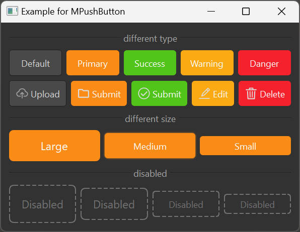

# MPushButton

Buttons are used to start an immediate action, marking or encapsulating a group of command operations.

## Import

```python
from dayu_widgets import MPushButton
```

## Examples

### Basic Usage

MPushButton has five types: default button, primary button, success button, warning button, and danger button.

```python
from dayu_widgets.push_button import MPushButton

# Create different types of buttons
default_button = MPushButton("Default")
primary_button = MPushButton("Primary").primary()
success_button = MPushButton("Success").success()
warning_button = MPushButton("Warning").warning()
danger_button = MPushButton("Danger").danger()
```

### Different Sizes

MPushButton has five sizes: tiny, small, medium (default), large, and huge.

```python
from dayu_widgets.push_button import MPushButton

# Create buttons with different sizes
huge_button = MPushButton("Huge").huge().primary()
large_button = MPushButton("Large").large().primary()
medium_button = MPushButton("Medium").medium().primary()
small_button = MPushButton("Small").small().primary()
tiny_button = MPushButton("Tiny").tiny().primary()
```

### Disabled State

Use `setEnabled(False)` to set a button to the disabled state.

```python
from dayu_widgets.push_button import MPushButton

# Create a disabled button
disabled_button = MPushButton("Disabled")
disabled_button.setEnabled(False)
```

### Complete Example

The following is a complete example that demonstrates all the features of MPushButton:



```python
# Import third-party modules
from qtpy import QtWidgets

# Import local modules
from dayu_widgets import dayu_theme
from dayu_widgets.divider import MDivider
from dayu_widgets.field_mixin import MFieldMixin
from dayu_widgets.push_button import MPushButton
from dayu_widgets.qt import MIcon


class PushButtonExample(QtWidgets.QWidget, MFieldMixin):
    def __init__(self, parent=None):
        super(PushButtonExample, self).__init__(parent)
        self.setWindowTitle("Example for MPushButton")

        sub_lay1 = QtWidgets.QHBoxLayout()
        sub_lay1.addWidget(MPushButton("Default"))
        sub_lay1.addWidget(MPushButton("Primary").primary())
        sub_lay1.addWidget(MPushButton("Success").success())
        sub_lay1.addWidget(MPushButton("Warning").warning())
        sub_lay1.addWidget(MPushButton("Danger").danger())

        sub_lay2 = QtWidgets.QHBoxLayout()
        sub_lay2.addWidget(MPushButton("Upload", MIcon("cloud_line.svg")))
        sub_lay2.addWidget(MPushButton("Submit", MIcon("folder_line.svg", "#ddd")).primary())
        sub_lay2.addWidget(MPushButton("Submit", MIcon("success_line.svg", "#ddd")).success())
        sub_lay2.addWidget(MPushButton("Edit", MIcon("edit_line.svg", "#ddd")).warning())
        sub_lay2.addWidget(MPushButton("Delete", MIcon("trash_line.svg", "#ddd")).danger())

        sub_lay3 = QtWidgets.QHBoxLayout()
        sub_lay3.addWidget(MPushButton("Large").large().primary())
        sub_lay3.addWidget(MPushButton("Medium").medium().primary())
        sub_lay3.addWidget(MPushButton("Small").small().primary())

        disabled_button_1 = MPushButton("Disabled").huge()
        disabled_button_1.setEnabled(False)
        disabled_button_2 = MPushButton("Disabled").large()
        disabled_button_2.setEnabled(False)
        disabled_button_3 = MPushButton("Disabled")
        disabled_button_3.setEnabled(False)
        disabled_button_4 = MPushButton("Disabled").small()
        disabled_button_4.setEnabled(False)
        disable_lay = QtWidgets.QHBoxLayout()
        disable_lay.addWidget(disabled_button_1)
        disable_lay.addWidget(disabled_button_2)
        disable_lay.addWidget(disabled_button_3)
        disable_lay.addWidget(disabled_button_4)

        main_lay = QtWidgets.QVBoxLayout()
        main_lay.addWidget(MDivider("different type"))
        main_lay.addLayout(sub_lay1)
        main_lay.addLayout(sub_lay2)
        main_lay.addWidget(MDivider("different size"))
        main_lay.addLayout(sub_lay3)
        main_lay.addWidget(MDivider("disabled"))
        main_lay.addLayout(disable_lay)
        main_lay.addStretch()
        self.setLayout(main_lay)


if __name__ == '__main__':
    # Import local modules
    from dayu_widgets import dayu_theme
    from dayu_widgets.qt import application

    with application() as app:
        test = PushButtonExample()
        dayu_theme.apply(test)
        test.show()
```

## API

### Properties

| Property | Description | Type | Default Value |
| --- | --- | --- | --- |
| `dayu_size` | Button size | `int` | `dayu_theme.default_size` |
| `dayu_type` | Button type | `str` | `MPushButton.DefaultType` |

### Methods

| Method | Description | Parameters | Return Value |
| --- | --- | --- | --- |
| `primary()` | Set the button to primary type | None | Current button instance |
| `success()` | Set the button to success type | None | Current button instance |
| `warning()` | Set the button to warning type | None | Current button instance |
| `danger()` | Set the button to danger type | None | Current button instance |
| `huge()` | Set the button to huge size | None | Current button instance |
| `large()` | Set the button to large size | None | Current button instance |
| `medium()` | Set the button to medium size | None | Current button instance |
| `small()` | Set the button to small size | None | Current button instance |
| `tiny()` | Set the button to tiny size | None | Current button instance |

### Inherited Signals

| Signal | Description | Parameters |
| --- | --- | --- |
| `clicked` | Emitted when the button is clicked | None |

## Frequently Asked Questions

### How to set the button style?

The style of MPushButton is managed by dayu_theme. You can change the button style by setting different types and sizes, without manually setting the stylesheet.

### How to use multiple types on a single button?

Each button can only be set to one type, but you can chain calls to set the type and size, for example:

```python
button = MPushButton("Button").primary().large()
