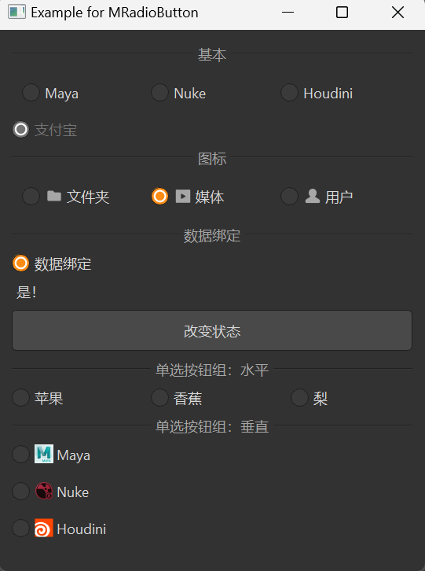

# MRadioButton

MRadioButton is a radio button component used for selecting a single option from a set. It is based on Qt's QRadioButton class, providing a more attractive style and better interaction experience.

## Import

```python
from dayu_widgets.radio_button import MRadioButton
```

## Examples

### Basic Usage

MRadioButton can create a simple radio button that users can check or uncheck.

```python
from dayu_widgets.radio_button import MRadioButton
from qtpy import QtWidgets

# Create a horizontal layout
layout = QtWidgets.QHBoxLayout()

# Add three radio buttons
layout.addWidget(MRadioButton("Maya"))
layout.addWidget(MRadioButton("Nuke"))
layout.addWidget(MRadioButton("Houdini"))

# Note: By default, radio buttons with the same parent are mutually exclusive
```

### Radio Button with Icon

MRadioButton supports setting an icon that will be displayed next to the text.

```python
from dayu_widgets.radio_button import MRadioButton
from dayu_widgets.qt import MIcon

# Create radio buttons with icons
radio_button_1 = MRadioButton("Folder")
radio_button_1.setIcon(MIcon("folder_fill.svg"))

radio_button_2 = MRadioButton("Media")
radio_button_2.setIcon(MIcon("media_fill.svg"))

radio_button_3 = MRadioButton("User")
radio_button_3.setIcon(MIcon("user_fill.svg"))

# Set default checked state
radio_button_2.setChecked(True)
```

### Disabled State

MRadioButton can be set to a disabled state, where users cannot interact with it.

```python
from dayu_widgets.radio_button import MRadioButton

# Create a disabled radio button
radio_button = MRadioButton("Disabled Option")
radio_button.setEnabled(False)

# Create a checked and disabled radio button
radio_button_checked = MRadioButton("Checked and Disabled")
radio_button_checked.setChecked(True)
radio_button_checked.setEnabled(False)
```

### Data Binding

MRadioButton can be used with MFieldMixin for data binding.

```python
# Import third-party modules
from qtpy import QtWidgets

# Import local modules
from dayu_widgets.radio_button import MRadioButton
from dayu_widgets.field_mixin import MFieldMixin
from dayu_widgets.label import MLabel
from dayu_widgets.push_button import MPushButton


class RadioButtonBindExample(QtWidgets.QWidget, MFieldMixin):
    def __init__(self, parent=None):
        super(RadioButtonBindExample, self).__init__(parent)
        self._init_ui()

    def _init_ui(self):
        # Create radio button and label
        radio_button = MRadioButton("Data Bind")
        label = MLabel()

        # Create button to change state
        button = MPushButton("Change State")
        button.clicked.connect(lambda: self.set_field("checked", not self.field("checked")))

        # Register fields and bind
        self.register_field("checked", True)
        self.register_field("checked_text", lambda: "Yes!" if self.field("checked") else "No!!")
        self.bind("checked", radio_button, "checked", signal="toggled")
        self.bind("checked_text", label, "text")

        # Create layout
        main_lay = QtWidgets.QVBoxLayout()
        main_lay.addWidget(radio_button)
        main_lay.addWidget(label)
        main_lay.addWidget(button)
        self.setLayout(main_lay)
```

### Radio Button Group

MRadioButtonGroup is a radio button group component that can easily manage a group of radio buttons.

```python
from dayu_widgets.button_group import MRadioButtonGroup
from qtpy import QtCore

# Create a horizontal radio button group
radio_group_h = MRadioButtonGroup()
radio_group_h.set_button_list(["Apple", "Banana", "Pear"])

# Create a vertical radio button group
radio_group_v = MRadioButtonGroup(orientation=QtCore.Qt.Vertical)
radio_group_v.set_button_list(["Option A", "Option B", "Option C"])

# Listen for checked state changes
radio_group_h.sig_checked_changed.connect(lambda index: print("Checked option index:", index))
```

### Radio Button Group with Icons

MRadioButtonGroup supports setting icons for each option.

```python
from dayu_widgets.button_group import MRadioButtonGroup
from dayu_widgets.qt import MIcon

# Create a radio button group with icons
radio_group = MRadioButtonGroup()
radio_group.set_button_list([
    {"text": "Maya", "icon": MIcon("app-maya.png")},
    {"text": "Nuke", "icon": MIcon("app-nuke.png")},
    {"text": "Houdini", "icon": MIcon("app-houdini.png")}
])
```

### Complete Example



Here's a complete example demonstrating various uses of MRadioButton and MRadioButtonGroup:

```python
# Import third-party modules
from qtpy import QtCore
from qtpy import QtWidgets

# Import local modules
from dayu_widgets.button_group import MRadioButtonGroup
from dayu_widgets.divider import MDivider
from dayu_widgets.field_mixin import MFieldMixin
from dayu_widgets.label import MLabel
from dayu_widgets.push_button import MPushButton
from dayu_widgets.qt import MIcon
from dayu_widgets.radio_button import MRadioButton


class RadioButtonExample(QtWidgets.QWidget, MFieldMixin):
    def __init__(self, parent=None):
        super(RadioButtonExample, self).__init__(parent)
        self.setWindowTitle("Example for MRadioButton")
        self._init_ui()

    def _init_ui(self):
        # Basic radio buttons
        widget_1 = QtWidgets.QWidget()
        lay_1 = QtWidgets.QHBoxLayout()
        lay_1.addWidget(MRadioButton("Maya"))
        lay_1.addWidget(MRadioButton("Nuke"))
        lay_1.addWidget(MRadioButton("Houdini"))
        widget_1.setLayout(lay_1)

        # Radio buttons with icons
        check_box_icon_1 = MRadioButton("Folder")
        check_box_icon_1.setIcon(MIcon("folder_fill.svg"))
        check_box_icon_2 = MRadioButton("Media")
        check_box_icon_2.setIcon(MIcon("media_fill.svg"))
        check_box_icon_3 = MRadioButton("User")
        check_box_icon_3.setIcon(MIcon("user_fill.svg"))
        check_box_icon_2.setChecked(True)
        widget_2 = QtWidgets.QWidget()
        lay_2 = QtWidgets.QHBoxLayout()
        lay_2.addWidget(check_box_icon_1)
        lay_2.addWidget(check_box_icon_2)
        lay_2.addWidget(check_box_icon_3)
        widget_2.setLayout(lay_2)

        # Disabled radio button
        check_box_single = MRadioButton("Alipay")
        check_box_single.setChecked(True)
        check_box_single.setEnabled(False)

        # Data binding
        check_box_bind = MRadioButton("Data Bind")
        label = MLabel()
        button = MPushButton(text="Change State")
        button.clicked.connect(lambda: self.set_field("checked", not self.field("checked")))
        self.register_field("checked", True)
        self.register_field("checked_text", lambda: "Yes!" if self.field("checked") else "No!!")
        self.bind("checked", check_box_bind, "checked", signal="toggled")
        self.bind("checked_text", label, "text")

        # Radio button group
        radio_group_h = MRadioButtonGroup()
        radio_group_h.set_button_list(["Apple", {"text": "Banana"}, {"text": "Pear"}])

        app_data = [
            {"text": "Maya", "icon": MIcon("app-maya.png")},
            {"text": "Nuke", "icon": MIcon("app-nuke.png")},
            {"text": "Houdini", "icon": MIcon("app-houdini.png")},
        ]
        radio_group_v = MRadioButtonGroup(orientation=QtCore.Qt.Vertical)
        radio_group_v.set_button_list(app_data)

        # Main layout
        main_lay = QtWidgets.QVBoxLayout()
        main_lay.addWidget(MDivider("Basic"))
        main_lay.addWidget(widget_1)
        main_lay.addWidget(check_box_single)
        main_lay.addWidget(MDivider("Icon"))
        main_lay.addWidget(widget_2)
        main_lay.addWidget(MDivider("Data Bind"))
        main_lay.addWidget(check_box_bind)
        main_lay.addWidget(label)
        main_lay.addWidget(button)
        main_lay.addWidget(MDivider("Radio Button Group: Horizontal"))
        main_lay.addWidget(radio_group_h)
        main_lay.addWidget(MDivider("Radio Button Group: Vertical"))
        main_lay.addWidget(radio_group_v)
        main_lay.addStretch()
        self.setLayout(main_lay)


if __name__ == "__main__":
    # Import local modules
    from dayu_widgets import dayu_theme
    from dayu_widgets.qt import application

    with application() as app:
        test = RadioButtonExample()
        dayu_theme.apply(test)
        test.show()
```

## API

### MRadioButton

#### Constructor

```python
MRadioButton(text="", parent=None)
```

| Parameter | Description | Type | Default Value |
| --- | --- | --- | --- |
| `text` | Text displayed by the radio button | `str` | `""` |
| `parent` | Parent widget | `QWidget` | `None` |

#### Inherited Methods

MRadioButton inherits from QRadioButton, so you can use all methods of QRadioButton, such as:

- `setChecked(bool)`: Set whether the radio button is checked
- `isChecked()`: Get whether the radio button is checked
- `setIcon(QIcon)`: Set the radio button icon
- `setEnabled(bool)`: Set whether the radio button is enabled
- For more methods, please refer to the Qt documentation

### MRadioButtonGroup

#### Constructor

```python
MRadioButtonGroup(orientation=QtCore.Qt.Horizontal, parent=None)
```

| Parameter | Description | Type | Default Value |
| --- | --- | --- | --- |
| `orientation` | Layout orientation | `QtCore.Qt.Orientation` | `QtCore.Qt.Horizontal` |
| `parent` | Parent widget | `QWidget` | `None` |

#### Methods

| Method | Description | Parameters | Return Value |
| --- | --- | --- | --- |
| `set_button_list(data_list)` | Set the button list | `data_list`: List of button data | None |
| `get_dayu_checked()` | Get the index of the checked button | None | `int` |
| `set_dayu_checked(value)` | Set the index of the checked button | `value`: Index of the button to check | None |
| `set_spacing(value)` | Set the spacing between buttons | `value`: Spacing value | None |
| `get_button_group()` | Get the internal QButtonGroup | None | `QButtonGroup` |

#### Signals

| Signal | Description | Parameters |
| --- | --- | --- |
| `sig_checked_changed` | Triggered when the checked state changes | `int`: Index of the checked button |

#### Button Data

Button data can be a string or a dictionary:

- If it's a string, it will be used as the button text
- If it's a dictionary, it can contain the following keys:
  - `text`: Button text
  - `icon`: Button icon
  - `checked`: Whether the button is checked by default

## Frequently Asked Questions

### How to create mutually exclusive radio button groups?

By default, radio buttons with the same parent are mutually exclusive, meaning only one can be checked at a time. If you need to create multiple exclusive groups, you can use QButtonGroup:

```python
from dayu_widgets.radio_button import MRadioButton
from qtpy import QtWidgets

# Create two button groups
group1 = QtWidgets.QButtonGroup()
group2 = QtWidgets.QButtonGroup()

# First group of radio buttons
radio1_1 = MRadioButton("Option 1-1")
radio1_2 = MRadioButton("Option 1-2")
group1.addButton(radio1_1)
group1.addButton(radio1_2)

# Second group of radio buttons
radio2_1 = MRadioButton("Option 2-1")
radio2_2 = MRadioButton("Option 2-2")
group2.addButton(radio2_1)
group2.addButton(radio2_2)

# Now, radio buttons within each group are mutually exclusive, but groups are independent
```

Or use MRadioButtonGroup:

```python
from dayu_widgets.button_group import MRadioButtonGroup

# Create two radio button groups
group1 = MRadioButtonGroup()
group1.set_button_list(["Option 1-1", "Option 1-2"])

group2 = MRadioButtonGroup()
group2.set_button_list(["Option 2-1", "Option 2-2"])

# Now, radio buttons within each group are mutually exclusive, but groups are independent
```

### How to listen for radio button state changes?

You can listen for radio button state changes by connecting to the `toggled` signal:

```python
from dayu_widgets.radio_button import MRadioButton

# Create a radio button
radio_button = MRadioButton("Option")

# Listen for state changes
radio_button.toggled.connect(lambda checked: print("Checked state:", checked))
```

For MRadioButtonGroup, you can listen for checked state changes by connecting to the `sig_checked_changed` signal:

```python
from dayu_widgets.button_group import MRadioButtonGroup

# Create a radio button group
radio_group = MRadioButtonGroup()
radio_group.set_button_list(["Option 1", "Option 2", "Option 3"])

# Listen for checked state changes
radio_group.sig_checked_changed.connect(lambda index: print("Checked option index:", index))
```

### How to set the default checked option in MRadioButtonGroup?

You can set the default checked option through the `set_dayu_checked` method:

```python
from dayu_widgets.button_group import MRadioButtonGroup

# Create a radio button group
radio_group = MRadioButtonGroup()
radio_group.set_button_list(["Option 1", "Option 2", "Option 3", "Option 4"])

# Set the default checked option (index starts from 0)
radio_group.set_dayu_checked(2)  # Check "Option 3"
```

Or when setting the button list, through the `checked` key in the dictionary:

```python
from dayu_widgets.button_group import MRadioButtonGroup

# Create a radio button group
radio_group = MRadioButtonGroup()
radio_group.set_button_list([
    "Option 1",
    {"text": "Option 2", "checked": True},  # Default checked
    "Option 3"
])
```

### How to get the checked option in MRadioButtonGroup?

You can get the index of the checked option through the `get_dayu_checked` method:

```python
from dayu_widgets.button_group import MRadioButtonGroup

# Create a radio button group
radio_group = MRadioButtonGroup()
radio_group.set_button_list(["Option 1", "Option 2", "Option 3"])

# Get the index of the checked option
checked_index = radio_group.get_dayu_checked()
print("Checked option index:", checked_index)
```
