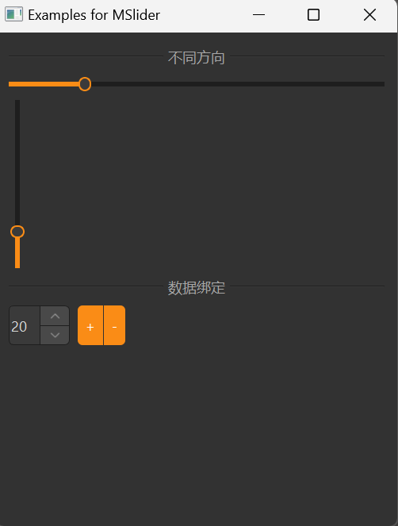

# MSlider

MSlider is a slider component used for selecting a value within a fixed range. It is based on Qt's QSlider class, providing a more attractive style and better interaction experience.

## Import

```python
from dayu_widgets.slider import MSlider
```

## Examples

### Basic Usage

MSlider can create a simple slider that users can drag to select a value.

```python
from dayu_widgets.slider import MSlider
from qtpy import QtCore

# Create a horizontal slider
slider_h = MSlider(QtCore.Qt.Horizontal)
slider_h.setRange(0, 100)
slider_h.setValue(50)

# Create a vertical slider
slider_v = MSlider(QtCore.Qt.Vertical)
slider_v.setRange(0, 100)
slider_v.setValue(50)
```

### Disable Tooltip Text

By default, when the user drags the slider, a tooltip showing the current value is displayed. You can disable this feature using the `disable_show_text` method.

```python
from dayu_widgets.slider import MSlider

# Create a slider
slider = MSlider()
slider.setRange(0, 100)
slider.setValue(50)

# Disable tooltip text
slider.disable_show_text()
```

### Data Binding

MSlider can be used with MFieldMixin for data binding.

```python
# Import third-party modules
from qtpy import QtCore
from qtpy import QtWidgets

# Import local modules
from dayu_widgets.slider import MSlider
from dayu_widgets.field_mixin import MFieldMixin
from dayu_widgets.spin_box import MSpinBox


class SliderBindExample(QtWidgets.QWidget, MFieldMixin):
    def __init__(self, parent=None):
        super(SliderBindExample, self).__init__(parent)
        self._init_ui()

    def _init_ui(self):
        # Register field
        self.register_field("value", 50)

        # Create slider and spin box
        slider = MSlider(QtCore.Qt.Horizontal)
        slider.setRange(0, 100)

        spin_box = MSpinBox()
        spin_box.setRange(0, 100)

        # Bind data
        self.bind("value", slider, "value")
        self.bind("value", spin_box, "value", signal="valueChanged")

        # Create layout
        main_lay = QtWidgets.QVBoxLayout()
        main_lay.addWidget(slider)
        main_lay.addWidget(spin_box)
        self.setLayout(main_lay)
```

### Complete Example



Here's a complete example demonstrating various uses of MSlider:

```python
# Import built-in modules
import functools

# Import third-party modules
from qtpy import QtCore
from qtpy import QtWidgets

# Import local modules
from dayu_widgets.button_group import MPushButtonGroup
from dayu_widgets.divider import MDivider
from dayu_widgets.field_mixin import MFieldMixin
from dayu_widgets.slider import MSlider
from dayu_widgets.spin_box import MSpinBox


class SliderExample(QtWidgets.QWidget, MFieldMixin):
    def __init__(self, parent=None):
        super(SliderExample, self).__init__(parent)
        self.setWindowTitle("Examples for MSlider")
        self._init_ui()

    def _init_ui(self):
        self.register_field("percent", 20)
        main_lay = QtWidgets.QVBoxLayout()
        main_lay.addWidget(MDivider("different orientation"))
        for orn in [QtCore.Qt.Horizontal, QtCore.Qt.Vertical]:
            slider = MSlider(orn)
            slider.setRange(1, 100)
            self.bind("percent", slider, "value")
            lay = QtWidgets.QVBoxLayout()
            lay.addWidget(slider)
            main_lay.addLayout(lay)
        spin_box = MSpinBox()
        spin_box.setRange(1, 100)
        self.bind("percent", spin_box, "value", signal="valueChanged")

        lay3 = QtWidgets.QHBoxLayout()
        button_grp = MPushButtonGroup()
        button_grp.set_button_list(
            [
                {"text": "+", "clicked": functools.partial(self.slot_change_value, 10)},
                {
                    "text": "-",
                    "clicked": functools.partial(self.slot_change_value, -10),
                },
            ]
        )
        lay3.addWidget(spin_box)
        lay3.addWidget(button_grp)
        lay3.addStretch()
        main_lay.addWidget(MDivider("data bind"))
        main_lay.addLayout(lay3)
        main_lay.addStretch()
        self.setLayout(main_lay)

    def slot_change_value(self, value):
        self.set_field("percent", max(0, min(self.field("percent") + value, 100)))


if __name__ == "__main__":
    # Import local modules
    from dayu_widgets import dayu_theme
    from dayu_widgets.qt import application

    with application() as app:
        test = SliderExample()
        dayu_theme.apply(test)
        test.show()
```

## API

### Constructor

```python
MSlider(orientation=QtCore.Qt.Horizontal, parent=None)
```

| Parameter | Description | Type | Default Value |
| --- | --- | --- | --- |
| `orientation` | Orientation of the slider | `QtCore.Qt.Orientation` | `QtCore.Qt.Horizontal` |
| `parent` | Parent widget | `QWidget` | `None` |

### Methods

| Method | Description | Parameters | Return Value |
| --- | --- | --- | --- |
| `disable_show_text()` | Disable showing tooltip text when dragging | None | None |

### Inherited Methods

MSlider inherits from QSlider, so you can use all methods of QSlider, such as:

- `setRange(min, max)`: Set the range of the slider
- `setValue(value)`: Set the current value of the slider
- `value()`: Get the current value of the slider
- `setOrientation(orientation)`: Set the orientation of the slider
- `setTickPosition(position)`: Set the position of the tick marks
- `setTickInterval(interval)`: Set the interval between tick marks
- For more methods, please refer to the Qt documentation

### Signals

MSlider inherits from QSlider, so you can use all signals of QSlider, such as:

- `valueChanged(int)`: Triggered when the value changes
- `sliderPressed()`: Triggered when the slider is pressed
- `sliderMoved(int)`: Triggered when the slider is moved
- `sliderReleased()`: Triggered when the slider is released
- For more signals, please refer to the Qt documentation

## Frequently Asked Questions

### How to listen for slider value changes?

You can listen for slider value changes by connecting to the `valueChanged` signal:

```python
from dayu_widgets.slider import MSlider

# Create a slider
slider = MSlider()
slider.setRange(0, 100)
slider.setValue(50)

# Listen for value changes
slider.valueChanged.connect(lambda value: print("Current value:", value))
```

### How to set tick marks on the slider?

You can set tick marks on the slider using the `setTickPosition` and `setTickInterval` methods:

```python
from dayu_widgets.slider import MSlider
from qtpy import QtWidgets

# Create a slider
slider = MSlider()
slider.setRange(0, 100)
slider.setValue(50)

# Set tick marks
slider.setTickPosition(QtWidgets.QSlider.TicksBelow)  # Show tick marks below
slider.setTickInterval(10)  # Show a tick mark every 10 units
```

### How to create a two-way binding between a slider and a spin box?

You can use MFieldMixin to create a two-way binding between a slider and a spin box:

```python
from dayu_widgets.slider import MSlider
from dayu_widgets.spin_box import MSpinBox
from dayu_widgets.field_mixin import MFieldMixin
from qtpy import QtWidgets

class SliderSpinBoxExample(QtWidgets.QWidget, MFieldMixin):
    def __init__(self, parent=None):
        super(SliderSpinBoxExample, self).__init__(parent)

        # Register field
        self.register_field("value", 50)

        # Create slider
        slider = MSlider()
        slider.setRange(0, 100)

        # Create spin box
        spin_box = MSpinBox()
        spin_box.setRange(0, 100)

        # Bind data
        self.bind("value", slider, "value")
        self.bind("value", spin_box, "value", signal="valueChanged")

        # Create layout
        layout = QtWidgets.QVBoxLayout()
        layout.addWidget(slider)
        layout.addWidget(spin_box)
        self.setLayout(layout)
```

### How to disable a slider?

You can disable a slider using the `setEnabled` method:

```python
from dayu_widgets.slider import MSlider

# Create a slider
slider = MSlider()
slider.setRange(0, 100)
slider.setValue(50)

# Disable the slider
slider.setEnabled(False)
```
