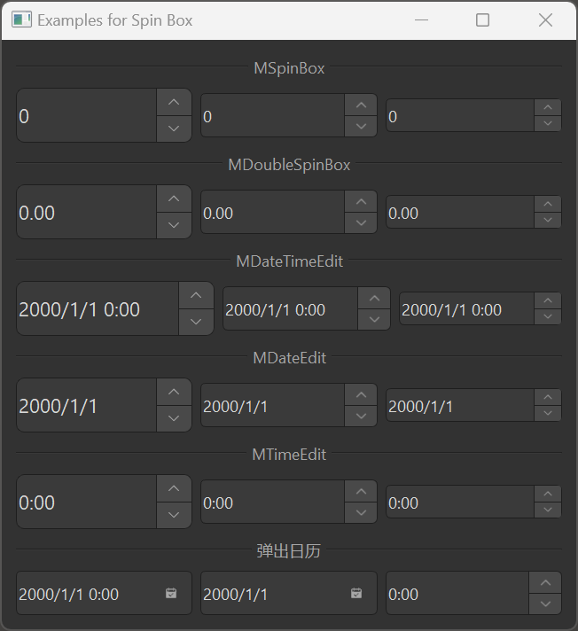

# MSpinBox

MSpinBox is a numeric input component used for inputting integer values. It is based on Qt's QSpinBox class, providing a more attractive style and better interaction experience. Additionally, dayu_widgets provides MDoubleSpinBox, MDateTimeEdit, MDateEdit, and MTimeEdit components for inputting floating-point numbers, date-time, date, and time.

## Import

```python
from dayu_widgets.spin_box import MSpinBox
from dayu_widgets.spin_box import MDoubleSpinBox
from dayu_widgets.spin_box import MDateTimeEdit
from dayu_widgets.spin_box import MDateEdit
from dayu_widgets.spin_box import MTimeEdit
```

## Examples

### Basic Usage

MSpinBox can create a simple integer input field where users can set values by clicking the up/down buttons or by direct input.

```python
from dayu_widgets.spin_box import MSpinBox

# Create an integer input field
spin_box = MSpinBox()
spin_box.setRange(0, 100)
spin_box.setValue(50)
```

### Different Sizes

MSpinBox supports different sizes, which can be set through method chaining.

```python
from dayu_widgets.spin_box import MSpinBox

# Create a large size integer input field
spin_box_large = MSpinBox().large()

# Create a medium size integer input field (default)
spin_box_medium = MSpinBox().medium()

# Create a small size integer input field
spin_box_small = MSpinBox().small()
```

### Floating-Point Input

MDoubleSpinBox can create a floating-point input field for inputting decimal values.

```python
from dayu_widgets.spin_box import MDoubleSpinBox

# Create a floating-point input field
double_spin_box = MDoubleSpinBox()
double_spin_box.setRange(0.0, 1.0)
double_spin_box.setValue(0.5)
double_spin_box.setSingleStep(0.1)
double_spin_box.setDecimals(2)  # Set decimal places
```

### Date-Time Input

MDateTimeEdit, MDateEdit, and MTimeEdit can create date-time, date, and time input fields.

```python
# Import built-in modules
import datetime

# Import local modules
from dayu_widgets.spin_box import MDateTimeEdit
from dayu_widgets.spin_box import MDateEdit
from dayu_widgets.spin_box import MTimeEdit

# Create a date-time input field
date_time_edit = MDateTimeEdit()
date_time_edit.setDateTime(datetime.datetime.now())

# Create a date input field
date_edit = MDateEdit()
date_edit.setDate(datetime.datetime.now().date())

# Create a time input field
time_edit = MTimeEdit()
time_edit.setTime(datetime.datetime.now().time())
```

### Calendar Popup

MDateTimeEdit and MDateEdit support a calendar popup for easy date selection.

```python
from dayu_widgets.spin_box import MDateTimeEdit
from dayu_widgets.spin_box import MDateEdit

# Create a date-time input field with calendar popup
date_time_edit = MDateTimeEdit()
date_time_edit.setCalendarPopup(True)

# Create a date input field with calendar popup
date_edit = MDateEdit()
date_edit.setCalendarPopup(True)
```

### Data Binding

MSpinBox can be used with MFieldMixin for data binding.

```python
# Import third-party modules
from qtpy import QtWidgets

# Import local modules
from dayu_widgets.spin_box import MSpinBox
from dayu_widgets.field_mixin import MFieldMixin
from dayu_widgets.slider import MSlider


class SpinBoxBindExample(QtWidgets.QWidget, MFieldMixin):
    def __init__(self, parent=None):
        super(SpinBoxBindExample, self).__init__(parent)
        self._init_ui()

    def _init_ui(self):
        # Register field
        self.register_field("value", 50)

        # Create spin box and slider
        spin_box = MSpinBox()
        spin_box.setRange(0, 100)

        slider = MSlider()
        slider.setRange(0, 100)

        # Bind data
        self.bind("value", spin_box, "value", signal="valueChanged")
        self.bind("value", slider, "value")

        # Create layout
        main_lay = QtWidgets.QVBoxLayout()
        main_lay.addWidget(spin_box)
        main_lay.addWidget(slider)
        self.setLayout(main_lay)
```

### Complete Example



Here's a complete example demonstrating various uses of MSpinBox and related components:

```python
# Import third-party modules
from qtpy import QtWidgets

# Import local modules
from dayu_widgets.divider import MDivider
from dayu_widgets.spin_box import MDateEdit
from dayu_widgets.spin_box import MDateTimeEdit
from dayu_widgets.spin_box import MDoubleSpinBox
from dayu_widgets.spin_box import MSpinBox
from dayu_widgets.spin_box import MTimeEdit


class SpinBoxExample(QtWidgets.QWidget):
    def __init__(self, parent=None):
        super(SpinBoxExample, self).__init__(parent)
        self.setWindowTitle("Examples for Spin Box")

        main_lay = QtWidgets.QVBoxLayout()
        class_list = [MSpinBox, MDoubleSpinBox, MDateTimeEdit, MDateEdit, MTimeEdit]
        for cls in class_list:
            main_lay.addWidget(MDivider(cls.__name__))
            lay = QtWidgets.QHBoxLayout()
            lay.addWidget(cls().large())
            lay.addWidget(cls().medium())
            lay.addWidget(cls().small())
            main_lay.addLayout(lay)

        main_lay.addWidget(MDivider("Pop Calendar Widget"))
        date_time_edit = MDateTimeEdit()
        date_time_edit.setCalendarPopup(True)
        date_edit = MDateEdit()
        date_edit.setCalendarPopup(True)
        time_edit = MTimeEdit()
        time_edit.setCalendarPopup(True)
        date_lay = QtWidgets.QHBoxLayout()
        date_lay.addWidget(date_time_edit)
        date_lay.addWidget(date_edit)
        date_lay.addWidget(time_edit)
        main_lay.addLayout(date_lay)

        main_lay.addStretch()
        self.setLayout(main_lay)


if __name__ == "__main__":
    # Import local modules
    from dayu_widgets import dayu_theme
    from dayu_widgets.qt import application

    with application() as app:
        test = SpinBoxExample()
        dayu_theme.apply(test)
        test.show()
```

## API

### MSpinBox

#### Constructor

```python
MSpinBox(parent=None)
```

| Parameter | Description | Type | Default Value |
| --- | --- | --- | --- |
| `parent` | Parent widget | `QWidget` | `None` |

#### Methods

| Method | Description | Parameters | Return Value |
| --- | --- | --- | --- |
| `set_dayu_size(value)` | Set the size of the input field | `value`: Size value | None |
| `get_dayu_size()` | Get the size of the input field | None | `int` |
| `huge()` | Set to huge size | None | `self` |
| `large()` | Set to large size | None | `self` |
| `medium()` | Set to medium size | None | `self` |
| `small()` | Set to small size | None | `self` |
| `tiny()` | Set to tiny size | None | `self` |

#### Inherited Methods

MSpinBox inherits from QSpinBox, so you can use all methods of QSpinBox, such as:

- `setRange(min, max)`: Set the value range
- `setValue(value)`: Set the current value
- `value()`: Get the current value
- `setPrefix(prefix)`: Set the prefix
- `setSuffix(suffix)`: Set the suffix
- `setSingleStep(step)`: Set the single step value
- For more methods, please refer to the Qt documentation

### MDoubleSpinBox

#### Constructor

```python
MDoubleSpinBox(parent=None)
```

| Parameter | Description | Type | Default Value |
| --- | --- | --- | --- |
| `parent` | Parent widget | `QWidget` | `None` |

#### Methods

Same as MSpinBox, with the addition of:

- `setDecimals(precision)`: Set the number of decimal places

### MDateTimeEdit

#### Constructor

```python
MDateTimeEdit(datetime=None, parent=None)
```

| Parameter | Description | Type | Default Value |
| --- | --- | --- | --- |
| `datetime` | Initial date-time | `datetime.datetime` | `None` |
| `parent` | Parent widget | `QWidget` | `None` |

#### Methods

Same as MSpinBox, with the addition of:

- `setCalendarPopup(enable)`: Set whether to show the calendar popup
- `setDateTime(datetime)`: Set the date-time
- `dateTime()`: Get the date-time

### MDateEdit

#### Constructor

```python
MDateEdit(date=None, parent=None)
```

| Parameter | Description | Type | Default Value |
| --- | --- | --- | --- |
| `date` | Initial date | `datetime.datetime` or `datetime.date` | `None` |
| `parent` | Parent widget | `QWidget` | `None` |

#### Methods

Same as MSpinBox, with the addition of:

- `setCalendarPopup(enable)`: Set whether to show the calendar popup
- `setDate(date)`: Set the date
- `date()`: Get the date

### MTimeEdit

#### Constructor

```python
MTimeEdit(time=None, parent=None)
```

| Parameter | Description | Type | Default Value |
| --- | --- | --- | --- |
| `time` | Initial time | `datetime.datetime` or `datetime.time` | `None` |
| `parent` | Parent widget | `QWidget` | `None` |

#### Methods

Same as MSpinBox, with the addition of:

- `setTime(time)`: Set the time
- `time()`: Get the time

## Frequently Asked Questions

### How to listen for value changes?

You can listen for value changes by connecting to the `valueChanged` signal:

```python
from dayu_widgets.spin_box import MSpinBox

# Create a spin box
spin_box = MSpinBox()
spin_box.setRange(0, 100)
spin_box.setValue(50)

# Listen for value changes
spin_box.valueChanged.connect(lambda value: print("Current value:", value))
```

For MDoubleSpinBox, you can use the `valueChanged` signal:

```python
from dayu_widgets.spin_box import MDoubleSpinBox

# Create a double spin box
double_spin_box = MDoubleSpinBox()
double_spin_box.setRange(0.0, 1.0)
double_spin_box.setValue(0.5)

# Listen for value changes
double_spin_box.valueChanged.connect(lambda value: print("Current value:", value))
```

For MDateTimeEdit, MDateEdit, and MTimeEdit, you can use the corresponding signals:

```python
from dayu_widgets.spin_box import MDateTimeEdit, MDateEdit, MTimeEdit

# Create date-time input fields
date_time_edit = MDateTimeEdit()
date_edit = MDateEdit()
time_edit = MTimeEdit()

# Listen for value changes
date_time_edit.dateTimeChanged.connect(lambda datetime: print("Current date-time:", datetime))
date_edit.dateChanged.connect(lambda date: print("Current date:", date))
time_edit.timeChanged.connect(lambda time: print("Current time:", time))
```

### How to set prefix and suffix?

You can set prefix and suffix using the `setPrefix` and `setSuffix` methods:

```python
from dayu_widgets.spin_box import MSpinBox, MDoubleSpinBox

# Create a spin box
spin_box = MSpinBox()
spin_box.setRange(0, 100)
spin_box.setValue(50)
spin_box.setPrefix("$")
spin_box.setSuffix(" units")

# Create a double spin box
double_spin_box = MDoubleSpinBox()
double_spin_box.setRange(0.0, 1.0)
double_spin_box.setValue(0.5)
double_spin_box.setPrefix("Ratio: ")
double_spin_box.setSuffix(" %")
```

### How to set the step value?

You can set the step value using the `setSingleStep` method:

```python
from dayu_widgets.spin_box import MSpinBox, MDoubleSpinBox

# Create a spin box
spin_box = MSpinBox()
spin_box.setRange(0, 100)
spin_box.setValue(50)
spin_box.setSingleStep(5)  # Increase or decrease by 5 each click

# Create a double spin box
double_spin_box = MDoubleSpinBox()
double_spin_box.setRange(0.0, 1.0)
double_spin_box.setValue(0.5)
double_spin_box.setSingleStep(0.1)  # Increase or decrease by 0.1 each click
```

### How to disable the input field?

You can disable the input field using the `setEnabled` method:

```python
from dayu_widgets.spin_box import MSpinBox

# Create a spin box
spin_box = MSpinBox()
spin_box.setRange(0, 100)
spin_box.setValue(50)

# Disable the input field
spin_box.setEnabled(False)
```
