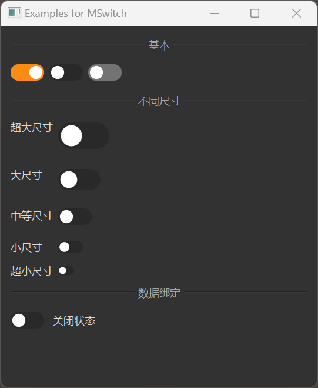

# MSwitch

MSwitch is a switch component used for toggling between two states. It is based on Qt's QRadioButton class, but provides a more attractive style and better interaction experience.

## Import

```python
from dayu_widgets.switch import MSwitch
```

## Examples

### Basic Usage

MSwitch can create a simple switch that users can click to toggle its state.

```python
from dayu_widgets.switch import MSwitch

# Create a switch
switch = MSwitch()

# Create a checked switch
switch_checked = MSwitch()
switch_checked.setChecked(True)

# Create a disabled switch
switch_disabled = MSwitch()
switch_disabled.setEnabled(False)
```

### Different Sizes

MSwitch supports different sizes, which can be set through method chaining.

```python
from dayu_widgets.switch import MSwitch

# Create a huge size switch
switch_huge = MSwitch().huge()

# Create a large size switch
switch_large = MSwitch().large()

# Create a medium size switch (default)
switch_medium = MSwitch().medium()

# Create a small size switch
switch_small = MSwitch().small()

# Create a tiny size switch
switch_tiny = MSwitch().tiny()
```

### Listening for State Changes

MSwitch can listen for state changes by connecting to the `toggled` signal.

```python
from dayu_widgets.switch import MSwitch
from qtpy import QtWidgets

# Create a switch and a label
switch = MSwitch()
label = QtWidgets.QLabel("Off")

# Listen for state changes
switch.toggled.connect(lambda checked: label.setText("On" if checked else "Off"))
```

### Data Binding

MSwitch can be used with MFieldMixin for data binding.

```python
# Import third-party modules
from qtpy import QtWidgets

# Import local modules
from dayu_widgets.switch import MSwitch
from dayu_widgets.field_mixin import MFieldMixin
from dayu_widgets.label import MLabel


class SwitchBindExample(QtWidgets.QWidget, MFieldMixin):
    def __init__(self, parent=None):
        super(SwitchBindExample, self).__init__(parent)
        self._init_ui()

    def _init_ui(self):
        # Create switch and label
        switch = MSwitch()
        label = MLabel()

        # Register fields and bind
        self.register_field("is_on", False)
        self.register_field("status_text", lambda: "On" if self.field("is_on") else "Off")
        self.bind("is_on", switch, "checked", signal="toggled")
        self.bind("status_text", label, "text")

        # Create layout
        main_lay = QtWidgets.QVBoxLayout()
        main_lay.addWidget(switch)
        main_lay.addWidget(label)
        self.setLayout(main_lay)
```

### Using in Forms

MSwitch is commonly used in forms as a toggle option.

```python
from dayu_widgets.switch import MSwitch
from dayu_widgets.label import MLabel
from qtpy import QtWidgets

# Create a form layout
form_layout = QtWidgets.QFormLayout()

# Add switch options
form_layout.addRow(MLabel("Auto Save:"), MSwitch())
form_layout.addRow(MLabel("Night Mode:"), MSwitch())
form_layout.addRow(MLabel("Notifications:"), MSwitch())
```

### Complete Example



Here's a complete example demonstrating various uses of MSwitch:

```python
# Import third-party modules
from qtpy import QtWidgets

# Import local modules
from dayu_widgets import dayu_theme
from dayu_widgets.divider import MDivider
from dayu_widgets.field_mixin import MFieldMixin
from dayu_widgets.label import MLabel
from dayu_widgets.switch import MSwitch


class SwitchExample(QtWidgets.QWidget, MFieldMixin):
    def __init__(self, parent=None):
        super(SwitchExample, self).__init__(parent)
        self.setWindowTitle("Examples for MSwitch")
        self._init_ui()

    def _init_ui(self):
        # Basic switches
        switch_1 = MSwitch()
        switch_1.setChecked(True)
        switch_2 = MSwitch()
        switch_3 = MSwitch()
        switch_3.setEnabled(False)
        basic_lay = QtWidgets.QHBoxLayout()
        basic_lay.addWidget(switch_1)
        basic_lay.addWidget(switch_2)
        basic_lay.addWidget(switch_3)
        basic_lay.addStretch()

        # Different sizes
        size_lay = QtWidgets.QFormLayout()
        size_lay.addRow("Huge", MSwitch().huge())
        size_lay.addRow("Large", MSwitch().large())
        size_lay.addRow("Medium", MSwitch().medium())
        size_lay.addRow("Small", MSwitch().small())
        size_lay.addRow("Tiny", MSwitch().tiny())

        # Data binding
        self.register_field("is_on", False)
        self.register_field("status_text", lambda: "On State" if self.field("is_on") else "Off State")

        switch_bind = MSwitch()
        status_label = MLabel()

        self.bind("is_on", switch_bind, "checked", signal="toggled")
        self.bind("status_text", status_label, "text")

        bind_lay = QtWidgets.QHBoxLayout()
        bind_lay.addWidget(switch_bind)
        bind_lay.addWidget(status_label)
        bind_lay.addStretch()

        # Main layout
        main_lay = QtWidgets.QVBoxLayout()
        main_lay.addWidget(MDivider("Basic"))
        main_lay.addLayout(basic_lay)
        main_lay.addWidget(MDivider("Different Sizes"))
        main_lay.addLayout(size_lay)
        main_lay.addWidget(MDivider("Data Binding"))
        main_lay.addLayout(bind_lay)
        main_lay.addStretch()
        self.setLayout(main_lay)


if __name__ == "__main__":
    # Import local modules
    from dayu_widgets.qt import application

    with application() as app:
        test = SwitchExample()
        dayu_theme.apply(test)
        test.show()
```

## API

### Constructor

```python
MSwitch(parent=None)
```

| Parameter | Description | Type | Default Value |
| --- | --- | --- | --- |
| `parent` | Parent widget | `QWidget` | `None` |

### Methods

| Method | Description | Parameters | Return Value |
| --- | --- | --- | --- |
| `set_dayu_size(value)` | Set the size of the switch | `value`: Size value | None |
| `get_dayu_size()` | Get the size of the switch | None | `int` |
| `huge()` | Set to huge size | None | `self` |
| `large()` | Set to large size | None | `self` |
| `medium()` | Set to medium size | None | `self` |
| `small()` | Set to small size | None | `self` |
| `tiny()` | Set to tiny size | None | `self` |

### Inherited Methods

MSwitch inherits from QRadioButton, so you can use all methods of QRadioButton, such as:

- `setChecked(bool)`: Set whether the switch is checked
- `isChecked()`: Get whether the switch is checked
- `setEnabled(bool)`: Set whether the switch is enabled
- For more methods, please refer to the Qt documentation

### Signals

MSwitch inherits from QRadioButton, so you can use all signals of QRadioButton, such as:

- `toggled(bool)`: Triggered when the switch state changes
- For more signals, please refer to the Qt documentation

## Frequently Asked Questions

### How to listen for switch state changes?

You can listen for switch state changes by connecting to the `toggled` signal:

```python
from dayu_widgets.switch import MSwitch

# Create a switch
switch = MSwitch()

# Listen for state changes
switch.toggled.connect(lambda checked: print("Switch state:", "On" if checked else "Off"))
```

### How to set the default state of a switch?

You can set the default state of a switch using the `setChecked` method:

```python
from dayu_widgets.switch import MSwitch

# Create a switch
switch = MSwitch()

# Set to checked state
switch.setChecked(True)
```

### How to disable a switch?

You can disable a switch using the `setEnabled` method:

```python
from dayu_widgets.switch import MSwitch

# Create a switch
switch = MSwitch()

# Disable the switch
switch.setEnabled(False)
```

### How to use switches in a form?

You can add switches to a form layout:

```python
from dayu_widgets.switch import MSwitch
from dayu_widgets.label import MLabel
from qtpy import QtWidgets

# Create a form layout
form_layout = QtWidgets.QFormLayout()

# Add switch options
form_layout.addRow(MLabel("Auto Save:"), MSwitch())
form_layout.addRow(MLabel("Night Mode:"), MSwitch())
form_layout.addRow(MLabel("Notifications:"), MSwitch())

# Create widget and set layout
widget = QtWidgets.QWidget()
widget.setLayout(form_layout)
```
