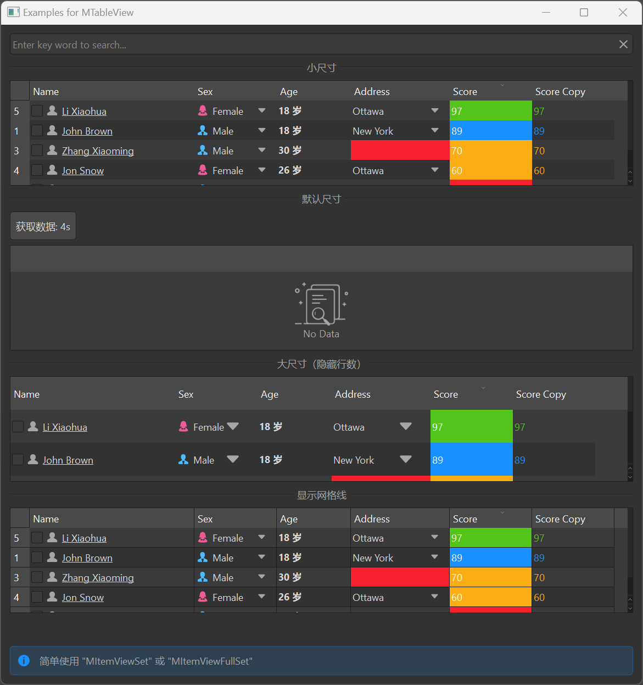

# MTableView

MTableView is a table view component used to display structured data. It is based on Qt's QTableView class, providing a more attractive style and better interaction experience, supporting sorting, filtering, custom delegates, and more.

## Import

```python
from dayu_widgets.item_view import MTableView
```

## Examples

### Basic Usage

MTableView needs to be used with MTableModel and MSortFilterModel to display and manage data.

```python
from dayu_widgets.item_view import MTableView
from dayu_widgets.item_model import MTableModel
from dayu_widgets.item_model import MSortFilterModel

# Create model
model = MTableModel()
model.set_header_list([
    {"key": "name", "label": "Name"},
    {"key": "age", "label": "Age"},
    {"key": "city", "label": "City"}
])

# Create sort filter model
sort_filter_model = MSortFilterModel()
sort_filter_model.setSourceModel(model)

# Create table view
table_view = MTableView()
table_view.setModel(sort_filter_model)
table_view.set_header_list([
    {"key": "name", "label": "Name"},
    {"key": "age", "label": "Age"},
    {"key": "city", "label": "City"}
])

# Set data
model.set_data_list([
    {"name": "John", "age": 18, "city": "New York"},
    {"name": "Jane", "age": 25, "city": "London"},
    {"name": "Bob", "age": 30, "city": "Paris"}
])
```

### Different Sizes

MTableView supports different sizes, which can be set through the `size` parameter.

```python
from dayu_widgets.item_view import MTableView
from dayu_widgets import dayu_theme

# Create a small size table view
table_small = MTableView(size=dayu_theme.small, show_row_count=True)

# Create a medium size table view (default)
table_default = MTableView(size=dayu_theme.medium, show_row_count=True)

# Create a large size table view
table_large = MTableView(size=dayu_theme.large, show_row_count=False)
```

### Show Grid

MTableView does not show grid lines by default, but you can set it to show grid lines using the `setShowGrid` method.

```python
from dayu_widgets.item_view import MTableView

# Create table view
table_grid = MTableView()

# Set to show grid lines
table_grid.setShowGrid(True)
```

### Search Filtering

MTableView can be used with MLineEdit to implement search filtering.

```python
from dayu_widgets.item_view import MTableView
from dayu_widgets.item_model import MTableModel
from dayu_widgets.item_model import MSortFilterModel
from dayu_widgets.line_edit import MLineEdit

# Create model and view
model = MTableModel()
sort_filter_model = MSortFilterModel()
sort_filter_model.setSourceModel(model)
table_view = MTableView()
table_view.setModel(sort_filter_model)

# Create search box
search_line_edit = MLineEdit().search().small()
search_line_edit.textChanged.connect(sort_filter_model.set_search_pattern)
```

### Loading State

MTableView can be used with MLoadingWrapper to display a loading state.

```python
from dayu_widgets.item_view import MTableView
from dayu_widgets.loading import MLoadingWrapper
import functools

# Create table view
table_view = MTableView()

# Create loading wrapper
loading_wrapper = MLoadingWrapper(widget=table_view, loading=False)

# Simulate data loading
def fetch_data():
    # Show loading state
    loading_wrapper.set_dayu_loading(True)

    # Simulate network request
    # ...

    # Hide loading state
    loading_wrapper.set_dayu_loading(False)
```

### Custom Delegates

MTableView supports using custom delegates to display data in specific columns.

```python
from dayu_widgets.item_view import MTableView
from dayu_widgets.item_model import MTableModel
from dayu_widgets.item_model import MSortFilterModel
from dayu_widgets.delegate import MPushButtonDelegate

# Create model and view
model = MTableModel()
sort_filter_model = MSortFilterModel()
sort_filter_model.setSourceModel(model)
table_view = MTableView()
table_view.setModel(sort_filter_model)

# Create button delegate
button_delegate = MPushButtonDelegate(parent=table_view)
table_view.setItemDelegateForColumn(4, button_delegate)  # Set button delegate for column 5

# Connect button click event
button_delegate.sig_clicked.connect(lambda index: print("Button clicked, row index:", index.row()))
```

### Save and Restore State

MTableView supports saving and restoring header state, including column width, column order, etc.

```python
from dayu_widgets.item_view import MTableView

# Create table view
table_view = MTableView()

# Save header state
table_view.save_state("my_table")

# Restore header state
table_view.load_state("my_table")
```

### Complete Example



Here's a complete example demonstrating various uses of MTableView:

```python
# Import built-in modules
import functools

# Import third-party modules
from qtpy import QtCore
from qtpy import QtWidgets

# Import local modules
from dayu_widgets import dayu_theme
from dayu_widgets.alert import MAlert
from dayu_widgets.divider import MDivider
from dayu_widgets.field_mixin import MFieldMixin
from dayu_widgets.item_model import MSortFilterModel
from dayu_widgets.item_model import MTableModel
from dayu_widgets.item_view import MTableView
from dayu_widgets.line_edit import MLineEdit
from dayu_widgets.loading import MLoadingWrapper
from dayu_widgets.push_button import MPushButton
import examples._mock_data as mock


class MFetchDataThread(QtCore.QThread):
    """A mock thread to fetch data"""
    sig_fetch_finished = QtCore.Signal(list)

    def __init__(self, parent=None):
        super(MFetchDataThread, self).__init__(parent)
        self.size = 5

    def run(self, *args, **kwargs):
        self.msleep(800)
        self.sig_fetch_finished.emit(mock.data_list)


class TableViewExample(QtWidgets.QWidget, MFieldMixin):
    def __init__(self, parent=None):
        super(TableViewExample, self).__init__(parent)
        self.setWindowTitle("Examples for MTableView")
        self._init_ui()

    def _init_ui(self):
        model_1 = MTableModel()
        model_1.set_header_list(mock.header_list)
        model_sort = MSortFilterModel()
        model_sort.setSourceModel(model_1)

        table_small = MTableView(size=dayu_theme.small, show_row_count=True)
        table_grid = MTableView(size=dayu_theme.small, show_row_count=True)
        table_grid.setShowGrid(True)
        table_default = MTableView(size=dayu_theme.medium, show_row_count=True)
        thread = MFetchDataThread(self)

        self.loading_wrapper = MLoadingWrapper(widget=table_default, loading=False)
        thread.started.connect(functools.partial(self.loading_wrapper.set_dayu_loading, True))
        thread.finished.connect(functools.partial(self.loading_wrapper.set_dayu_loading, False))
        thread.finished.connect(functools.partial(table_default.setModel, model_sort))
        button = MPushButton(text="Get Data: 4s")
        button.clicked.connect(thread.start)
        switch_lay = QtWidgets.QHBoxLayout()
        switch_lay.addWidget(button)
        switch_lay.addStretch()
        table_large = MTableView(size=dayu_theme.large, show_row_count=False)

        table_small.setModel(model_sort)
        table_grid.setModel(model_sort)
        table_large.setModel(model_sort)
        model_sort.set_header_list(mock.header_list)
        table_small.set_header_list(mock.header_list)
        table_grid.set_header_list(mock.header_list)
        table_default.set_header_list(mock.header_list)
        table_large.set_header_list(mock.header_list)
        model_1.set_data_list(mock.data_list)

        line_edit = MLineEdit().search().small()
        line_edit.textChanged.connect(model_sort.set_search_pattern)

        main_lay = QtWidgets.QVBoxLayout()
        main_lay.addWidget(line_edit)
        main_lay.addWidget(MDivider("Small Size"))
        main_lay.addWidget(table_small)
        main_lay.addWidget(MDivider("Default Size"))
        main_lay.addLayout(switch_lay)
        main_lay.addWidget(self.loading_wrapper)
        main_lay.addWidget(MDivider("Large Size (Hide Row Count)"))
        main_lay.addWidget(table_large)
        main_lay.addWidget(MDivider("With Grid"))
        main_lay.addWidget(table_grid)
        main_lay.addStretch()
        main_lay.addWidget(MAlert('Simply use "MItemViewSet" or "MItemViewFullSet"'))
        self.setLayout(main_lay)


if __name__ == "__main__":
    # Import local modules
    from dayu_widgets.qt import application

    with application() as app:
        test = TableViewExample()
        dayu_theme.apply(test)
        test.show()
```

## API

### Constructor

```python
MTableView(size=None, show_row_count=False, parent=None)
```

| Parameter | Description | Type | Default Value |
| --- | --- | --- | --- |
| `size` | Table size | `int` | `dayu_theme.default_size` |
| `show_row_count` | Whether to show row numbers | `bool` | `False` |
| `parent` | Parent widget | `QWidget` | `None` |

### Methods

| Method | Description | Parameters | Return Value |
| --- | --- | --- | --- |
| `set_header_list(header_list)` | Set header list | `header_list`: Header list | None |
| `save_state(name)` | Save header state | `name`: State name | None |
| `load_state(name)` | Load header state | `name`: State name | None |
| `enable_context_menu(enable)` | Enable context menu | `enable`: Whether to enable | None |
| `slot_context_menu(point)` | Context menu slot function | `point`: Right-click position | None |

### Signals

| Signal | Description | Parameters |
| --- | --- | --- |
| `sig_context_menu` | Context menu signal | `object`: Context menu data |

### Inherited Methods

MTableView inherits from QTableView, so you can use all methods of QTableView, such as:

- `setModel(model)`: Set data model
- `setShowGrid(show)`: Set whether to show grid lines
- `setSelectionBehavior(behavior)`: Set selection behavior
- `setSelectionMode(mode)`: Set selection mode
- `setSortingEnabled(enable)`: Set whether to enable sorting
- For more methods, please refer to the Qt documentation

## Frequently Asked Questions

### How to set the header?

You can set the header using the `set_header_list` method, which accepts a list where each element is a dictionary containing keys like `key` and `label`:

```python
from dayu_widgets.item_view import MTableView

# Create table view
table_view = MTableView()

# Set header
table_view.set_header_list([
    {"key": "name", "label": "Name"},
    {"key": "age", "label": "Age", "width": 80},
    {"key": "city", "label": "City"}
])
```

### How to set the data?

Data needs to be set through the `set_data_list` method of MTableModel:

```python
from dayu_widgets.item_view import MTableView
from dayu_widgets.item_model import MTableModel
from dayu_widgets.item_model import MSortFilterModel

# Create model
model = MTableModel()
model.set_header_list([
    {"key": "name", "label": "Name"},
    {"key": "age", "label": "Age"},
    {"key": "city", "label": "City"}
])

# Create sort filter model
sort_filter_model = MSortFilterModel()
sort_filter_model.setSourceModel(model)

# Create table view
table_view = MTableView()
table_view.setModel(sort_filter_model)
table_view.set_header_list([
    {"key": "name", "label": "Name"},
    {"key": "age", "label": "Age"},
    {"key": "city", "label": "City"}
])

# Set data
model.set_data_list([
    {"name": "John", "age": 18, "city": "New York"},
    {"name": "Jane", "age": 25, "city": "London"},
    {"name": "Bob", "age": 30, "city": "Paris"}
])
```

### How to implement search filtering?

You can implement search filtering through the `set_search_pattern` method of MSortFilterModel:

```python
from dayu_widgets.item_view import MTableView
from dayu_widgets.item_model import MTableModel
from dayu_widgets.item_model import MSortFilterModel
from dayu_widgets.line_edit import MLineEdit

# Create model and view
model = MTableModel()
sort_filter_model = MSortFilterModel()
sort_filter_model.setSourceModel(model)
table_view = MTableView()
table_view.setModel(sort_filter_model)

# Create search box
search_line_edit = MLineEdit().search().small()
search_line_edit.textChanged.connect(sort_filter_model.set_search_pattern)
```

### How to use MItemViewSet to simplify code?

MItemViewSet is a component that encapsulates MTableView, MTableModel, and MSortFilterModel, which can simplify code:

```python
from dayu_widgets.item_view_set import MItemViewSet

# Create item view set
item_view_set = MItemViewSet()

# Set header
item_view_set.set_header_list([
    {"key": "name", "label": "Name"},
    {"key": "age", "label": "Age"},
    {"key": "city", "label": "City"}
])

# Set data
item_view_set.set_data_list([
    {"name": "John", "age": 18, "city": "New York"},
    {"name": "Jane", "age": 25, "city": "London"},
    {"name": "Bob", "age": 30, "city": "Paris"}
])
```

### How to handle button click events in the table?

You can use MPushButtonDelegate to set a button delegate for a specific column and connect the click event:

```python
from dayu_widgets.item_view import MTableView
from dayu_widgets.delegate import MPushButtonDelegate

# Create table view
table_view = MTableView()

# Create button delegate
button_delegate = MPushButtonDelegate(parent=table_view)
table_view.setItemDelegateForColumn(4, button_delegate)  # Set button delegate for column 5

# Connect button click event
button_delegate.sig_clicked.connect(lambda index: print("Button clicked, row index:", index.row()))
```
