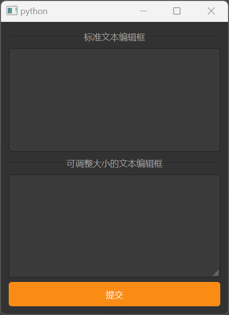

# MTextEdit

MTextEdit is a multi-line text editing component used for inputting and editing multi-line text. It is based on Qt's QTextEdit class, providing a more attractive style and better interaction experience.

## Import

```python
from dayu_widgets.text_edit import MTextEdit
```

## Examples

### Basic Usage

MTextEdit can create a simple multi-line text editor where users can input and edit multi-line text.

```python
from dayu_widgets.text_edit import MTextEdit
from qtpy import QtWidgets

# Create a multi-line text editor
text_edit = MTextEdit()

# Create a multi-line text editor with default text
text_edit_with_text = MTextEdit()
text_edit_with_text.setText("This is default text.\nIt can contain multiple lines.")

# Add the text editor to a layout
layout = QtWidgets.QVBoxLayout()
layout.addWidget(text_edit)
```

### Resizable

MTextEdit supports adding a size grip in the bottom right corner, allowing users to resize the text editor by dragging.

```python
from dayu_widgets.text_edit import MTextEdit

# Create a resizable multi-line text editor
text_edit = MTextEdit().resizeable()
```

### Auto-size

MTextEdit supports automatically adjusting its size based on content (note: this feature is not fully implemented yet).

```python
from dayu_widgets.text_edit import MTextEdit

# Create an auto-sizing multi-line text editor
text_edit = MTextEdit().autosize()
```

### Complete Example



Here's a complete example demonstrating various uses of MTextEdit:

```python
# Import third-party modules
from qtpy import QtWidgets

# Import local modules
from dayu_widgets.divider import MDivider
from dayu_widgets.push_button import MPushButton
from dayu_widgets.text_edit import MTextEdit


class TextEditExample(QtWidgets.QWidget):
    def __init__(self, parent=None):
        super(TextEditExample, self).__init__(parent)
        self._init_ui()

    def _init_ui(self):
        main_lay = QtWidgets.QVBoxLayout()

        main_lay.addWidget(MDivider("Standard Text Editor"))
        main_lay.addWidget(MTextEdit(self))
        main_lay.addWidget(MDivider("Resizable Text Editor"))
        main_lay.addWidget(MTextEdit(self).resizeable())
        main_lay.addWidget(MPushButton("Submit").primary())

        self.setLayout(main_lay)


if __name__ == "__main__":
    # Import local modules
    from dayu_widgets import dayu_theme
    from dayu_widgets.qt import application

    with application() as app:
        test = TextEditExample()
        dayu_theme.apply(test)
        test.show()
```

## API

### Constructor

```python
MTextEdit(parent=None)
```

| Parameter | Description | Type | Default Value |
| --- | --- | --- | --- |
| `parent` | Parent widget | `QWidget` | `None` |

### Methods

| Method | Description | Parameters | Return Value |
| --- | --- | --- | --- |
| `resizeable()` | Add a size grip in the bottom right corner | None | `self` |
| `autosize()` | Automatically adjust size based on content (not fully implemented yet) | None | `self` |

### Inherited Methods

MTextEdit inherits from QTextEdit, so you can use all methods of QTextEdit, such as:

- `setText(text)`: Set the text content
- `text()`: Get the text content
- `setPlainText(text)`: Set the plain text content
- `toPlainText()`: Get the plain text content
- `setHtml(html)`: Set the HTML content
- `toHtml()`: Get the HTML content
- `setReadOnly(bool)`: Set whether the text editor is read-only
- `isReadOnly()`: Get whether the text editor is read-only
- `clear()`: Clear the content
- For more methods, please refer to the Qt documentation

### Signals

MTextEdit inherits from QTextEdit, so you can use all signals of QTextEdit, such as:

- `textChanged()`: Triggered when the text content changes
- `selectionChanged()`: Triggered when the selection changes
- `copyAvailable(bool)`: Triggered when copy operation is available
- For more signals, please refer to the Qt documentation

## Frequently Asked Questions

### How to listen for text changes?

You can listen for text changes by connecting to the `textChanged` signal:

```python
from dayu_widgets.text_edit import MTextEdit

# Create a multi-line text editor
text_edit = MTextEdit()

# Listen for text changes
text_edit.textChanged.connect(lambda: print("Text changed:", text_edit.toPlainText()))
```

### How to set read-only mode?

You can set the text editor to read-only mode using the `setReadOnly` method:

```python
from dayu_widgets.text_edit import MTextEdit

# Create a multi-line text editor
text_edit = MTextEdit()
text_edit.setText("This is read-only text that users cannot edit.")

# Set to read-only mode
text_edit.setReadOnly(True)
```

### How to set placeholder text?

You can set placeholder text using the `setPlaceholderText` method:

```python
from dayu_widgets.text_edit import MTextEdit

# Create a multi-line text editor
text_edit = MTextEdit()

# Set placeholder text
text_edit.setPlaceholderText("Enter multi-line text here...")
```

### How to limit the maximum height of the text editor?

You can limit the maximum height of the text editor using the `setMaximumHeight` method:

```python
from dayu_widgets.text_edit import MTextEdit

# Create a multi-line text editor
text_edit = MTextEdit()

# Limit the maximum height to 200 pixels
text_edit.setMaximumHeight(200)
```

### How to use syntax highlighting in the text editor?

You can use the QSyntaxHighlighter class to add syntax highlighting to MTextEdit:

```python
from dayu_widgets.text_edit import MTextEdit
from qtpy import QtCore, QtGui

# Create a simple syntax highlighter
class SimpleHighlighter(QtGui.QSyntaxHighlighter):
    def __init__(self, parent=None):
        super(SimpleHighlighter, self).__init__(parent)
        self.keyword_format = QtGui.QTextCharFormat()
        self.keyword_format.setForeground(QtCore.Qt.blue)
        self.keyword_format.setFontWeight(QtGui.QFont.Bold)
        self.keywords = ["import", "from", "def", "class", "if", "else", "for", "while"]

    def highlightBlock(self, text):
        for word in text.split():
            if word in self.keywords:
                self.setFormat(text.indexOf(word), len(word), self.keyword_format)

# Create a multi-line text editor
text_edit = MTextEdit()
text_edit.setText("import os\n\ndef hello():\n    print('Hello, World!')")

# Apply syntax highlighting
highlighter = SimpleHighlighter(text_edit.document())
```
