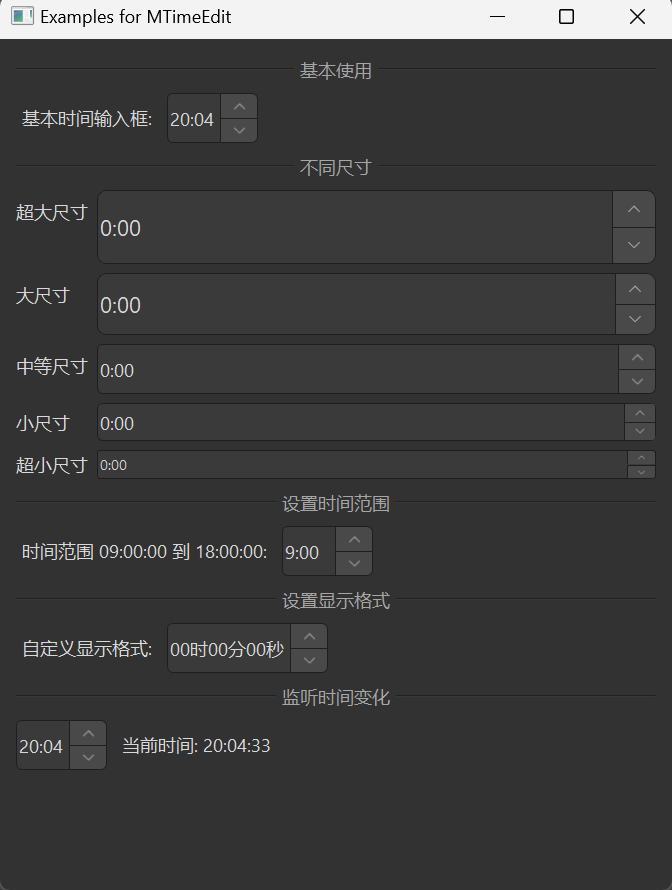

# MTimeEdit

MTimeEdit is a time editing component used for inputting and editing times. It is based on Qt's QTimeEdit class, providing a more attractive style and better interaction experience.

## Import

```python
from dayu_widgets.spin_box import MTimeEdit
```

## Examples

### Basic Usage

MTimeEdit can create a simple time input field where users can set times by clicking the up/down buttons or by direct input.

```python
# Import built-in modules
import datetime

# Import local modules
from dayu_widgets.spin_box import MTimeEdit

# Create a time input field
time_edit = MTimeEdit()
time_edit.setTime(datetime.datetime.now().time())
```

### Different Sizes

MTimeEdit supports different sizes, which can be set through method chaining.

```python
from dayu_widgets.spin_box import MTimeEdit

# Create a huge size time input field
time_edit_huge = MTimeEdit().huge()

# Create a large size time input field
time_edit_large = MTimeEdit().large()

# Create a medium size time input field (default)
time_edit_medium = MTimeEdit().medium()

# Create a small size time input field
time_edit_small = MTimeEdit().small()

# Create a tiny size time input field
time_edit_tiny = MTimeEdit().tiny()
```

### Setting Time Range

MTimeEdit supports setting time ranges.

```python
# Import built-in modules
import datetime

# Import local modules
from dayu_widgets.spin_box import MTimeEdit

# Create a time input field and set range
time_edit = MTimeEdit()
time_edit.setTimeRange(
    datetime.time(9, 0, 0),
    datetime.time(18, 0, 0)
)
```

### Setting Display Format

MTimeEdit supports setting display formats.

```python
from dayu_widgets.spin_box import MTimeEdit

# Create a time input field and set display format
time_edit = MTimeEdit()
time_edit.setDisplayFormat("hh:mm:ss")
```

### Listening for Time Changes

MTimeEdit can listen for time changes by connecting to the `timeChanged` signal.

```python
# Import built-in modules
import datetime

# Import local modules
from dayu_widgets.spin_box import MTimeEdit

# Create a time input field
time_edit = MTimeEdit()
time_edit.setTime(datetime.datetime.now().time())

# Listen for time changes
time_edit.timeChanged.connect(lambda time: print("Current time:", time))
```

### Complete Example



Here's a complete example demonstrating various uses of MTimeEdit:

```python
# Import built-in modules
import datetime

# Import third-party modules
from qtpy import QtWidgets

# Import local modules
from dayu_widgets.divider import MDivider
from dayu_widgets.spin_box import MTimeEdit
from dayu_widgets.label import MLabel


class TimeEditExample(QtWidgets.QWidget):
    def __init__(self, parent=None):
        super(TimeEditExample, self).__init__(parent)
        self.setWindowTitle("Examples for MTimeEdit")
        self._init_ui()

    def _init_ui(self):
        main_lay = QtWidgets.QVBoxLayout()

        # Basic usage
        main_lay.addWidget(MDivider("Basic Usage"))
        basic_lay = QtWidgets.QHBoxLayout()
        basic_time_edit = MTimeEdit()
        basic_time_edit.setTime(datetime.datetime.now().time())
        basic_lay.addWidget(MLabel("Basic Time Input:"))
        basic_lay.addWidget(basic_time_edit)
        basic_lay.addStretch()
        main_lay.addLayout(basic_lay)

        # Different sizes
        main_lay.addWidget(MDivider("Different Sizes"))
        size_lay = QtWidgets.QFormLayout()
        size_lay.addRow("Huge", MTimeEdit().huge())
        size_lay.addRow("Large", MTimeEdit().large())
        size_lay.addRow("Medium", MTimeEdit().medium())
        size_lay.addRow("Small", MTimeEdit().small())
        size_lay.addRow("Tiny", MTimeEdit().tiny())
        main_lay.addLayout(size_lay)

        # Setting time range
        main_lay.addWidget(MDivider("Setting Time Range"))
        range_lay = QtWidgets.QHBoxLayout()
        range_time_edit = MTimeEdit()
        range_time_edit.setTimeRange(
            datetime.time(9, 0, 0),
            datetime.time(18, 0, 0)
        )
        range_lay.addWidget(MLabel("Time Range 09:00:00 to 18:00:00:"))
        range_lay.addWidget(range_time_edit)
        range_lay.addStretch()
        main_lay.addLayout(range_lay)

        # Setting display format
        main_lay.addWidget(MDivider("Setting Display Format"))
        format_lay = QtWidgets.QHBoxLayout()
        format_time_edit = MTimeEdit()
        format_time_edit.setDisplayFormat("hh:mm:ss")
        format_lay.addWidget(MLabel("Custom Display Format:"))
        format_lay.addWidget(format_time_edit)
        format_lay.addStretch()
        main_lay.addLayout(format_lay)

        # Listening for time changes
        main_lay.addWidget(MDivider("Listening for Time Changes"))
        time_changed_lay = QtWidgets.QHBoxLayout()
        time_changed_time_edit = MTimeEdit()
        time_changed_time_edit.setTime(datetime.datetime.now().time())
        time_changed_label = MLabel("Current time: {}".format(datetime.datetime.now().time().strftime("%H:%M:%S")))
        time_changed_time_edit.timeChanged.connect(
            lambda time: time_changed_label.setText("Current time: {}".format(time.toString("hh:mm:ss")))
        )
        time_changed_lay.addWidget(time_changed_time_edit)
        time_changed_lay.addWidget(time_changed_label)
        time_changed_lay.addStretch()
        main_lay.addLayout(time_changed_lay)

        main_lay.addStretch()
        self.setLayout(main_lay)


if __name__ == "__main__":
    # Import local modules
    from dayu_widgets import dayu_theme
    from dayu_widgets.qt import application

    with application() as app:
        test = TimeEditExample()
        dayu_theme.apply(test)
        test.show()
```

## API

### Constructor

```python
MTimeEdit(time=None, parent=None)
```

| Parameter | Description | Type | Default Value |
| --- | --- | --- | --- |
| `time` | Initial time | `datetime.datetime` or `datetime.time` | `None` |
| `parent` | Parent widget | `QWidget` | `None` |

### Methods

| Method | Description | Parameters | Return Value |
| --- | --- | --- | --- |
| `set_dayu_size(value)` | Set the size of the input field | `value`: Size value | None |
| `get_dayu_size()` | Get the size of the input field | None | `int` |
| `huge()` | Set to huge size | None | `self` |
| `large()` | Set to large size | None | `self` |
| `medium()` | Set to medium size | None | `self` |
| `small()` | Set to small size | None | `self` |
| `tiny()` | Set to tiny size | None | `self` |

### Inherited Methods

MTimeEdit inherits from QTimeEdit, so you can use all methods of QTimeEdit, such as:

- `setTime(time)`: Set the time
- `time()`: Get the time
- `setTimeRange(min, max)`: Set the time range
- `setMinimumTime(time)`: Set the minimum time
- `setMaximumTime(time)`: Set the maximum time
- `setDisplayFormat(format)`: Set the display format
- For more methods, please refer to the Qt documentation

### Signals

MTimeEdit inherits from QTimeEdit, so you can use all signals of QTimeEdit, such as:

- `timeChanged(time)`: Triggered when the time changes
- For more signals, please refer to the Qt documentation

## Frequently Asked Questions

### How to set the time format?

You can set the time format using the `setDisplayFormat` method:

```python
from dayu_widgets.spin_box import MTimeEdit

# Create a time input field
time_edit = MTimeEdit()

# Set display format
time_edit.setDisplayFormat("hh:mm:ss")
```

The format string uses the following placeholders:

- `h`: Hour (0-23)
- `hh`: Hour (00-23)
- `m`: Minute (0-59)
- `mm`: Minute (00-59)
- `s`: Second (0-59)
- `ss`: Second (00-59)
- `AP`: Use AM/PM display
- `ap`: Use am/pm display

### How to set the time range?

You can set the time range using the `setTimeRange` method:

```python
# Import built-in modules
import datetime

# Import local modules
from dayu_widgets.spin_box import MTimeEdit

# Create a time input field
time_edit = MTimeEdit()

# Set time range
time_edit.setTimeRange(
    datetime.time(9, 0, 0),
    datetime.time(18, 0, 0)
)
```

You can also set the minimum and maximum times separately:

```python
# Import built-in modules
import datetime

# Import local modules
from dayu_widgets.spin_box import MTimeEdit

# Create a time input field
time_edit = MTimeEdit()

# Set minimum time
time_edit.setMinimumTime(datetime.time(9, 0, 0))

# Set maximum time
time_edit.setMaximumTime(datetime.time(18, 0, 0))
```

### How to disable the time input field?

You can disable the time input field using the `setEnabled` method:

```python
from dayu_widgets.spin_box import MTimeEdit

# Create a time input field
time_edit = MTimeEdit()

# Disable the time input field
time_edit.setEnabled(False)
```
