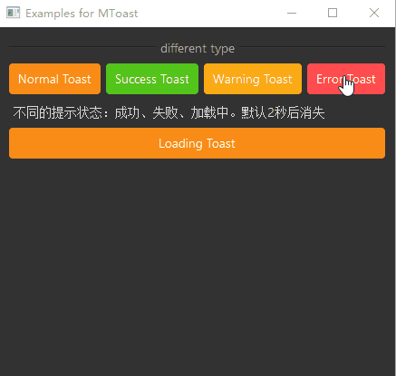

# MToast

MToast is a lightweight notification component used to display brief message feedback in the page. It appears in the center of the page and automatically disappears, suitable for simple feedback that doesn't require user action.

## Import

```python
from dayu_widgets.toast import MToast
```

## Examples

### Basic Usage

MToast provides four different types of notifications: information, success, warning, and error.

```python
from dayu_widgets.toast import MToast

# Display an information notification
MToast.info(text="This is an information message", parent=self)

# Display a success notification
MToast.success(text="This is a success message", parent=self)

# Display a warning notification
MToast.warning(text="This is a warning message", parent=self)

# Display an error notification
MToast.error(text="This is an error message", parent=self)
```

### Custom Display Duration

MToast automatically disappears after 2 seconds by default, but you can customize the display duration using the `duration` parameter.

```python
from dayu_widgets.toast import MToast

# Display a notification that disappears after 5 seconds
MToast.info(text="This message will be displayed for 5 seconds", parent=self, duration=5)
```

### Complete Example



Here's a complete example demonstrating various uses of MToast:

```python
# Import built-in modules
import functools

# Import third-party modules
from qtpy import QtWidgets

# Import local modules
from dayu_widgets.button_group import MPushButtonGroup
from dayu_widgets.divider import MDivider
from dayu_widgets.field_mixin import MFieldMixin
from dayu_widgets.label import MLabel
from dayu_widgets.push_button import MPushButton
from dayu_widgets.toast import MToast


class ToastExample(QtWidgets.QWidget, MFieldMixin):
    def __init__(self, parent=None):
        super(ToastExample, self).__init__(parent)
        self.setWindowTitle("Examples for MToast")
        self._init_ui()

    def _init_ui(self):
        button_1 = MPushButton(text="Normal Toast").primary()
        button_2 = MPushButton(text="Success Toast").success()
        button_3 = MPushButton(text="Warning Toast").warning()
        button_4 = MPushButton(text="Error Toast").danger()
        button_1.clicked.connect(
            functools.partial(
                self.slot_show_toast, MToast.info, {"text": "This is a normal message"}
            )
        )
        button_2.clicked.connect(
            functools.partial(
                self.slot_show_toast, MToast.success, {"text": "Congratulations, success!"}
            )
        )
        button_3.clicked.connect(
            functools.partial(
                self.slot_show_toast, MToast.warning, {"text": "I'm warning you!"}
            )
        )
        button_4.clicked.connect(
            functools.partial(
                self.slot_show_toast, MToast.error, {"text": "Failed!"}
            )
        )

        sub_lay1 = QtWidgets.QHBoxLayout()
        sub_lay1.addWidget(button_1)
        sub_lay1.addWidget(button_2)
        sub_lay1.addWidget(button_3)
        sub_lay1.addWidget(button_4)

        button_duration = MPushButton(text="Show 5s Toast")
        button_duration.clicked.connect(
            functools.partial(
                self.slot_show_toast,
                MToast.info,
                {"text": "This message will be displayed for 5 seconds", "duration": 5},
            )
        )

        main_lay = QtWidgets.QVBoxLayout()
        main_lay.addWidget(MDivider("different type"))
        main_lay.addLayout(sub_lay1)
        main_lay.addWidget(MLabel("Different toast types: normal, success, warning, error. Default disappears after 2 seconds"))
        main_lay.addWidget(MDivider("set duration"))
        main_lay.addWidget(button_duration)
        main_lay.addWidget(MLabel("Custom duration, set duration parameter, unit is seconds"))

        main_lay.addStretch()
        self.setLayout(main_lay)

    def slot_show_toast(self, func, config):
        func(parent=self, **config)


if __name__ == "__main__":
    # Import local modules
    from dayu_widgets import dayu_theme
    from dayu_widgets.qt import application

    with application() as app:
        test = ToastExample()
        dayu_theme.apply(test)
        test.show()
```

## API

### Class Methods

| Method | Description | Parameters | Return Value |
| --- | --- | --- | --- |
| `info(text, parent, duration=None)` | Display an information notification | `text`: Notification text<br>`parent`: Parent widget<br>`duration`: Display duration (seconds) | `MToast` instance |
| `success(text, parent, duration=None)` | Display a success notification | `text`: Notification text<br>`parent`: Parent widget<br>`duration`: Display duration (seconds) | `MToast` instance |
| `warning(text, parent, duration=None)` | Display a warning notification | `text`: Notification text<br>`parent`: Parent widget<br>`duration`: Display duration (seconds) | `MToast` instance |
| `error(text, parent, duration=None)` | Display an error notification | `text`: Notification text<br>`parent`: Parent widget<br>`duration`: Display duration (seconds) | `MToast` instance |

### Class Constants

| Constant | Description | Value |
| --- | --- | --- |
| `InfoType` | Information type | `"info"` |
| `SuccessType` | Success type | `"success"` |
| `WarningType` | Warning type | `"warning"` |
| `ErrorType` | Error type | `"error"` |

### Default Configuration

| Configuration Item | Description | Default Value |
| --- | --- | --- |
| `duration` | Default display duration (seconds) | `2` |

## Frequently Asked Questions

### How to display different types of notifications?

You can display different types of notifications using MToast's class methods:

```python
from dayu_widgets.toast import MToast

# Display an information notification
MToast.info(text="This is an information message", parent=self)

# Display a success notification
MToast.success(text="This is a success message", parent=self)

# Display a warning notification
MToast.warning(text="This is a warning message", parent=self)

# Display an error notification
MToast.error(text="This is an error message", parent=self)
```

### How to customize the display duration of a notification?

You can customize the display duration of a notification using the `duration` parameter:

```python
from dayu_widgets.toast import MToast

# Display a notification that disappears after 5 seconds
MToast.info(text="This message will be displayed for 5 seconds", parent=self, duration=5)
```

### What's the difference between MToast and MMessage?

MToast and MMessage are both components for displaying notification information, but they have the following differences:

1. **Display Position**: MToast appears in the center of the page, while MMessage appears centered at the top of the page.
2. **Use Case**: MToast is suitable for simple operation feedback, such as confirmation prompts after clicking a button; MMessage is suitable for important information that requires user attention, such as operation result notifications.
3. **Functionality**: MMessage supports closable and loading states, while MToast is more concise, providing only basic notification functionality.

### How to display a notification after an asynchronous operation is completed?

You can display a notification in the callback function of an asynchronous operation:

```python
from dayu_widgets.toast import MToast

# Simulate an asynchronous operation
def async_operation():
    # Display a notification after the asynchronous operation is completed
    MToast.success(text="Operation successful", parent=self)

# Or use QTimer to delay the display
from qtpy import QtCore

timer = QtCore.QTimer()
timer.setSingleShot(True)
timer.timeout.connect(lambda: MToast.success(text="Operation successful", parent=self))
timer.start(2000)  # Display notification after 2 seconds
```
