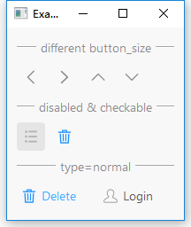

# MToolButton

Tool buttons are lightweight button controls typically used in toolbars or scenarios requiring icon buttons. They support multiple display modes, including icon-only, text-only, or both icon and text together.

## Import

```python
from dayu_widgets import MToolButton
```

## Examples

### Basic Usage

MToolButton can be set with SVG icons and supports multiple display modes.

```python
from dayu_widgets.tool_button import MToolButton

# Create an icon-only tool button
icon_only_button = MToolButton().svg("left_line.svg").icon_only()

# Create a text-only tool button
text_only_button = MToolButton().text_only()
text_only_button.setText("Text Button")

# Create a button with text beside icon
text_beside_icon_button = MToolButton().svg("user_line.svg").text_beside_icon()
text_beside_icon_button.setText("User")

# Create a button with text under icon
text_under_icon_button = MToolButton().svg("calendar_line.svg").text_under_icon()
text_under_icon_button.setText("Calendar")
```

### Different Sizes

MToolButton has five sizes: tiny, small, medium (default), large, and huge.

```python
from dayu_widgets.tool_button import MToolButton

# Create tool buttons with different sizes
huge_button = MToolButton().svg("left_line.svg").icon_only().huge()
large_button = MToolButton().svg("right_line.svg").icon_only().large()
medium_button = MToolButton().svg("up_line.svg").icon_only()  # medium is the default size
small_button = MToolButton().svg("up_line.svg").icon_only().small()
tiny_button = MToolButton().svg("down_line.svg").icon_only().tiny()
```

### Disabled State

Use `setEnabled(False)` to set a button to the disabled state.

```python
from dayu_widgets.tool_button import MToolButton

# Create a disabled tool button
disabled_button = MToolButton().svg("detail_line.svg").icon_only()
disabled_button.setEnabled(False)
```

### Checkable State

MToolButton supports a checkable state. When the button is checked, the icon changes to the theme color.

```python
from dayu_widgets.tool_button import MToolButton

# Create a checkable tool button
checkable_button = MToolButton().svg("trash_line.svg").icon_only()
checkable_button.setCheckable(True)
```

### Complete Example

The following is a complete example that demonstrates all the features of MToolButton:



```python
# Import third-party modules
from qtpy import QtWidgets

# Import local modules
from dayu_widgets.divider import MDivider
from dayu_widgets.field_mixin import MFieldMixin
from dayu_widgets.tool_button import MToolButton


class ToolButtonExample(QtWidgets.QWidget, MFieldMixin):
    def __init__(self, parent=None):
        super(ToolButtonExample, self).__init__(parent)
        self.setWindowTitle("Examples for MToolButton")
        self._init_ui()

    def _init_ui(self):
        size_lay = QtWidgets.QVBoxLayout()
        sub_lay1 = QtWidgets.QHBoxLayout()
        sub_lay1.addWidget(MToolButton().svg("left_line.svg").icon_only().huge())
        sub_lay1.addWidget(MToolButton().svg("right_line.svg").icon_only().large())
        sub_lay1.addWidget(MToolButton().svg("up_line.svg").icon_only())
        sub_lay1.addWidget(MToolButton().svg("up_line.svg").icon_only().small())
        sub_lay1.addWidget(MToolButton().svg("down_line.svg").icon_only().tiny())
        sub_lay1.addStretch()
        size_lay.addLayout(sub_lay1)

        button2 = MToolButton().svg("detail_line.svg").icon_only()
        button2.setEnabled(False)
        button7 = MToolButton().svg("trash_line.svg").icon_only()
        button7.setCheckable(True)
        state_lay = QtWidgets.QHBoxLayout()
        state_lay.addWidget(button2)
        state_lay.addWidget(button7)
        state_lay.addStretch()

        button_trash = MToolButton().svg("trash_line.svg").text_beside_icon()
        button_trash.setText("Delete")
        button_login = MToolButton().svg("user_line.svg").text_beside_icon()
        button_login.setText("Login")

        button_lay = QtWidgets.QHBoxLayout()
        button_lay.addWidget(button_trash)
        button_lay.addWidget(button_login)
        button_lay.addStretch()

        main_lay = QtWidgets.QVBoxLayout()
        main_lay.addWidget(MDivider("Different Sizes"))
        main_lay.addLayout(size_lay)
        main_lay.addWidget(MDivider("Disabled and Checkable States"))
        main_lay.addLayout(state_lay)
        main_lay.addWidget(MDivider("Text and Icon"))
        main_lay.addLayout(button_lay)
        main_lay.addStretch()
        self.setLayout(main_lay)


if __name__ == "__main__":
    # Import local modules
    from dayu_widgets import dayu_theme
    from dayu_widgets.qt import application

    with application() as app:
        test = ToolButtonExample()
        dayu_theme.apply(test)
        test.show()
```

## API

### Properties

| Property | Description | Type | Default Value |
| --- | --- | --- | --- |
| `dayu_size` | Button size | `int` | `dayu_theme.default_size` |
| `dayu_svg` | SVG icon path | `str` | `None` |

### Methods

| Method | Description | Parameters | Return Value |
| --- | --- | --- | --- |
| `svg(path)` | Set the SVG icon path | `path`: SVG icon path | Current button instance |
| `icon_only()` | Set the button to display only the icon | None | Current button instance |
| `text_only()` | Set the button to display only the text | None | Current button instance |
| `text_beside_icon()` | Set the text to display beside the icon | None | Current button instance |
| `text_under_icon()` | Set the text to display under the icon | None | Current button instance |
| `huge()` | Set the button to huge size | None | Current button instance |
| `large()` | Set the button to large size | None | Current button instance |
| `medium()` | Set the button to medium size | None | Current button instance |
| `small()` | Set the button to small size | None | Current button instance |
| `tiny()` | Set the button to tiny size | None | Current button instance |

### Inherited Signals

| Signal | Description | Parameters |
| --- | --- | --- |
| `clicked` | Emitted when the button is clicked | None |
| `toggled` | Emitted when the button state changes (only when the button is checkable) | `bool`: Whether checked |

## Frequently Asked Questions

### How to set the button style?

The style of MToolButton is managed by dayu_theme. You can change the button style by setting different sizes, without manually setting the stylesheet.

### How to use SVG icons?

MToolButton supports using SVG icons. You can set the icon path using the `svg()` method. SVG icon files should be placed in the project's resource directory.

```python
button = MToolButton().svg("icon_name.svg").icon_only()
```

### How to display both icon and text?

MToolButton supports multiple display modes. You can use the `text_beside_icon()` or `text_under_icon()` methods to display both icon and text.

```python
# Text beside icon
button1 = MToolButton().svg("user_line.svg").text_beside_icon()
button1.setText("User")

# Text under icon
button2 = MToolButton().svg("calendar_line.svg").text_under_icon()
button2.setText("Calendar")
```
