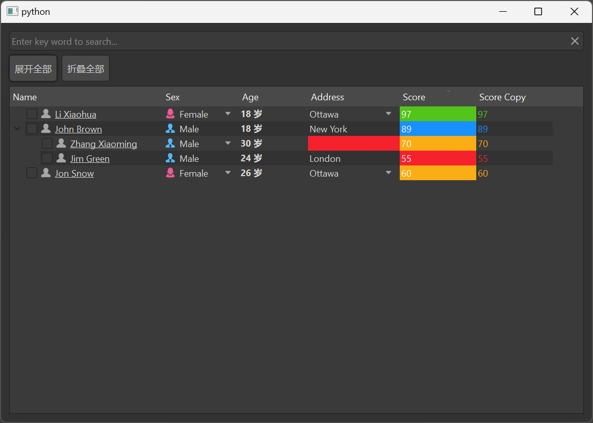

# MTreeView

MTreeView is a tree view component used to display hierarchical data. It is based on Qt's QTreeView class, providing a more attractive style and better interaction experience, supporting sorting, filtering, expanding/collapsing, and more.

## Import

```python
from dayu_widgets.item_view import MTreeView
```

## Examples

### Basic Usage

MTreeView needs to be used with MTableModel and MSortFilterModel to display and manage data.

```python
from dayu_widgets.item_view import MTreeView
from dayu_widgets.item_model import MTableModel
from dayu_widgets.item_model import MSortFilterModel

# Create model
model = MTableModel()
model.set_header_list([
    {"key": "name", "label": "Name"},
    {"key": "size", "label": "Size"},
    {"key": "type", "label": "Type"}
])

# Create sort filter model
sort_filter_model = MSortFilterModel()
sort_filter_model.setSourceModel(model)

# Create tree view
tree_view = MTreeView()
tree_view.setModel(sort_filter_model)
tree_view.set_header_list([
    {"key": "name", "label": "Name"},
    {"key": "size", "label": "Size"},
    {"key": "type", "label": "Type"}
])

# Set data (tree structure)
model.set_data_list([
    {"name": "Documents", "size": "-", "type": "Folder", "children": [
        {"name": "report.docx", "size": "24KB", "type": "Word Document"},
        {"name": "data.xlsx", "size": "38KB", "type": "Excel Spreadsheet"}
    ]},
    {"name": "Images", "size": "-", "type": "Folder", "children": [
        {"name": "photo1.jpg", "size": "1.2MB", "type": "Image"},
        {"name": "photo2.jpg", "size": "1.5MB", "type": "Image"}
    ]},
    {"name": "Music", "size": "-", "type": "Folder", "children": [
        {"name": "song1.mp3", "size": "4.2MB", "type": "Audio"},
        {"name": "song2.mp3", "size": "3.8MB", "type": "Audio"}
    ]}
])
```

### Expand and Collapse

MTreeView provides methods to expand and collapse nodes.

```python
from dayu_widgets.item_view import MTreeView
from dayu_widgets.push_button import MPushButton

# Create tree view
tree_view = MTreeView()

# Create expand and collapse buttons
expand_button = MPushButton("Expand All")
expand_button.clicked.connect(tree_view.expandAll)

collapse_button = MPushButton("Collapse All")
collapse_button.clicked.connect(tree_view.collapseAll)
```

### Search Filtering

MTreeView can be used with MLineEdit to implement search filtering.

```python
from dayu_widgets.item_view import MTreeView
from dayu_widgets.item_model import MTableModel
from dayu_widgets.item_model import MSortFilterModel
from dayu_widgets.line_edit import MLineEdit

# Create model and view
model = MTableModel()
sort_filter_model = MSortFilterModel()
sort_filter_model.setSourceModel(model)
tree_view = MTreeView()
tree_view.setModel(sort_filter_model)

# Create search box
search_line_edit = MLineEdit().search().small()
search_line_edit.textChanged.connect(sort_filter_model.set_search_pattern)
```

### Complete Example



Here is a complete example showing various uses of MTreeView:

```python
# Import third-party modules
from qtpy import QtWidgets

# Import local modules
from dayu_widgets import dayu_theme
from dayu_widgets.field_mixin import MFieldMixin
from dayu_widgets.item_model import MSortFilterModel
from dayu_widgets.item_model import MTableModel
from dayu_widgets.item_view import MTreeView
from dayu_widgets.line_edit import MLineEdit
from dayu_widgets.push_button import MPushButton
import examples._mock_data as mock


class TreeViewExample(QtWidgets.QWidget, MFieldMixin):
    def __init__(self, parent=None):
        super(TreeViewExample, self).__init__(parent)
        self._init_ui()

    def _init_ui(self):
        model_1 = MTableModel()
        model_1.set_header_list(mock.header_list)
        model_sort = MSortFilterModel()
        model_sort.setSourceModel(model_1)

        tree_view = MTreeView()
        tree_view.setModel(model_sort)

        model_sort.set_header_list(mock.header_list)
        tree_view.set_header_list(mock.header_list)
        model_1.set_data_list(mock.tree_data_list)

        line_edit = MLineEdit().search().small()
        line_edit.textChanged.connect(model_sort.set_search_pattern)

        expand_button = MPushButton("Expand All")
        expand_button.clicked.connect(tree_view.expandAll)
        collapse_button = MPushButton("Collapse All")
        collapse_button.clicked.connect(tree_view.collapseAll)

        button_lay = QtWidgets.QHBoxLayout()
        button_lay.addWidget(expand_button)
        button_lay.addWidget(collapse_button)
        button_lay.addStretch()

        main_lay = QtWidgets.QVBoxLayout()
        main_lay.addWidget(line_edit)
        main_lay.addLayout(button_lay)
        main_lay.addWidget(tree_view)
        self.setLayout(main_lay)


if __name__ == "__main__":
    # Import local modules
    from dayu_widgets.qt import application

    with application() as app:
        test = TreeViewExample()
        dayu_theme.apply(test)
        test.show()
```

## API

### Constructor

```python
MTreeView(parent=None)
```

| Parameter | Description | Type | Default |
| --- | --- | --- | --- |
| `parent` | Parent widget | `QWidget` | `None` |

### Methods

| Method | Description | Parameters | Return |
| --- | --- | --- | --- |
| `set_header_list(header_list)` | Set header list | `header_list`: Header list | None |
| `enable_context_menu(enable)` | Enable context menu | `enable`: Whether to enable | None |
| `slot_context_menu(point)` | Context menu slot function | `point`: Right-click position | None |

### Signals

| Signal | Description | Parameters |
| --- | --- | --- |
| `sig_context_menu` | Context menu signal | `object`: Context menu data |

### Inherited Methods

MTreeView inherits from QTreeView, so you can use all methods of QTreeView, such as:

- `setModel(model)`: Set data model
- `expandAll()`: Expand all nodes
- `collapseAll()`: Collapse all nodes
- `setSelectionBehavior(behavior)`: Set selection behavior
- `setSelectionMode(mode)`: Set selection mode
- `setSortingEnabled(enable)`: Set whether to enable sorting
- For more methods, please refer to the Qt documentation

## FAQ

### How to set the header?

You can set the header through the `set_header_list` method, which accepts a list where each element is a dictionary containing keys such as `key` and `label`:

```python
from dayu_widgets.item_view import MTreeView

# Create tree view
tree_view = MTreeView()

# Set header
tree_view.set_header_list([
    {"key": "name", "label": "Name"},
    {"key": "size", "label": "Size"},
    {"key": "type", "label": "Type"}
])
```

### How to set data?

Data needs to be set through the `set_data_list` method of MTableModel. For tree structures, use the `children` field to represent child nodes:

```python
from dayu_widgets.item_view import MTreeView
from dayu_widgets.item_model import MTableModel
from dayu_widgets.item_model import MSortFilterModel

# Create model
model = MTableModel()
model.set_header_list([
    {"key": "name", "label": "Name"},
    {"key": "size", "label": "Size"},
    {"key": "type", "label": "Type"}
])

# Create sort filter model
sort_filter_model = MSortFilterModel()
sort_filter_model.setSourceModel(model)

# Create tree view
tree_view = MTreeView()
tree_view.setModel(sort_filter_model)
tree_view.set_header_list([
    {"key": "name", "label": "Name"},
    {"key": "size", "label": "Size"},
    {"key": "type", "label": "Type"}
])

# Set data (tree structure)
model.set_data_list([
    {"name": "Documents", "size": "-", "type": "Folder", "children": [
        {"name": "report.docx", "size": "24KB", "type": "Word Document"},
        {"name": "data.xlsx", "size": "38KB", "type": "Excel Spreadsheet"}
    ]},
    {"name": "Images", "size": "-", "type": "Folder", "children": [
        {"name": "photo1.jpg", "size": "1.2MB", "type": "Image"},
        {"name": "photo2.jpg", "size": "1.5MB", "type": "Image"}
    ]}
])
```

### How to implement search filtering?

You can implement search filtering through the `set_search_pattern` method of MSortFilterModel:

```python
from dayu_widgets.item_view import MTreeView
from dayu_widgets.item_model import MTableModel
from dayu_widgets.item_model import MSortFilterModel
from dayu_widgets.line_edit import MLineEdit

# Create model and view
model = MTableModel()
sort_filter_model = MSortFilterModel()
sort_filter_model.setSourceModel(model)
tree_view = MTreeView()
tree_view.setModel(sort_filter_model)

# Create search box
search_line_edit = MLineEdit().search().small()
search_line_edit.textChanged.connect(sort_filter_model.set_search_pattern)
```

### How to use MItemViewSet to simplify code?

MItemViewSet is a component that encapsulates MTreeView, MTableModel, and MSortFilterModel, which can simplify code:

```python
from dayu_widgets.item_view_set import MItemViewSet
from dayu_widgets.push_button import MPushButton

# Create tree view set
item_view_set = MItemViewSet(view_type=MItemViewSet.TreeViewType)

# Set header
item_view_set.set_header_list([
    {"key": "name", "label": "Name"},
    {"key": "size", "label": "Size"},
    {"key": "type", "label": "Type"}
])

# Set data
item_view_set.setup_data([
    {"name": "Documents", "size": "-", "type": "Folder", "children": [
        {"name": "report.docx", "size": "24KB", "type": "Word Document"},
        {"name": "data.xlsx", "size": "38KB", "type": "Excel Spreadsheet"}
    ]},
    {"name": "Images", "size": "-", "type": "Folder", "children": [
        {"name": "photo1.jpg", "size": "1.2MB", "type": "Image"},
        {"name": "photo2.jpg", "size": "1.5MB", "type": "Image"}
    ]}
])

# Add expand and collapse buttons
expand_button = MPushButton("Expand All")
expand_button.clicked.connect(item_view_set.item_view.expandAll)
item_view_set.insert_widget(expand_button)

collapse_button = MPushButton("Collapse All")
collapse_button.clicked.connect(item_view_set.item_view.collapseAll)
item_view_set.insert_widget(collapse_button)

# Enable search functionality
item_view_set.searchable()
```
