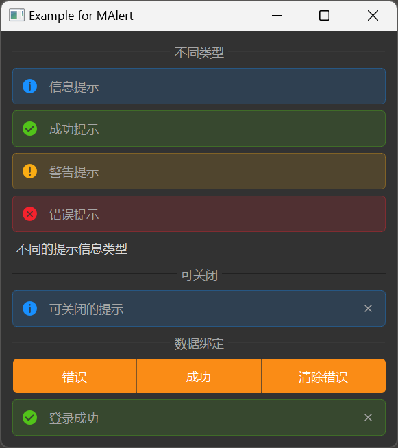

# MAlert 警告提示

MAlert 是一个警告提示组件，用于展示重要的提示信息。它支持四种不同的提示类型，可以包含图标、文本内容，并且可以设置为可关闭。

## 导入

```python
from dayu_widgets.alert import MAlert
```

## 代码示例

### 基本使用

MAlert 可以创建不同类型的警告提示，包括信息、成功、警告和错误。

```python
from dayu_widgets.alert import MAlert

# 创建信息类型的警告提示
info_alert = MAlert(text="这是一条信息提示").info()

# 创建成功类型的警告提示
success_alert = MAlert(text="这是一条成功提示").success()

# 创建警告类型的警告提示
warning_alert = MAlert(text="这是一条警告提示").warning()

# 创建错误类型的警告提示
error_alert = MAlert(text="这是一条错误提示").error()
```

### 可关闭的警告提示

MAlert 支持创建可关闭的警告提示，用户可以通过点击关闭按钮移除该提示。

```python
from dayu_widgets.alert import MAlert

# 创建可关闭的警告提示
closable_alert = MAlert(text="这是一条可关闭的提示").info().closable()
```

### 隐藏图标

MAlert 默认显示图标，可以通过 `set_show_icon` 方法隐藏图标。

```python
from dayu_widgets.alert import MAlert

# 创建不显示图标的警告提示
alert = MAlert(text="这是一条不显示图标的提示").info()
alert.set_show_icon(False)
```

### 动态更改内容

MAlert 的内容可以动态更改，当内容为空时，警告提示会自动隐藏。

```python
from dayu_widgets.alert import MAlert

# 创建警告提示
alert = MAlert(text="这是一条警告提示").warning()

# 更改内容
alert.set_dayu_text("内容已更改")

# 清空内容（会自动隐藏）
alert.set_dayu_text("")
```

### 数据绑定

MAlert 可以与 MFieldMixin 结合使用，实现数据绑定。

```python
# Import third-party modules
from qtpy import QtWidgets

# Import local modules
from dayu_widgets.alert import MAlert
from dayu_widgets.field_mixin import MFieldMixin
from dayu_widgets.push_button import MPushButton
import functools


class AlertBindExample(QtWidgets.QWidget, MFieldMixin):
    def __init__(self, parent=None):
        super(AlertBindExample, self).__init__(parent)
        self._init_ui()

    def _init_ui(self):
        # 创建警告提示
        data_bind_alert = MAlert(parent=self)
        data_bind_alert.set_closable(True)

        # 注册字段和绑定
        self.register_field("msg", "")
        self.register_field("msg_type", MAlert.InfoType)
        self.bind("msg", data_bind_alert, "dayu_text")
        self.bind("msg_type", data_bind_alert, "dayu_type")

        # 创建按钮
        error_button = MPushButton(text="显示错误").danger()
        success_button = MPushButton(text="显示成功").success()
        clear_button = MPushButton(text="清除消息")

        # 连接按钮点击事件
        error_button.clicked.connect(functools.partial(self.slot_change_alert, "密码错误", MAlert.ErrorType))
        success_button.clicked.connect(functools.partial(self.slot_change_alert, "登录成功", MAlert.SuccessType))
        clear_button.clicked.connect(functools.partial(self.slot_change_alert, "", MAlert.InfoType))

        # 创建布局
        button_lay = QtWidgets.QHBoxLayout()
        button_lay.addWidget(error_button)
        button_lay.addWidget(success_button)
        button_lay.addWidget(clear_button)

        main_lay = QtWidgets.QVBoxLayout()
        main_lay.addLayout(button_lay)
        main_lay.addWidget(data_bind_alert)
        self.setLayout(main_lay)

    def slot_change_alert(self, alert_text, alert_type):
        """更改警告提示的内容和类型"""
        self.set_field("msg_type", alert_type)
        self.set_field("msg", alert_text)
```

### 完整示例



以下是一个完整的示例，展示了 MAlert 的各种用法：

```python
# Import built-in modules
import functools

# Import third-party modules
from qtpy import QtWidgets

# Import local modules
from dayu_widgets.alert import MAlert
from dayu_widgets.button_group import MPushButtonGroup
from dayu_widgets.divider import MDivider
from dayu_widgets.field_mixin import MFieldMixin
from dayu_widgets.label import MLabel


class AlertExample(QtWidgets.QWidget, MFieldMixin):
    def __init__(self, parent=None):
        super(AlertExample, self).__init__(parent)
        self.setWindowTitle("Example for MAlert")
        self._init_ui()

    def _init_ui(self):
        main_lay = QtWidgets.QVBoxLayout()
        self.setLayout(main_lay)
        main_lay.addWidget(MDivider("不同类型"))
        main_lay.addWidget(MAlert(text="信息提示", parent=self).info())
        main_lay.addWidget(MAlert(text="成功提示", parent=self).success())
        main_lay.addWidget(MAlert(text="警告提示", parent=self).warning())
        main_lay.addWidget(MAlert(text="错误提示", parent=self).error())

        closable_alert = MAlert("可关闭的提示", parent=self).closable()

        main_lay.addWidget(MLabel("不同的提示信息类型"))
        main_lay.addWidget(MDivider("可关闭"))
        main_lay.addWidget(closable_alert)
        main_lay.addWidget(MDivider("数据绑定"))
        self.register_field("msg", "")
        self.register_field("msg_type", MAlert.InfoType)

        data_bind_alert = MAlert(parent=self)
        data_bind_alert.set_closable(True)

        self.bind("msg", data_bind_alert, "dayu_text")
        self.bind("msg_type", data_bind_alert, "dayu_type")
        button_grp = MPushButtonGroup()
        button_grp.set_button_list(
            [
                {
                    "text": "错误",
                    "clicked": functools.partial(self.slot_change_alert, "密码错误", MAlert.ErrorType),
                },
                {
                    "text": "成功",
                    "clicked": functools.partial(self.slot_change_alert, "登录成功", MAlert.SuccessType),
                },
                {
                    "text": "清除错误",
                    "clicked": functools.partial(self.slot_change_alert, "", MAlert.InfoType),
                },
            ]
        )
        main_lay.addWidget(button_grp)
        main_lay.addWidget(data_bind_alert)
        main_lay.addStretch()

    def slot_change_alert(self, alert_text, alert_type):
        self.set_field("msg_type", alert_type)
        self.set_field("msg", alert_text)


if __name__ == "__main__":
    # Import local modules
    from dayu_widgets import dayu_theme
    from dayu_widgets.qt import application

    with application() as app:
        test = AlertExample()
        dayu_theme.apply(test)
        test.show()
```

## API

### 构造函数

```python
MAlert(text="", parent=None, flags=QtCore.Qt.Widget)
```

| 参数 | 描述 | 类型 | 默认值 |
| --- | --- | --- | --- |
| `text` | 提示文本 | `str` | `""` |
| `parent` | 父部件 | `QWidget` | `None` |
| `flags` | 窗口标志 | `Qt.WindowFlags` | `QtCore.Qt.Widget` |

### 类常量

| 常量 | 描述 | 值 |
| --- | --- | --- |
| `InfoType` | 信息类型 | `"info"` |
| `SuccessType` | 成功类型 | `"success"` |
| `WarningType` | 警告类型 | `"warning"` |
| `ErrorType` | 错误类型 | `"error"` |

### 方法

| 方法 | 描述 | 参数 | 返回值 |
| --- | --- | --- | --- |
| `set_closable(closable)` | 设置是否可关闭 | `closable`: 布尔值 | 无 |
| `set_show_icon(show_icon)` | 设置是否显示图标 | `show_icon`: 布尔值 | 无 |
| `set_dayu_text(value)` | 设置提示文本 | `value`: 文本内容 | 无 |
| `get_dayu_text()` | 获取提示文本 | 无 | `str` |
| `set_dayu_type(value)` | 设置提示类型 | `value`: 类型值 | 无 |
| `get_dayu_type()` | 获取提示类型 | 无 | `str` |
| `info()` | 设置为信息类型 | 无 | `self` |
| `success()` | 设置为成功类型 | 无 | `self` |
| `warning()` | 设置为警告类型 | 无 | `self` |
| `error()` | 设置为错误类型 | 无 | `self` |
| `closable()` | 设置为可关闭 | 无 | `self` |

### 属性

| 属性 | 描述 | 类型 | 默认值 |
| --- | --- | --- | --- |
| `dayu_text` | 提示文本 | `str` | `""` |
| `dayu_type` | 提示类型 | `str` | `InfoType` |

## 常见问题

### 如何创建不同类型的警告提示？

可以使用 MAlert 的类方法创建不同类型的警告提示：

```python
from dayu_widgets.alert import MAlert

# 创建信息类型的警告提示
info_alert = MAlert(text="这是一条信息提示").info()

# 创建成功类型的警告提示
success_alert = MAlert(text="这是一条成功提示").success()

# 创建警告类型的警告提示
warning_alert = MAlert(text="这是一条警告提示").warning()

# 创建错误类型的警告提示
error_alert = MAlert(text="这是一条错误提示").error()
```

### 如何创建可关闭的警告提示？

可以使用 `closable()` 方法或 `set_closable(True)` 方法创建可关闭的警告提示：

```python
from dayu_widgets.alert import MAlert

# 使用 closable() 方法
closable_alert_1 = MAlert(text="这是一条可关闭的提示").info().closable()

# 使用 set_closable(True) 方法
closable_alert_2 = MAlert(text="这是一条可关闭的提示").info()
closable_alert_2.set_closable(True)
```

### 如何隐藏警告提示的图标？

可以使用 `set_show_icon(False)` 方法隐藏警告提示的图标：

```python
from dayu_widgets.alert import MAlert

# 创建不显示图标的警告提示
alert = MAlert(text="这是一条不显示图标的提示").info()
alert.set_show_icon(False)
```

### 如何动态更改警告提示的内容和类型？

可以使用 `set_dayu_text` 和 `set_dayu_type` 方法动态更改警告提示的内容和类型：

```python
from dayu_widgets.alert import MAlert

# 创建警告提示
alert = MAlert(text="这是一条信息提示").info()

# 更改内容
alert.set_dayu_text("内容已更改")

# 更改类型
alert.set_dayu_type(MAlert.WarningType)

# 或者使用类方法更改类型
alert.warning()
```

### 警告提示何时会自动隐藏？

当警告提示的内容为空时，它会自动隐藏：

```python
from dayu_widgets.alert import MAlert

# 创建警告提示
alert = MAlert(text="这是一条警告提示").warning()

# 清空内容（会自动隐藏）
alert.set_dayu_text("")
```
