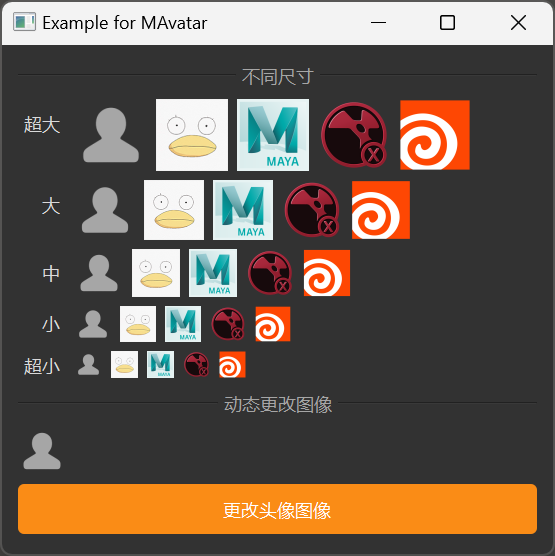

# MAvatar 头像

MAvatar 是一个头像组件，用于展示人物或对象的图像。它提供了不同的尺寸选项，并支持设置自定义图像。

## 导入

```python
from dayu_widgets.avatar import MAvatar
```

## 代码示例

### 基本使用

MAvatar 可以创建一个简单的头像组件，默认显示一个用户图标。

```python
from dayu_widgets.avatar import MAvatar

# 创建一个默认头像
avatar = MAvatar()
```

### 设置图像

MAvatar 可以通过 `set_dayu_image` 方法设置自定义图像。

```python
from dayu_widgets.avatar import MAvatar
from dayu_widgets.qt import MPixmap

# 创建一个带自定义图像的头像
avatar = MAvatar()
avatar.set_dayu_image(MPixmap("avatar.png"))
```

### 不同尺寸

MAvatar 支持不同的尺寸，可以通过类方法或 `set_dayu_size` 方法设置。

```python
from dayu_widgets.avatar import MAvatar
from dayu_widgets.qt import MPixmap
from dayu_widgets import dayu_theme

# 使用类方法创建不同尺寸的头像
avatar_huge = MAvatar.huge()
avatar_large = MAvatar.large()
avatar_medium = MAvatar.medium()
avatar_small = MAvatar.small()
avatar_tiny = MAvatar.tiny()

# 使用 set_dayu_size 方法设置尺寸
avatar = MAvatar()
avatar.set_dayu_size(dayu_theme.large)
```

### 带图像的不同尺寸头像

MAvatar 的类方法也支持直接设置图像。

```python
from dayu_widgets.avatar import MAvatar
from dayu_widgets.qt import MPixmap

# 创建带图像的不同尺寸头像
avatar_large = MAvatar.large(MPixmap("avatar.png"))
avatar_small = MAvatar.small(MPixmap("app-maya.png"))
```

### 动态更改图像

MAvatar 可以动态更改图像。

```python
# Import third-party modules
from qtpy import QtWidgets

# Import local modules
from dayu_widgets.avatar import MAvatar
from dayu_widgets.field_mixin import MFieldMixin
from dayu_widgets.push_button import MPushButton
from dayu_widgets.qt import MPixmap


class AvatarExample(QtWidgets.QWidget, MFieldMixin):
    def __init__(self, parent=None):
        super(AvatarExample, self).__init__(parent)
        self._init_ui()

    def _init_ui(self):
        # 创建头像和图像列表
        self.avatar = MAvatar()
        self.pix_map_list = [
            None,
            MPixmap("avatar.png"),
            MPixmap("app-maya.png"),
            MPixmap("app-nuke.png"),
            MPixmap("app-houdini.png"),
        ]

        # 注册字段和绑定
        self.register_field("image", None)
        self.bind("image", self.avatar, "dayu_image")

        # 创建按钮
        button = MPushButton(text="更改头像图像").primary()
        button.clicked.connect(self.slot_change_image)

        # 创建布局
        main_lay = QtWidgets.QVBoxLayout()
        main_lay.addWidget(self.avatar)
        main_lay.addWidget(button)
        self.setLayout(main_lay)

    def slot_change_image(self):
        """随机设置头像图像"""
        # Import built-in modules
        import random

        self.set_field("image", random.choice(self.pix_map_list))
```

### 完整示例



以下是一个完整的示例，展示了 MAvatar 的各种用法：

```python
# Import third-party modules
from qtpy import QtCore
from qtpy import QtWidgets

# Import local modules
from dayu_widgets import dayu_theme
from dayu_widgets.avatar import MAvatar
from dayu_widgets.divider import MDivider
from dayu_widgets.field_mixin import MFieldMixin
from dayu_widgets.label import MLabel
from dayu_widgets.push_button import MPushButton
from dayu_widgets.qt import MPixmap


class AvatarExample(QtWidgets.QWidget, MFieldMixin):
    def __init__(self, parent=None):
        super(AvatarExample, self).__init__(parent)
        self.setWindowTitle("Example for MAvatar")
        self._init_ui()

    def _init_ui(self):
        main_lay = QtWidgets.QVBoxLayout()
        main_lay.addWidget(MDivider("不同尺寸"))

        size_list = [
            ("超大", MAvatar.huge),
            ("大", MAvatar.large),
            ("中", MAvatar.medium),
            ("小", MAvatar.small),
            ("超小", MAvatar.tiny),
        ]

        self.pix_map_list = [
            None,
            MPixmap("avatar.png"),
            MPixmap("app-maya.png"),
            MPixmap("app-nuke.png"),
            MPixmap("app-houdini.png"),
        ]
        form_lay = QtWidgets.QFormLayout()
        form_lay.setLabelAlignment(QtCore.Qt.AlignRight)

        for label, cls in size_list:
            h_lay = QtWidgets.QHBoxLayout()
            for image in self.pix_map_list:
                avatar_tmp = cls(image)
                h_lay.addWidget(avatar_tmp)
            h_lay.addStretch()
            form_lay.addRow(MLabel(label), h_lay)
        main_lay.addLayout(form_lay)

        self.register_field("image", None)
        main_lay.addWidget(MDivider("动态更改图像"))
        avatar = MAvatar()
        self.bind("image", avatar, "dayu_image")
        button = MPushButton(text="更改头像图像").primary()
        button.clicked.connect(self.slot_change_image)

        main_lay.addWidget(avatar)
        main_lay.addWidget(button)
        main_lay.addStretch()
        self.setLayout(main_lay)

    def slot_change_image(self):
        """随机设置头像图像"""
        # Import built-in modules
        import random

        self.set_field("image", random.choice(self.pix_map_list))


if __name__ == "__main__":
    # Import local modules
    from dayu_widgets import dayu_theme
    from dayu_widgets.qt import application

    with application() as app:
        test = AvatarExample()
        dayu_theme.apply(test)
        test.show()
```

## API

### 构造函数

```python
MAvatar(parent=None, flags=QtCore.Qt.Widget)
```

| 参数 | 描述 | 类型 | 默认值 |
| --- | --- | --- | --- |
| `parent` | 父部件 | `QWidget` | `None` |
| `flags` | 窗口标志 | `Qt.WindowFlags` | `QtCore.Qt.Widget` |

### 方法

| 方法 | 描述 | 参数 | 返回值 |
| --- | --- | --- | --- |
| `set_dayu_size(value)` | 设置头像的尺寸 | `value`: 尺寸值 | 无 |
| `get_dayu_size()` | 获取头像的尺寸 | 无 | `int` |
| `set_dayu_image(value)` | 设置头像的图像 | `value`: QPixmap 对象或 None | 无 |
| `get_dayu_image()` | 获取头像的图像 | 无 | `QPixmap` |

### 类方法

| 方法 | 描述 | 参数 | 返回值 |
| --- | --- | --- | --- |
| `huge(image=None)` | 创建超大尺寸的头像 | `image`: QPixmap 对象或 None | `MAvatar` 实例 |
| `large(image=None)` | 创建大尺寸的头像 | `image`: QPixmap 对象或 None | `MAvatar` 实例 |
| `medium(image=None)` | 创建中等尺寸的头像 | `image`: QPixmap 对象或 None | `MAvatar` 实例 |
| `small(image=None)` | 创建小尺寸的头像 | `image`: QPixmap 对象或 None | `MAvatar` 实例 |
| `tiny(image=None)` | 创建超小尺寸的头像 | `image`: QPixmap 对象或 None | `MAvatar` 实例 |

### 属性

| 属性 | 描述 | 类型 | 默认值 |
| --- | --- | --- | --- |
| `dayu_image` | 头像的图像 | `QPixmap` | 默认用户图标 |
| `dayu_size` | 头像的尺寸 | `int` | `dayu_theme.default_size` |

## 常见问题

### 如何设置自定义图像？

可以通过 `set_dayu_image` 方法或 `dayu_image` 属性设置自定义图像：

```python
from dayu_widgets.avatar import MAvatar
from dayu_widgets.qt import MPixmap

# 使用 set_dayu_image 方法
avatar = MAvatar()
avatar.set_dayu_image(MPixmap("avatar.png"))

# 使用 dayu_image 属性
avatar = MAvatar()
avatar.setProperty("dayu_image", MPixmap("avatar.png"))
```

### 如何设置头像尺寸？

可以通过 `set_dayu_size` 方法、`dayu_size` 属性或类方法设置头像尺寸：

```python
from dayu_widgets.avatar import MAvatar
from dayu_widgets import dayu_theme

# 使用 set_dayu_size 方法
avatar = MAvatar()
avatar.set_dayu_size(dayu_theme.large)

# 使用 dayu_size 属性
avatar = MAvatar()
avatar.setProperty("dayu_size", dayu_theme.large)

# 使用类方法
avatar = MAvatar.large()
```

### 如何处理图像缩放？

MAvatar 会自动将图像缩放到适合头像的尺寸，保持图像的纵横比。如果图像为空或无效，将显示默认的用户图标。

### 如何在其他组件中使用 MAvatar？

MAvatar 可以与其他组件一起使用，例如在 MBadge 中：

```python
from dayu_widgets.avatar import MAvatar
from dayu_widgets.badge import MBadge
from dayu_widgets.qt import MPixmap

# 创建一个带徽标的头像
avatar = MAvatar.large(MPixmap("avatar.png"))
badge = MBadge.dot(True, widget=avatar)
```
