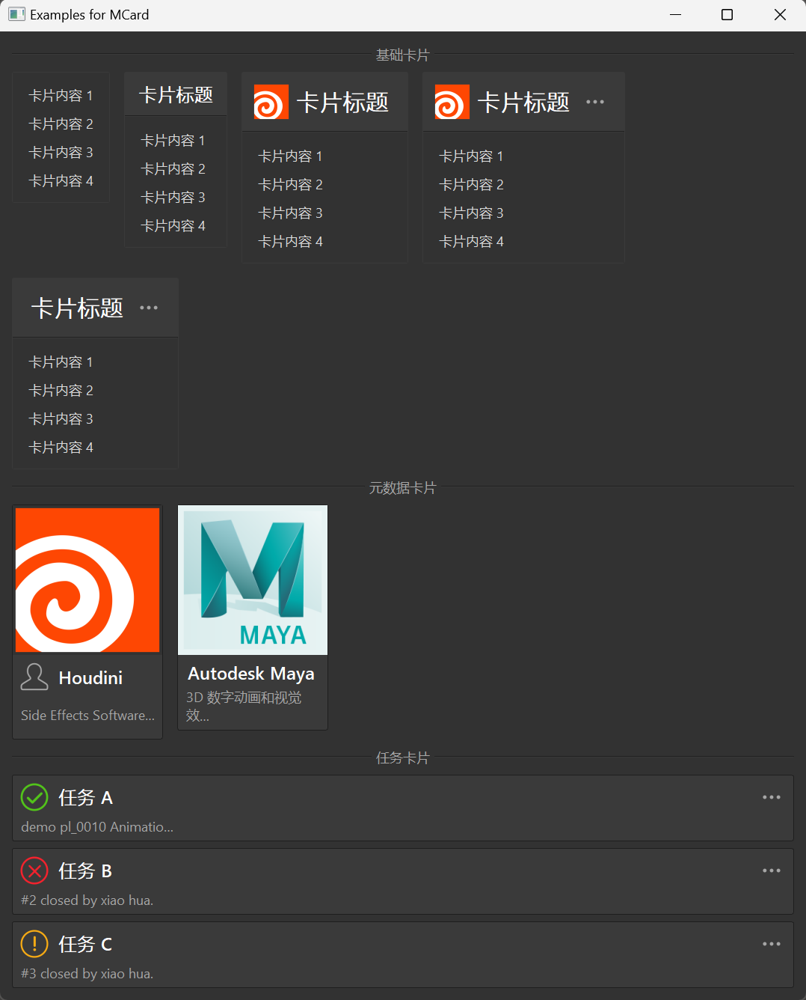

# MCard 卡片

MCard 是一个卡片组件，用于展示内容，可以包含标题、图标和内容区域。它提供了一种简洁的方式来组织和展示信息，适用于各种场景。

## 导入

```python
from dayu_widgets.card import MCard
from dayu_widgets.card import MMeta
```

## 代码示例

### 基本使用

MCard 可以创建一个简单的卡片，包含标题和内容。

```python
from dayu_widgets.card import MCard
from dayu_widgets.label import MLabel
from qtpy import QtWidgets

# 创建一个带标题的卡片
card = MCard(title="卡片标题")

# 创建内容部件
content_widget = QtWidgets.QWidget()
content_layout = QtWidgets.QVBoxLayout()
content_layout.setContentsMargins(15, 15, 15, 15)
content_widget.setLayout(content_layout)

# 添加内容
for i in range(4):
    content_layout.addWidget(MLabel("卡片内容 {}".format(i + 1)))

# 设置卡片内容
card.set_widget(content_widget)
```

### 不同尺寸

MCard 支持不同的尺寸，可以通过 `size` 参数设置。

```python
from dayu_widgets.card import MCard
from dayu_widgets import dayu_theme

# 创建小尺寸的卡片
card_small = MCard(title="小尺寸卡片", size=dayu_theme.small)

# 创建中等尺寸的卡片（默认）
card_medium = MCard(title="中等尺寸卡片", size=dayu_theme.medium)

# 创建大尺寸的卡片
card_large = MCard(title="大尺寸卡片", size=dayu_theme.large)
```

### 带图标的卡片

MCard 支持在标题旁边显示图标。

```python
from dayu_widgets.card import MCard
from dayu_widgets.qt import MPixmap

# 创建带图标的卡片
card = MCard(title="带图标的卡片", image=MPixmap("app-houdini.png"))
```

### 带额外操作的卡片

MCard 支持在标题右侧添加额外的操作按钮。

```python
from dayu_widgets.card import MCard

# 创建带额外操作的卡片
card = MCard(title="带额外操作的卡片", extra="更多")

# 获取更多按钮并连接点击事件
more_button = card.get_more_button()
more_button.clicked.connect(lambda: print("点击了更多按钮"))
```

### 带边框的卡片

MCard 支持显示边框。

```python
from dayu_widgets.card import MCard

# 创建带边框的卡片
card = MCard(title="带边框的卡片").border()
```

### 元数据卡片（MMeta）

MMeta 是一种特殊类型的卡片，用于展示元数据信息，如封面图、头像、标题和描述。

```python
from dayu_widgets.card import MMeta
from dayu_widgets.qt import MPixmap

# 创建一个元数据卡片
meta_card = MMeta()
meta_card.setup_data({
    "title": "Houdini",
    "description": "Side Effects Software的旗舰级产品，是创建高级视觉效果的有效工具",
    "avatar": MPixmap("user_line.svg"),
    "cover": MPixmap("app-houdini.png")
})
```

### 带额外操作的元数据卡片

MMeta 也支持添加额外的操作按钮。

```python
from dayu_widgets.card import MMeta
from dayu_widgets.qt import MPixmap

# 创建带额外操作的元数据卡片
meta_card = MMeta(extra=True)
meta_card.setup_data({
    "title": "任务 A",
    "description": "demo pl_0010 Animation \n2019/04/01 - 2019/04/09",
    "avatar": MPixmap("success_line.svg", dayu_theme.success_color)
})

# 获取更多按钮并连接点击事件
more_button = meta_card.get_more_button()
more_button.clicked.connect(lambda: print("点击了更多按钮"))
```

### 完整示例



以下是一个完整的示例，展示了 MCard 和 MMeta 的各种用法：

```python
# Import third-party modules
from qtpy import QtWidgets

# Import local modules
from dayu_widgets import dayu_theme
from dayu_widgets.card import MCard
from dayu_widgets.card import MMeta
from dayu_widgets.divider import MDivider
from dayu_widgets.flow_layout import MFlowLayout
from dayu_widgets.label import MLabel
from dayu_widgets.qt import MPixmap


class CardExample(QtWidgets.QWidget):
    def __init__(self, parent=None):
        super(CardExample, self).__init__(parent)
        self.setWindowTitle("Examples for MCard")
        self._init_ui()

    def _init_ui(self):
        basic_card_lay = MFlowLayout()
        basic_card_lay.setSpacing(20)
        for setting in [
            {
                "title": "",
            },
            {"title": "卡片标题", "size": dayu_theme.small},
            {"title": "卡片标题", "image": MPixmap("app-houdini.png")},
            {
                "title": "卡片标题",
                "extra": "更多",
                "image": MPixmap("app-houdini.png"),
            },
            {
                "title": "卡片标题",
                "extra": "更多",
            },
        ]:
            card_0 = MCard(**setting)
            content_widget_0 = QtWidgets.QWidget()
            content_lay_0 = QtWidgets.QVBoxLayout()
            content_lay_0.setContentsMargins(15, 15, 15, 15)
            content_widget_0.setLayout(content_lay_0)
            for i in range(4):
                content_lay_0.addWidget(MLabel("卡片内容 {}".format(i + 1)))
            card_0.set_widget(content_widget_0)

            basic_card_lay.addWidget(card_0)

        meta_card_lay = MFlowLayout()
        meta_card_lay.setSpacing(20)
        for setting in [
            {
                "title": "Houdini",
                "description": "Side Effects Software的旗舰级产品，是创建高级视觉效果的有效工具",
                "avatar": MPixmap("user_line.svg"),
                "cover": MPixmap("app-houdini.png"),
            },
            {
                "title": "Autodesk Maya",
                "description": "3D 数字动画和视觉效果的世界领先软件应用程序",
                "cover": MPixmap("app-maya.png"),
            },
        ]:
            meta_card = MMeta()
            meta_card.setup_data(setting)
            meta_card_lay.addWidget(meta_card)

        task_card_lay = QtWidgets.QVBoxLayout()
        for setting in [
            {
                "title": "任务 A",
                "description": "demo pl_0010 Animation \n2019/04/01 - 2019/04/09",
                "avatar": MPixmap("success_line.svg", dayu_theme.success_color),
            },
            {
                "title": "任务 B",
                "description": "#2 closed by xiao hua.",
                "avatar": MPixmap("error_line.svg", dayu_theme.error_color),
            },
            {
                "title": "任务 C",
                "description": "#3 closed by xiao hua.",
                "avatar": MPixmap("warning_line.svg", dayu_theme.warning_color),
            },
        ]:
            meta_card = MMeta(extra=True)
            meta_card.setup_data(setting)
            task_card_lay.addWidget(meta_card)

        main_lay = QtWidgets.QVBoxLayout()
        main_lay.addWidget(MDivider("基础卡片"))
        main_lay.addLayout(basic_card_lay)
        main_lay.addWidget(MDivider("元数据卡片"))
        main_lay.addLayout(meta_card_lay)
        main_lay.addWidget(MDivider("任务卡片"))
        main_lay.addLayout(task_card_lay)
        main_lay.addStretch()
        self.setLayout(main_lay)


if __name__ == "__main__":
    # Import local modules
    from dayu_widgets import dayu_theme
    from dayu_widgets.qt import application

    with application() as app:
        test = CardExample()
        dayu_theme.apply(test)
        test.show()
```

## API

### MCard

#### 构造函数

```python
MCard(title=None, image=None, size=None, extra=None, type=None, parent=None)
```

| 参数 | 描述 | 类型 | 默认值 |
| --- | --- | --- | --- |
| `title` | 卡片标题 | `str` | `None` |
| `image` | 标题旁边的图标 | `QPixmap` | `None` |
| `size` | 卡片尺寸 | `int` | `dayu_theme.default_size` |
| `extra` | 额外操作的文本 | `str` | `None` |
| `type` | 卡片类型 | `str` | `None` |
| `parent` | 父部件 | `QWidget` | `None` |

#### 方法

| 方法 | 描述 | 参数 | 返回值 |
| --- | --- | --- | --- |
| `get_more_button()` | 获取更多按钮 | 无 | `MToolButton` |
| `set_widget(widget)` | 设置卡片内容部件 | `widget`: 内容部件 | 无 |
| `border()` | 设置卡片显示边框 | 无 | `self` |

### MMeta

#### 构造函数

```python
MMeta(cover=None, avatar=None, title=None, description=None, extra=False, parent=None)
```

| 参数 | 描述 | 类型 | 默认值 |
| --- | --- | --- | --- |
| `cover` | 封面图 | `QPixmap` | `None` |
| `avatar` | 头像图标 | `QPixmap` | `None` |
| `title` | 标题 | `str` | `None` |
| `description` | 描述 | `str` | `None` |
| `extra` | 是否显示额外操作按钮 | `bool` | `False` |
| `parent` | 父部件 | `QWidget` | `None` |

#### 方法

| 方法 | 描述 | 参数 | 返回值 |
| --- | --- | --- | --- |
| `get_more_button()` | 获取更多按钮 | 无 | `MToolButton` |
| `setup_data(data_dict)` | 设置卡片数据 | `data_dict`: 数据字典 | 无 |

#### 数据字典

`setup_data` 方法接受一个数据字典，可以包含以下键：

| 键 | 描述 | 类型 | 是否必须 |
| --- | --- | --- | --- |
| `cover` | 封面图 | `QPixmap` | 否 |
| `avatar` | 头像图标 | `QPixmap` | 否 |
| `title` | 标题 | `str` | 否 |
| `description` | 描述 | `str` | 否 |

## 常见问题

### 如何在卡片中添加自定义内容？

可以通过 `set_widget` 方法设置卡片的内容部件：

```python
from dayu_widgets.card import MCard
from dayu_widgets.label import MLabel
from qtpy import QtWidgets

# 创建卡片
card = MCard(title="自定义内容")

# 创建内容部件
content_widget = QtWidgets.QWidget()
content_layout = QtWidgets.QVBoxLayout()
content_layout.setContentsMargins(15, 15, 15, 15)
content_widget.setLayout(content_layout)

# 添加自定义内容
content_layout.addWidget(MLabel("这是自定义内容"))
content_layout.addWidget(QtWidgets.QPushButton("点击我"))

# 设置卡片内容
card.set_widget(content_widget)
```

### 如何处理额外操作按钮的点击事件？

可以通过 `get_more_button` 方法获取更多按钮，然后连接点击事件：

```python
from dayu_widgets.card import MCard

# 创建带额外操作的卡片
card = MCard(title="带额外操作的卡片", extra="更多")

# 获取更多按钮并连接点击事件
more_button = card.get_more_button()
more_button.clicked.connect(lambda: print("点击了更多按钮"))
```

### 如何创建不同样式的卡片？

MCard 和 MMeta 提供了不同的样式选项：

1. 基础卡片：使用 MCard 创建基础卡片
2. 带边框的卡片：使用 `border()` 方法创建带边框的卡片
3. 带图标的卡片：设置 `image` 参数创建带图标的卡片
4. 带额外操作的卡片：设置 `extra` 参数创建带额外操作的卡片
5. 元数据卡片：使用 MMeta 创建元数据卡片
6. 任务卡片：使用 MMeta 并设置不同的头像图标创建任务卡片

```python
from dayu_widgets.card import MCard
from dayu_widgets.card import MMeta
from dayu_widgets.qt import MPixmap
from dayu_widgets import dayu_theme

# 基础卡片
basic_card = MCard(title="基础卡片")

# 带边框的卡片
border_card = MCard(title="带边框的卡片").border()

# 带图标的卡片
icon_card = MCard(title="带图标的卡片", image=MPixmap("app-houdini.png"))

# 带额外操作的卡片
extra_card = MCard(title="带额外操作的卡片", extra="更多")

# 元数据卡片
meta_card = MMeta()
meta_card.setup_data({
    "title": "Houdini",
    "description": "Side Effects Software的旗舰级产品",
    "cover": MPixmap("app-houdini.png")
})

# 任务卡片
task_card = MMeta(extra=True)
task_card.setup_data({
    "title": "任务 A",
    "description": "demo pl_0010 Animation",
    "avatar": MPixmap("success_line.svg", dayu_theme.success_color)
})
```
