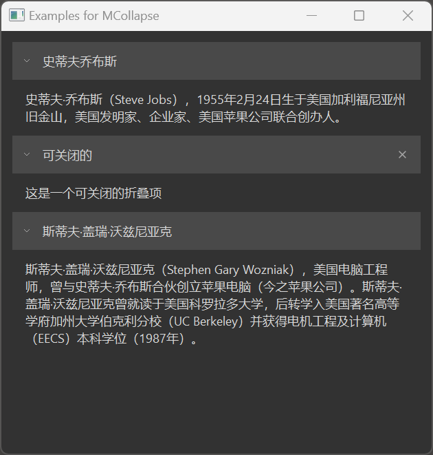

# MCollapse 折叠面板

MCollapse 是一个折叠面板组件，用于将内容区域折叠/展开，可以折叠多个区域，也可以只保持一个区域展开。它适用于将复杂的内容区域分组显示，用户可以选择性地查看需要的信息。

## 导入

```python
from dayu_widgets.collapse import MCollapse
```

## 代码示例

### 基本使用

MCollapse 可以通过 `add_section` 方法添加折叠区域，每个区域包含标题和内容部件。

```python
from dayu_widgets.collapse import MCollapse
from dayu_widgets.label import MLabel

# 创建一个折叠面板
collapse = MCollapse()

# 创建内容部件
label_1 = MLabel("这是第一个折叠区域的内容")
label_1.setWordWrap(True)

# 添加折叠区域
collapse.add_section({
    "title": "第一个区域",
    "expand": True,  # 默认展开
    "widget": label_1
})
```

### 添加多个折叠区域

MCollapse 可以通过 `add_section_list` 方法一次性添加多个折叠区域。

```python
from dayu_widgets.collapse import MCollapse
from dayu_widgets.label import MLabel

# 创建一个折叠面板
collapse = MCollapse()

# 创建内容部件
label_1 = MLabel("这是第一个折叠区域的内容")
label_2 = MLabel("这是第二个折叠区域的内容")
label_3 = MLabel("这是第三个折叠区域的内容")
label_1.setWordWrap(True)
label_2.setWordWrap(True)
label_3.setWordWrap(True)

# 添加多个折叠区域
section_list = [
    {"title": "第一个区域", "expand": True, "widget": label_1},
    {"title": "第二个区域", "expand": False, "widget": label_2},
    {"title": "第三个区域", "expand": False, "widget": label_3}
]
collapse.add_section_list(section_list)
```

### 可关闭的折叠区域

MCollapse 支持创建可关闭的折叠区域，用户可以通过点击关闭按钮移除该区域。

```python
from dayu_widgets.collapse import MCollapse
from dayu_widgets.label import MLabel

# 创建一个折叠面板
collapse = MCollapse()

# 创建内容部件
label = MLabel("这是一个可关闭的折叠区域")
label.setWordWrap(True)

# 添加可关闭的折叠区域
collapse.add_section({
    "title": "可关闭的区域",
    "expand": True,
    "widget": label,
    "closable": True  # 设置为可关闭
})
```

### 完整示例



以下是一个完整的示例，展示了 MCollapse 的各种用法：

```python
# Import third-party modules
from qtpy import QtWidgets

# Import local modules
from dayu_widgets.collapse import MCollapse
from dayu_widgets.label import MLabel


class CollapseExample(QtWidgets.QWidget):
    def __init__(self, parent=None):
        super(CollapseExample, self).__init__(parent)
        self.setWindowTitle("Examples for MCollapse")
        self._init_ui()

    def _init_ui(self):
        label_1 = MLabel("史蒂夫·乔布斯（Steve Jobs），1955年2月24日生于美国加利福尼亚州旧金山，美国发明家、企业家、美国苹果公司联合创办人。")
        label_2 = MLabel(
            "斯蒂夫·盖瑞·沃兹尼亚克（Stephen Gary Wozniak），美国电脑工程师，曾与史蒂夫·乔布斯合伙创立苹果电脑（今之苹果公司）。斯蒂夫·盖瑞·沃兹尼亚克曾就读于美国科罗拉多大学，后转学入美国著名高等学府加州大学伯克利分校（UC Berkeley）并获得电机工程及计算机（EECS）本科学位（1987年）。"
        )
        label_3 = MLabel(
            "乔纳森·伊夫是一位工业设计师，现任Apple公司设计师兼资深副总裁，英国爵士。他曾参与设计了iPod，iMac，iPhone，iPad等众多苹果产品。除了乔布斯，他是对苹果那些著名的产品最有影响力的人。"
        )
        label_1.setWordWrap(True)
        label_2.setWordWrap(True)
        label_3.setWordWrap(True)
        section_list = [
            {"title": "史蒂夫乔布斯", "expand": True, "widget": label_1},
            {
                "title": "可关闭的",
                "expand": True,
                "widget": MLabel("这是一个可关闭的折叠项"),
                "closable": True,
            },
            {"title": "斯蒂夫·盖瑞·沃兹尼亚克", "expand": True, "widget": label_2},
        ]

        section_group = MCollapse()
        section_group.add_section_list(section_list)

        main_lay = QtWidgets.QVBoxLayout()
        main_lay.addWidget(section_group)
        main_lay.addStretch()
        self.setLayout(main_lay)


if __name__ == "__main__":
    # Import local modules
    from dayu_widgets import dayu_theme
    from dayu_widgets.qt import application

    with application() as app:
        test = CollapseExample()
        dayu_theme.apply(test)
        test.show()
```

## API

### MCollapse

#### 构造函数

```python
MCollapse(parent=None)
```

| 参数 | 描述 | 类型 | 默认值 |
| --- | --- | --- | --- |
| `parent` | 父部件 | `QWidget` | `None` |

#### 方法

| 方法 | 描述 | 参数 | 返回值 |
| --- | --- | --- | --- |
| `add_section(section_data)` | 添加一个折叠区域 | `section_data`: 区域数据字典 | `MSectionItem` |
| `add_section_list(section_list)` | 添加多个折叠区域 | `section_list`: 区域数据字典列表 | 无 |
| `remove_section(widget)` | 移除一个折叠区域 | `widget`: 要移除的区域部件 | 无 |
| `sections()` | 获取所有折叠区域 | 无 | `List[MSectionItem]` |
| `clear()` | 清除所有折叠区域 | 无 | 无 |

#### 区域数据字典

`add_section` 和 `add_section_list` 方法接受的区域数据字典可以包含以下键：

| 键 | 描述 | 类型 | 是否必须 |
| --- | --- | --- | --- |
| `title` | 区域标题 | `str` | 是 |
| `expand` | 是否默认展开 | `bool` | 否 |
| `widget` | 区域内容部件 | `QWidget` | 是 |
| `closable` | 是否可关闭 | `bool` | 否 |

### MSectionItem

MSectionItem 是 MCollapse 内部使用的折叠区域项组件。

#### 方法

| 方法 | 描述 | 参数 | 返回值 |
| --- | --- | --- | --- |
| `set_content(widget)` | 设置区域内容部件 | `widget`: 内容部件 | 无 |
| `get_content()` | 获取区域内容部件 | 无 | `QWidget` |
| `set_closable(value)` | 设置是否可关闭 | `value`: 布尔值 | 无 |
| `set_expand(value)` | 设置是否展开 | `value`: 布尔值 | 无 |
| `set_title(value)` | 设置区域标题 | `value`: 标题文本 | 无 |

#### 属性

| 属性 | 描述 | 类型 | 默认值 |
| --- | --- | --- | --- |
| `closable` | 是否可关闭 | `bool` | `False` |
| `expand` | 是否展开 | `bool` | `False` |
| `title` | 区域标题 | `str` | `""` |

## 常见问题

### 如何控制折叠区域的展开和折叠？

可以通过设置区域数据字典中的 `expand` 键来控制折叠区域的初始状态，也可以通过 `set_expand` 方法动态控制：

```python
from dayu_widgets.collapse import MCollapse
from dayu_widgets.label import MLabel

# 创建一个折叠面板
collapse = MCollapse()

# 添加默认展开的折叠区域
section = collapse.add_section({
    "title": "默认展开",
    "expand": True,
    "widget": MLabel("这是内容")
})

# 动态折叠区域
section.set_expand(False)

# 动态展开区域
section.set_expand(True)
```

### 如何处理折叠区域的关闭事件？

当用户点击可关闭折叠区域的关闭按钮时，该区域会自动从 MCollapse 中移除。如果需要在关闭前执行其他操作，可以连接区域的 `_close_button.clicked` 信号：

```python
from dayu_widgets.collapse import MCollapse
from dayu_widgets.label import MLabel

# 创建一个折叠面板
collapse = MCollapse()

# 添加可关闭的折叠区域
section = collapse.add_section({
    "title": "可关闭的区域",
    "expand": True,
    "widget": MLabel("这是内容"),
    "closable": True
})

# 连接关闭按钮的点击事件
section._close_button.clicked.connect(lambda: print("区域即将关闭"))
```

### 如何获取所有折叠区域？

可以通过 `sections()` 方法获取所有折叠区域：

```python
from dayu_widgets.collapse import MCollapse

# 创建一个折叠面板并添加区域
collapse = MCollapse()
# 添加区域...

# 获取所有折叠区域
all_sections = collapse.sections()
for section in all_sections:
    print(section.property("title"))
```

### 如何清除所有折叠区域？

可以通过 `clear()` 方法清除所有折叠区域：

```python
from dayu_widgets.collapse import MCollapse

# 创建一个折叠面板并添加区域
collapse = MCollapse()
# 添加区域...

# 清除所有折叠区域
collapse.clear()
```
