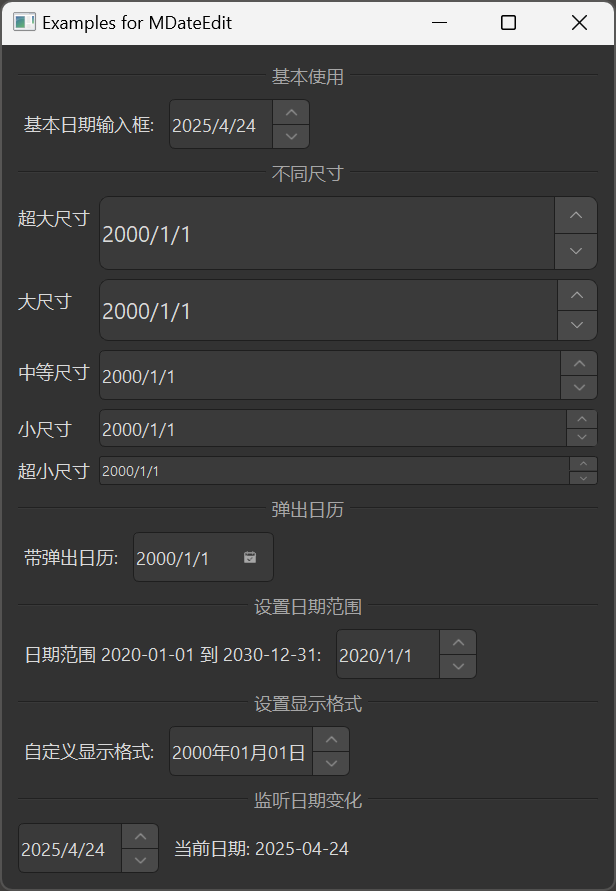

# MDateEdit 日期编辑框

MDateEdit 是一个日期编辑框组件，用于输入和编辑日期。它基于 Qt 的 QDateEdit 类，提供了更美观的样式和更好的交互体验。

## 导入

```python
from dayu_widgets.spin_box import MDateEdit
```

## 代码示例

### 基本使用

MDateEdit 可以创建一个简单的日期输入框，用户可以通过点击上下按钮或直接输入来设置日期。

```python
# Import built-in modules
import datetime

# Import local modules
from dayu_widgets.spin_box import MDateEdit

# 创建一个日期输入框
date_edit = MDateEdit()
date_edit.setDate(datetime.datetime.now().date())
```

### 不同尺寸

MDateEdit 支持不同的尺寸，可以通过方法链式调用设置。

```python
from dayu_widgets.spin_box import MDateEdit

# 创建超大尺寸的日期输入框
date_edit_huge = MDateEdit().huge()

# 创建大尺寸的日期输入框
date_edit_large = MDateEdit().large()

# 创建中等尺寸的日期输入框（默认）
date_edit_medium = MDateEdit().medium()

# 创建小尺寸的日期输入框
date_edit_small = MDateEdit().small()

# 创建超小尺寸的日期输入框
date_edit_tiny = MDateEdit().tiny()
```

### 弹出日历

MDateEdit 支持弹出日历，方便用户选择日期。

```python
from dayu_widgets.spin_box import MDateEdit

# 创建一个带弹出日历的日期输入框
date_edit = MDateEdit()
date_edit.setCalendarPopup(True)
```

### 设置日期范围

MDateEdit 支持设置日期范围。

```python
# Import built-in modules
import datetime

# Import local modules
from dayu_widgets.spin_box import MDateEdit

# 创建日期输入框并设置范围
date_edit = MDateEdit()
date_edit.setDateRange(
    datetime.date(2020, 1, 1),
    datetime.date(2030, 12, 31)
)
```

### 设置显示格式

MDateEdit 支持设置显示格式。

```python
from dayu_widgets.spin_box import MDateEdit

# 创建日期输入框并设置显示格式
date_edit = MDateEdit()
date_edit.setDisplayFormat("yyyy年MM月dd日")
```

### 监听日期变化

MDateEdit 可以通过连接 `dateChanged` 信号来监听日期变化。

```python
# Import built-in modules
import datetime

# Import local modules
from dayu_widgets.spin_box import MDateEdit

# 创建日期输入框
date_edit = MDateEdit()
date_edit.setDate(datetime.datetime.now().date())

# 监听日期变化
date_edit.dateChanged.connect(lambda date: print("当前日期:", date))
```

### 完整示例



以下是一个完整的示例，展示了 MDateEdit 的各种用法：

```python
# Import built-in modules
import datetime

# Import third-party modules
from qtpy import QtWidgets

# Import local modules
from dayu_widgets.divider import MDivider
from dayu_widgets.spin_box import MDateEdit
from dayu_widgets.label import MLabel


class DateEditExample(QtWidgets.QWidget):
    def __init__(self, parent=None):
        super(DateEditExample, self).__init__(parent)
        self.setWindowTitle("Examples for MDateEdit")
        self._init_ui()

    def _init_ui(self):
        main_lay = QtWidgets.QVBoxLayout()

        # 基本使用
        main_lay.addWidget(MDivider("基本使用"))
        basic_lay = QtWidgets.QHBoxLayout()
        basic_date_edit = MDateEdit()
        basic_date_edit.setDate(datetime.datetime.now().date())
        basic_lay.addWidget(MLabel("基本日期输入框:"))
        basic_lay.addWidget(basic_date_edit)
        basic_lay.addStretch()
        main_lay.addLayout(basic_lay)

        # 不同尺寸
        main_lay.addWidget(MDivider("不同尺寸"))
        size_lay = QtWidgets.QFormLayout()
        size_lay.addRow("超大尺寸", MDateEdit().huge())
        size_lay.addRow("大尺寸", MDateEdit().large())
        size_lay.addRow("中等尺寸", MDateEdit().medium())
        size_lay.addRow("小尺寸", MDateEdit().small())
        size_lay.addRow("超小尺寸", MDateEdit().tiny())
        main_lay.addLayout(size_lay)

        # 弹出日历
        main_lay.addWidget(MDivider("弹出日历"))
        popup_lay = QtWidgets.QHBoxLayout()
        popup_date_edit = MDateEdit()
        popup_date_edit.setCalendarPopup(True)
        popup_lay.addWidget(MLabel("带弹出日历:"))
        popup_lay.addWidget(popup_date_edit)
        popup_lay.addStretch()
        main_lay.addLayout(popup_lay)

        # 设置日期范围
        main_lay.addWidget(MDivider("设置日期范围"))
        range_lay = QtWidgets.QHBoxLayout()
        range_date_edit = MDateEdit()
        range_date_edit.setDateRange(
            datetime.date(2020, 1, 1),
            datetime.date(2030, 12, 31)
        )
        range_lay.addWidget(MLabel("日期范围 2020-01-01 到 2030-12-31:"))
        range_lay.addWidget(range_date_edit)
        range_lay.addStretch()
        main_lay.addLayout(range_lay)

        # 设置显示格式
        main_lay.addWidget(MDivider("设置显示格式"))
        format_lay = QtWidgets.QHBoxLayout()
        format_date_edit = MDateEdit()
        format_date_edit.setDisplayFormat("yyyy年MM月dd日")
        format_lay.addWidget(MLabel("自定义显示格式:"))
        format_lay.addWidget(format_date_edit)
        format_lay.addStretch()
        main_lay.addLayout(format_lay)

        # 监听日期变化
        main_lay.addWidget(MDivider("监听日期变化"))
        date_changed_lay = QtWidgets.QHBoxLayout()
        date_changed_date_edit = MDateEdit()
        date_changed_date_edit.setDate(datetime.datetime.now().date())
        date_changed_label = MLabel("当前日期: {}".format(datetime.datetime.now().date()))
        date_changed_date_edit.dateChanged.connect(
            lambda date: date_changed_label.setText("当前日期: {}".format(date))
        )
        date_changed_lay.addWidget(date_changed_date_edit)
        date_changed_lay.addWidget(date_changed_label)
        date_changed_lay.addStretch()
        main_lay.addLayout(date_changed_lay)

        main_lay.addStretch()
        self.setLayout(main_lay)


if __name__ == "__main__":
    # Import local modules
    from dayu_widgets import dayu_theme
    from dayu_widgets.qt import application

    with application() as app:
        test = DateEditExample()
        dayu_theme.apply(test)
        test.show()
```

## API

### 构造函数

```python
MDateEdit(date=None, parent=None)
```

| 参数 | 描述 | 类型 | 默认值 |
| --- | --- | --- | --- |
| `date` | 初始日期 | `datetime.datetime` 或 `datetime.date` | `None` |
| `parent` | 父部件 | `QWidget` | `None` |

### 方法

| 方法 | 描述 | 参数 | 返回值 |
| --- | --- | --- | --- |
| `set_dayu_size(value)` | 设置输入框的尺寸 | `value`: 尺寸值 | 无 |
| `get_dayu_size()` | 获取输入框的尺寸 | 无 | `int` |
| `huge()` | 设置为超大尺寸 | 无 | `self` |
| `large()` | 设置为大尺寸 | 无 | `self` |
| `medium()` | 设置为中等尺寸 | 无 | `self` |
| `small()` | 设置为小尺寸 | 无 | `self` |
| `tiny()` | 设置为超小尺寸 | 无 | `self` |

### 继承的方法

MDateEdit 继承自 QDateEdit，因此可以使用 QDateEdit 的所有方法，例如：

- `setDate(date)`: 设置日期
- `date()`: 获取日期
- `setDateRange(min, max)`: 设置日期范围
- `setMinimumDate(date)`: 设置最小日期
- `setMaximumDate(date)`: 设置最大日期
- `setDisplayFormat(format)`: 设置显示格式
- `setCalendarPopup(enable)`: 设置是否显示弹出日历
- 更多方法请参考 Qt 文档

### 信号

MDateEdit 继承自 QDateEdit，因此可以使用 QDateEdit 的所有信号，例如：

- `dateChanged(date)`: 当日期变化时触发
- 更多信号请参考 Qt 文档

## 常见问题

### 如何设置日期格式？

可以通过 `setDisplayFormat` 方法设置日期格式：

```python
from dayu_widgets.spin_box import MDateEdit

# 创建日期输入框
date_edit = MDateEdit()

# 设置显示格式
date_edit.setDisplayFormat("yyyy-MM-dd")
```

格式字符串使用以下占位符：

- `d`：日期（1-31）
- `dd`：日期（01-31）
- `M`：月份（1-12）
- `MM`：月份（01-12）
- `yy`：年份（00-99）
- `yyyy`：年份（0000-9999）

### 如何启用弹出日历？

可以通过 `setCalendarPopup` 方法启用弹出日历：

```python
from dayu_widgets.spin_box import MDateEdit

# 创建日期输入框
date_edit = MDateEdit()

# 启用弹出日历
date_edit.setCalendarPopup(True)
```

### 如何设置日期范围？

可以通过 `setDateRange` 方法设置日期范围：

```python
# Import built-in modules
import datetime

# Import local modules
from dayu_widgets.spin_box import MDateEdit

# 创建日期输入框
date_edit = MDateEdit()

# 设置日期范围
date_edit.setDateRange(
    datetime.date(2020, 1, 1),
    datetime.date(2030, 12, 31)
)
```

也可以单独设置最小和最大日期：

```python
# Import built-in modules
import datetime

# Import local modules
from dayu_widgets.spin_box import MDateEdit

# 创建日期输入框
date_edit = MDateEdit()

# 设置最小日期
date_edit.setMinimumDate(datetime.date(2020, 1, 1))

# 设置最大日期
date_edit.setMaximumDate(datetime.date(2030, 12, 31))
```

### 如何禁用日期输入框？

可以通过 `setEnabled` 方法禁用日期输入框：

```python
from dayu_widgets.spin_box import MDateEdit

# 创建日期输入框
date_edit = MDateEdit()

# 禁用日期输入框
date_edit.setEnabled(False)
```
