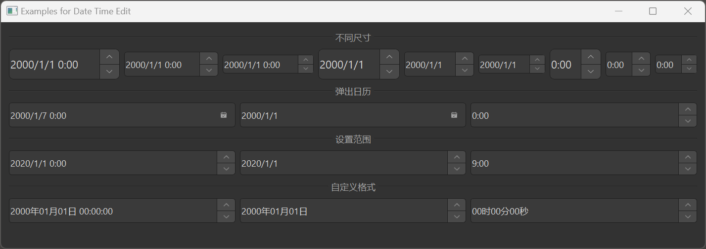

# MDateTimeEdit 日期时间编辑框

MDateTimeEdit 是一个日期时间编辑框组件，用于输入和编辑日期时间。它基于 Qt 的 QDateTimeEdit 类，提供了更美观的样式和更好的交互体验。此外，dayu_widgets 还提供了 MDateEdit 和 MTimeEdit 组件，分别用于输入日期和时间。

## 导入

```python
from dayu_widgets.spin_box import MDateTimeEdit
from dayu_widgets.spin_box import MDateEdit
from dayu_widgets.spin_box import MTimeEdit
```

## 代码示例

### 基本使用

MDateTimeEdit、MDateEdit 和 MTimeEdit 可以创建日期时间、日期和时间输入框。

```python
# Import built-in modules
import datetime

# Import local modules
from dayu_widgets.spin_box import MDateTimeEdit
from dayu_widgets.spin_box import MDateEdit
from dayu_widgets.spin_box import MTimeEdit

# 创建一个日期时间输入框
date_time_edit = MDateTimeEdit()
date_time_edit.setDateTime(datetime.datetime.now())

# 创建一个日期输入框
date_edit = MDateEdit()
date_edit.setDate(datetime.datetime.now().date())

# 创建一个时间输入框
time_edit = MTimeEdit()
time_edit.setTime(datetime.datetime.now().time())
```

### 不同尺寸

MDateTimeEdit、MDateEdit 和 MTimeEdit 支持不同的尺寸，可以通过方法链式调用设置。

```python
from dayu_widgets.spin_box import MDateTimeEdit
from dayu_widgets.spin_box import MDateEdit
from dayu_widgets.spin_box import MTimeEdit

# 创建大尺寸的日期时间输入框
date_time_edit_large = MDateTimeEdit().large()

# 创建中等尺寸的日期输入框（默认）
date_edit_medium = MDateEdit().medium()

# 创建小尺寸的时间输入框
time_edit_small = MTimeEdit().small()
```

### 弹出日历

MDateTimeEdit 和 MDateEdit 支持弹出日历，方便用户选择日期。

```python
from dayu_widgets.spin_box import MDateTimeEdit
from dayu_widgets.spin_box import MDateEdit

# 创建一个带弹出日历的日期时间输入框
date_time_edit = MDateTimeEdit()
date_time_edit.setCalendarPopup(True)

# 创建一个带弹出日历的日期输入框
date_edit = MDateEdit()
date_edit.setCalendarPopup(True)
```

### 设置日期时间范围

MDateTimeEdit、MDateEdit 和 MTimeEdit 支持设置日期时间范围。

```python
# Import built-in modules
import datetime

# Import local modules
from dayu_widgets.spin_box import MDateTimeEdit
from dayu_widgets.spin_box import MDateEdit
from dayu_widgets.spin_box import MTimeEdit

# 创建日期时间输入框并设置范围
date_time_edit = MDateTimeEdit()
date_time_edit.setDateTimeRange(
    datetime.datetime(2020, 1, 1, 0, 0, 0),
    datetime.datetime(2030, 12, 31, 23, 59, 59)
)

# 创建日期输入框并设置范围
date_edit = MDateEdit()
date_edit.setDateRange(
    datetime.date(2020, 1, 1),
    datetime.date(2030, 12, 31)
)

# 创建时间输入框并设置范围
time_edit = MTimeEdit()
time_edit.setTimeRange(
    datetime.time(9, 0, 0),
    datetime.time(18, 0, 0)
)
```

### 设置显示格式

MDateTimeEdit、MDateEdit 和 MTimeEdit 支持设置显示格式。

```python
from dayu_widgets.spin_box import MDateTimeEdit
from dayu_widgets.spin_box import MDateEdit
from dayu_widgets.spin_box import MTimeEdit

# 创建日期时间输入框并设置显示格式
date_time_edit = MDateTimeEdit()
date_time_edit.setDisplayFormat("yyyy年MM月dd日 hh:mm:ss")

# 创建日期输入框并设置显示格式
date_edit = MDateEdit()
date_edit.setDisplayFormat("yyyy年MM月dd日")

# 创建时间输入框并设置显示格式
time_edit = MTimeEdit()
time_edit.setDisplayFormat("hh时mm分ss秒")
```

### 完整示例



以下是一个完整的示例，展示了 MDateTimeEdit、MDateEdit 和 MTimeEdit 的各种用法：

```python
# Import built-in modules
import datetime

# Import third-party modules
from qtpy import QtWidgets

# Import local modules
from dayu_widgets.divider import MDivider
from dayu_widgets.spin_box import MDateEdit
from dayu_widgets.spin_box import MDateTimeEdit
from dayu_widgets.spin_box import MTimeEdit


class DateTimeEditExample(QtWidgets.QWidget):
    def __init__(self, parent=None):
        super(DateTimeEditExample, self).__init__(parent)
        self.setWindowTitle("Examples for Date Time Edit")
        self._init_ui()

    def _init_ui(self):
        main_lay = QtWidgets.QVBoxLayout()

        # 不同尺寸
        main_lay.addWidget(MDivider("不同尺寸"))
        size_lay = QtWidgets.QHBoxLayout()
        for cls in [MDateTimeEdit, MDateEdit, MTimeEdit]:
            size_lay.addWidget(cls().large())
            size_lay.addWidget(cls().medium())
            size_lay.addWidget(cls().small())
        main_lay.addLayout(size_lay)

        # 弹出日历
        main_lay.addWidget(MDivider("弹出日历"))
        date_time_edit = MDateTimeEdit()
        date_time_edit.setCalendarPopup(True)
        date_edit = MDateEdit()
        date_edit.setCalendarPopup(True)
        time_edit = MTimeEdit()
        time_edit.setCalendarPopup(True)
        date_lay = QtWidgets.QHBoxLayout()
        date_lay.addWidget(date_time_edit)
        date_lay.addWidget(date_edit)
        date_lay.addWidget(time_edit)
        main_lay.addLayout(date_lay)

        # 设置范围
        main_lay.addWidget(MDivider("设置范围"))
        date_time_range = MDateTimeEdit()
        date_time_range.setDateTimeRange(
            datetime.datetime(2020, 1, 1, 0, 0, 0),
            datetime.datetime(2030, 12, 31, 23, 59, 59)
        )
        date_range = MDateEdit()
        date_range.setDateRange(
            datetime.date(2020, 1, 1),
            datetime.date(2030, 12, 31)
        )
        time_range = MTimeEdit()
        time_range.setTimeRange(
            datetime.time(9, 0, 0),
            datetime.time(18, 0, 0)
        )
        range_lay = QtWidgets.QHBoxLayout()
        range_lay.addWidget(date_time_range)
        range_lay.addWidget(date_range)
        range_lay.addWidget(time_range)
        main_lay.addLayout(range_lay)

        # 自定义格式
        main_lay.addWidget(MDivider("自定义格式"))
        date_time_format = MDateTimeEdit()
        date_time_format.setDisplayFormat("yyyy年MM月dd日 hh:mm:ss")
        date_format = MDateEdit()
        date_format.setDisplayFormat("yyyy年MM月dd日")
        time_format = MTimeEdit()
        time_format.setDisplayFormat("hh时mm分ss秒")
        format_lay = QtWidgets.QHBoxLayout()
        format_lay.addWidget(date_time_format)
        format_lay.addWidget(date_format)
        format_lay.addWidget(time_format)
        main_lay.addLayout(format_lay)

        main_lay.addStretch()
        self.setLayout(main_lay)


if __name__ == "__main__":
    # Import local modules
    from dayu_widgets import dayu_theme
    from dayu_widgets.qt import application

    with application() as app:
        test = DateTimeEditExample()
        dayu_theme.apply(test)
        test.show()
```

## API

### MDateTimeEdit

#### 构造函数

```python
MDateTimeEdit(datetime=None, parent=None)
```

| 参数 | 描述 | 类型 | 默认值 |
| --- | --- | --- | --- |
| `datetime` | 初始日期时间 | `datetime.datetime` | `None` |
| `parent` | 父部件 | `QWidget` | `None` |

#### 方法

| 方法 | 描述 | 参数 | 返回值 |
| --- | --- | --- | --- |
| `set_dayu_size(value)` | 设置输入框的尺寸 | `value`: 尺寸值 | 无 |
| `get_dayu_size()` | 获取输入框的尺寸 | 无 | `int` |
| `huge()` | 设置为超大尺寸 | 无 | `self` |
| `large()` | 设置为大尺寸 | 无 | `self` |
| `medium()` | 设置为中等尺寸 | 无 | `self` |
| `small()` | 设置为小尺寸 | 无 | `self` |
| `tiny()` | 设置为超小尺寸 | 无 | `self` |

#### 继承的方法

MDateTimeEdit 继承自 QDateTimeEdit，因此可以使用 QDateTimeEdit 的所有方法，例如：

- `setDateTime(datetime)`: 设置日期时间
- `dateTime()`: 获取日期时间
- `setDateTimeRange(min, max)`: 设置日期时间范围
- `setDisplayFormat(format)`: 设置显示格式
- `setCalendarPopup(enable)`: 设置是否显示弹出日历
- 更多方法请参考 Qt 文档

### MDateEdit

#### 构造函数

```python
MDateEdit(date=None, parent=None)
```

| 参数 | 描述 | 类型 | 默认值 |
| --- | --- | --- | --- |
| `date` | 初始日期 | `datetime.datetime` 或 `datetime.date` | `None` |
| `parent` | 父部件 | `QWidget` | `None` |

#### 方法

与 MDateTimeEdit 相同，并增加了以下方法：

- `setDate(date)`: 设置日期
- `date()`: 获取日期
- `setDateRange(min, max)`: 设置日期范围

### MTimeEdit

#### 构造函数

```python
MTimeEdit(time=None, parent=None)
```

| 参数 | 描述 | 类型 | 默认值 |
| --- | --- | --- | --- |
| `time` | 初始时间 | `datetime.datetime` 或 `datetime.time` | `None` |
| `parent` | 父部件 | `QWidget` | `None` |

#### 方法

与 MDateTimeEdit 相同，并增加了以下方法：

- `setTime(time)`: 设置时间
- `time()`: 获取时间
- `setTimeRange(min, max)`: 设置时间范围

## 常见问题

### 如何监听日期时间变化？

可以通过连接相应的信号来监听日期时间变化：

```python
from dayu_widgets.spin_box import MDateTimeEdit, MDateEdit, MTimeEdit

# 创建日期时间输入框
date_time_edit = MDateTimeEdit()
date_edit = MDateEdit()
time_edit = MTimeEdit()

# 监听值变化
date_time_edit.dateTimeChanged.connect(lambda datetime: print("当前日期时间:", datetime))
date_edit.dateChanged.connect(lambda date: print("当前日期:", date))
time_edit.timeChanged.connect(lambda time: print("当前时间:", time))
```

### 如何设置日期时间格式？

可以通过 `setDisplayFormat` 方法设置日期时间格式：

```python
from dayu_widgets.spin_box import MDateTimeEdit, MDateEdit, MTimeEdit

# 创建日期时间输入框
date_time_edit = MDateTimeEdit()
date_edit = MDateEdit()
time_edit = MTimeEdit()

# 设置显示格式
date_time_edit.setDisplayFormat("yyyy-MM-dd hh:mm:ss")
date_edit.setDisplayFormat("yyyy-MM-dd")
time_edit.setDisplayFormat("hh:mm:ss")
```

格式字符串使用以下占位符：

- `d`：日期（1-31）
- `dd`：日期（01-31）
- `M`：月份（1-12）
- `MM`：月份（01-12）
- `yy`：年份（00-99）
- `yyyy`：年份（0000-9999）
- `h`：小时（0-23）
- `hh`：小时（00-23）
- `m`：分钟（0-59）
- `mm`：分钟（00-59）
- `s`：秒（0-59）
- `ss`：秒（00-59）
- `AP`：使用 AM/PM 显示
- `ap`：使用 am/pm 显示

### 如何禁用日期时间输入框？

可以通过 `setEnabled` 方法禁用日期时间输入框：

```python
from dayu_widgets.spin_box import MDateTimeEdit, MDateEdit, MTimeEdit

# 创建日期时间输入框
date_time_edit = MDateTimeEdit()
date_edit = MDateEdit()
time_edit = MTimeEdit()

# 禁用输入框
date_time_edit.setEnabled(False)
date_edit.setEnabled(False)
time_edit.setEnabled(False)
```

### 如何设置最小和最大日期时间？

可以通过 `setDateTimeRange`、`setDateRange` 和 `setTimeRange` 方法设置日期时间范围：

```python
# Import built-in modules
import datetime

# Import local modules
from dayu_widgets.spin_box import MDateTimeEdit, MDateEdit, MTimeEdit

# 创建日期时间输入框
date_time_edit = MDateTimeEdit()
date_edit = MDateEdit()
time_edit = MTimeEdit()

# 设置范围
date_time_edit.setDateTimeRange(
    datetime.datetime(2020, 1, 1, 0, 0, 0),
    datetime.datetime(2030, 12, 31, 23, 59, 59)
)
date_edit.setDateRange(
    datetime.date(2020, 1, 1),
    datetime.date(2030, 12, 31)
)
time_edit.setTimeRange(
    datetime.time(9, 0, 0),
    datetime.time(18, 0, 0)
)
```

也可以单独设置最小和最大值：

```python
# Import built-in modules
import datetime

# Import local modules
from dayu_widgets.spin_box import MDateTimeEdit, MDateEdit, MTimeEdit

# 创建日期时间输入框
date_time_edit = MDateTimeEdit()
date_edit = MDateEdit()
time_edit = MTimeEdit()

# 设置最小值
date_time_edit.setMinimumDateTime(datetime.datetime(2020, 1, 1, 0, 0, 0))
date_edit.setMinimumDate(datetime.date(2020, 1, 1))
time_edit.setMinimumTime(datetime.time(9, 0, 0))

# 设置最大值
date_time_edit.setMaximumDateTime(datetime.datetime(2030, 12, 31, 23, 59, 59))
date_edit.setMaximumDate(datetime.date(2030, 12, 31))
time_edit.setMaximumTime(datetime.time(18, 0, 0))
```
