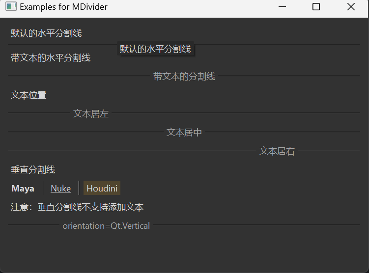

# MDivider 分割线

MDivider 是一个分割线组件，用于分隔不同的内容区域。它可以是水平的或垂直的，并且可以在分割线中添加文本。

## 导入

```python
from dayu_widgets.divider import MDivider
```

## 代码示例

### 基本使用

MDivider 可以创建一个简单的水平分割线。

```python
from dayu_widgets.divider import MDivider

# 创建一个简单的水平分割线
divider = MDivider()
```

### 带文本的分割线

MDivider 可以在分割线中添加文本，文本可以居左、居中或居右显示。

```python
from dayu_widgets.divider import MDivider

# 创建一个带文本的分割线（默认居中）
divider_with_text = MDivider("带文本的分割线")

# 创建一个文本居左的分割线
divider_left = MDivider.left("文本居左")

# 创建一个文本居中的分割线
divider_center = MDivider.center("文本居中")

# 创建一个文本居右的分割线
divider_right = MDivider.right("文本居右")
```

### 垂直分割线

MDivider 可以创建垂直分割线，用于分隔水平方向的内容。

```python
from dayu_widgets.divider import MDivider
from qtpy import QtCore

# 创建一个垂直分割线
divider_vertical = MDivider(orientation=QtCore.Qt.Vertical)

# 或者使用类方法
divider_vertical = MDivider.vertical()
```

### 完整示例



以下是一个完整的示例，展示了 MDivider 的各种用法：

```python
# Import third-party modules
from qtpy import QtWidgets

# Import local modules
from dayu_widgets.divider import MDivider
from dayu_widgets.field_mixin import MFieldMixin
from dayu_widgets.label import MLabel


class DividerExample(QtWidgets.QWidget, MFieldMixin):
    def __init__(self, parent=None):
        super(DividerExample, self).__init__(parent)
        self.setWindowTitle("Examples for MDivider")
        self._init_ui()

    def _init_ui(self):
        div1 = MDivider()
        div2 = MDivider("带文本的分割线")
        div3 = MDivider.left("文本居左")
        div4 = MDivider.center("文本居中")
        div5 = MDivider.right("文本居右")
        div6 = MDivider.vertical()
        div7 = MDivider.vertical()
        div8 = MDivider.left("orientation=Qt.Vertical")
        label1 = MLabel("Maya").strong()
        label2 = MLabel("Nuke").underline()
        label3 = MLabel("Houdini").mark()
        sub_lay = QtWidgets.QHBoxLayout()
        sub_lay.addWidget(label1)
        sub_lay.addWidget(div6)
        sub_lay.addWidget(label2)
        sub_lay.addWidget(div7)
        sub_lay.addWidget(label3)
        sub_lay.addStretch()

        main_lay = QtWidgets.QVBoxLayout()
        main_lay.addWidget(MLabel("默认的水平分割线"))
        main_lay.addWidget(div1)
        main_lay.addWidget(MLabel("带文本的水平分割线"))
        main_lay.addWidget(div2)
        main_lay.addWidget(MLabel("文本位置"))
        main_lay.addWidget(div3)
        main_lay.addWidget(div4)
        main_lay.addWidget(div5)
        main_lay.addWidget(MLabel("垂直分割线"))
        main_lay.addLayout(sub_lay)
        main_lay.addWidget(MLabel("注意：垂直分割线不支持添加文本"))
        main_lay.addWidget(div8)
        main_lay.addStretch()
        self.setLayout(main_lay)


if __name__ == "__main__":
    # Import local modules
    from dayu_widgets import dayu_theme
    from dayu_widgets.qt import application

    with application() as app:
        test = DividerExample()
        dayu_theme.apply(test)
        test.show()
```

## API

### 构造函数

```python
MDivider(text="", orientation=QtCore.Qt.Horizontal, alignment=QtCore.Qt.AlignCenter, parent=None)
```

| 参数 | 描述 | 类型 | 默认值 |
| --- | --- | --- | --- |
| `text` | 分割线中的文本 | `str` | `""` |
| `orientation` | 分割线的方向 | `QtCore.Qt.Orientation` | `QtCore.Qt.Horizontal` |
| `alignment` | 文本的对齐方式 | `QtCore.Qt.Alignment` | `QtCore.Qt.AlignCenter` |
| `parent` | 父部件 | `QWidget` | `None` |

### 方法

| 方法 | 描述 | 参数 | 返回值 |
| --- | --- | --- | --- |
| `set_dayu_text(value)` | 设置分割线中的文本 | `value`: 文本内容 | 无 |
| `get_dayu_text()` | 获取分割线中的文本 | 无 | `str` |

### 类方法

| 方法 | 描述 | 参数 | 返回值 |
| --- | --- | --- | --- |
| `left(text="")` | 创建一个文本居左的水平分割线 | `text`: 文本内容 | `MDivider` 实例 |
| `right(text="")` | 创建一个文本居右的水平分割线 | `text`: 文本内容 | `MDivider` 实例 |
| `center(text="")` | 创建一个文本居中的水平分割线 | `text`: 文本内容 | `MDivider` 实例 |
| `vertical()` | 创建一个垂直分割线 | 无 | `MDivider` 实例 |

### 属性

| 属性 | 描述 | 类型 | 默认值 |
| --- | --- | --- | --- |
| `dayu_text` | 分割线中的文本 | `str` | `""` |

## 常见问题

### 如何创建不同对齐方式的分割线？

可以使用 MDivider 的类方法创建不同对齐方式的分割线：

```python
from dayu_widgets.divider import MDivider

# 创建一个文本居左的分割线
divider_left = MDivider.left("文本居左")

# 创建一个文本居中的分割线
divider_center = MDivider.center("文本居中")

# 创建一个文本居右的分割线
divider_right = MDivider.right("文本居右")
```

或者使用构造函数并指定 `alignment` 参数：

```python
from dayu_widgets.divider import MDivider
from qtpy import QtCore

# 创建一个文本居左的分割线
divider_left = MDivider("文本居左", alignment=QtCore.Qt.AlignLeft)

# 创建一个文本居中的分割线
divider_center = MDivider("文本居中", alignment=QtCore.Qt.AlignCenter)

# 创建一个文本居右的分割线
divider_right = MDivider("文本居右", alignment=QtCore.Qt.AlignRight)
```

### 如何创建垂直分割线？

可以使用 MDivider 的 `vertical` 类方法创建垂直分割线：

```python
from dayu_widgets.divider import MDivider

# 创建一个垂直分割线
divider_vertical = MDivider.vertical()
```

或者使用构造函数并指定 `orientation` 参数：

```python
from dayu_widgets.divider import MDivider
from qtpy import QtCore

# 创建一个垂直分割线
divider_vertical = MDivider(orientation=QtCore.Qt.Vertical)
```

### 垂直分割线可以添加文本吗？

不可以。垂直分割线不支持添加文本，即使设置了文本，也不会显示。

```python
from dayu_widgets.divider import MDivider

# 创建一个垂直分割线
divider_vertical = MDivider.vertical()

# 尝试设置文本（不会显示）
divider_vertical.set_dayu_text("这段文本不会显示")
```

### 如何动态更改分割线的文本？

可以使用 `set_dayu_text` 方法动态更改分割线的文本：

```python
from dayu_widgets.divider import MDivider

# 创建一个分割线
divider = MDivider("初始文本")

# 更改文本
divider.set_dayu_text("新文本")
```
