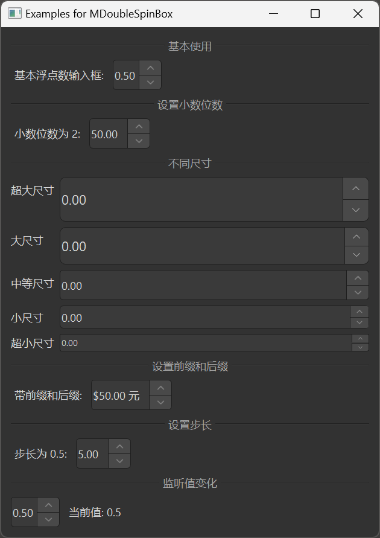

# MDoubleSpinBox 浮点数输入框

MDoubleSpinBox 是一个浮点数输入框组件，用于输入小数值。它基于 Qt 的 QDoubleSpinBox 类，提供了更美观的样式和更好的交互体验。

## 导入

```python
from dayu_widgets.spin_box import MDoubleSpinBox
```

## 代码示例

### 基本使用

MDoubleSpinBox 可以创建一个简单的浮点数输入框，用户可以通过点击上下按钮或直接输入来设置值。

```python
from dayu_widgets.spin_box import MDoubleSpinBox

# 创建一个浮点数输入框
double_spin_box = MDoubleSpinBox()
double_spin_box.setRange(0.0, 1.0)
double_spin_box.setValue(0.5)
double_spin_box.setSingleStep(0.1)
```

### 设置小数位数

MDoubleSpinBox 可以通过 `setDecimals` 方法设置小数位数。

```python
from dayu_widgets.spin_box import MDoubleSpinBox

# 创建一个浮点数输入框
double_spin_box = MDoubleSpinBox()
double_spin_box.setRange(0.0, 100.0)
double_spin_box.setValue(50.0)

# 设置小数位数为 2
double_spin_box.setDecimals(2)
```

### 不同尺寸

MDoubleSpinBox 支持不同的尺寸，可以通过方法链式调用设置。

```python
from dayu_widgets.spin_box import MDoubleSpinBox

# 创建超大尺寸的浮点数输入框
double_spin_box_huge = MDoubleSpinBox().huge()

# 创建大尺寸的浮点数输入框
double_spin_box_large = MDoubleSpinBox().large()

# 创建中等尺寸的浮点数输入框（默认）
double_spin_box_medium = MDoubleSpinBox().medium()

# 创建小尺寸的浮点数输入框
double_spin_box_small = MDoubleSpinBox().small()

# 创建超小尺寸的浮点数输入框
double_spin_box_tiny = MDoubleSpinBox().tiny()
```

### 设置前缀和后缀

MDoubleSpinBox 可以通过 `setPrefix` 和 `setSuffix` 方法设置前缀和后缀。

```python
from dayu_widgets.spin_box import MDoubleSpinBox

# 创建一个浮点数输入框
double_spin_box = MDoubleSpinBox()
double_spin_box.setRange(0.0, 100.0)
double_spin_box.setValue(50.0)

# 设置前缀和后缀
double_spin_box.setPrefix("$")
double_spin_box.setSuffix(" 元")
```

### 设置步长

MDoubleSpinBox 可以通过 `setSingleStep` 方法设置步长。

```python
from dayu_widgets.spin_box import MDoubleSpinBox

# 创建一个浮点数输入框
double_spin_box = MDoubleSpinBox()
double_spin_box.setRange(0.0, 1.0)
double_spin_box.setValue(0.5)

# 设置步长为 0.1
double_spin_box.setSingleStep(0.1)
```

### 监听值变化

MDoubleSpinBox 可以通过连接 `valueChanged` 信号来监听值变化。

```python
from dayu_widgets.spin_box import MDoubleSpinBox

# 创建一个浮点数输入框
double_spin_box = MDoubleSpinBox()
double_spin_box.setRange(0.0, 1.0)
double_spin_box.setValue(0.5)

# 监听值变化
double_spin_box.valueChanged.connect(lambda value: print("当前值:", value))
```

### 完整示例



以下是一个完整的示例，展示了 MDoubleSpinBox 的各种用法：

```python
# Import third-party modules
from qtpy import QtWidgets

# Import local modules
from dayu_widgets.divider import MDivider
from dayu_widgets.spin_box import MDoubleSpinBox
from dayu_widgets.label import MLabel


class DoubleSpinBoxExample(QtWidgets.QWidget):
    def __init__(self, parent=None):
        super(DoubleSpinBoxExample, self).__init__(parent)
        self.setWindowTitle("Examples for MDoubleSpinBox")
        self._init_ui()

    def _init_ui(self):
        main_lay = QtWidgets.QVBoxLayout()

        # 基本使用
        main_lay.addWidget(MDivider("基本使用"))
        basic_lay = QtWidgets.QHBoxLayout()
        basic_spin_box = MDoubleSpinBox()
        basic_spin_box.setRange(0.0, 1.0)
        basic_spin_box.setValue(0.5)
        basic_spin_box.setSingleStep(0.1)
        basic_lay.addWidget(MLabel("基本浮点数输入框:"))
        basic_lay.addWidget(basic_spin_box)
        basic_lay.addStretch()
        main_lay.addLayout(basic_lay)

        # 设置小数位数
        main_lay.addWidget(MDivider("设置小数位数"))
        decimals_lay = QtWidgets.QHBoxLayout()
        decimals_spin_box = MDoubleSpinBox()
        decimals_spin_box.setRange(0.0, 100.0)
        decimals_spin_box.setValue(50.0)
        decimals_spin_box.setDecimals(2)
        decimals_lay.addWidget(MLabel("小数位数为 2:"))
        decimals_lay.addWidget(decimals_spin_box)
        decimals_lay.addStretch()
        main_lay.addLayout(decimals_lay)

        # 不同尺寸
        main_lay.addWidget(MDivider("不同尺寸"))
        size_lay = QtWidgets.QFormLayout()
        size_lay.addRow("超大尺寸", MDoubleSpinBox().huge())
        size_lay.addRow("大尺寸", MDoubleSpinBox().large())
        size_lay.addRow("中等尺寸", MDoubleSpinBox().medium())
        size_lay.addRow("小尺寸", MDoubleSpinBox().small())
        size_lay.addRow("超小尺寸", MDoubleSpinBox().tiny())
        main_lay.addLayout(size_lay)

        # 设置前缀和后缀
        main_lay.addWidget(MDivider("设置前缀和后缀"))
        prefix_suffix_lay = QtWidgets.QHBoxLayout()
        prefix_suffix_spin_box = MDoubleSpinBox()
        prefix_suffix_spin_box.setRange(0.0, 100.0)
        prefix_suffix_spin_box.setValue(50.0)
        prefix_suffix_spin_box.setPrefix("$")
        prefix_suffix_spin_box.setSuffix(" 元")
        prefix_suffix_lay.addWidget(MLabel("带前缀和后缀:"))
        prefix_suffix_lay.addWidget(prefix_suffix_spin_box)
        prefix_suffix_lay.addStretch()
        main_lay.addLayout(prefix_suffix_lay)

        # 设置步长
        main_lay.addWidget(MDivider("设置步长"))
        step_lay = QtWidgets.QHBoxLayout()
        step_spin_box = MDoubleSpinBox()
        step_spin_box.setRange(0.0, 10.0)
        step_spin_box.setValue(5.0)
        step_spin_box.setSingleStep(0.5)
        step_lay.addWidget(MLabel("步长为 0.5:"))
        step_lay.addWidget(step_spin_box)
        step_lay.addStretch()
        main_lay.addLayout(step_lay)

        # 监听值变化
        main_lay.addWidget(MDivider("监听值变化"))
        value_changed_lay = QtWidgets.QHBoxLayout()
        value_changed_spin_box = MDoubleSpinBox()
        value_changed_spin_box.setRange(0.0, 1.0)
        value_changed_spin_box.setValue(0.5)
        value_changed_label = MLabel("当前值: 0.5")
        value_changed_spin_box.valueChanged.connect(
            lambda value: value_changed_label.setText("当前值: {}".format(value))
        )
        value_changed_lay.addWidget(value_changed_spin_box)
        value_changed_lay.addWidget(value_changed_label)
        value_changed_lay.addStretch()
        main_lay.addLayout(value_changed_lay)

        main_lay.addStretch()
        self.setLayout(main_lay)


if __name__ == "__main__":
    # Import local modules
    from dayu_widgets import dayu_theme
    from dayu_widgets.qt import application

    with application() as app:
        test = DoubleSpinBoxExample()
        dayu_theme.apply(test)
        test.show()
```

## API

### 构造函数

```python
MDoubleSpinBox(parent=None)
```

| 参数 | 描述 | 类型 | 默认值 |
| --- | --- | --- | --- |
| `parent` | 父部件 | `QWidget` | `None` |

### 方法

| 方法 | 描述 | 参数 | 返回值 |
| --- | --- | --- | --- |
| `set_dayu_size(value)` | 设置输入框的尺寸 | `value`: 尺寸值 | 无 |
| `get_dayu_size()` | 获取输入框的尺寸 | 无 | `int` |
| `huge()` | 设置为超大尺寸 | 无 | `self` |
| `large()` | 设置为大尺寸 | 无 | `self` |
| `medium()` | 设置为中等尺寸 | 无 | `self` |
| `small()` | 设置为小尺寸 | 无 | `self` |
| `tiny()` | 设置为超小尺寸 | 无 | `self` |

### 继承的方法

MDoubleSpinBox 继承自 QDoubleSpinBox，因此可以使用 QDoubleSpinBox 的所有方法，例如：

- `setRange(min, max)`: 设置数值范围
- `setValue(value)`: 设置当前值
- `value()`: 获取当前值
- `setDecimals(precision)`: 设置小数位数
- `decimals()`: 获取小数位数
- `setPrefix(prefix)`: 设置前缀
- `setSuffix(suffix)`: 设置后缀
- `setSingleStep(step)`: 设置单步值
- 更多方法请参考 Qt 文档

### 信号

MDoubleSpinBox 继承自 QDoubleSpinBox，因此可以使用 QDoubleSpinBox 的所有信号，例如：

- `valueChanged(double)`: 当值变化时触发
- 更多信号请参考 Qt 文档

## 常见问题

### 如何限制小数位数？

可以通过 `setDecimals` 方法设置小数位数：

```python
from dayu_widgets.spin_box import MDoubleSpinBox

# 创建浮点数输入框
double_spin_box = MDoubleSpinBox()
double_spin_box.setRange(0.0, 100.0)
double_spin_box.setValue(50.0)

# 设置小数位数为 2
double_spin_box.setDecimals(2)
```

### 如何设置步长？

可以通过 `setSingleStep` 方法设置步长：

```python
from dayu_widgets.spin_box import MDoubleSpinBox

# 创建浮点数输入框
double_spin_box = MDoubleSpinBox()
double_spin_box.setRange(0.0, 1.0)
double_spin_box.setValue(0.5)

# 设置步长为 0.1
double_spin_box.setSingleStep(0.1)
```

### 如何设置前缀和后缀？

可以通过 `setPrefix` 和 `setSuffix` 方法设置前缀和后缀：

```python
from dayu_widgets.spin_box import MDoubleSpinBox

# 创建浮点数输入框
double_spin_box = MDoubleSpinBox()
double_spin_box.setRange(0.0, 100.0)
double_spin_box.setValue(50.0)

# 设置前缀和后缀
double_spin_box.setPrefix("$")
double_spin_box.setSuffix(" 元")
```

### 如何禁用输入框？

可以通过 `setEnabled` 方法禁用输入框：

```python
from dayu_widgets.spin_box import MDoubleSpinBox

# 创建浮点数输入框
double_spin_box = MDoubleSpinBox()
double_spin_box.setRange(0.0, 1.0)
double_spin_box.setValue(0.5)

# 禁用输入框
double_spin_box.setEnabled(False)
```
