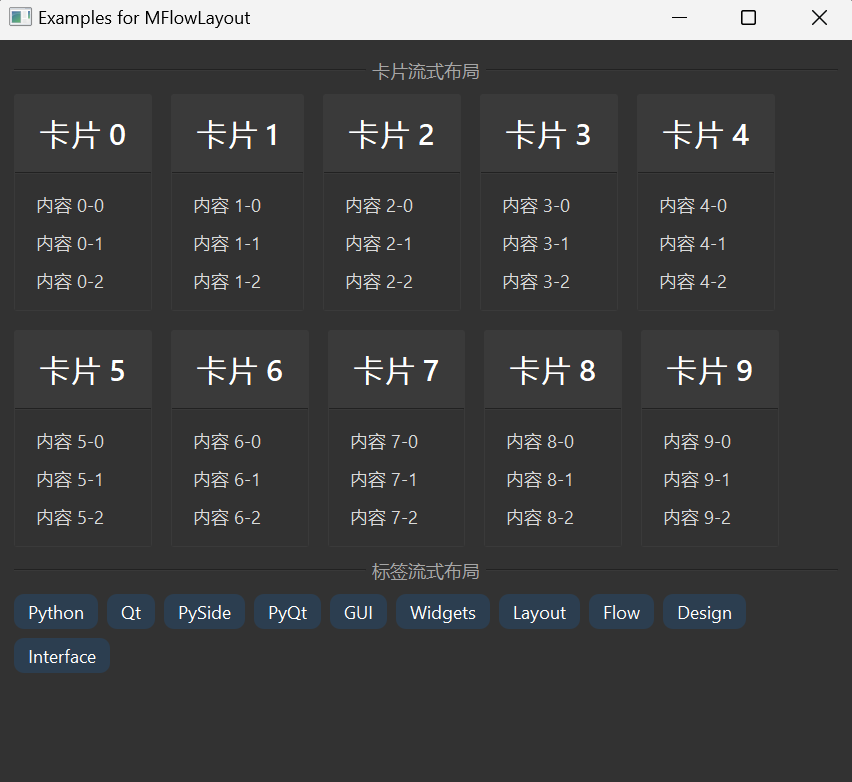

# MFlowLayout 浮动布局

MFlowLayout 是一个流式布局组件，它可以自动将子部件按照从左到右、从上到下的顺序排列，当一行放不下时会自动换行。这种布局非常适合需要自适应宽度的界面，如标签云、卡片列表等。

## 导入

```python
from dayu_widgets.flow_layout import MFlowLayout
```

## 代码示例

### 基本使用

MFlowLayout 可以像普通布局一样使用，只需要将子部件添加到布局中即可。

```python
from dayu_widgets.flow_layout import MFlowLayout
from dayu_widgets.label import MLabel
from qtpy import QtWidgets

# 创建一个流式布局
flow_layout = MFlowLayout()

# 添加多个标签
for i in range(10):
    flow_layout.addWidget(MLabel("标签 {}".format(i)))

# 创建一个容器并设置布局
container = QtWidgets.QWidget()
container.setLayout(flow_layout)
```

### 设置间距

MFlowLayout 支持设置部件之间的间距。

```python
from dayu_widgets.flow_layout import MFlowLayout
from dayu_widgets.push_button import MPushButton

# 创建一个流式布局并设置间距为 20 像素
flow_layout = MFlowLayout()
flow_layout.setSpacing(20)

# 添加多个按钮
for i in range(10):
    flow_layout.addWidget(MPushButton("按钮 {}".format(i)))
```

### 插入部件

MFlowLayout 支持在指定位置插入部件。

```python
from dayu_widgets.flow_layout import MFlowLayout
from dayu_widgets.push_button import MPushButton

# 创建一个流式布局
flow_layout = MFlowLayout()

# 添加多个按钮
for i in range(5):
    flow_layout.addWidget(MPushButton("按钮 {}".format(i)))

# 在索引为 2 的位置插入一个新按钮
flow_layout.insertWidget(2, MPushButton("插入的按钮"))
```

### 清空布局

MFlowLayout 支持清空布局中的所有部件。

```python
from dayu_widgets.flow_layout import MFlowLayout
from dayu_widgets.push_button import MPushButton

# 创建一个流式布局
flow_layout = MFlowLayout()

# 添加多个按钮
for i in range(5):
    flow_layout.addWidget(MPushButton("按钮 {}".format(i)))

# 清空布局
flow_layout.clear()
```

### 完整示例



MFlowLayout 非常适合用于卡片布局，以下是一个使用 MFlowLayout 和 MCard 的示例：

```python
# Import third-party modules
from qtpy import QtWidgets

# Import local modules
from dayu_widgets import dayu_theme
from dayu_widgets.card import MCard
from dayu_widgets.divider import MDivider
from dayu_widgets.flow_layout import MFlowLayout
from dayu_widgets.label import MLabel
from dayu_widgets.qt import MPixmap


class FlowLayoutExample(QtWidgets.QWidget):
    def __init__(self, parent=None):
        super(FlowLayoutExample, self).__init__(parent)
        self.setWindowTitle("Examples for MFlowLayout")
        self._init_ui()

    def _init_ui(self):
        # 创建一个流式布局用于卡片
        card_layout = MFlowLayout()
        card_layout.setSpacing(20)

        # 添加多个卡片
        for i in range(10):
            card = MCard(title="卡片 {}".format(i))
            content_widget = QtWidgets.QWidget()
            content_layout = QtWidgets.QVBoxLayout()
            content_layout.setContentsMargins(15, 15, 15, 15)
            content_widget.setLayout(content_layout)

            # 添加卡片内容
            for j in range(3):
                content_layout.addWidget(MLabel("内容 {}-{}".format(i, j)))

            card.set_widget(content_widget)
            card_layout.addWidget(card)

        # 创建一个流式布局用于标签
        label_layout = MFlowLayout()
        label_layout.setSpacing(10)

        # 添加多个标签
        for text in ["Python", "Qt", "PySide", "PyQt", "GUI", "Widgets", "Layout", "Flow", "Design", "Interface"]:
            label = MLabel(text)
            label.setStyleSheet("background-color: #2c3e50; color: white; padding: 5px 10px; border-radius: 10px;")
            label_layout.addWidget(label)

        main_layout = QtWidgets.QVBoxLayout()
        main_layout.addWidget(MDivider("卡片流式布局"))
        main_layout.addLayout(card_layout)
        main_layout.addWidget(MDivider("标签流式布局"))
        main_layout.addLayout(label_layout)
        main_layout.addStretch()
        self.setLayout(main_layout)


if __name__ == "__main__":
    # Import local modules
    from dayu_widgets import dayu_theme
    from dayu_widgets.qt import application

    with application() as app:
        test = FlowLayoutExample()
        dayu_theme.apply(test)
        test.show()
```

## API

### 构造函数

```python
MFlowLayout(parent=None, margin=0, spacing=-1)
```

| 参数 | 描述 | 类型 | 默认值 |
| --- | --- | --- | --- |
| `parent` | 父部件 | `QWidget` | `None` |
| `margin` | 布局边距 | `int` | `0` |
| `spacing` | 部件之间的间距 | `int` | `-1` |

### 方法

| 方法 | 描述 | 参数 | 返回值 |
| --- | --- | --- | --- |
| `addWidget(widget)` | 添加部件到布局末尾 | `widget`: 要添加的部件 | 无 |
| `insertWidget(index, widget)` | 在指定位置插入部件 | `index`: 插入位置的索引<br>`widget`: 要插入的部件 | 无 |
| `addItem(item)` | 添加布局项到布局末尾 | `item`: 要添加的布局项 | 无 |
| `count()` | 获取布局中的部件数量 | 无 | `int` |
| `itemAt(index)` | 获取指定索引的布局项 | `index`: 布局项的索引 | `QLayoutItem` |
| `takeAt(index)` | 移除并返回指定索引的部件 | `index`: 部件的索引 | `QWidget` |
| `clear()` | 清空布局中的所有部件 | 无 | 无 |
| `setSpacing(spacing)` | 设置部件之间的间距 | `spacing`: 间距值 | 无 |
| `spacing()` | 获取部件之间的间距 | 无 | `int` |

## 常见问题

### 如何让 MFlowLayout 中的部件等宽？

MFlowLayout 中的部件默认使用其 sizeHint() 来确定大小。如果你想让部件等宽，可以为每个部件设置固定宽度：

```python
from dayu_widgets.flow_layout import MFlowLayout
from dayu_widgets.push_button import MPushButton

flow_layout = MFlowLayout()

for i in range(10):
    button = MPushButton("按钮 {}".format(i))
    button.setFixedWidth(100)  # 设置固定宽度
    flow_layout.addWidget(button)
```

### MFlowLayout 与 QHBoxLayout 和 QVBoxLayout 有什么区别？

- QHBoxLayout：将部件水平排列，不会自动换行
- QVBoxLayout：将部件垂直排列，不会自动换行
- MFlowLayout：将部件水平排列，当一行放不下时会自动换行

### 如何控制 MFlowLayout 的对齐方式？

MFlowLayout 默认是左对齐的，目前不支持直接设置对齐方式。如果需要其他对齐方式，可以将 MFlowLayout 嵌套在其他布局中，并使用 addStretch() 来实现：

```python
from dayu_widgets.flow_layout import MFlowLayout
from dayu_widgets.push_button import MPushButton
from qtpy import QtWidgets

# 创建一个水平布局
h_layout = QtWidgets.QHBoxLayout()

# 创建一个流式布局
flow_layout = MFlowLayout()
for i in range(5):
    flow_layout.addWidget(MPushButton("按钮 {}".format(i)))

# 居中对齐
h_layout.addStretch()
h_layout.addLayout(flow_layout)
h_layout.addStretch()

# 右对齐
# h_layout.addStretch()
# h_layout.addLayout(flow_layout)
```

### 如何在 MFlowLayout 中添加间隔？

可以使用透明的 QWidget 作为间隔：

```python
from dayu_widgets.flow_layout import MFlowLayout
from dayu_widgets.push_button import MPushButton
from qtpy import QtWidgets

flow_layout = MFlowLayout()

for i in range(5):
    flow_layout.addWidget(MPushButton("按钮 {}".format(i)))

    # 添加间隔
    spacer = QtWidgets.QWidget()
    spacer.setFixedSize(10, 10)  # 设置间隔大小
    spacer.setStyleSheet("background-color: transparent;")  # 设置透明背景
    flow_layout.addWidget(spacer)
```
