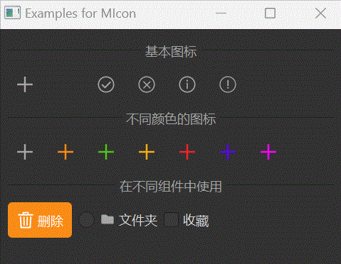

# MIcon 图标

MIcon 是一个用于显示图标的组件，它基于 Qt 的 QIcon 类，提供了更便捷的图标加载和颜色管理功能。

## 导入

```python
from dayu_widgets.qt import MIcon
```

## 代码示例

### 基本使用

MIcon 可以加载 SVG 或 PNG 格式的图标，并支持自定义颜色。

```python
from dayu_widgets.qt import MIcon
from qtpy import QtWidgets

# 创建一个图标
icon = MIcon("add_line.svg")

# 创建一个带有自定义颜色的图标
colored_icon = MIcon("add_line.svg", "#1890ff")

# 在按钮中使用图标
button = QtWidgets.QPushButton()
button.setIcon(icon)
```

### 在组件中使用

MIcon 可以与 dayu_widgets 中的其他组件一起使用，如 MPushButton、MToolButton、MRadioButton 等。

```python
from dayu_widgets.qt import MIcon
from dayu_widgets.push_button import MPushButton
from dayu_widgets.tool_button import MToolButton
from dayu_widgets.radio_button import MRadioButton

# 在 MPushButton 中使用
button = MPushButton(text="添加", icon=MIcon("add_line.svg", "#fff"))

# 在 MToolButton 中使用
tool_button = MToolButton().svg("user_line.svg")

# 在 MRadioButton 中使用
radio_button = MRadioButton("文件夹")
radio_button.setIcon(MIcon("folder_fill.svg"))
```

### 不同颜色的图标

MIcon 支持自定义图标颜色，只需在创建时传入颜色值即可。

```python
from dayu_widgets.qt import MIcon
from dayu_widgets import dayu_theme
from qtool_widgets import MPushButton

# 使用主题颜色
primary_icon = MIcon("check_line.svg", dayu_theme.primary_color)
success_icon = MIcon("check_circle_line.svg", dayu_theme.success_color)
warning_icon = MIcon("warning_fill.svg", dayu_theme.warning_color)
error_icon = MIcon("close_circle_fill.svg", dayu_theme.error_color)

# 使用自定义颜色
custom_icon = MIcon("star_fill.svg", "#ff5500")

# 在按钮中使用
primary_button = MPushButton(icon=primary_icon, text="主要按钮").primary()
success_button = MPushButton(icon=success_icon, text="成功按钮").success()
warning_button = MPushButton(icon=warning_icon, text="警告按钮").warning()
error_button = MPushButton(icon=error_icon, text="错误按钮").danger()
```

### 完整示例



以下是一个完整的示例，展示了 MIcon 的各种用法：

```python
# Import third-party modules
from qtpy import QtWidgets
from qtpy import QtCore

# Import local modules
from dayu_widgets.qt import MIcon
from dayu_widgets import dayu_theme
from dayu_widgets.divider import MDivider
from dayu_widgets.field_mixin import MFieldMixin
from dayu_widgets.push_button import MPushButton
from dayu_widgets.tool_button import MToolButton
from dayu_widgets.radio_button import MRadioButton
from dayu_widgets.check_box import MCheckBox


class MIconExample(QtWidgets.QWidget, MFieldMixin):
    def __init__(self, parent=None):
        super(MIconExample, self).__init__(parent)
        self.setWindowTitle("Examples for MIcon")
        self._init_ui()

    def _init_ui(self):
        # 基本图标示例
        basic_lay = QtWidgets.QHBoxLayout()
        basic_lay.addWidget(MToolButton().svg("add_line.svg").icon_only())
        basic_lay.addWidget(MToolButton().svg("delete_line.svg").icon_only())
        basic_lay.addWidget(MToolButton().svg("success_line.svg").icon_only())
        basic_lay.addWidget(MToolButton().svg("error_line.svg").icon_only())
        basic_lay.addWidget(MToolButton().svg("info_line.svg").icon_only())
        basic_lay.addWidget(MToolButton().svg("warning_line.svg").icon_only())
        basic_lay.addStretch()

        # 不同颜色的图标
        color_lay = QtWidgets.QHBoxLayout()

        # 默认颜色
        default_button = MToolButton().icon_only()
        default_button.setIcon(MIcon("add_line.svg"))
        color_lay.addWidget(default_button)

        # 使用主题色
        primary_button = MToolButton().icon_only()
        primary_button.setIcon(MIcon("add_line.svg", dayu_theme.primary_color))
        color_lay.addWidget(primary_button)

        # 使用成功色
        success_button = MToolButton().icon_only()
        success_button.setIcon(MIcon("add_line.svg", dayu_theme.success_color))
        color_lay.addWidget(success_button)

        # 使用警告色
        warning_button = MToolButton().icon_only()
        warning_button.setIcon(MIcon("add_line.svg", dayu_theme.warning_color))
        color_lay.addWidget(warning_button)

        # 使用错误色
        error_button = MToolButton().icon_only()
        error_button.setIcon(MIcon("add_line.svg", dayu_theme.error_color))
        color_lay.addWidget(error_button)

        # 使用自定义颜色
        custom_button1 = MToolButton().icon_only()
        custom_button1.setIcon(MIcon("add_line.svg", "#5d00ff"))
        color_lay.addWidget(custom_button1)

        custom_button2 = MToolButton().icon_only()
        custom_button2.setIcon(MIcon("add_line.svg", "#ff00ff"))
        color_lay.addWidget(custom_button2)

        color_lay.addStretch()

        # 在不同组件中使用
        components_lay = QtWidgets.QHBoxLayout()
        components_lay.addWidget(MPushButton(icon=MIcon("trash_line.svg", "#fff"), text="删除").primary())

        radio_button = MRadioButton("文件夹")
        radio_button.setIcon(MIcon("folder_fill.svg"))
        components_lay.addWidget(radio_button)

        check_box = MCheckBox("收藏")
        check_box.setIcon(MIcon("star_fill.svg"))
        components_lay.addWidget(check_box)

        components_lay.addStretch()

        main_lay = QtWidgets.QVBoxLayout()
        main_lay.addWidget(MDivider("基本图标"))
        main_lay.addLayout(basic_lay)
        main_lay.addWidget(MDivider("不同颜色的图标"))
        main_lay.addLayout(color_lay)
        main_lay.addWidget(MDivider("在不同组件中使用"))
        main_lay.addLayout(components_lay)
        main_lay.addStretch()
        self.setLayout(main_lay)


if __name__ == "__main__":
    # Import local modules
    from dayu_widgets import dayu_theme
    from dayu_widgets.qt import application

    with application() as app:
        test = MIconExample()
        dayu_theme.apply(test)
        test.show()
```

## API

### 构造函数

```python
MIcon(path, color=None)
```

| 参数 | 描述 | 类型 | 默认值 |
| --- | --- | --- | --- |
| `path` | 图标路径，相对于静态资源目录 | `str` | - |
| `color` | 图标颜色，可以是十六进制颜色代码或主题颜色变量 | `str` | `None` |

### 静态资源路径

MIcon 会在以下路径中查找图标文件：

1. 默认路径：`dayu_widgets/static/`
2. 自定义路径：通过 `dayu_widgets.CUSTOM_STATIC_FOLDERS` 设置

## 常见问题

### 如何使用自定义图标？

MIcon 默认会在 `dayu_widgets/static/` 目录下查找图标文件。如果你想使用自定义图标，可以通过以下方式：

1. 将图标文件放在 `dayu_widgets/static/` 目录下
2. 或者设置自定义路径：

```python
import dayu_widgets
dayu_widgets.CUSTOM_STATIC_FOLDERS.append("path/to/your/icons")
```

### 如何更改图标颜色？

MIcon 支持在创建时指定图标颜色：

```python
# 使用十六进制颜色代码
icon1 = MIcon("star_fill.svg", "#ff5500")

# 使用主题颜色
icon2 = MIcon("star_fill.svg", dayu_theme.primary_color)
```

### 支持哪些图标格式？

MIcon 支持 SVG 和 PNG 格式的图标：

- SVG 格式：支持通过 `color` 参数更改颜色
- PNG 格式：不支持更改颜色

### 如何在组件中使用图标？

大多数 dayu_widgets 组件都支持设置图标：

```python
# 在 MPushButton 中使用
button = MPushButton(icon=MIcon("add_line.svg"))

# 在 MToolButton 中使用
tool_button = MToolButton().svg("user_line.svg")

# 在 MRadioButton 中使用
radio_button = MRadioButton("选项")
radio_button.setIcon(MIcon("check_circle_fill.svg"))
```
