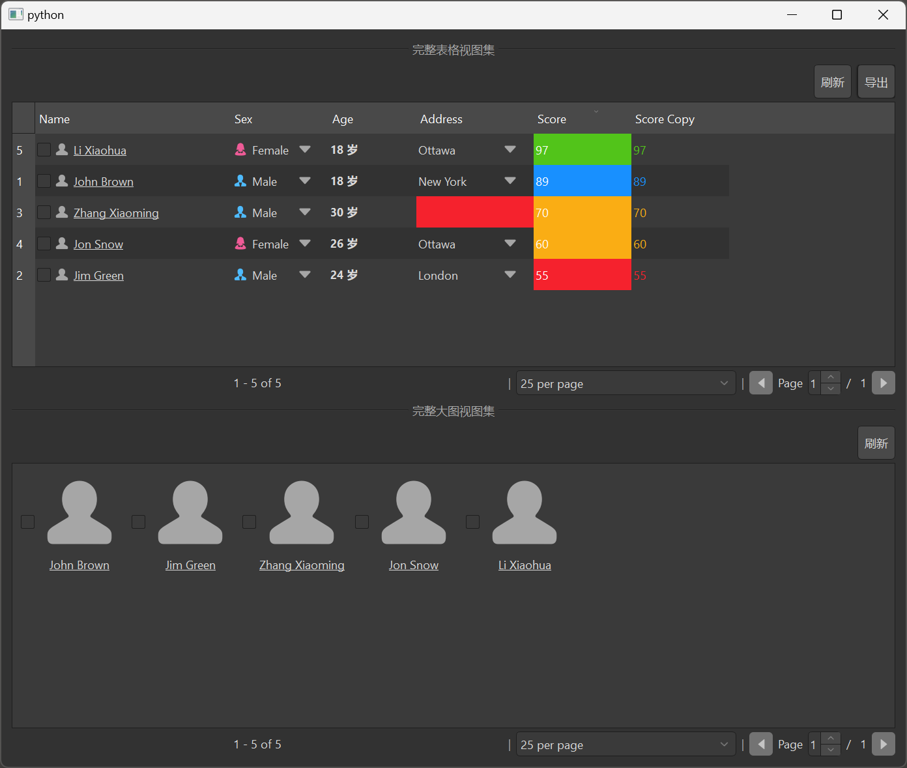

# MItemViewFullSet 完整视图集

MItemViewFullSet 是 MItemViewSet 的扩展版本，提供了更多的功能和更完整的界面。它不仅包含了 MItemViewSet 的所有功能，还添加了工具栏、分页控件等额外功能，适用于需要更复杂界面的场景。

## 导入

```python
from dayu_widgets.item_view_full_set import MItemViewFullSet
```

## 代码示例

### 基本使用

MItemViewFullSet 可以通过 `table_view` 和 `big_view` 参数指定要使用的视图类型。

```python
from dayu_widgets.item_view_full_set import MItemViewFullSet

# 创建完整表格视图集
table_view_set = MItemViewFullSet(table_view=True, big_view=False)

# 设置表头
table_view_set.set_header_list([
    {"key": "name", "label": "姓名"},
    {"key": "age", "label": "年龄"},
    {"key": "city", "label": "城市"}
])

# 设置数据
table_view_set.setup_data([
    {"name": "张三", "age": 18, "city": "北京"},
    {"name": "李四", "age": 25, "city": "上海"},
    {"name": "王五", "age": 30, "city": "广州"}
])
```

### 不同视图类型

MItemViewFullSet 支持两种视图类型：表格视图和大图视图，可以通过 `table_view` 和 `big_view` 参数进行设置。

```python
from dayu_widgets.item_view_full_set import MItemViewFullSet

# 创建完整表格视图集
table_view_set = MItemViewFullSet(table_view=True, big_view=False)

# 创建完整大图视图集
big_view_set = MItemViewFullSet(table_view=False, big_view=True)

# 同时显示表格视图和大图视图
both_view_set = MItemViewFullSet(table_view=True, big_view=True)
```

### 启用搜索功能

MItemViewFullSet 默认启用了搜索功能，无需额外调用 `searchable` 方法。

```python
from dayu_widgets.item_view_full_set import MItemViewFullSet

# 创建完整表格视图集
table_view_set = MItemViewFullSet(table_view=True, big_view=False)

# 搜索功能已默认启用
```

### 添加工具栏按钮

MItemViewFullSet 可以通过 `tool_bar_append_widget` 方法添加工具栏按钮。

```python
from dayu_widgets.item_view_full_set import MItemViewFullSet
from dayu_widgets.push_button import MPushButton

# 创建完整表格视图集
table_view_set = MItemViewFullSet(table_view=True, big_view=False)

# 添加刷新按钮
refresh_button = MPushButton("刷新")
refresh_button.clicked.connect(lambda: print("刷新数据"))
table_view_set.tool_bar_append_widget(refresh_button)

# 添加导出按钮
export_button = MPushButton("导出")
export_button.clicked.connect(lambda: print("导出数据"))
table_view_set.tool_bar_append_widget(export_button)
```

### 设置分页

MItemViewFullSet 支持分页功能，可以通过 `set_record_count` 方法设置记录总数。

```python
from dayu_widgets.item_view_full_set import MItemViewFullSet

# 创建完整表格视图集
table_view_set = MItemViewFullSet(table_view=True, big_view=False)

# 设置分页信息
table_view_set.set_record_count(200)

# 监听页码变化
table_view_set.page_set.sig_page_changed.connect(lambda page: print("切换到页码:", page))
```

### 完整示例



以下是一个完整的示例，展示了 MItemViewFullSet 的各种用法：

```python
# Import third-party modules
from qtpy import QtWidgets

# Import local modules
from dayu_widgets import utils
from dayu_widgets.divider import MDivider
from dayu_widgets.field_mixin import MFieldMixin
from dayu_widgets.item_view_full_set import MItemViewFullSet
from dayu_widgets.push_button import MPushButton
import examples._mock_data as mock


@utils.add_settings("DaYu", "DaYuExample", event_name="hideEvent")
class ItemViewFullSetExample(QtWidgets.QWidget, MFieldMixin):
    def __init__(self, parent=None):
        super(ItemViewFullSetExample, self).__init__(parent)
        self._init_ui()

    def _init_ui(self):
        # 创建完整表格视图集
        item_view_set_table = MItemViewFullSet(table_view=True, big_view=False)
        item_view_set_table.set_header_list(mock.header_list)

        # 添加工具栏按钮
        refresh_button = MPushButton("刷新")
        refresh_button.clicked.connect(self.slot_refresh_data)
        item_view_set_table.tool_bar_append_widget(refresh_button)

        export_button = MPushButton("导出")
        export_button.clicked.connect(lambda: print("导出数据"))
        item_view_set_table.tool_bar_append_widget(export_button)

        # 设置分页信息
        item_view_set_table.set_record_count(100)
        item_view_set_table.page_set.sig_page_changed.connect(lambda page: print("切换到页码:", page))

        # 设置数据
        item_view_set_table.setup_data(mock.data_list)

        # 创建完整大图视图集
        item_view_set_big = MItemViewFullSet(table_view=False, big_view=True)
        item_view_set_big.set_header_list(mock.header_list)

        # 添加工具栏按钮
        refresh_button2 = MPushButton("刷新")
        refresh_button2.clicked.connect(self.slot_refresh_data)
        item_view_set_big.tool_bar_append_widget(refresh_button2)

        # 设置数据
        item_view_set_big.setup_data(mock.data_list)

        # 创建布局
        main_lay = QtWidgets.QVBoxLayout()
        main_lay.addWidget(MDivider("完整表格视图集"))
        main_lay.addWidget(item_view_set_table)
        main_lay.addWidget(MDivider("完整大图视图集"))
        main_lay.addWidget(item_view_set_big)
        self.setLayout(main_lay)

    def slot_refresh_data(self):
        print("刷新数据")
        # 这里可以添加刷新数据的逻辑


if __name__ == "__main__":
    # Import local modules
    from dayu_widgets import dayu_theme
    from dayu_widgets.qt import application

    with application() as app:
        test = ItemViewFullSetExample()
        dayu_theme.apply(test)
        test.show()
```

## API

### 构造函数

```python
MItemViewFullSet(table_view=True, big_view=False, parent=None)
```

| 参数 | 描述 | 类型 | 默认值 |
| --- | --- | --- | --- |
| `table_view` | 是否显示表格视图 | `bool` | `True` |
| `big_view` | 是否显示大图视图 | `bool` | `False` |
| `parent` | 父部件 | `QWidget` | `None` |

### 方法

| 方法 | 描述 | 参数 | 返回值 |
| --- | --- | --- | --- |
| `set_header_list(header_list)` | 设置表头列表 | `header_list`: 表头列表 | 无 |
| `setup_data(data_list)` | 设置数据列表 | `data_list`: 数据列表 | 无 |
| `get_data()` | 获取数据列表 | 无 | `list`: 数据列表 |
| `tool_bar_append_widget(widget)` | 在工具栏末尾添加部件 | `widget`: 要添加的部件 | 无 |
| `tool_bar_insert_widget(widget)` | 在工具栏开头插入部件 | `widget`: 要插入的部件 | 无 |
| `set_record_count(total)` | 设置记录总数 | `total`: 记录总数 | 无 |
| `searchable()` | 启用搜索功能 | 无 | `self` |

### 信号

| 信号 | 描述 | 参数 |
| --- | --- | --- |
| `sig_double_clicked` | 双击信号 | `QModelIndex`: 被双击的索引 |
| `sig_left_clicked` | 左键点击信号 | `QModelIndex`: 被点击的索引 |
| `sig_current_changed` | 当前项变化信号 | `QModelIndex`: 当前索引<br>`QModelIndex`: 上一个索引 |
| `sig_current_row_changed` | 当前行变化信号 | `QModelIndex`: 当前行索引<br>`QModelIndex`: 上一个行索引 |
| `sig_current_column_changed` | 当前列变化信号 | `QModelIndex`: 当前列索引<br>`QModelIndex`: 上一个列索引 |
| `sig_selection_changed` | 选择变化信号 | `QItemSelection`: 当前选择<br>`QItemSelection`: 上一个选择 |
| `sig_context_menu` | 右键菜单信号 | `object`: 上下文菜单对象 |

## 常见问题

### 如何设置表头？

可以通过 `set_header_list` 方法设置表头，该方法接受一个列表，列表中的每个元素是一个字典，包含 `key` 和 `label` 等键：

```python
from dayu_widgets.item_view_full_set import MItemViewFullSet

# 创建完整视图集
item_view_set = MItemViewFullSet()

# 设置表头
item_view_set.set_header_list([
    {"key": "name", "label": "姓名"},
    {"key": "age", "label": "年龄"},
    {"key": "city", "label": "城市"}
])
```

### 如何设置数据？

可以通过 `setup_data` 方法设置数据，该方法接受一个列表，列表中的每个元素是一个字典，包含与表头对应的键值对：

```python
from dayu_widgets.item_view_full_set import MItemViewFullSet

# 创建完整视图集
item_view_set = MItemViewFullSet()

# 设置表头
item_view_set.set_header_list([
    {"key": "name", "label": "姓名"},
    {"key": "age", "label": "年龄"},
    {"key": "city", "label": "城市"}
])

# 设置数据
item_view_set.setup_data([
    {"name": "张三", "age": 18, "city": "北京"},
    {"name": "李四", "age": 25, "city": "上海"},
    {"name": "王五", "age": 30, "city": "广州"}
])
```

### 如何添加工具栏按钮？

可以通过 `tool_bar_append_widget` 方法添加工具栏按钮：

```python
from dayu_widgets.item_view_full_set import MItemViewFullSet
from dayu_widgets.push_button import MPushButton

# 创建完整视图集
item_view_set = MItemViewFullSet()

# 添加刷新按钮
refresh_button = MPushButton("刷新")
refresh_button.clicked.connect(lambda: print("刷新数据"))
item_view_set.tool_bar_append_widget(refresh_button)
```

### 如何设置分页？

可以通过 `set_record_count` 方法设置记录总数：

```python
from dayu_widgets.item_view_full_set import MItemViewFullSet

# 创建完整视图集
item_view_set = MItemViewFullSet()

# 设置记录总数
item_view_set.set_record_count(200)

# 监听页码变化
item_view_set.page_set.sig_page_changed.connect(lambda page: print("切换到页码:", page))
```

### MItemViewFullSet 与 MItemViewSet 有什么区别？

MItemViewFullSet 是 MItemViewSet 的扩展版本，主要区别如下：

1. MItemViewFullSet 默认启用了搜索功能，无需额外调用 `searchable` 方法
2. MItemViewFullSet 添加了工具栏，可以通过 `tool_bar_append_widget` 方法添加按钮
3. MItemViewFullSet 支持分页功能，可以通过 `set_record_count` 方法设置记录总数
4. MItemViewFullSet 提供了更完整的界面，适用于需要更复杂界面的场景
5. MItemViewFullSet 的构造函数使用 `table_view` 和 `big_view` 参数来确定视图类型，而不是使用 `view_type` 参数
