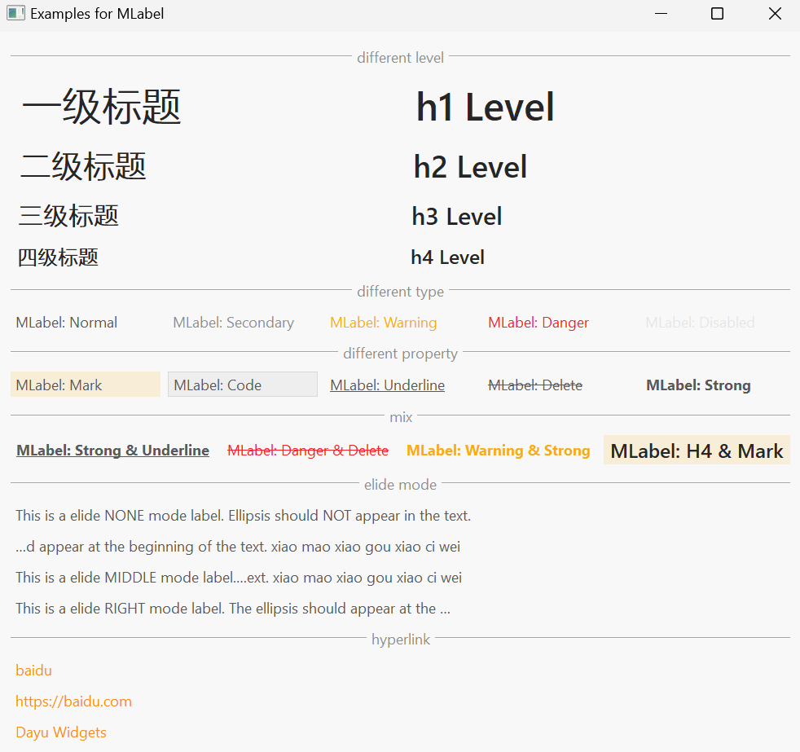
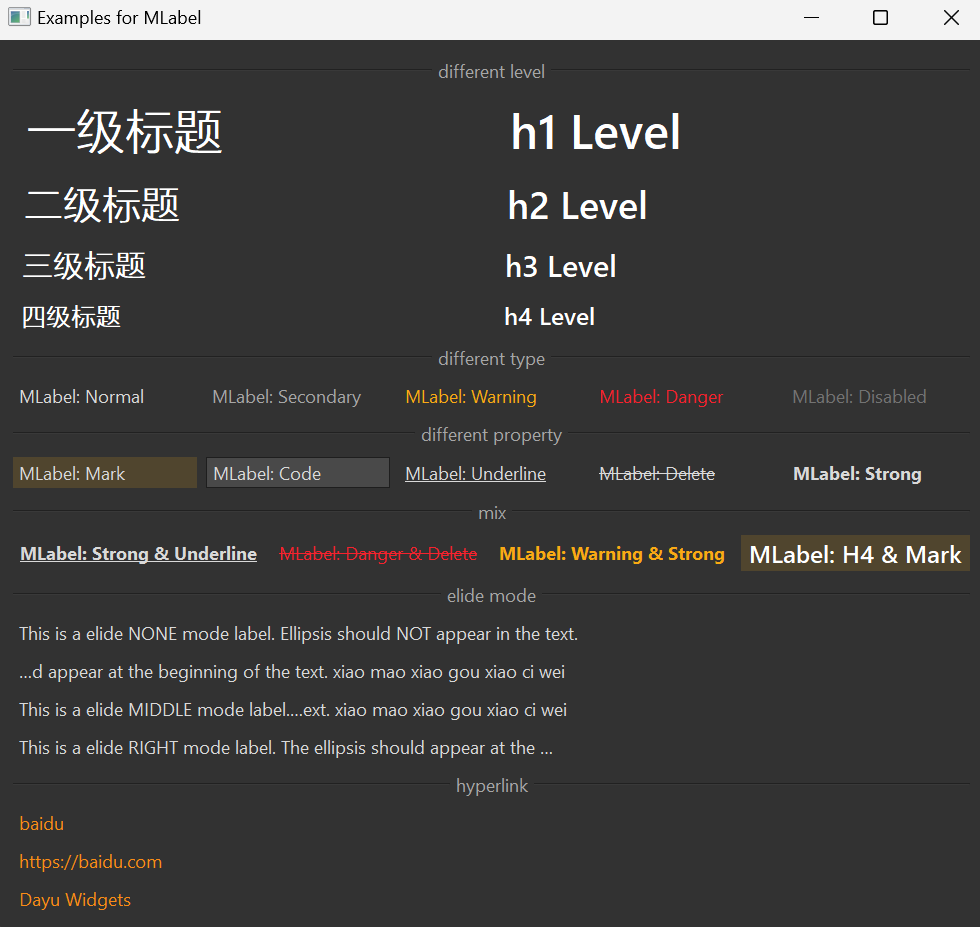

# MLabel 标签

MLabel 是一个用于显示文本的组件，它基于 Qt 的 QLabel 类，提供了更丰富的文本样式和格式化选项。

## 导入

```python
from dayu_widgets import MLabel
```

## 代码示例

### 基本使用

MLabel 可以设置不同级别的标题样式。

```python
from dayu_widgets.label import MLabel

# 创建不同级别的标题
h1_label = MLabel("一级标题").h1()
h2_label = MLabel("二级标题").h2()
h3_label = MLabel("三级标题").h3()
h4_label = MLabel("四级标题").h4()
```

### 不同类型

MLabel 支持多种文本类型，包括普通文本、次要文本、警告文本和危险文本。

```python
from dayu_widgets.label import MLabel

# 创建不同类型的标签
normal_label = MLabel("普通文本")
secondary_label = MLabel("次要文本").secondary()
warning_label = MLabel("警告文本").warning()
danger_label = MLabel("危险文本").danger()

# 创建禁用的标签
disabled_label = MLabel("禁用文本")
disabled_label.setEnabled(False)
```

### 文本样式

MLabel 支持多种文本样式，如标记、代码、下划线、删除线和加粗。

```python
from dayu_widgets.label import MLabel

# 创建不同样式的标签
mark_label = MLabel("标记文本").mark()
code_label = MLabel("代码文本").code()
underline_label = MLabel("下划线文本").underline()
delete_label = MLabel("删除线文本").delete()
strong_label = MLabel("加粗文本").strong()
```

### 组合样式

MLabel 支持组合多种样式，创建更丰富的文本效果。

```python
from dayu_widgets.label import MLabel

# 创建组合样式的标签
label1 = MLabel("加粗下划线").strong().underline()
label2 = MLabel("危险删除线").danger().delete()
label3 = MLabel("警告加粗").warning().strong()
label4 = MLabel("四级标记").h4().mark()
```

### 省略模式

MLabel 支持文本省略，可以设置省略位置为左侧、中间或右侧。

```python
from dayu_widgets.label import MLabel
from qtpy import QtCore

# 创建不同省略模式的标签
label_none = MLabel("这是一个不省略的标签，文本不会被截断。")

label_left = MLabel("这是一个左侧省略的标签，省略号会出现在文本的开头。这是一些额外的文本。")
label_left.set_elide_mode(QtCore.Qt.ElideLeft)

label_middle = MLabel("这是一个中间省略的标签，省略号会出现在文本的中间。这是一些额外的文本。")
label_middle.set_elide_mode(QtCore.Qt.ElideMiddle)

label_right = MLabel("这是一个右侧省略的标签，省略号会出现在文本的末尾。这是一些额外的文本。")
label_right.set_elide_mode(QtCore.Qt.ElideRight)
```

### 超链接

MLabel 支持设置超链接文本。

```python
from dayu_widgets.label import MLabel

# 创建超链接标签
link_label1 = MLabel()
link_label1.set_link("https://baidu.com", text="百度")

link_label2 = MLabel()
link_label2.set_link("https://baidu.com")  # 使用链接作为显示文本

link_label3 = MLabel()
link_label3.set_link("https://github.com/phenom-films/dayu_widgets", text="Dayu Widgets")
```

### 完整示例

<div class="theme-image-container">
  
  
</div>

以下是一个完整的示例，展示了 MLabel 的各种用法：

```python
# Import third-party modules
from qtpy import QtCore
from qtpy import QtWidgets

# Import local modules
from dayu_widgets.divider import MDivider
from dayu_widgets.field_mixin import MFieldMixin
from dayu_widgets.label import MLabel
from dayu_widgets.push_button import MPushButton


class LabelExample(QtWidgets.QWidget, MFieldMixin):
    def __init__(self, parent=None):
        super(LabelExample, self).__init__(parent)
        self.setWindowTitle("Examples for MLabel")
        self._init_ui()

    def _init_ui(self):
        title_lay = QtWidgets.QGridLayout()
        title_lay.addWidget(MLabel("一级标题").h1(), 0, 0)
        title_lay.addWidget(MLabel("二级标题").h2(), 1, 0)
        title_lay.addWidget(MLabel("三级标题").h3(), 2, 0)
        title_lay.addWidget(MLabel("四级标题").h4(), 3, 0)
        title_lay.addWidget(MLabel("h1 Level").h1(), 0, 1)
        title_lay.addWidget(MLabel("h2 Level").h2(), 1, 1)
        title_lay.addWidget(MLabel("h3 Level").h3(), 2, 1)
        title_lay.addWidget(MLabel("h4 Level").h4(), 3, 1)

        text_type_lay = QtWidgets.QHBoxLayout()
        text_type_lay.addWidget(MLabel("MLabel: Normal"))
        text_type_lay.addWidget(MLabel("MLabel: Secondary").secondary())
        text_type_lay.addWidget(MLabel("MLabel: Warning").warning())
        text_type_lay.addWidget(MLabel("MLabel: Danger").danger())
        disable_text = MLabel("MLabel: Disabled")
        disable_text.setEnabled(False)
        text_type_lay.addWidget(disable_text)

        text_attr_lay = QtWidgets.QHBoxLayout()
        text_attr_lay.addWidget(MLabel("MLabel: Mark").mark())
        text_attr_lay.addWidget(MLabel("MLabel: Code").code())
        text_attr_lay.addWidget(MLabel("MLabel: Underline").underline())
        text_attr_lay.addWidget(MLabel("MLabel: Delete").delete())
        text_attr_lay.addWidget(MLabel("MLabel: Strong").strong())

        text_mix_lay = QtWidgets.QHBoxLayout()
        text_mix_lay.addWidget(MLabel("MLabel: Strong & Underline").strong().underline())
        text_mix_lay.addWidget(MLabel("MLabel: Danger & Delete").danger().delete())
        text_mix_lay.addWidget(MLabel("MLabel: Warning & Strong").warning().strong())
        text_mix_lay.addWidget(MLabel("MLabel: H4 & Mark").h4().mark())

        lay_elide = QtWidgets.QVBoxLayout()
        label_none = MLabel("This is a elide NONE mode label. " "Ellipsis should NOT appear in the text.")
        label_left = MLabel(
            "This is a elide LEFT mode label. "
            "The ellipsis should appear at the beginning of the text. "
            "xiao mao xiao gou xiao ci wei"
        )
        label_left.set_elide_mode(QtCore.Qt.ElideLeft)
        label_middle = MLabel(
            "This is a elide MIDDLE mode label. "
            "The ellipsis should appear in the middle of the text. "
            "xiao mao xiao gou xiao ci wei"
        )
        label_middle.set_elide_mode(QtCore.Qt.ElideMiddle)
        label_right = MLabel()
        label_right.setText(
            "This is a elide RIGHT mode label. "
            "The ellipsis should appear at the end of the text. "
            "Some text to fill the line bala bala bala."
        )
        label_right.set_elide_mode(QtCore.Qt.ElideRight)
        lay_elide.addWidget(label_none)
        lay_elide.addWidget(label_left)
        lay_elide.addWidget(label_middle)
        lay_elide.addWidget(label_right)

        hyper_label_1 = MLabel()
        hyper_label_1.set_link("https://baidu.com", text="baidu")
        hyper_label_2 = MLabel()
        hyper_label_2.set_link("https://baidu.com")
        hyper_label_3 = MLabel()
        hyper_label_3.set_link("https://github.com/phenom-films/dayu_widgets", text="Dayu Widgets")

        hyperlink_lay = QtWidgets.QVBoxLayout()
        hyperlink_lay.addWidget(hyper_label_1)
        hyperlink_lay.addWidget(hyper_label_2)
        hyperlink_lay.addWidget(hyper_label_3)

        main_lay = QtWidgets.QVBoxLayout()
        main_lay.addWidget(MDivider("different level"))
        main_lay.addLayout(title_lay)
        main_lay.addWidget(MDivider("different type"))
        main_lay.addLayout(text_type_lay)
        main_lay.addWidget(MDivider("different property"))
        main_lay.addLayout(text_attr_lay)
        main_lay.addWidget(MDivider("mix"))
        main_lay.addLayout(text_mix_lay)
        main_lay.addWidget(MDivider("elide mode"))
        main_lay.addLayout(lay_elide)
        main_lay.addWidget(MDivider("hyperlink"))
        main_lay.addLayout(hyperlink_lay)
        main_lay.addStretch()
        self.setLayout(main_lay)


if __name__ == "__main__":
    # Import local modules
    from dayu_widgets import dayu_theme
    from dayu_widgets.qt import application

    with application() as app:
        test = LabelExample()
        dayu_theme.apply(test)
        test.show()
```

## API

### 属性

| 属性 | 描述 | 类型 | 默认值 |
| --- | --- | --- | --- |
| `dayu_level` | 标题级别 | `int` | `0` |
| `dayu_type` | 文本类型 | `str` | `""` |
| `dayu_underline` | 是否显示下划线 | `bool` | `False` |
| `dayu_delete` | 是否显示删除线 | `bool` | `False` |
| `dayu_strong` | 是否加粗 | `bool` | `False` |
| `dayu_mark` | 是否标记 | `bool` | `False` |
| `dayu_code` | 是否显示为代码 | `bool` | `False` |
| `dayu_elide_mod` | 省略模式 | `QtCore.Qt.TextElideMode` | `QtCore.Qt.ElideNone` |

### 常量

| 常量 | 值 |
| --- | --- |
| `SecondaryType` | `"secondary"` |
| `WarningType` | `"warning"` |
| `DangerType` | `"danger"` |
| `H1Level` | `1` |
| `H2Level` | `2` |
| `H3Level` | `3` |
| `H4Level` | `4` |

### 方法

| 方法 | 描述 | 参数 | 返回值 |
| --- | --- | --- | --- |
| `h1()` | 设置为一级标题 | 无 | 当前标签实例 |
| `h2()` | 设置为二级标题 | 无 | 当前标签实例 |
| `h3()` | 设置为三级标题 | 无 | 当前标签实例 |
| `h4()` | 设置为四级标题 | 无 | 当前标签实例 |
| `secondary()` | 设置为次要文本 | 无 | 当前标签实例 |
| `warning()` | 设置为警告文本 | 无 | 当前标签实例 |
| `danger()` | 设置为危险文本 | 无 | 当前标签实例 |
| `strong()` | 设置为加粗文本 | 无 | 当前标签实例 |
| `mark()` | 设置为标记文本 | 无 | 当前标签实例 |
| `code()` | 设置为代码文本 | 无 | 当前标签实例 |
| `delete()` | 设置为删除线文本 | 无 | 当前标签实例 |
| `underline()` | 设置为下划线文本 | 无 | 当前标签实例 |
| `set_elide_mode(mode)` | 设置省略模式 | `mode`: 省略模式，可选值为 `QtCore.Qt.ElideNone`、`QtCore.Qt.ElideLeft`、`QtCore.Qt.ElideMiddle`、`QtCore.Qt.ElideRight` | 无 |
| `set_link(href, text=None)` | 设置超链接 | `href`: 链接地址<br>`text`: 显示文本，默认为链接地址 | 无 |

## 常见问题

### 如何设置标签样式？

MLabel 提供了多种方法来设置标签样式，可以通过链式调用组合多种样式：

```python
# 设置标题级别
label1 = MLabel("一级标题").h1()

# 设置文本类型
label2 = MLabel("警告文本").warning()

# 设置文本样式
label3 = MLabel("加粗文本").strong()
label4 = MLabel("下划线文本").underline()

# 组合多种样式
label5 = MLabel("加粗警告文本").warning().strong()
```

### 如何处理长文本？

MLabel 支持文本省略，可以通过 `set_elide_mode` 方法设置省略模式：

```python
from dayu_widgets.label import MLabel
from qtpy import QtCore

# 左侧省略
label1 = MLabel("这是一个很长的文本...")
label1.set_elide_mode(QtCore.Qt.ElideLeft)

# 中间省略
label2 = MLabel("这是一个很长的文本...")
label2.set_elide_mode(QtCore.Qt.ElideMiddle)

# 右侧省略
label3 = MLabel("这是一个很长的文本...")
label3.set_elide_mode(QtCore.Qt.ElideRight)
```

### 如何创建超链接？

MLabel 支持创建超链接，可以通过 `set_link` 方法设置：

```python
from dayu_widgets.label import MLabel

# 创建超链接，使用自定义文本
link_label1 = MLabel()
link_label1.set_link("https://github.com", text="GitHub")

# 创建超链接，使用链接作为文本
link_label2 = MLabel()
link_label2.set_link("https://github.com")
```
