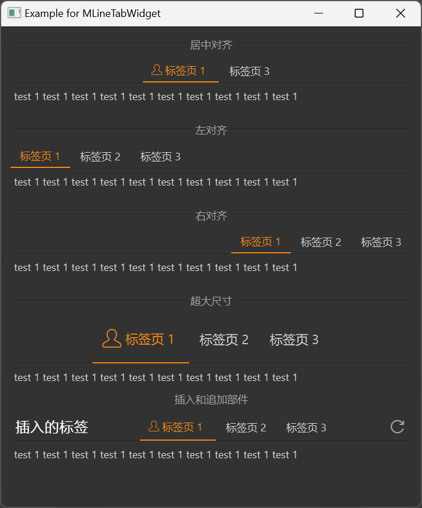

# MLineTabWidget 下划线式 TabBar

MLineTabWidget 是一个下划线式的标签页组件，用于在不同内容区域之间进行切换。它的特点是标签页下方有一条下划线，可以清晰地指示当前选中的标签页。

## 导入

```python
from dayu_widgets.line_tab_widget import MLineTabWidget
```

## 代码示例

### 基本使用

MLineTabWidget 可以通过 `add_tab` 方法添加标签页，每个标签页包含一个内容部件和一个标签数据字典。

```python
from dayu_widgets.line_tab_widget import MLineTabWidget
from dayu_widgets.label import MLabel

# 创建一个下划线式标签页组件
tab_widget = MLineTabWidget()

# 添加标签页
tab_widget.add_tab(MLabel("这是第一个标签页的内容"), "标签页 1")
tab_widget.add_tab(MLabel("这是第二个标签页的内容"), "标签页 2")
tab_widget.add_tab(MLabel("这是第三个标签页的内容"), "标签页 3")

# 设置默认选中的标签页
tab_widget.tool_button_group.set_dayu_checked(0)
```

### 带图标的标签页

MLineTabWidget 支持在标签页上显示图标。

```python
from dayu_widgets.line_tab_widget import MLineTabWidget
from dayu_widgets.label import MLabel

# 创建一个下划线式标签页组件
tab_widget = MLineTabWidget()

# 添加带图标的标签页
tab_widget.add_tab(MLabel("这是第一个标签页的内容"), {"text": "标签页 1", "svg": "user_line.svg"})
tab_widget.add_tab(MLabel("这是第二个标签页的内容"), {"svg": "calendar_line.svg"})
tab_widget.add_tab(MLabel("这是第三个标签页的内容"), "标签页 3")

# 设置默认选中的标签页
tab_widget.tool_button_group.set_dayu_checked(0)
```

### 不同对齐方式

MLineTabWidget 支持不同的对齐方式，可以在创建时通过 `alignment` 参数设置。

```python
from dayu_widgets.line_tab_widget import MLineTabWidget
from dayu_widgets.label import MLabel
from qtpy import QtCore

# 创建居中对齐的标签页组件（默认）
tab_center = MLineTabWidget(alignment=QtCore.Qt.AlignCenter)
tab_center.add_tab(MLabel("这是第一个标签页的内容"), "标签页 1")
tab_center.add_tab(MLabel("这是第二个标签页的内容"), "标签页 2")
tab_center.add_tab(MLabel("这是第三个标签页的内容"), "标签页 3")
tab_center.tool_button_group.set_dayu_checked(0)

# 创建左对齐的标签页组件
tab_left = MLineTabWidget(alignment=QtCore.Qt.AlignLeft)
tab_left.add_tab(MLabel("这是第一个标签页的内容"), "标签页 1")
tab_left.add_tab(MLabel("这是第二个标签页的内容"), "标签页 2")
tab_left.add_tab(MLabel("这是第三个标签页的内容"), "标签页 3")
tab_left.tool_button_group.set_dayu_checked(0)

# 创建右对齐的标签页组件
tab_right = MLineTabWidget(alignment=QtCore.Qt.AlignRight)
tab_right.add_tab(MLabel("这是第一个标签页的内容"), "标签页 1")
tab_right.add_tab(MLabel("这是第二个标签页的内容"), "标签页 2")
tab_right.add_tab(MLabel("这是第三个标签页的内容"), "标签页 3")
tab_right.tool_button_group.set_dayu_checked(0)
```

### 不同尺寸

MLineTabWidget 支持不同的尺寸，可以通过 `set_dayu_size` 方法设置。

```python
from dayu_widgets.line_tab_widget import MLineTabWidget
from dayu_widgets.label import MLabel
from dayu_widgets import dayu_theme

# 创建超大尺寸的标签页组件
tab_huge = MLineTabWidget()
tab_huge.set_dayu_size(dayu_theme.huge)
tab_huge.add_tab(MLabel("这是第一个标签页的内容"), {"text": "标签页 1", "svg": "user_line.svg"})
tab_huge.add_tab(MLabel("这是第二个标签页的内容"), "标签页 2")
tab_huge.add_tab(MLabel("这是第三个标签页的内容"), "标签页 3")
tab_huge.tool_button_group.set_dayu_checked(0)
```

### 插入和追加部件

MLineTabWidget 支持在标签栏的两端插入和追加自定义部件。

```python
from dayu_widgets.line_tab_widget import MLineTabWidget
from dayu_widgets.label import MLabel
from dayu_widgets.tool_button import MToolButton

# 创建一个下划线式标签页组件
tab_widget = MLineTabWidget()
tab_widget.add_tab(MLabel("这是第一个标签页的内容"), {"text": "标签页 1", "svg": "user_line.svg"})
tab_widget.add_tab(MLabel("这是第二个标签页的内容"), "标签页 2")
tab_widget.add_tab(MLabel("这是第三个标签页的内容"), "标签页 3")
tab_widget.tool_button_group.set_dayu_checked(0)

# 在左侧插入标签
tab_widget.insert_widget(MLabel("插入的标签").h4())

# 在右侧追加按钮
tab_widget.append_widget(MToolButton().svg("refresh_line.svg").icon_only())
```

### 完整示例



以下是一个完整的示例，展示了 MLineTabWidget 的各种用法：

```python
# Import third-party modules
from qtpy import QtCore
from qtpy import QtWidgets

# Import local modules
from dayu_widgets import dayu_theme
from dayu_widgets.divider import MDivider
from dayu_widgets.label import MLabel
from dayu_widgets.line_tab_widget import MLineTabWidget
from dayu_widgets.tool_button import MToolButton


class LineTabWidgetExample(QtWidgets.QWidget):
    def __init__(self, parent=None):
        super(LineTabWidgetExample, self).__init__(parent)
        self.setWindowTitle("Example for MLineTabWidget")
        self._init_ui()

    def _init_ui(self):
        main_lay = QtWidgets.QVBoxLayout()

        tab_center = MLineTabWidget()
        tab_center.add_tab(MLabel("test 1 " * 10), {"text": "标签页 1", "svg": "user_line.svg"})
        tab_center.add_tab(MLabel("test 2 " * 10), {"svg": "calendar_line.svg"})
        tab_center.add_tab(MLabel("test 3 " * 10), "标签页 3")
        tab_center.tool_button_group.set_dayu_checked(0)

        tab_left = MLineTabWidget(alignment=QtCore.Qt.AlignLeft)
        tab_left.add_tab(MLabel("test 1 " * 10), "标签页 1")
        tab_left.add_tab(MLabel("test 2 " * 10), "标签页 2")
        tab_left.add_tab(MLabel("test 3 " * 10), "标签页 3")
        tab_left.tool_button_group.set_dayu_checked(0)

        tab_right = MLineTabWidget(alignment=QtCore.Qt.AlignRight)
        tab_right.add_tab(MLabel("test 1 " * 10), "标签页 1")
        tab_right.add_tab(MLabel("test 2 " * 10), "标签页 2")
        tab_right.add_tab(MLabel("test 3 " * 10), "标签页 3")
        tab_right.tool_button_group.set_dayu_checked(0)

        tab_huge = MLineTabWidget()
        tab_huge.set_dayu_size(dayu_theme.huge)
        tab_huge.add_tab(MLabel("test 1 " * 10), {"text": "标签页 1", "svg": "user_line.svg"})
        tab_huge.add_tab(MLabel("test 2 " * 10), "标签页 2")
        tab_huge.add_tab(MLabel("test 3 " * 10), "标签页 3")
        tab_huge.tool_button_group.set_dayu_checked(0)

        tab_append_insert = MLineTabWidget()
        tab_append_insert.add_tab(MLabel("test 1 " * 10), {"text": "标签页 1", "svg": "user_line.svg"})
        tab_append_insert.add_tab(MLabel("test 2 " * 10), "标签页 2")
        tab_append_insert.add_tab(MLabel("test 3 " * 10), "标签页 3")
        tab_append_insert.tool_button_group.set_dayu_checked(0)
        tab_append_insert.insert_widget(MLabel("插入的标签").h4())
        tab_append_insert.append_widget(MToolButton().svg("refresh_line.svg").icon_only())

        main_lay.addWidget(MDivider("居中对齐"))
        main_lay.addWidget(tab_center)
        main_lay.addSpacing(20)
        main_lay.addWidget(MDivider("左对齐"))
        main_lay.addWidget(tab_left)
        main_lay.addSpacing(20)
        main_lay.addWidget(MDivider("右对齐"))
        main_lay.addWidget(tab_right)
        main_lay.addSpacing(20)
        main_lay.addWidget(MDivider("超大尺寸"))
        main_lay.addWidget(tab_huge)
        main_lay.addWidget(MDivider("插入和追加部件"))
        main_lay.addWidget(tab_append_insert)
        main_lay.addStretch()
        self.setLayout(main_lay)


if __name__ == "__main__":
    # Import local modules
    from dayu_widgets import dayu_theme
    from dayu_widgets.qt import application

    with application() as app:
        test = LineTabWidgetExample()
        dayu_theme.apply(test)
        test.show()
```

## API

### MLineTabWidget

#### 构造函数

```python
MLineTabWidget(alignment=QtCore.Qt.AlignCenter, parent=None)
```

| 参数 | 描述 | 类型 | 默认值 |
| --- | --- | --- | --- |
| `alignment` | 标签栏对齐方式 | `Qt.Alignment` | `QtCore.Qt.AlignCenter` |
| `parent` | 父部件 | `QWidget` | `None` |

#### 方法

| 方法 | 描述 | 参数 | 返回值 |
| --- | --- | --- | --- |
| `append_widget(widget)` | 在标签栏右侧追加部件 | `widget`: 要追加的部件 | 无 |
| `insert_widget(widget)` | 在标签栏左侧插入部件 | `widget`: 要插入的部件 | 无 |
| `add_tab(widget, data_dict)` | 添加一个标签页 | `widget`: 内容部件<br>`data_dict`: 标签数据字典或文本 | 无 |
| `get_dayu_size()` | 获取标签页尺寸 | 无 | `int` |
| `set_dayu_size(value)` | 设置标签页尺寸 | `value`: 尺寸值 | 无 |

#### 属性

| 属性 | 描述 | 类型 | 默认值 |
| --- | --- | --- | --- |
| `dayu_size` | 标签页尺寸 | `int` | `dayu_theme.default` |
| `tool_button_group` | 标签按钮组 | `MUnderlineButtonGroup` | - |
| `stack_widget` | 内容区域堆叠部件 | `MStackedWidget` | - |

#### 标签数据字典

`add_tab` 方法的 `data_dict` 参数可以是一个字符串或一个字典。如果是字典，可以包含以下键：

| 键 | 描述 | 类型 | 是否必须 |
| --- | --- | --- | --- |
| `text` | 标签文本 | `str` | 否 |
| `svg` | 标签图标的 SVG 文件名 | `str` | 否 |
| `icon` | 标签图标对象 | `QIcon` | 否 |

## 常见问题

### 如何设置默认选中的标签页？

可以通过 `tool_button_group.set_dayu_checked` 方法设置默认选中的标签页：

```python
from dayu_widgets.line_tab_widget import MLineTabWidget
from dayu_widgets.label import MLabel

# 创建一个下划线式标签页组件
tab_widget = MLineTabWidget()
tab_widget.add_tab(MLabel("这是第一个标签页的内容"), "标签页 1")
tab_widget.add_tab(MLabel("这是第二个标签页的内容"), "标签页 2")
tab_widget.add_tab(MLabel("这是第三个标签页的内容"), "标签页 3")

# 设置默认选中第二个标签页（索引从 0 开始）
tab_widget.tool_button_group.set_dayu_checked(1)
```

### 如何获取当前选中的标签页索引？

可以通过 `tool_button_group.get_dayu_checked` 方法获取当前选中的标签页索引：

```python
from dayu_widgets.line_tab_widget import MLineTabWidget

# 创建一个下划线式标签页组件
tab_widget = MLineTabWidget()
# 添加标签页...

# 获取当前选中的标签页索引
current_index = tab_widget.tool_button_group.get_dayu_checked()
print("当前选中的标签页索引:", current_index)
```

### 如何监听标签页切换事件？

可以通过连接 `tool_button_group.sig_checked_changed` 信号来监听标签页切换事件：

```python
from dayu_widgets.line_tab_widget import MLineTabWidget
from dayu_widgets.label import MLabel

# 创建一个下划线式标签页组件
tab_widget = MLineTabWidget()
tab_widget.add_tab(MLabel("这是第一个标签页的内容"), "标签页 1")
tab_widget.add_tab(MLabel("这是第二个标签页的内容"), "标签页 2")
tab_widget.add_tab(MLabel("这是第三个标签页的内容"), "标签页 3")

# 监听标签页切换事件
tab_widget.tool_button_group.sig_checked_changed.connect(lambda index: print("切换到标签页:", index))
```

### 如何在标签页中只显示图标？

如果只想显示图标而不显示文本，可以只设置 `svg` 或 `icon` 键，不设置 `text` 键：

```python
from dayu_widgets.line_tab_widget import MLineTabWidget
from dayu_widgets.label import MLabel

# 创建一个下划线式标签页组件
tab_widget = MLineTabWidget()

# 添加只显示图标的标签页
tab_widget.add_tab(MLabel("这是内容"), {"svg": "user_line.svg"})
```

### 如何在标签栏两端添加自定义部件？

可以通过 `insert_widget` 和 `append_widget` 方法在标签栏的两端添加自定义部件：

```python
from dayu_widgets.line_tab_widget import MLineTabWidget
from dayu_widgets.label import MLabel
from dayu_widgets.tool_button import MToolButton

# 创建一个下划线式标签页组件
tab_widget = MLineTabWidget()
# 添加标签页...

# 在左侧插入标签
tab_widget.insert_widget(MLabel("插入的标签").h4())

# 在右侧追加按钮
tab_widget.append_widget(MToolButton().svg("refresh_line.svg").icon_only())
```
