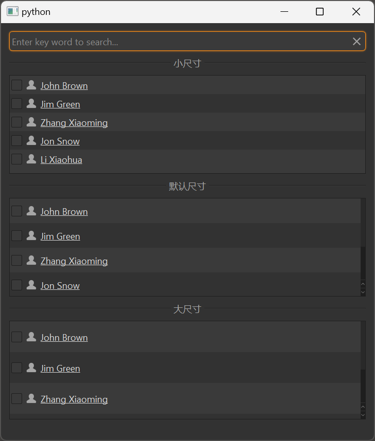

# MListView 列表视图

MListView 是一个列表视图组件，用于以列表形式展示数据。它基于 Qt 的 QListView 类，提供了更美观的样式和更好的交互体验，支持排序、筛选等功能。

## 导入

```python
from dayu_widgets.item_view import MListView
```

## 代码示例

<!-- 需要添加 MListView 的截图 -->


### 基本使用

MListView 需要与 MTableModel 和 MSortFilterModel 一起使用，以展示和管理数据。

```python
from dayu_widgets.item_view import MListView
from dayu_widgets.item_model import MTableModel
from dayu_widgets.item_model import MSortFilterModel

# 创建模型
model = MTableModel()
model.set_header_list([
    {"key": "name", "label": "姓名"},
    {"key": "age", "label": "年龄"},
    {"key": "city", "label": "城市"}
])

# 创建排序筛选模型
sort_filter_model = MSortFilterModel()
sort_filter_model.setSourceModel(model)

# 创建列表视图
list_view = MListView()
list_view.setModel(sort_filter_model)
list_view.set_header_list([
    {"key": "name", "label": "姓名"},
    {"key": "age", "label": "年龄"},
    {"key": "city", "label": "城市"}
])

# 设置数据
model.set_data_list([
    {"name": "张三", "age": 18, "city": "北京"},
    {"name": "李四", "age": 25, "city": "上海"},
    {"name": "王五", "age": 30, "city": "广州"}
])
```

### 不同尺寸

MListView 支持不同的尺寸，可以通过 `size` 参数设置。

```python
from dayu_widgets.item_view import MListView
from dayu_widgets import dayu_theme

# 创建小尺寸的列表视图
list_small = MListView(size=dayu_theme.small)

# 创建中等尺寸的列表视图（默认）
list_default = MListView(size=dayu_theme.medium)

# 创建大尺寸的列表视图
list_large = MListView(size=dayu_theme.large)
```

### 设置显示列

MListView 可以通过 `set_show_column` 方法设置要显示的列。

```python
from dayu_widgets.item_view import MListView

# 创建列表视图
list_view = MListView()

# 设置显示 "name" 列
list_view.set_show_column("name")
```

### 搜索过滤

MListView 可以与 MLineEdit 结合使用，实现搜索过滤功能。

```python
from dayu_widgets.item_view import MListView
from dayu_widgets.item_model import MTableModel
from dayu_widgets.item_model import MSortFilterModel
from dayu_widgets.line_edit import MLineEdit

# 创建模型和视图
model = MTableModel()
sort_filter_model = MSortFilterModel()
sort_filter_model.setSourceModel(model)
list_view = MListView()
list_view.setModel(sort_filter_model)

# 创建搜索框
search_line_edit = MLineEdit().search().small()
search_line_edit.textChanged.connect(sort_filter_model.set_search_pattern)
```

### 完整示例



以下是一个完整的示例，展示了 MListView 的各种用法：

```python
# Import third-party modules
from qtpy import QtWidgets

# Import local modules
from dayu_widgets import dayu_theme
from dayu_widgets.divider import MDivider
from dayu_widgets.field_mixin import MFieldMixin
from dayu_widgets.item_model import MSortFilterModel
from dayu_widgets.item_model import MTableModel
from dayu_widgets.item_view import MListView
from dayu_widgets.line_edit import MLineEdit
import examples._mock_data as mock


class ListViewExample(QtWidgets.QWidget, MFieldMixin):
    def __init__(self, parent=None):
        super(ListViewExample, self).__init__(parent)
        self._init_ui()

    def _init_ui(self):
        table_small = MListView(size=dayu_theme.small)
        table_default = MListView()
        table_large = MListView(size=dayu_theme.large)

        model_1 = MTableModel()
        model_1.set_header_list(mock.header_list)
        model_sort = MSortFilterModel()
        model_sort.setSourceModel(model_1)
        table_small.setModel(model_sort)
        table_default.setModel(model_sort)
        table_large.setModel(model_sort)
        model_sort.set_header_list(mock.header_list)
        table_small.set_header_list(mock.header_list)
        table_default.set_header_list(mock.header_list)
        table_large.set_header_list(mock.header_list)
        model_1.set_data_list(mock.data_list)

        line_edit = MLineEdit().search().small()
        line_edit.textChanged.connect(model_sort.set_search_pattern)

        main_lay = QtWidgets.QVBoxLayout()
        main_lay.addWidget(line_edit)
        main_lay.addWidget(MDivider("小尺寸"))
        main_lay.addWidget(table_small)
        main_lay.addWidget(MDivider("默认尺寸"))
        main_lay.addWidget(table_default)
        main_lay.addWidget(MDivider("大尺寸"))
        main_lay.addWidget(table_large)
        main_lay.addStretch()
        self.setLayout(main_lay)


if __name__ == "__main__":
    # Import local modules
    from dayu_widgets.qt import application

    with application() as app:
        test = ListViewExample()
        dayu_theme.apply(test)
        test.show()
```

## API

### 构造函数

```python
MListView(size=None, parent=None)
```

| 参数 | 描述 | 类型 | 默认值 |
| --- | --- | --- | --- |
| `size` | 列表尺寸 | `int` | `dayu_theme.default_size` |
| `parent` | 父部件 | `QWidget` | `None` |

### 方法

| 方法 | 描述 | 参数 | 返回值 |
| --- | --- | --- | --- |
| `set_header_list(header_list)` | 设置表头列表 | `header_list`: 表头列表 | 无 |
| `set_show_column(attr)` | 设置显示的列 | `attr`: 列的键名 | 无 |
| `enable_context_menu(enable)` | 启用右键菜单 | `enable`: 是否启用 | 无 |
| `slot_context_menu(point)` | 右键菜单槽函数 | `point`: 右键点击位置 | 无 |

### 信号

| 信号 | 描述 | 参数 |
| --- | --- | --- |
| `sig_context_menu` | 右键菜单信号 | `object`: 右键菜单数据 |

### 继承的方法

MListView 继承自 QListView，因此可以使用 QListView 的所有方法，例如：

- `setModel(model)`: 设置数据模型
- `setSelectionBehavior(behavior)`: 设置选择行为
- `setSelectionMode(mode)`: 设置选择模式
- 更多方法请参考 Qt 文档

## 常见问题

### 如何设置表头？

可以通过 `set_header_list` 方法设置表头，该方法接受一个列表，列表中的每个元素是一个字典，包含 `key` 和 `label` 等键：

```python
from dayu_widgets.item_view import MListView

# 创建列表视图
list_view = MListView()

# 设置表头
list_view.set_header_list([
    {"key": "name", "label": "姓名"},
    {"key": "age", "label": "年龄"},
    {"key": "city", "label": "城市"}
])
```

### 如何设置数据？

数据需要通过 MTableModel 的 `set_data_list` 方法设置：

```python
from dayu_widgets.item_view import MListView
from dayu_widgets.item_model import MTableModel
from dayu_widgets.item_model import MSortFilterModel

# 创建模型
model = MTableModel()
model.set_header_list([
    {"key": "name", "label": "姓名"},
    {"key": "age", "label": "年龄"},
    {"key": "city", "label": "城市"}
])

# 创建排序筛选模型
sort_filter_model = MSortFilterModel()
sort_filter_model.setSourceModel(model)

# 创建列表视图
list_view = MListView()
list_view.setModel(sort_filter_model)
list_view.set_header_list([
    {"key": "name", "label": "姓名"},
    {"key": "age", "label": "年龄"},
    {"key": "city", "label": "城市"}
])

# 设置数据
model.set_data_list([
    {"name": "张三", "age": 18, "city": "北京"},
    {"name": "李四", "age": 25, "city": "上海"},
    {"name": "王五", "age": 30, "city": "广州"}
])
```

### 如何实现搜索过滤？

可以通过 MSortFilterModel 的 `set_search_pattern` 方法实现搜索过滤：

```python
from dayu_widgets.item_view import MListView
from dayu_widgets.item_model import MTableModel
from dayu_widgets.item_model import MSortFilterModel
from dayu_widgets.line_edit import MLineEdit

# 创建模型和视图
model = MTableModel()
sort_filter_model = MSortFilterModel()
sort_filter_model.setSourceModel(model)
list_view = MListView()
list_view.setModel(sort_filter_model)

# 创建搜索框
search_line_edit = MLineEdit().search().small()
search_line_edit.textChanged.connect(sort_filter_model.set_search_pattern)
```

### 如何使用 MItemViewSet 简化代码？

MItemViewSet 是一个封装了 MListView、MTableModel 和 MSortFilterModel 的组件，可以简化代码：

```python
from dayu_widgets.item_view_set import MItemViewSet

# 创建列表视图集
item_view_set = MItemViewSet(view_type=MItemViewSet.ListViewType)

# 设置表头
item_view_set.set_header_list([
    {"key": "name", "label": "姓名"},
    {"key": "age", "label": "年龄"},
    {"key": "city", "label": "城市"}
])

# 设置数据
item_view_set.setup_data([
    {"name": "张三", "age": 18, "city": "北京"},
    {"name": "李四", "age": 25, "city": "上海"},
    {"name": "王五", "age": 30, "city": "广州"}
])
```
