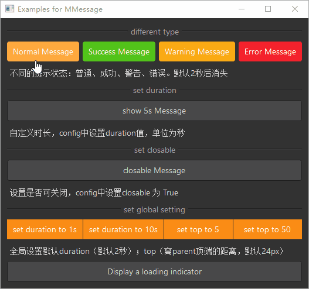

# MMessage 全局提示

MMessage 是一个全局提示组件，用于展示操作反馈信息。它会在页面顶部居中显示，并自动消失，适用于不打断用户操作的轻量级提示。

## 导入

```python
from dayu_widgets.message import MMessage
```

## 代码示例

### 基本使用

MMessage 提供了四种不同类型的全局提示：信息、成功、警告和错误。

```python
from dayu_widgets.message import MMessage

# 显示信息提示
MMessage.info("这是一条信息提示", parent=self)

# 显示成功提示
MMessage.success("这是一条成功提示", parent=self)

# 显示警告提示
MMessage.warning("这是一条警告提示", parent=self)

# 显示错误提示
MMessage.error("这是一条错误提示", parent=self)
```

### 自定义显示时长

MMessage 默认显示 2 秒后自动消失，可以通过 `duration` 参数自定义显示时长。

```python
from dayu_widgets.message import MMessage

# 显示 5 秒后消失的提示
MMessage.info("该条消息将显示 5 秒后关闭", parent=self, duration=5)
```

### 可关闭的提示

MMessage 支持创建可关闭的提示，用户可以通过点击关闭按钮提前关闭提示。

```python
from dayu_widgets.message import MMessage

# 显示可关闭的提示
MMessage.info("这是一条可关闭的提示", parent=self, closable=True)
```

### 加载中提示

MMessage 支持显示带有加载动画的提示，适用于异步操作的反馈。

```python
from dayu_widgets.message import MMessage
import functools

# 显示加载中提示
loading_message = MMessage.loading("正在加载中", parent=self)

# 模拟异步操作完成后显示成功提示
# 在实际应用中，可以在异步操作的回调函数中关闭加载提示并显示结果提示
loading_message.sig_closed.connect(functools.partial(MMessage.success, "加载成功", self))
```

### 全局配置

MMessage 支持全局配置默认的显示时长和距离顶部的距离。

```python
from dayu_widgets.message import MMessage

# 设置默认显示时长为 1 秒
MMessage.config(duration=1)

# 设置距离顶部的距离为 50 像素
MMessage.config(top=50)

# 同时设置显示时长和距离顶部的距离
MMessage.config(duration=3, top=30)
```

### 完整示例



以下是一个完整的示例，展示了 MMessage 的各种用法：

```python
# Import built-in modules
import functools

# Import third-party modules
from qtpy import QtWidgets

# Import local modules
from dayu_widgets.button_group import MPushButtonGroup
from dayu_widgets.divider import MDivider
from dayu_widgets.field_mixin import MFieldMixin
from dayu_widgets.label import MLabel
from dayu_widgets.message import MMessage
from dayu_widgets.push_button import MPushButton


class MessageExample(QtWidgets.QWidget, MFieldMixin):
    def __init__(self, parent=None):
        super(MessageExample, self).__init__(parent)
        self.setWindowTitle("Examples for MMessage")
        self._init_ui()

    def _init_ui(self):
        button3 = MPushButton(text="普通提示").primary()
        button4 = MPushButton(text="成功提示").success()
        button5 = MPushButton(text="警告提示").warning()
        button6 = MPushButton(text="错误提示").danger()
        button3.clicked.connect(functools.partial(self.slot_show_message, MMessage.info, {"text": "这是一条普通提示"}))
        button4.clicked.connect(functools.partial(self.slot_show_message, MMessage.success, {"text": "恭喜你，成功啦！"}))
        button5.clicked.connect(functools.partial(self.slot_show_message, MMessage.warning, {"text": "我警告你哦！"}))
        button6.clicked.connect(functools.partial(self.slot_show_message, MMessage.error, {"text": "失败了！"}))

        sub_lay1 = QtWidgets.QHBoxLayout()
        sub_lay1.addWidget(button3)
        sub_lay1.addWidget(button4)
        sub_lay1.addWidget(button5)
        sub_lay1.addWidget(button6)

        button_duration = MPushButton(text="显示 5 秒的提示")
        button_duration.clicked.connect(
            functools.partial(
                self.slot_show_message,
                MMessage.info,
                {"text": "该条消息将显示 5 秒后关闭", "duration": 5},
            )
        )
        button_closable = MPushButton(text="可关闭的提示")
        button_closable.clicked.connect(
            functools.partial(
                self.slot_show_message,
                MMessage.info,
                {"text": "可手动关闭提示", "closable": True},
            )
        )
        main_lay = QtWidgets.QVBoxLayout()
        main_lay.addWidget(MDivider("不同类型"))
        main_lay.addLayout(sub_lay1)
        main_lay.addWidget(MLabel("不同的提示状态：普通、成功、警告、错误。默认 2 秒后消失"))
        main_lay.addWidget(MDivider("自定义时长"))
        main_lay.addWidget(button_duration)
        main_lay.addWidget(MLabel("自定义时长，config 中设置 duration 值，单位为秒"))

        main_lay.addWidget(MDivider("可关闭"))
        main_lay.addWidget(button_closable)
        main_lay.addWidget(MLabel("设置是否可关闭，config 中设置 closable 为 True"))

        button_grp = MPushButtonGroup()
        button_grp.set_button_list(
            [
                {
                    "text": "设置时长为 1 秒",
                    "clicked": functools.partial(self.slot_set_config, MMessage.config, {"duration": 1}),
                },
                {
                    "text": "设置时长为 10 秒",
                    "clicked": functools.partial(self.slot_set_config, MMessage.config, {"duration": 10}),
                },
                {
                    "text": "设置顶部距离为 5",
                    "clicked": functools.partial(self.slot_set_config, MMessage.config, {"top": 5}),
                },
                {
                    "text": "设置顶部距离为 50",
                    "clicked": functools.partial(self.slot_set_config, MMessage.config, {"top": 50}),
                },
            ]
        )
        loading_button = MPushButton("显示加载提示")
        loading_button.clicked.connect(self.slot_show_loading)
        main_lay.addWidget(MDivider("全局设置"))
        main_lay.addWidget(button_grp)
        main_lay.addWidget(MLabel("全局设置默认 duration（默认 2 秒）；top（离 parent 顶端的距离，默认 24px）"))
        main_lay.addWidget(loading_button)

        main_lay.addStretch()
        self.setLayout(main_lay)

    def slot_show_message(self, func, config):
        func(parent=self, **config)

    def slot_set_config(self, func, config):
        func(**config)

    def slot_show_loading(self):
        msg = MMessage.loading("正在加载中", parent=self)
        msg.sig_closed.connect(functools.partial(MMessage.success, "加载成功啦！！哈哈哈哈", self))


if __name__ == "__main__":
    # Import local modules
    from dayu_widgets import dayu_theme
    from dayu_widgets.qt import application

    with application() as app:
        test = MessageExample()
        dayu_theme.apply(test)
        test.show()
```

## API

### 类方法

| 方法 | 描述 | 参数 | 返回值 |
| --- | --- | --- | --- |
| `info(text, parent, duration=None, closable=None)` | 显示信息提示 | `text`: 提示文本<br>`parent`: 父部件<br>`duration`: 显示时长（秒）<br>`closable`: 是否可关闭 | `MMessage` 实例 |
| `success(text, parent, duration=None, closable=None)` | 显示成功提示 | `text`: 提示文本<br>`parent`: 父部件<br>`duration`: 显示时长（秒）<br>`closable`: 是否可关闭 | `MMessage` 实例 |
| `warning(text, parent, duration=None, closable=None)` | 显示警告提示 | `text`: 提示文本<br>`parent`: 父部件<br>`duration`: 显示时长（秒）<br>`closable`: 是否可关闭 | `MMessage` 实例 |
| `error(text, parent, duration=None, closable=None)` | 显示错误提示 | `text`: 提示文本<br>`parent`: 父部件<br>`duration`: 显示时长（秒）<br>`closable`: 是否可关闭 | `MMessage` 实例 |
| `loading(text, parent)` | 显示加载提示 | `text`: 提示文本<br>`parent`: 父部件 | `MMessage` 实例 |
| `config(duration=None, top=None)` | 全局配置 | `duration`: 默认显示时长（秒）<br>`top`: 距离顶部的距离（像素） | 无 |

### 类常量

| 常量 | 描述 | 值 |
| --- | --- | --- |
| `InfoType` | 信息类型 | `"info"` |
| `SuccessType` | 成功类型 | `"success"` |
| `WarningType` | 警告类型 | `"warning"` |
| `ErrorType` | 错误类型 | `"error"` |
| `LoadingType` | 加载类型 | `"loading"` |

### 信号

| 信号 | 描述 | 参数 |
| --- | --- | --- |
| `sig_closed` | 提示关闭时触发 | 无 |

### 默认配置

| 配置项 | 描述 | 默认值 |
| --- | --- | --- |
| `duration` | 默认显示时长（秒） | `2` |
| `top` | 距离顶部的距离（像素） | `24` |

## 常见问题

### 如何显示不同类型的提示？

可以使用 MMessage 的类方法显示不同类型的提示：

```python
from dayu_widgets.message import MMessage

# 显示信息提示
MMessage.info("这是一条信息提示", parent=self)

# 显示成功提示
MMessage.success("这是一条成功提示", parent=self)

# 显示警告提示
MMessage.warning("这是一条警告提示", parent=self)

# 显示错误提示
MMessage.error("这是一条错误提示", parent=self)
```

### 如何自定义提示的显示时长？

可以通过 `duration` 参数自定义提示的显示时长：

```python
from dayu_widgets.message import MMessage

# 显示 5 秒后消失的提示
MMessage.info("该条消息将显示 5 秒后关闭", parent=self, duration=5)
```

### 如何创建可关闭的提示？

可以通过 `closable` 参数创建可关闭的提示：

```python
from dayu_widgets.message import MMessage

# 显示可关闭的提示
MMessage.info("这是一条可关闭的提示", parent=self, closable=True)
```

### 如何全局配置提示的默认行为？

可以使用 `config` 方法全局配置提示的默认行为：

```python
from dayu_widgets.message import MMessage

# 设置默认显示时长为 1 秒
MMessage.config(duration=1)

# 设置距离顶部的距离为 50 像素
MMessage.config(top=50)

# 同时设置显示时长和距离顶部的距离
MMessage.config(duration=3, top=30)
```

### 如何在异步操作完成后显示结果提示？

可以使用 `sig_closed` 信号在异步操作完成后显示结果提示：

```python
from dayu_widgets.message import MMessage
import functools

# 显示加载中提示
loading_message = MMessage.loading("正在加载中", parent=self)

# 模拟异步操作
def async_operation():
    # 异步操作完成后关闭加载提示并显示结果提示
    loading_message.close()
    MMessage.success("操作成功", parent=self)

# 或者使用信号连接
loading_message.sig_closed.connect(functools.partial(MMessage.success, "操作成功", self))
```
