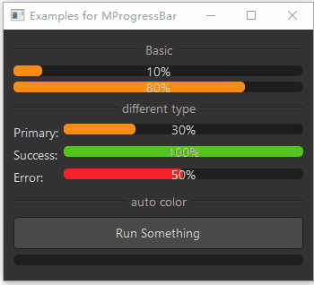

# MProgressBar 进度条

MProgressBar 是一个进度条组件，用于展示操作的当前进度。它基于 Qt 的 QProgressBar 类，提供了更美观的样式和更好的交互体验，支持不同的状态和自动变色功能。

## 导入

```python
from dayu_widgets.progress_bar import MProgressBar
```

## 代码示例

### 基本使用

MProgressBar 可以创建一个简单的进度条，用于显示操作的进度。

```python
from dayu_widgets.progress_bar import MProgressBar

# 创建一个进度条
progress_bar = MProgressBar()
progress_bar.setValue(50)  # 设置进度为 50%
```

### 不同状态

MProgressBar 支持三种不同的状态：普通（primary）、成功（success）和错误（error）。

```python
from dayu_widgets.progress_bar import MProgressBar

# 创建普通状态的进度条
normal_progress = MProgressBar()
normal_progress.setValue(30)

# 创建成功状态的进度条
success_progress = MProgressBar().success()
success_progress.setValue(100)

# 创建错误状态的进度条
error_progress = MProgressBar().error()
error_progress.setValue(50)
```

### 自动变色

MProgressBar 支持根据进度自动变色，当进度达到最大值时自动变为成功状态。

```python
from dayu_widgets.progress_bar import MProgressBar

# 创建自动变色的进度条
auto_color_progress = MProgressBar().auto_color()
auto_color_progress.setValue(50)  # 普通状态
auto_color_progress.setValue(100)  # 自动变为成功状态
```

### 完整示例



以下是一个完整的示例，展示了 MProgressBar 的各种用法：

```python
# Import third-party modules
from qtpy import QtCore
from qtpy import QtWidgets

# Import local modules
from dayu_widgets.divider import MDivider
from dayu_widgets.field_mixin import MFieldMixin
from dayu_widgets.progress_bar import MProgressBar
from dayu_widgets.push_button import MPushButton


class ProgressBarExample(QtWidgets.QWidget, MFieldMixin):
    def __init__(self, parent=None):
        super(ProgressBarExample, self).__init__(parent)
        self.setWindowTitle("Examples for MProgressBar")
        self._init_ui()

    def _init_ui(self):
        progress_1 = MProgressBar()
        progress_1.setValue(10)
        progress_1.setAlignment(QtCore.Qt.AlignCenter)
        progress_2 = MProgressBar()
        progress_2.setValue(80)

        progress_normal = MProgressBar()
        progress_normal.setValue(30)
        progress_success = MProgressBar().success()
        progress_success.setValue(100)
        progress_error = MProgressBar().error()
        progress_error.setValue(50)
        form_lay = QtWidgets.QFormLayout()
        form_lay.addRow("普通:", progress_normal)
        form_lay.addRow("成功:", progress_success)
        form_lay.addRow("错误:", progress_error)

        self.progress_count = 0
        self.timer = QtCore.QTimer()
        self.timer.setInterval(10)
        self.timer.timeout.connect(self.slot_timeout)
        run_button = MPushButton(text="运行任务")
        run_button.clicked.connect(self.slot_run)
        self.auto_color_progress = MProgressBar().auto_color()
        auto_color_lay = QtWidgets.QVBoxLayout()
        auto_color_lay.addWidget(run_button)
        auto_color_lay.addWidget(self.auto_color_progress)

        main_lay = QtWidgets.QVBoxLayout()
        main_lay.addWidget(MDivider("基本"))

        main_lay.addWidget(progress_1)
        main_lay.addWidget(progress_2)
        main_lay.addWidget(MDivider("不同状态"))
        main_lay.addLayout(form_lay)
        main_lay.addWidget(MDivider("自动变色"))
        main_lay.addLayout(auto_color_lay)
        main_lay.addStretch()
        self.setLayout(main_lay)

    def slot_run(self):
        self.timer.start()
        self.auto_color_progress.setValue(0)

    def slot_timeout(self):
        if self.auto_color_progress.value() > 99:
            self.timer.stop()
        else:
            self.auto_color_progress.setValue(self.auto_color_progress.value() + 1)


if __name__ == "__main__":
    # Import local modules
    from dayu_widgets import dayu_theme
    from dayu_widgets.qt import application

    with application() as app:
        test = ProgressBarExample()
        dayu_theme.apply(test)
        test.show()
```

## API

### 构造函数

```python
MProgressBar(parent=None)
```

| 参数 | 描述 | 类型 | 默认值 |
| --- | --- | --- | --- |
| `parent` | 父部件 | `QWidget` | `None` |

### 类常量

| 常量 | 描述 | 值 |
| --- | --- | --- |
| `ErrorStatus` | 错误状态 | `"error"` |
| `NormalStatus` | 普通状态 | `"primary"` |
| `SuccessStatus` | 成功状态 | `"success"` |

### 方法

| 方法 | 描述 | 参数 | 返回值 |
| --- | --- | --- | --- |
| `auto_color()` | 设置为自动变色模式 | 无 | `self` |
| `get_dayu_status()` | 获取当前状态 | 无 | `str` |
| `set_dayu_status(value)` | 设置当前状态 | `value`: 状态值 | 无 |
| `normal()` | 设置为普通状态 | 无 | `self` |
| `error()` | 设置为错误状态 | 无 | `self` |
| `success()` | 设置为成功状态 | 无 | `self` |

### 属性

| 属性 | 描述 | 类型 | 默认值 |
| --- | --- | --- | --- |
| `dayu_status` | 当前状态 | `str` | `NormalStatus` |

### 继承的方法

MProgressBar 继承自 QProgressBar，因此可以使用 QProgressBar 的所有方法，例如：

- `setValue(value)`: 设置当前值
- `value()`: 获取当前值
- `setRange(min, max)`: 设置范围
- `setMinimum(min)`: 设置最小值
- `setMaximum(max)`: 设置最大值
- `setAlignment(alignment)`: 设置对齐方式
- 更多方法请参考 Qt 文档

## 常见问题

### 如何设置进度条的值？

可以使用 `setValue` 方法设置进度条的值：

```python
from dayu_widgets.progress_bar import MProgressBar

# 创建一个进度条
progress_bar = MProgressBar()

# 设置进度为 50%
progress_bar.setValue(50)
```

### 如何设置进度条的状态？

可以使用 `set_dayu_status` 方法或链式方法设置进度条的状态：

```python
from dayu_widgets.progress_bar import MProgressBar

# 创建一个进度条
progress_bar = MProgressBar()

# 使用 set_dayu_status 方法设置状态
progress_bar.set_dayu_status(MProgressBar.SuccessStatus)

# 或者使用链式方法
progress_bar = MProgressBar().success()
progress_bar = MProgressBar().error()
progress_bar = MProgressBar().normal()
```

### 如何实现自动变色？

可以使用 `auto_color` 方法设置进度条为自动变色模式，当进度达到最大值时自动变为成功状态：

```python
from dayu_widgets.progress_bar import MProgressBar

# 创建自动变色的进度条
auto_color_progress = MProgressBar().auto_color()
auto_color_progress.setValue(50)  # 普通状态
auto_color_progress.setValue(100)  # 自动变为成功状态
```

### 如何设置进度条的对齐方式？

可以使用 `setAlignment` 方法设置进度条文本的对齐方式：

```python
from dayu_widgets.progress_bar import MProgressBar
from qtpy import QtCore

# 创建一个进度条
progress_bar = MProgressBar()

# 设置文本居中对齐
progress_bar.setAlignment(QtCore.Qt.AlignCenter)

# 设置文本左对齐
progress_bar.setAlignment(QtCore.Qt.AlignLeft)

# 设置文本右对齐
progress_bar.setAlignment(QtCore.Qt.AlignRight)
```
