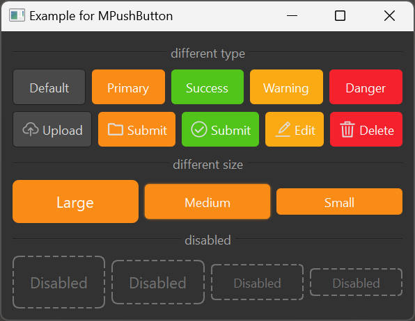

# MPushButton 按钮 

按钮用于开始一个即时操作，标记了一个或封装一组操作命令。


## 导入

```python
from dayu_widgets import MPushButton
```

## 代码示例

### 基本使用

MPushButton 有五种类型：默认按钮、主要按钮、成功按钮、警告按钮和危险按钮。

```python
from dayu_widgets.push_button import MPushButton

# 创建不同类型的按钮
default_button = MPushButton("Default")
primary_button = MPushButton("Primary").primary()
success_button = MPushButton("Success").success()
warning_button = MPushButton("Warning").warning()
danger_button = MPushButton("Danger").danger()
```

### 不同尺寸

MPushButton 有五种尺寸：tiny、small、medium（默认）、large 和 huge。

```python
from dayu_widgets.push_button import MPushButton

# 创建不同尺寸的按钮
huge_button = MPushButton("Huge").huge().primary()
large_button = MPushButton("Large").large().primary()
medium_button = MPushButton("Medium").medium().primary()
small_button = MPushButton("Small").small().primary()
tiny_button = MPushButton("Tiny").tiny().primary()
```

### 禁用状态

使用 `setEnabled(False)` 可以设置按钮为禁用状态。

```python
from dayu_widgets.push_button import MPushButton

# 创建禁用的按钮
disabled_button = MPushButton("Disabled")
disabled_button.setEnabled(False)
```

### 完整示例

以下是一个完整的示例，展示了MPushButton的所有功能：



```python
# Import third-party modules
from qtpy import QtWidgets

# Import local modules
from dayu_widgets import dayu_theme
from dayu_widgets.divider import MDivider
from dayu_widgets.field_mixin import MFieldMixin
from dayu_widgets.push_button import MPushButton
from dayu_widgets.qt import MIcon


class PushButtonExample(QtWidgets.QWidget, MFieldMixin):
    def __init__(self, parent=None):
        super(PushButtonExample, self).__init__(parent)
        self.setWindowTitle("Example for MPushButton")

        sub_lay1 = QtWidgets.QHBoxLayout()
        sub_lay1.addWidget(MPushButton("Default"))
        sub_lay1.addWidget(MPushButton("Primary").primary())
        sub_lay1.addWidget(MPushButton("Success").success())
        sub_lay1.addWidget(MPushButton("Warning").warning())
        sub_lay1.addWidget(MPushButton("Danger").danger())

        sub_lay2 = QtWidgets.QHBoxLayout()
        sub_lay2.addWidget(MPushButton("Upload", MIcon("cloud_line.svg")))
        sub_lay2.addWidget(MPushButton("Submit", MIcon("folder_line.svg", "#ddd")).primary())
        sub_lay2.addWidget(MPushButton("Submit", MIcon("success_line.svg", "#ddd")).success())
        sub_lay2.addWidget(MPushButton("Edit", MIcon("edit_line.svg", "#ddd")).warning())
        sub_lay2.addWidget(MPushButton("Delete", MIcon("trash_line.svg", "#ddd")).danger())

        sub_lay3 = QtWidgets.QHBoxLayout()
        sub_lay3.addWidget(MPushButton("Large").large().primary())
        sub_lay3.addWidget(MPushButton("Medium").medium().primary())
        sub_lay3.addWidget(MPushButton("Small").small().primary())

        disabled_button_1 = MPushButton("Disabled").huge()
        disabled_button_1.setEnabled(False)
        disabled_button_2 = MPushButton("Disabled").large()
        disabled_button_2.setEnabled(False)
        disabled_button_3 = MPushButton("Disabled")
        disabled_button_3.setEnabled(False)
        disabled_button_4 = MPushButton("Disabled").small()
        disabled_button_4.setEnabled(False)
        disable_lay = QtWidgets.QHBoxLayout()
        disable_lay.addWidget(disabled_button_1)
        disable_lay.addWidget(disabled_button_2)
        disable_lay.addWidget(disabled_button_3)
        disable_lay.addWidget(disabled_button_4)

        main_lay = QtWidgets.QVBoxLayout()
        main_lay.addWidget(MDivider("different type"))
        main_lay.addLayout(sub_lay1)
        main_lay.addLayout(sub_lay2)
        main_lay.addWidget(MDivider("different size"))
        main_lay.addLayout(sub_lay3)
        main_lay.addWidget(MDivider("disabled"))
        main_lay.addLayout(disable_lay)
        main_lay.addStretch()
        self.setLayout(main_lay)


if __name__ == '__main__':
    # Import local modules
    from dayu_widgets import dayu_theme
    from dayu_widgets.qt import application

    with application() as app:
        test = PushButtonExample()
        dayu_theme.apply(test)
        test.show()
```

## API

### 属性

| 属性 | 描述 | 类型 | 默认值 |
| --- | --- | --- | --- |
| `dayu_size` | 按钮尺寸 | `int` | `dayu_theme.default_size` |
| `dayu_type` | 按钮类型 | `str` | `MPushButton.DefaultType` |

### 方法

| 方法 | 描述 | 参数 | 返回值 |
| --- | --- | --- | --- |
| `primary()` | 设置按钮为主要类型 | 无 | 当前按钮实例 |
| `success()` | 设置按钮为成功类型 | 无 | 当前按钮实例 |
| `warning()` | 设置按钮为警告类型 | 无 | 当前按钮实例 |
| `danger()` | 设置按钮为危险类型 | 无 | 当前按钮实例 |
| `huge()` | 设置按钮为超大尺寸 | 无 | 当前按钮实例 |
| `large()` | 设置按钮为大尺寸 | 无 | 当前按钮实例 |
| `medium()` | 设置按钮为中等尺寸 | 无 | 当前按钮实例 |
| `small()` | 设置按钮为小尺寸 | 无 | 当前按钮实例 |
| `tiny()` | 设置按钮为超小尺寸 | 无 | 当前按钮实例 |

### 继承的信号

| 信号 | 描述 | 参数 |
| --- | --- | --- |
| `clicked` | 当按钮被点击时触发 | 无 |

## 常见问题

### 如何设置按钮样式？

MPushButton 的样式由 dayu_theme 统一管理，你可以通过设置不同的 type 和 size 来改变按钮样式，而不需要手动设置样式表。

### 如何在一个按钮上同时使用多个类型？

每个按钮只能设置一种类型，但可以链式调用设置类型和尺寸，例如：

```python
button = MPushButton("Button").primary().large()

```
