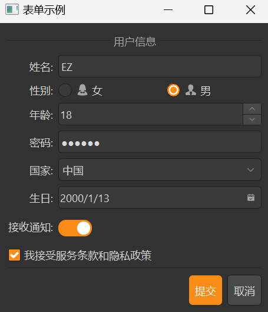

# 快速上手

本文将介绍如何在项目中使用 Dayu Widgets，帮助您快速上手开发基于 PySide 的应用程序。

## 安装

### 环境要求

- Python: >=3.7, <3.13
- Qt 绑定库: PySide2 (>=5.15.2.1) 或 PySide6 (>=6.4.2)

> 注意: PySide2 在 Python 3.11+ 上不再支持，如果您使用 Python 3.11 或更高版本，请使用 PySide6。

### 使用 pip 安装

```bash
# 安装基础包
pip install dayu_widgets

# 安装 PySide2 (二选一)
pip install dayu_widgets[pyside2]

# 或安装 PySide6 (二选一)
pip install dayu_widgets[pyside6]
```

### 使用 poetry 安装

```bash
# 安装基础包
poetry add dayu_widgets

# 安装 PySide2 (二选一)
poetry add dayu_widgets[pyside2]

# 或安装 PySide6 (二选一)
poetry add dayu_widgets[pyside6]
```

## 基本使用

### 导入组件

Dayu Widgets 提供了丰富的组件，您可以根据需要导入相应的组件：

```python
# 导入单个组件
from dayu_widgets.push_button import MPushButton
from dayu_widgets.label import MLabel

# 或者从主模块导入所有组件
from dayu_widgets import MPushButton, MLabel
```

### 创建应用程序

使用 Dayu Widgets 创建应用程序非常简单，以下是一个基本示例：

```python
# Import third-party modules
from qtpy import QtWidgets

# Import local modules
from dayu_widgets import dayu_theme
from dayu_widgets.push_button import MPushButton
from dayu_widgets.label import MLabel
from dayu_widgets.qt import application


class MyApp(QtWidgets.QWidget):
    def __init__(self, parent=None):
        super(MyApp, self).__init__(parent)
        self.setWindowTitle("Dayu Widgets 示例")
        self._init_ui()
        
    def _init_ui(self):
        # 创建标签
        label = MLabel("欢迎使用 Dayu Widgets!")
        label.h3()
        
        # 创建按钮
        button = MPushButton("点击我").primary()
        button.clicked.connect(self.slot_button_clicked)
        
        # 创建布局
        main_lay = QtWidgets.QVBoxLayout()
        main_lay.addWidget(label)
        main_lay.addWidget(button)
        main_lay.addStretch()
        self.setLayout(main_lay)
        
    def slot_button_clicked(self):
        print("按钮被点击了！")


if __name__ == "__main__":
    # 使用 application 上下文管理器创建应用程序
    with application() as app:
        # 创建主窗口
        window = MyApp()
        # 应用主题
        dayu_theme.apply(window)
        # 显示窗口
        window.show()
```

### 应用主题

Dayu Widgets 提供了明亮和暗黑两种主题，默认使用暗黑主题。您可以通过 `dayu_theme` 实例来应用主题：

```python
from dayu_widgets import dayu_theme

# 应用主题到窗口
dayu_theme.apply(window)
```

您也可以切换主题或自定义主题色：

```python
from dayu_widgets import dayu_theme
from dayu_widgets.theme import MTheme

# 切换到明亮主题
dayu_theme.set_theme("light")

# 设置主题色为蓝色
dayu_theme.set_primary_color(MTheme.blue)

# 应用主题
dayu_theme.apply(window)
```

更多关于主题的详细信息，请参考[定制主题](/zh-cn/custom_theme.md)。

## 组件示例

### 按钮

```python
from dayu_widgets.push_button import MPushButton

# 创建不同类型的按钮
default_button = MPushButton("默认按钮")
primary_button = MPushButton("主要按钮").primary()
success_button = MPushButton("成功按钮").success()
warning_button = MPushButton("警告按钮").warning()
danger_button = MPushButton("危险按钮").danger()

# 创建不同尺寸的按钮
large_button = MPushButton("大按钮").large()
medium_button = MPushButton("中等按钮")  # 默认中等尺寸
small_button = MPushButton("小按钮").small()
```

### 标签

```python
from dayu_widgets.label import MLabel

# 创建不同级别的标题
h1_label = MLabel("一级标题").h1()
h2_label = MLabel("二级标题").h2()
h3_label = MLabel("三级标题").h3()
h4_label = MLabel("四级标题").h4()

# 创建不同类型的标签
normal_label = MLabel("普通文本")
secondary_label = MLabel("次要文本").secondary()
warning_label = MLabel("警告文本").warning()
danger_label = MLabel("危险文本").danger()
```

### 输入框

```python
from dayu_widgets.line_edit import MLineEdit

# 创建基本输入框
line_edit = MLineEdit()

# 创建搜索框
search_edit = MLineEdit().search()

# 创建密码框
password_edit = MLineEdit().password()

# 创建不同尺寸的输入框
large_edit = MLineEdit().large()
small_edit = MLineEdit().small()
```

### 表格视图

```python
from dayu_widgets.item_view import MTableView
from dayu_widgets.item_model import MTableModel
from dayu_widgets.item_model import MSortFilterModel

# 创建模型
model = MTableModel()
model.set_header_list([
    {"key": "name", "label": "姓名"},
    {"key": "age", "label": "年龄"},
    {"key": "city", "label": "城市"}
])

# 创建排序筛选模型
sort_filter_model = MSortFilterModel()
sort_filter_model.setSourceModel(model)

# 创建表格视图
table_view = MTableView()
table_view.setModel(sort_filter_model)
table_view.set_header_list([
    {"key": "name", "label": "姓名"},
    {"key": "age", "label": "年龄"},
    {"key": "city", "label": "城市"}
])

# 设置数据
model.set_data_list([
    {"name": "张三", "age": 18, "city": "北京"},
    {"name": "李四", "age": 25, "city": "上海"},
    {"name": "王五", "age": 30, "city": "广州"}
])
```

### 使用视图集简化代码

```python
from dayu_widgets.item_view_set import MItemViewSet

# 创建表格视图集
item_view_set = MItemViewSet(view_type=MItemViewSet.TableViewType)

# 设置表头
item_view_set.set_header_list([
    {"key": "name", "label": "姓名"},
    {"key": "age", "label": "年龄"},
    {"key": "city", "label": "城市"}
])

# 设置数据
item_view_set.setup_data([
    {"name": "张三", "age": 18, "city": "北京"},
    {"name": "李四", "age": 25, "city": "上海"},
    {"name": "王五", "age": 30, "city": "广州"}
])

# 启用搜索功能
item_view_set.searchable()
```

## 数据绑定

Dayu Widgets 提供了 `MFieldMixin` 类，可以实现数据绑定功能：

```python
from qtpy import QtWidgets
from dayu_widgets.field_mixin import MFieldMixin
from dayu_widgets.label import MLabel
from dayu_widgets.push_button import MPushButton


class DataBindExample(QtWidgets.QWidget, MFieldMixin):
    def __init__(self, parent=None):
        super(DataBindExample, self).__init__(parent)
        self._init_ui()
        
    def _init_ui(self):
        # 创建标签
        label = MLabel()
        
        # 创建按钮
        button = MPushButton("更改文本").primary()
        button.clicked.connect(self.slot_change_text)
        
        # 创建布局
        main_lay = QtWidgets.QVBoxLayout()
        main_lay.addWidget(label)
        main_lay.addWidget(button)
        self.setLayout(main_lay)
        
        # 注册字段并绑定
        self.register_field("text", "初始文本")
        self.bind("text", label, "text")
        
    def slot_change_text(self):
        self.set_field("text", "文本已更改")
```

## 完整示例

以下是一个完整的示例，展示了如何使用 Dayu Widgets 创建一个简单的表单：

<!-- 需要添加表单示例的截图 -->

```python
# Import third-party modules
from qtpy import QtWidgets

# Import local modules
from dayu_widgets import dayu_theme
from dayu_widgets.button_group import MRadioButtonGroup
from dayu_widgets.check_box import MCheckBox
from dayu_widgets.combo_box import MComboBox
from dayu_widgets.divider import MDivider
from dayu_widgets.field_mixin import MFieldMixin
from dayu_widgets.label import MLabel
from dayu_widgets.line_edit import MLineEdit
from dayu_widgets.menu import MMenu
from dayu_widgets.push_button import MPushButton
from dayu_widgets.qt import MIcon
from dayu_widgets.spin_box import MDateEdit
from dayu_widgets.spin_box import MSpinBox
from dayu_widgets.switch import MSwitch


class FormExample(QtWidgets.QWidget, MFieldMixin):
    def __init__(self, parent=None):
        super(FormExample, self).__init__(parent)
        self.setWindowTitle("表单示例")
        self._init_ui()
        
    def _init_ui(self):
        # 创建表单布局
        form_lay = QtWidgets.QFormLayout()
        form_lay.setLabelAlignment(QtCore.Qt.AlignRight)
        
        # 姓名输入框
        name_edit = MLineEdit().small()
        form_lay.addRow("姓名:", name_edit)
        
        # 性别单选按钮组
        gender_grp = MRadioButtonGroup()
        gender_grp.set_button_list([
            {"text": "女", "icon": MIcon("female.svg")},
            {"text": "男", "icon": MIcon("male.svg")}
        ])
        form_lay.addRow("性别:", gender_grp)
        
        # 年龄输入框
        age_spin = MSpinBox().small()
        form_lay.addRow("年龄:", age_spin)
        
        # 密码输入框
        password_edit = MLineEdit().small().password()
        form_lay.addRow("密码:", password_edit)
        
        # 国家下拉框
        country_combo = MComboBox().small()
        country_menu = MMenu()
        country_menu.set_data(["中国", "美国", "英国", "法国", "日本"])
        country_combo.set_menu(country_menu)
        form_lay.addRow("国家:", country_combo)
        
        # 生日日期选择器
        date_edit = MDateEdit().small()
        date_edit.setCalendarPopup(True)
        form_lay.addRow("生日:", date_edit)
        
        # 开关
        switch = MSwitch()
        form_lay.addRow("接收通知:", switch)
        
        # 复选框
        check_box = MCheckBox("我接受服务条款和隐私政策")
        
        # 按钮
        button_lay = QtWidgets.QHBoxLayout()
        button_lay.addStretch()
        button_lay.addWidget(MPushButton("提交").primary())
        button_lay.addWidget(MPushButton("取消"))
        
        # 主布局
        main_lay = QtWidgets.QVBoxLayout()
        main_lay.addWidget(MDivider("用户信息"))
        main_lay.addLayout(form_lay)
        main_lay.addWidget(check_box)
        main_lay.addStretch()
        main_lay.addWidget(MDivider())
        main_lay.addLayout(button_lay)
        self.setLayout(main_lay)


if __name__ == "__main__":
    # Import local modules
    from dayu_widgets.qt import application

    with application() as app:
        test = FormExample()
        dayu_theme.apply(test)
        test.show()
```


## 更多资源

- [组件文档](/zh-cn/README.md): 查看所有可用组件的详细文档
- [定制主题](/zh-cn/custom_theme.md): 了解如何自定义主题
- [GitHub 仓库](https://github.com/muyr/dayu_widgets3): 访问项目源代码和示例

## 常见问题

### 如何在 PySide2 和 PySide6 之间切换？

Dayu Widgets 使用 `qtpy` 库来实现对不同 Qt 绑定库的兼容。您只需要安装相应的 Qt 绑定库，然后导入 Dayu Widgets 组件即可。

```python
# 使用 PySide2
pip install PySide2
from dayu_widgets import MPushButton

# 使用 PySide6
pip install PySide6
from dayu_widgets import MPushButton
```

### 如何处理高分辨率屏幕？

Dayu Widgets 会自动处理高分辨率屏幕的缩放问题。如果您需要手动调整，可以在创建应用程序之前设置 Qt 的高 DPI 缩放属性：

```python
from qtpy import QtCore

# 启用高 DPI 缩放
QtCore.QCoreApplication.setAttribute(QtCore.Qt.AA_EnableHighDpiScaling, True)
QtCore.QCoreApplication.setAttribute(QtCore.Qt.AA_UseHighDpiPixmaps, True)
```

### 如何贡献代码？

如果您想为 Dayu Widgets 贡献代码，请参考 [GitHub 仓库](https://github.com/muyr/dayu_widgets3) 中的贡献指南。基本步骤如下：

1. 安装 poetry: `pip install poetry`
2. 安装依赖: `poetry install`
3. 运行单元测试: `poetry run pytest`
4. 运行代码格式检查: `poetry run black dayu_widgets3`
5. 运行导入排序: `poetry run isort dayu_widgets3`
6. 提交代码: `poetry run cz commit`
