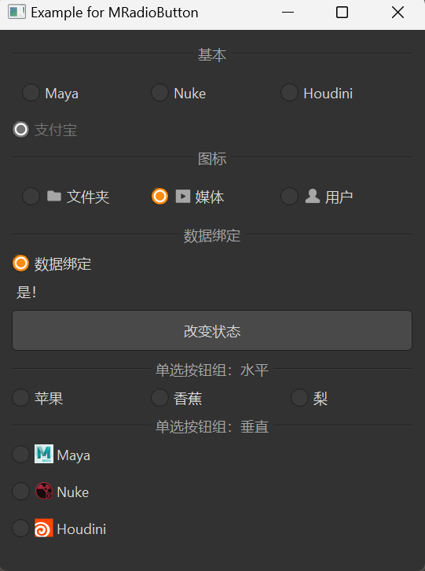

# MRadioButton 单选按钮

MRadioButton 是一个单选按钮组件，用于在一组选项中进行单项选择。它基于 Qt 的 QRadioButton 类，提供了更美观的样式和更好的交互体验。

## 导入

```python
from dayu_widgets.radio_button import MRadioButton
```

## 代码示例

### 基本使用

MRadioButton 可以创建一个简单的单选按钮，用户可以选中或取消选中。

```python
from dayu_widgets.radio_button import MRadioButton
from qtpy import QtWidgets

# 创建一个水平布局
layout = QtWidgets.QHBoxLayout()

# 添加三个单选按钮
layout.addWidget(MRadioButton("Maya"))
layout.addWidget(MRadioButton("Nuke"))
layout.addWidget(MRadioButton("Houdini"))

# 注意：默认情况下，同一父部件下的单选按钮是互斥的
```

### 带图标的单选按钮

MRadioButton 支持设置图标，可以在文本旁边显示一个图标。

```python
from dayu_widgets.radio_button import MRadioButton
from dayu_widgets.qt import MIcon

# 创建带图标的单选按钮
radio_button_1 = MRadioButton("文件夹")
radio_button_1.setIcon(MIcon("folder_fill.svg"))

radio_button_2 = MRadioButton("媒体")
radio_button_2.setIcon(MIcon("media_fill.svg"))

radio_button_3 = MRadioButton("用户")
radio_button_3.setIcon(MIcon("user_fill.svg"))

# 设置默认选中状态
radio_button_2.setChecked(True)
```

### 禁用状态

MRadioButton 可以设置为禁用状态，用户将无法与之交互。

```python
from dayu_widgets.radio_button import MRadioButton

# 创建一个禁用的单选按钮
radio_button = MRadioButton("禁用选项")
radio_button.setEnabled(False)

# 创建一个选中且禁用的单选按钮
radio_button_checked = MRadioButton("选中且禁用")
radio_button_checked.setChecked(True)
radio_button_checked.setEnabled(False)
```

### 数据绑定

MRadioButton 可以与 MFieldMixin 结合使用，实现数据绑定。

```python
# Import third-party modules
from qtpy import QtWidgets

# Import local modules
from dayu_widgets.radio_button import MRadioButton
from dayu_widgets.field_mixin import MFieldMixin
from dayu_widgets.label import MLabel
from dayu_widgets.push_button import MPushButton


class RadioButtonBindExample(QtWidgets.QWidget, MFieldMixin):
    def __init__(self, parent=None):
        super(RadioButtonBindExample, self).__init__(parent)
        self._init_ui()

    def _init_ui(self):
        # 创建单选按钮和标签
        radio_button = MRadioButton("数据绑定")
        label = MLabel()

        # 创建按钮用于改变状态
        button = MPushButton("改变状态")
        button.clicked.connect(lambda: self.set_field("checked", not self.field("checked")))

        # 注册字段和绑定
        self.register_field("checked", True)
        self.register_field("checked_text", lambda: "是！" if self.field("checked") else "否！！")
        self.bind("checked", radio_button, "checked", signal="toggled")
        self.bind("checked_text", label, "text")

        # 创建布局
        main_lay = QtWidgets.QVBoxLayout()
        main_lay.addWidget(radio_button)
        main_lay.addWidget(label)
        main_lay.addWidget(button)
        self.setLayout(main_lay)
```

### 单选按钮组

MRadioButtonGroup 是一个单选按钮组组件，可以方便地管理一组单选按钮。

```python
from dayu_widgets.button_group import MRadioButtonGroup
from qtpy import QtCore

# 创建水平布局的单选按钮组
radio_group_h = MRadioButtonGroup()
radio_group_h.set_button_list(["苹果", "香蕉", "梨"])

# 创建垂直布局的单选按钮组
radio_group_v = MRadioButtonGroup(orientation=QtCore.Qt.Vertical)
radio_group_v.set_button_list(["选项A", "选项B", "选项C"])

# 监听选中状态变化
radio_group_h.sig_checked_changed.connect(lambda index: print("选中的选项索引:", index))
```

### 带图标的单选按钮组

MRadioButtonGroup 支持为每个选项设置图标。

```python
from dayu_widgets.button_group import MRadioButtonGroup
from dayu_widgets.qt import MIcon

# 创建带图标的单选按钮组
radio_group = MRadioButtonGroup()
radio_group.set_button_list([
    {"text": "Maya", "icon": MIcon("app-maya.png")},
    {"text": "Nuke", "icon": MIcon("app-nuke.png")},
    {"text": "Houdini", "icon": MIcon("app-houdini.png")}
])
```

### 完整示例



以下是一个完整的示例，展示了 MRadioButton 和 MRadioButtonGroup 的各种用法：

```python
# Import third-party modules
from qtpy import QtCore
from qtpy import QtWidgets

# Import local modules
from dayu_widgets.button_group import MRadioButtonGroup
from dayu_widgets.divider import MDivider
from dayu_widgets.field_mixin import MFieldMixin
from dayu_widgets.label import MLabel
from dayu_widgets.push_button import MPushButton
from dayu_widgets.qt import MIcon
from dayu_widgets.radio_button import MRadioButton


class RadioButtonExample(QtWidgets.QWidget, MFieldMixin):
    def __init__(self, parent=None):
        super(RadioButtonExample, self).__init__(parent)
        self.setWindowTitle("Example for MRadioButton")
        self._init_ui()

    def _init_ui(self):
        # 基本单选按钮
        widget_1 = QtWidgets.QWidget()
        lay_1 = QtWidgets.QHBoxLayout()
        lay_1.addWidget(MRadioButton("Maya"))
        lay_1.addWidget(MRadioButton("Nuke"))
        lay_1.addWidget(MRadioButton("Houdini"))
        widget_1.setLayout(lay_1)

        # 带图标的单选按钮
        check_box_icon_1 = MRadioButton("文件夹")
        check_box_icon_1.setIcon(MIcon("folder_fill.svg"))
        check_box_icon_2 = MRadioButton("媒体")
        check_box_icon_2.setIcon(MIcon("media_fill.svg"))
        check_box_icon_3 = MRadioButton("用户")
        check_box_icon_3.setIcon(MIcon("user_fill.svg"))
        check_box_icon_2.setChecked(True)
        widget_2 = QtWidgets.QWidget()
        lay_2 = QtWidgets.QHBoxLayout()
        lay_2.addWidget(check_box_icon_1)
        lay_2.addWidget(check_box_icon_2)
        lay_2.addWidget(check_box_icon_3)
        widget_2.setLayout(lay_2)

        # 禁用的单选按钮
        check_box_single = MRadioButton("支付宝")
        check_box_single.setChecked(True)
        check_box_single.setEnabled(False)

        # 数据绑定
        check_box_bind = MRadioButton("数据绑定")
        label = MLabel()
        button = MPushButton(text="改变状态")
        button.clicked.connect(lambda: self.set_field("checked", not self.field("checked")))
        self.register_field("checked", True)
        self.register_field("checked_text", lambda: "是！" if self.field("checked") else "否！！")
        self.bind("checked", check_box_bind, "checked", signal="toggled")
        self.bind("checked_text", label, "text")

        # 单选按钮组
        radio_group_h = MRadioButtonGroup()
        radio_group_h.set_button_list(["苹果", {"text": "香蕉"}, {"text": "梨"}])

        app_data = [
            {"text": "Maya", "icon": MIcon("app-maya.png")},
            {"text": "Nuke", "icon": MIcon("app-nuke.png")},
            {"text": "Houdini", "icon": MIcon("app-houdini.png")},
        ]
        radio_group_v = MRadioButtonGroup(orientation=QtCore.Qt.Vertical)
        radio_group_v.set_button_list(app_data)

        # 主布局
        main_lay = QtWidgets.QVBoxLayout()
        main_lay.addWidget(MDivider("基本"))
        main_lay.addWidget(widget_1)
        main_lay.addWidget(check_box_single)
        main_lay.addWidget(MDivider("图标"))
        main_lay.addWidget(widget_2)
        main_lay.addWidget(MDivider("数据绑定"))
        main_lay.addWidget(check_box_bind)
        main_lay.addWidget(label)
        main_lay.addWidget(button)
        main_lay.addWidget(MDivider("单选按钮组：水平"))
        main_lay.addWidget(radio_group_h)
        main_lay.addWidget(MDivider("单选按钮组：垂直"))
        main_lay.addWidget(radio_group_v)
        main_lay.addStretch()
        self.setLayout(main_lay)


if __name__ == "__main__":
    # Import local modules
    from dayu_widgets import dayu_theme
    from dayu_widgets.qt import application

    with application() as app:
        test = RadioButtonExample()
        dayu_theme.apply(test)
        test.show()
```

## API

### MRadioButton

#### 构造函数

```python
MRadioButton(text="", parent=None)
```

| 参数 | 描述 | 类型 | 默认值 |
| --- | --- | --- | --- |
| `text` | 单选按钮显示的文本 | `str` | `""` |
| `parent` | 父部件 | `QWidget` | `None` |

#### 继承的方法

MRadioButton 继承自 QRadioButton，因此可以使用 QRadioButton 的所有方法，例如：

- `setChecked(bool)`: 设置单选按钮是否选中
- `isChecked()`: 获取单选按钮是否选中
- `setIcon(QIcon)`: 设置单选按钮的图标
- `setEnabled(bool)`: 设置单选按钮是否启用
- 更多方法请参考 Qt 文档

### MRadioButtonGroup

#### 构造函数

```python
MRadioButtonGroup(orientation=QtCore.Qt.Horizontal, parent=None)
```

| 参数 | 描述 | 类型 | 默认值 |
| --- | --- | --- | --- |
| `orientation` | 布局方向 | `QtCore.Qt.Orientation` | `QtCore.Qt.Horizontal` |
| `parent` | 父部件 | `QWidget` | `None` |

#### 方法

| 方法 | 描述 | 参数 | 返回值 |
| --- | --- | --- | --- |
| `set_button_list(data_list)` | 设置按钮列表 | `data_list`: 按钮数据列表 | 无 |
| `get_dayu_checked()` | 获取选中的按钮索引 | 无 | `int` |
| `set_dayu_checked(value)` | 设置选中的按钮索引 | `value`: 要选中的按钮索引 | 无 |
| `set_spacing(value)` | 设置按钮之间的间距 | `value`: 间距值 | 无 |
| `get_button_group()` | 获取内部的 QButtonGroup | 无 | `QButtonGroup` |

#### 信号

| 信号 | 描述 | 参数 |
| --- | --- | --- |
| `sig_checked_changed` | 选中状态变化时触发 | `int`: 选中的按钮索引 |

#### 按钮数据

按钮数据可以是字符串或字典：

- 如果是字符串，则作为按钮的文本
- 如果是字典，可以包含以下键：
  - `text`: 按钮文本
  - `icon`: 按钮图标
  - `checked`: 按钮是否默认选中

## 常见问题

### 如何创建互斥的单选按钮组？

默认情况下，同一父部件下的单选按钮是互斥的，即一次只能选中一个。如果需要创建多个互斥组，可以使用 QButtonGroup：

```python
from dayu_widgets.radio_button import MRadioButton
from qtpy import QtWidgets

# 创建两个按钮组
group1 = QtWidgets.QButtonGroup()
group2 = QtWidgets.QButtonGroup()

# 第一组单选按钮
radio1_1 = MRadioButton("选项 1-1")
radio1_2 = MRadioButton("选项 1-2")
group1.addButton(radio1_1)
group1.addButton(radio1_2)

# 第二组单选按钮
radio2_1 = MRadioButton("选项 2-1")
radio2_2 = MRadioButton("选项 2-2")
group2.addButton(radio2_1)
group2.addButton(radio2_2)

# 现在，每组内的单选按钮是互斥的，但组之间不互斥
```

或者使用 MRadioButtonGroup：

```python
from dayu_widgets.button_group import MRadioButtonGroup

# 创建两个单选按钮组
group1 = MRadioButtonGroup()
group1.set_button_list(["选项 1-1", "选项 1-2"])

group2 = MRadioButtonGroup()
group2.set_button_list(["选项 2-1", "选项 2-2"])

# 现在，每组内的单选按钮是互斥的，但组之间不互斥
```

### 如何监听单选按钮状态变化？

可以通过连接 `toggled` 信号来监听单选按钮状态变化：

```python
from dayu_widgets.radio_button import MRadioButton

# 创建单选按钮
radio_button = MRadioButton("选项")

# 监听状态变化
radio_button.toggled.connect(lambda checked: print("选中状态:", checked))
```

对于 MRadioButtonGroup，可以通过连接 `sig_checked_changed` 信号来监听选中状态变化：

```python
from dayu_widgets.button_group import MRadioButtonGroup

# 创建单选按钮组
radio_group = MRadioButtonGroup()
radio_group.set_button_list(["选项 1", "选项 2", "选项 3"])

# 监听选中状态变化
radio_group.sig_checked_changed.connect(lambda index: print("选中的选项索引:", index))
```

### 如何在 MRadioButtonGroup 中设置默认选中的选项？

可以通过 `set_dayu_checked` 方法设置默认选中的选项：

```python
from dayu_widgets.button_group import MRadioButtonGroup

# 创建单选按钮组
radio_group = MRadioButtonGroup()
radio_group.set_button_list(["选项 1", "选项 2", "选项 3", "选项 4"])

# 设置默认选中的选项（索引从 0 开始）
radio_group.set_dayu_checked(2)  # 选中 "选项 3"
```

或者在设置按钮列表时，通过字典的 `checked` 键设置默认选中状态：

```python
from dayu_widgets.button_group import MRadioButtonGroup

# 创建单选按钮组
radio_group = MRadioButtonGroup()
radio_group.set_button_list([
    "选项 1",
    {"text": "选项 2", "checked": True},  # 默认选中
    "选项 3"
])
```

### 如何获取 MRadioButtonGroup 中选中的选项？

可以通过 `get_dayu_checked` 方法获取选中的选项索引：

```python
from dayu_widgets.button_group import MRadioButtonGroup

# 创建单选按钮组
radio_group = MRadioButtonGroup()
radio_group.set_button_list(["选项 1", "选项 2", "选项 3"])

# 获取选中的选项索引
checked_index = radio_group.get_dayu_checked()
print("选中的选项索引:", checked_index)
```
