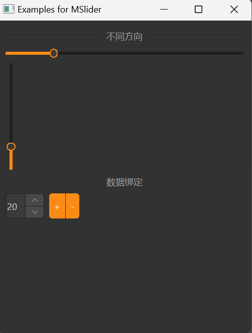

# MSlider 滑块

MSlider 是一个滑块组件，用于在一个固定区间内进行值的选择。它基于 Qt 的 QSlider 类，提供了更美观的样式和更好的交互体验。

## 导入

```python
from dayu_widgets.slider import MSlider
```

## 代码示例

### 基本使用

MSlider 可以创建一个简单的滑块，用户可以通过拖动滑块来选择值。

```python
from dayu_widgets.slider import MSlider
from qtpy import QtCore

# 创建一个水平滑块
slider_h = MSlider(QtCore.Qt.Horizontal)
slider_h.setRange(0, 100)
slider_h.setValue(50)

# 创建一个垂直滑块
slider_v = MSlider(QtCore.Qt.Vertical)
slider_v.setRange(0, 100)
slider_v.setValue(50)
```

### 禁用提示文本

默认情况下，当用户拖动滑块时，会显示当前值的提示文本。可以通过 `disable_show_text` 方法禁用此功能。

```python
from dayu_widgets.slider import MSlider

# 创建一个滑块
slider = MSlider()
slider.setRange(0, 100)
slider.setValue(50)

# 禁用提示文本
slider.disable_show_text()
```

### 数据绑定

MSlider 可以与 MFieldMixin 结合使用，实现数据绑定。

```python
# Import third-party modules
from qtpy import QtCore
from qtpy import QtWidgets

# Import local modules
from dayu_widgets.slider import MSlider
from dayu_widgets.field_mixin import MFieldMixin
from dayu_widgets.spin_box import MSpinBox


class SliderBindExample(QtWidgets.QWidget, MFieldMixin):
    def __init__(self, parent=None):
        super(SliderBindExample, self).__init__(parent)
        self._init_ui()

    def _init_ui(self):
        # 注册字段
        self.register_field("value", 50)

        # 创建滑块和数字输入框
        slider = MSlider(QtCore.Qt.Horizontal)
        slider.setRange(0, 100)

        spin_box = MSpinBox()
        spin_box.setRange(0, 100)

        # 绑定数据
        self.bind("value", slider, "value")
        self.bind("value", spin_box, "value", signal="valueChanged")

        # 创建布局
        main_lay = QtWidgets.QVBoxLayout()
        main_lay.addWidget(slider)
        main_lay.addWidget(spin_box)
        self.setLayout(main_lay)
```

### 完整示例



以下是一个完整的示例，展示了 MSlider 的各种用法：

```python
# Import built-in modules
import functools

# Import third-party modules
from qtpy import QtCore
from qtpy import QtWidgets

# Import local modules
from dayu_widgets.button_group import MPushButtonGroup
from dayu_widgets.divider import MDivider
from dayu_widgets.field_mixin import MFieldMixin
from dayu_widgets.slider import MSlider
from dayu_widgets.spin_box import MSpinBox


class SliderExample(QtWidgets.QWidget, MFieldMixin):
    def __init__(self, parent=None):
        super(SliderExample, self).__init__(parent)
        self.setWindowTitle("Examples for MSlider")
        self._init_ui()

    def _init_ui(self):
        self.register_field("percent", 20)
        main_lay = QtWidgets.QVBoxLayout()
        main_lay.addWidget(MDivider("不同方向"))
        for orn in [QtCore.Qt.Horizontal, QtCore.Qt.Vertical]:
            slider = MSlider(orn)
            slider.setRange(1, 100)
            self.bind("percent", slider, "value")
            lay = QtWidgets.QVBoxLayout()
            lay.addWidget(slider)
            main_lay.addLayout(lay)
        spin_box = MSpinBox()
        spin_box.setRange(1, 100)
        self.bind("percent", spin_box, "value", signal="valueChanged")

        lay3 = QtWidgets.QHBoxLayout()
        button_grp = MPushButtonGroup()
        button_grp.set_button_list(
            [
                {"text": "+", "clicked": functools.partial(self.slot_change_value, 10)},
                {
                    "text": "-",
                    "clicked": functools.partial(self.slot_change_value, -10),
                },
            ]
        )
        lay3.addWidget(spin_box)
        lay3.addWidget(button_grp)
        lay3.addStretch()
        main_lay.addWidget(MDivider("数据绑定"))
        main_lay.addLayout(lay3)
        main_lay.addStretch()
        self.setLayout(main_lay)

    def slot_change_value(self, value):
        self.set_field("percent", max(0, min(self.field("percent") + value, 100)))


if __name__ == "__main__":
    # Import local modules
    from dayu_widgets import dayu_theme
    from dayu_widgets.qt import application

    with application() as app:
        test = SliderExample()
        dayu_theme.apply(test)
        test.show()
```

## API

### 构造函数

```python
MSlider(orientation=QtCore.Qt.Horizontal, parent=None)
```

| 参数 | 描述 | 类型 | 默认值 |
| --- | --- | --- | --- |
| `orientation` | 滑块的方向 | `QtCore.Qt.Orientation` | `QtCore.Qt.Horizontal` |
| `parent` | 父部件 | `QWidget` | `None` |

### 方法

| 方法 | 描述 | 参数 | 返回值 |
| --- | --- | --- | --- |
| `disable_show_text()` | 禁用拖动时显示提示文本 | 无 | 无 |

### 继承的方法

MSlider 继承自 QSlider，因此可以使用 QSlider 的所有方法，例如：

- `setRange(min, max)`: 设置滑块的范围
- `setValue(value)`: 设置滑块的当前值
- `value()`: 获取滑块的当前值
- `setOrientation(orientation)`: 设置滑块的方向
- `setTickPosition(position)`: 设置刻度线的位置
- `setTickInterval(interval)`: 设置刻度线的间隔
- 更多方法请参考 Qt 文档

### 信号

MSlider 继承自 QSlider，因此可以使用 QSlider 的所有信号，例如：

- `valueChanged(int)`: 当值变化时触发
- `sliderPressed()`: 当滑块被按下时触发
- `sliderMoved(int)`: 当滑块被移动时触发
- `sliderReleased()`: 当滑块被释放时触发
- 更多信号请参考 Qt 文档

## 常见问题

### 如何监听滑块值的变化？

可以通过连接 `valueChanged` 信号来监听滑块值的变化：

```python
from dayu_widgets.slider import MSlider

# 创建滑块
slider = MSlider()
slider.setRange(0, 100)
slider.setValue(50)

# 监听值变化
slider.valueChanged.connect(lambda value: print("当前值:", value))
```

### 如何设置滑块的刻度线？

可以通过 `setTickPosition` 和 `setTickInterval` 方法设置滑块的刻度线：

```python
from dayu_widgets.slider import MSlider
from qtpy import QtWidgets

# 创建滑块
slider = MSlider()
slider.setRange(0, 100)
slider.setValue(50)

# 设置刻度线
slider.setTickPosition(QtWidgets.QSlider.TicksBelow)  # 在下方显示刻度线
slider.setTickInterval(10)  # 每 10 个单位显示一个刻度线
```

### 如何创建一个双向绑定的滑块和数字输入框？

可以使用 MFieldMixin 创建一个双向绑定的滑块和数字输入框：

```python
from dayu_widgets.slider import MSlider
from dayu_widgets.spin_box import MSpinBox
from dayu_widgets.field_mixin import MFieldMixin
from qtpy import QtWidgets

class SliderSpinBoxExample(QtWidgets.QWidget, MFieldMixin):
    def __init__(self, parent=None):
        super(SliderSpinBoxExample, self).__init__(parent)

        # 注册字段
        self.register_field("value", 50)

        # 创建滑块
        slider = MSlider()
        slider.setRange(0, 100)

        # 创建数字输入框
        spin_box = MSpinBox()
        spin_box.setRange(0, 100)

        # 绑定数据
        self.bind("value", slider, "value")
        self.bind("value", spin_box, "value", signal="valueChanged")

        # 创建布局
        layout = QtWidgets.QVBoxLayout()
        layout.addWidget(slider)
        layout.addWidget(spin_box)
        self.setLayout(layout)
```

### 如何禁用滑块？

可以通过 `setEnabled` 方法禁用滑块：

```python
from dayu_widgets.slider import MSlider

# 创建滑块
slider = MSlider()
slider.setRange(0, 100)
slider.setValue(50)

# 禁用滑块
slider.setEnabled(False)
```
