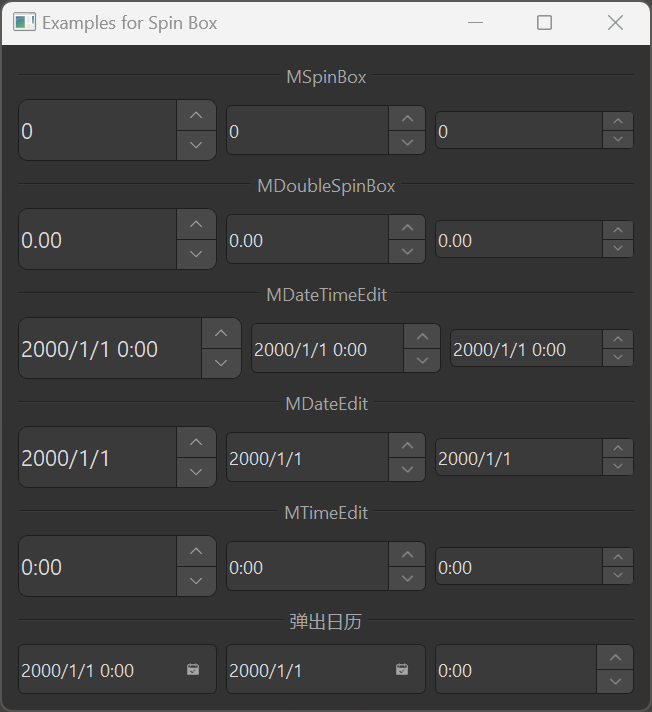

# MSpinBox 数字输入框

MSpinBox 是一个数字输入框组件，用于输入整数值。它基于 Qt 的 QSpinBox 类，提供了更美观的样式和更好的交互体验。此外，dayu_widgets 还提供了 MDoubleSpinBox、MDateTimeEdit、MDateEdit 和 MTimeEdit 组件，用于输入浮点数、日期时间、日期和时间。

## 导入

```python
from dayu_widgets.spin_box import MSpinBox
from dayu_widgets.spin_box import MDoubleSpinBox
from dayu_widgets.spin_box import MDateTimeEdit
from dayu_widgets.spin_box import MDateEdit
from dayu_widgets.spin_box import MTimeEdit
```

## 代码示例

### 基本使用

MSpinBox 可以创建一个简单的整数输入框，用户可以通过点击上下按钮或直接输入来设置值。

```python
from dayu_widgets.spin_box import MSpinBox

# 创建一个整数输入框
spin_box = MSpinBox()
spin_box.setRange(0, 100)
spin_box.setValue(50)
```

### 不同尺寸

MSpinBox 支持不同的尺寸，可以通过方法链式调用设置。

```python
from dayu_widgets.spin_box import MSpinBox

# 创建大尺寸的整数输入框
spin_box_large = MSpinBox().large()

# 创建中等尺寸的整数输入框（默认）
spin_box_medium = MSpinBox().medium()

# 创建小尺寸的整数输入框
spin_box_small = MSpinBox().small()
```

### 浮点数输入框

MDoubleSpinBox 可以创建一个浮点数输入框，用于输入小数值。

```python
from dayu_widgets.spin_box import MDoubleSpinBox

# 创建一个浮点数输入框
double_spin_box = MDoubleSpinBox()
double_spin_box.setRange(0.0, 1.0)
double_spin_box.setValue(0.5)
double_spin_box.setSingleStep(0.1)
double_spin_box.setDecimals(2)  # 设置小数位数
```

### 日期时间输入框

MDateTimeEdit、MDateEdit 和 MTimeEdit 可以创建日期时间、日期和时间输入框。

```python
# Import built-in modules
import datetime

# Import local modules
from dayu_widgets.spin_box import MDateTimeEdit
from dayu_widgets.spin_box import MDateEdit
from dayu_widgets.spin_box import MTimeEdit

# 创建一个日期时间输入框
date_time_edit = MDateTimeEdit()
date_time_edit.setDateTime(datetime.datetime.now())

# 创建一个日期输入框
date_edit = MDateEdit()
date_edit.setDate(datetime.datetime.now().date())

# 创建一个时间输入框
time_edit = MTimeEdit()
time_edit.setTime(datetime.datetime.now().time())
```

### 弹出日历

MDateTimeEdit 和 MDateEdit 支持弹出日历，方便用户选择日期。

```python
from dayu_widgets.spin_box import MDateTimeEdit
from dayu_widgets.spin_box import MDateEdit

# 创建一个带弹出日历的日期时间输入框
date_time_edit = MDateTimeEdit()
date_time_edit.setCalendarPopup(True)

# 创建一个带弹出日历的日期输入框
date_edit = MDateEdit()
date_edit.setCalendarPopup(True)
```

### 数据绑定

MSpinBox 可以与 MFieldMixin 结合使用，实现数据绑定。

```python
# Import third-party modules
from qtpy import QtWidgets

# Import local modules
from dayu_widgets.spin_box import MSpinBox
from dayu_widgets.field_mixin import MFieldMixin
from dayu_widgets.slider import MSlider


class SpinBoxBindExample(QtWidgets.QWidget, MFieldMixin):
    def __init__(self, parent=None):
        super(SpinBoxBindExample, self).__init__(parent)
        self._init_ui()

    def _init_ui(self):
        # 注册字段
        self.register_field("value", 50)

        # 创建数字输入框和滑块
        spin_box = MSpinBox()
        spin_box.setRange(0, 100)

        slider = MSlider()
        slider.setRange(0, 100)

        # 绑定数据
        self.bind("value", spin_box, "value", signal="valueChanged")
        self.bind("value", slider, "value")

        # 创建布局
        main_lay = QtWidgets.QVBoxLayout()
        main_lay.addWidget(spin_box)
        main_lay.addWidget(slider)
        self.setLayout(main_lay)
```

### 完整示例



以下是一个完整的示例，展示了 MSpinBox 及相关组件的各种用法：

```python
# Import third-party modules
from qtpy import QtWidgets

# Import local modules
from dayu_widgets.divider import MDivider
from dayu_widgets.spin_box import MDateEdit
from dayu_widgets.spin_box import MDateTimeEdit
from dayu_widgets.spin_box import MDoubleSpinBox
from dayu_widgets.spin_box import MSpinBox
from dayu_widgets.spin_box import MTimeEdit


class SpinBoxExample(QtWidgets.QWidget):
    def __init__(self, parent=None):
        super(SpinBoxExample, self).__init__(parent)
        self.setWindowTitle("Examples for Spin Box")

        main_lay = QtWidgets.QVBoxLayout()
        class_list = [MSpinBox, MDoubleSpinBox, MDateTimeEdit, MDateEdit, MTimeEdit]
        for cls in class_list:
            main_lay.addWidget(MDivider(cls.__name__))
            lay = QtWidgets.QHBoxLayout()
            lay.addWidget(cls().large())
            lay.addWidget(cls().medium())
            lay.addWidget(cls().small())
            main_lay.addLayout(lay)

        main_lay.addWidget(MDivider("弹出日历"))
        date_time_edit = MDateTimeEdit()
        date_time_edit.setCalendarPopup(True)
        date_edit = MDateEdit()
        date_edit.setCalendarPopup(True)
        time_edit = MTimeEdit()
        time_edit.setCalendarPopup(True)
        date_lay = QtWidgets.QHBoxLayout()
        date_lay.addWidget(date_time_edit)
        date_lay.addWidget(date_edit)
        date_lay.addWidget(time_edit)
        main_lay.addLayout(date_lay)

        main_lay.addStretch()
        self.setLayout(main_lay)


if __name__ == "__main__":
    # Import local modules
    from dayu_widgets import dayu_theme
    from dayu_widgets.qt import application

    with application() as app:
        test = SpinBoxExample()
        dayu_theme.apply(test)
        test.show()
```

## API

### MSpinBox

#### 构造函数

```python
MSpinBox(parent=None)
```

| 参数 | 描述 | 类型 | 默认值 |
| --- | --- | --- | --- |
| `parent` | 父部件 | `QWidget` | `None` |

#### 方法

| 方法 | 描述 | 参数 | 返回值 |
| --- | --- | --- | --- |
| `set_dayu_size(value)` | 设置输入框的尺寸 | `value`: 尺寸值 | 无 |
| `get_dayu_size()` | 获取输入框的尺寸 | 无 | `int` |
| `huge()` | 设置为超大尺寸 | 无 | `self` |
| `large()` | 设置为大尺寸 | 无 | `self` |
| `medium()` | 设置为中等尺寸 | 无 | `self` |
| `small()` | 设置为小尺寸 | 无 | `self` |
| `tiny()` | 设置为超小尺寸 | 无 | `self` |

#### 继承的方法

MSpinBox 继承自 QSpinBox，因此可以使用 QSpinBox 的所有方法，例如：

- `setRange(min, max)`: 设置数值范围
- `setValue(value)`: 设置当前值
- `value()`: 获取当前值
- `setPrefix(prefix)`: 设置前缀
- `setSuffix(suffix)`: 设置后缀
- `setSingleStep(step)`: 设置单步值
- 更多方法请参考 Qt 文档

### MDoubleSpinBox

#### 构造函数

```python
MDoubleSpinBox(parent=None)
```

| 参数 | 描述 | 类型 | 默认值 |
| --- | --- | --- | --- |
| `parent` | 父部件 | `QWidget` | `None` |

#### 方法

与 MSpinBox 相同，并增加了以下方法：

- `setDecimals(precision)`: 设置小数位数

### MDateTimeEdit

#### 构造函数

```python
MDateTimeEdit(datetime=None, parent=None)
```

| 参数 | 描述 | 类型 | 默认值 |
| --- | --- | --- | --- |
| `datetime` | 初始日期时间 | `datetime.datetime` | `None` |
| `parent` | 父部件 | `QWidget` | `None` |

#### 方法

与 MSpinBox 相同，并增加了以下方法：

- `setCalendarPopup(enable)`: 设置是否显示弹出日历
- `setDateTime(datetime)`: 设置日期时间
- `dateTime()`: 获取日期时间

### MDateEdit

#### 构造函数

```python
MDateEdit(date=None, parent=None)
```

| 参数 | 描述 | 类型 | 默认值 |
| --- | --- | --- | --- |
| `date` | 初始日期 | `datetime.datetime` 或 `datetime.date` | `None` |
| `parent` | 父部件 | `QWidget` | `None` |

#### 方法

与 MSpinBox 相同，并增加了以下方法：

- `setCalendarPopup(enable)`: 设置是否显示弹出日历
- `setDate(date)`: 设置日期
- `date()`: 获取日期

### MTimeEdit

#### 构造函数

```python
MTimeEdit(time=None, parent=None)
```

| 参数 | 描述 | 类型 | 默认值 |
| --- | --- | --- | --- |
| `time` | 初始时间 | `datetime.datetime` 或 `datetime.time` | `None` |
| `parent` | 父部件 | `QWidget` | `None` |

#### 方法

与 MSpinBox 相同，并增加了以下方法：

- `setTime(time)`: 设置时间
- `time()`: 获取时间

## 常见问题

### 如何监听值的变化？

可以通过连接 `valueChanged` 信号来监听值的变化：

```python
from dayu_widgets.spin_box import MSpinBox

# 创建数字输入框
spin_box = MSpinBox()
spin_box.setRange(0, 100)
spin_box.setValue(50)

# 监听值变化
spin_box.valueChanged.connect(lambda value: print("当前值:", value))
```

对于 MDoubleSpinBox，可以使用 `valueChanged` 信号：

```python
from dayu_widgets.spin_box import MDoubleSpinBox

# 创建浮点数输入框
double_spin_box = MDoubleSpinBox()
double_spin_box.setRange(0.0, 1.0)
double_spin_box.setValue(0.5)

# 监听值变化
double_spin_box.valueChanged.connect(lambda value: print("当前值:", value))
```

对于 MDateTimeEdit、MDateEdit 和 MTimeEdit，可以使用相应的信号：

```python
from dayu_widgets.spin_box import MDateTimeEdit, MDateEdit, MTimeEdit

# 创建日期时间输入框
date_time_edit = MDateTimeEdit()
date_edit = MDateEdit()
time_edit = MTimeEdit()

# 监听值变化
date_time_edit.dateTimeChanged.connect(lambda datetime: print("当前日期时间:", datetime))
date_edit.dateChanged.connect(lambda date: print("当前日期:", date))
time_edit.timeChanged.connect(lambda time: print("当前时间:", time))
```

### 如何设置前缀和后缀？

可以通过 `setPrefix` 和 `setSuffix` 方法设置前缀和后缀：

```python
from dayu_widgets.spin_box import MSpinBox, MDoubleSpinBox

# 创建数字输入框
spin_box = MSpinBox()
spin_box.setRange(0, 100)
spin_box.setValue(50)
spin_box.setPrefix("$")
spin_box.setSuffix(" 元")

# 创建浮点数输入框
double_spin_box = MDoubleSpinBox()
double_spin_box.setRange(0.0, 1.0)
double_spin_box.setValue(0.5)
double_spin_box.setPrefix("比例: ")
double_spin_box.setSuffix(" %")
```

### 如何设置步长？

可以通过 `setSingleStep` 方法设置步长：

```python
from dayu_widgets.spin_box import MSpinBox, MDoubleSpinBox

# 创建数字输入框
spin_box = MSpinBox()
spin_box.setRange(0, 100)
spin_box.setValue(50)
spin_box.setSingleStep(5)  # 每次点击增加或减少 5

# 创建浮点数输入框
double_spin_box = MDoubleSpinBox()
double_spin_box.setRange(0.0, 1.0)
double_spin_box.setValue(0.5)
double_spin_box.setSingleStep(0.1)  # 每次点击增加或减少 0.1
```

### 如何禁用输入框？

可以通过 `setEnabled` 方法禁用输入框：

```python
from dayu_widgets.spin_box import MSpinBox

# 创建数字输入框
spin_box = MSpinBox()
spin_box.setRange(0, 100)
spin_box.setValue(50)

# 禁用输入框
spin_box.setEnabled(False)
```
