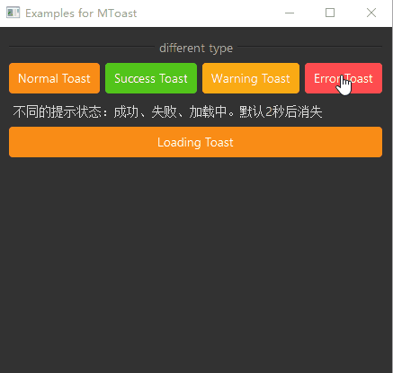

# MToast 轻提示

MToast 是一个轻量级的提示组件，用于在页面中显示简短的消息反馈。它会在页面中央显示，并自动消失，适用于不需要用户操作的简单反馈。

## 导入

```python
from dayu_widgets.toast import MToast
```

## 代码示例

### 基本使用

MToast 提供了四种不同类型的轻提示：信息、成功、警告和错误。

```python
from dayu_widgets.toast import MToast

# 显示信息提示
MToast.info(text="这是一条信息提示", parent=self)

# 显示成功提示
MToast.success(text="这是一条成功提示", parent=self)

# 显示警告提示
MToast.warning(text="这是一条警告提示", parent=self)

# 显示错误提示
MToast.error(text="这是一条错误提示", parent=self)
```

### 自定义显示时长

MToast 默认显示 2 秒后自动消失，可以通过 `duration` 参数自定义显示时长。

```python
from dayu_widgets.toast import MToast

# 显示 5 秒后消失的提示
MToast.info(text="该条消息将显示 5 秒后关闭", parent=self, duration=5)
```

### 完整示例



以下是一个完整的示例，展示了 MToast 的各种用法：

```python
# Import built-in modules
import functools

# Import third-party modules
from qtpy import QtWidgets

# Import local modules
from dayu_widgets.button_group import MPushButtonGroup
from dayu_widgets.divider import MDivider
from dayu_widgets.field_mixin import MFieldMixin
from dayu_widgets.label import MLabel
from dayu_widgets.push_button import MPushButton
from dayu_widgets.toast import MToast


class ToastExample(QtWidgets.QWidget, MFieldMixin):
    def __init__(self, parent=None):
        super(ToastExample, self).__init__(parent)
        self.setWindowTitle("Examples for MToast")
        self._init_ui()

    def _init_ui(self):
        button_1 = MPushButton(text="Normal Toast").primary()
        button_2 = MPushButton(text="Success Toast").success()
        button_3 = MPushButton(text="Warning Toast").warning()
        button_4 = MPushButton(text="Error Toast").danger()
        button_1.clicked.connect(
            functools.partial(
                self.slot_show_toast, MToast.info, {"text": "这是一条普通提示"}
            )
        )
        button_2.clicked.connect(
            functools.partial(
                self.slot_show_toast, MToast.success, {"text": "恭喜你，成功啦！"}
            )
        )
        button_3.clicked.connect(
            functools.partial(
                self.slot_show_toast, MToast.warning, {"text": "我警告你哦！"}
            )
        )
        button_4.clicked.connect(
            functools.partial(
                self.slot_show_toast, MToast.error, {"text": "失败了！"}
            )
        )

        sub_lay1 = QtWidgets.QHBoxLayout()
        sub_lay1.addWidget(button_1)
        sub_lay1.addWidget(button_2)
        sub_lay1.addWidget(button_3)
        sub_lay1.addWidget(button_4)

        button_duration = MPushButton(text="显示 5 秒的提示")
        button_duration.clicked.connect(
            functools.partial(
                self.slot_show_toast,
                MToast.info,
                {"text": "该条消息将显示 5 秒后关闭", "duration": 5},
            )
        )

        main_lay = QtWidgets.QVBoxLayout()
        main_lay.addWidget(MDivider("不同类型"))
        main_lay.addLayout(sub_lay1)
        main_lay.addWidget(MLabel("不同的提示状态：普通、成功、警告、错误。默认 2 秒后消失"))
        main_lay.addWidget(MDivider("自定义时长"))
        main_lay.addWidget(button_duration)
        main_lay.addWidget(MLabel("自定义时长，duration 参数设置值，单位为秒"))

        main_lay.addStretch()
        self.setLayout(main_lay)

    def slot_show_toast(self, func, config):
        func(parent=self, **config)


if __name__ == "__main__":
    # Import local modules
    from dayu_widgets import dayu_theme
    from dayu_widgets.qt import application

    with application() as app:
        test = ToastExample()
        dayu_theme.apply(test)
        test.show()
```

## API

### 类方法

| 方法 | 描述 | 参数 | 返回值 |
| --- | --- | --- | --- |
| `info(text, parent, duration=None)` | 显示信息提示 | `text`: 提示文本<br>`parent`: 父部件<br>`duration`: 显示时长（秒） | `MToast` 实例 |
| `success(text, parent, duration=None)` | 显示成功提示 | `text`: 提示文本<br>`parent`: 父部件<br>`duration`: 显示时长（秒） | `MToast` 实例 |
| `warning(text, parent, duration=None)` | 显示警告提示 | `text`: 提示文本<br>`parent`: 父部件<br>`duration`: 显示时长（秒） | `MToast` 实例 |
| `error(text, parent, duration=None)` | 显示错误提示 | `text`: 提示文本<br>`parent`: 父部件<br>`duration`: 显示时长（秒） | `MToast` 实例 |

### 类常量

| 常量 | 描述 | 值 |
| --- | --- | --- |
| `InfoType` | 信息类型 | `"info"` |
| `SuccessType` | 成功类型 | `"success"` |
| `WarningType` | 警告类型 | `"warning"` |
| `ErrorType` | 错误类型 | `"error"` |

### 默认配置

| 配置项 | 描述 | 默认值 |
| --- | --- | --- |
| `duration` | 默认显示时长（秒） | `2` |

## 常见问题

### 如何显示不同类型的提示？

可以使用 MToast 的类方法显示不同类型的提示：

```python
from dayu_widgets.toast import MToast

# 显示信息提示
MToast.info(text="这是一条信息提示", parent=self)

# 显示成功提示
MToast.success(text="这是一条成功提示", parent=self)

# 显示警告提示
MToast.warning(text="这是一条警告提示", parent=self)

# 显示错误提示
MToast.error(text="这是一条错误提示", parent=self)
```

### 如何自定义提示的显示时长？

可以通过 `duration` 参数自定义提示的显示时长：

```python
from dayu_widgets.toast import MToast

# 显示 5 秒后消失的提示
MToast.info(text="该条消息将显示 5 秒后关闭", parent=self, duration=5)
```

### MToast 和 MMessage 有什么区别？

MToast 和 MMessage 都是用于显示提示信息的组件，但它们有以下区别：

1. **显示位置**：MToast 在页面中央显示，而 MMessage 在页面顶部居中显示。
2. **使用场景**：MToast 适用于简单的操作反馈，如点击按钮后的确认提示；MMessage 适用于需要用户关注的重要信息，如操作结果的通知。
3. **功能**：MMessage 支持可关闭和加载中状态，而 MToast 更加简洁，只提供基本的提示功能。

### 如何在异步操作完成后显示提示？

可以在异步操作的回调函数中显示提示：

```python
from dayu_widgets.toast import MToast

# 模拟异步操作
def async_operation():
    # 异步操作完成后显示提示
    MToast.success(text="操作成功", parent=self)

# 或者使用 QTimer 延迟显示
from qtpy import QtCore

timer = QtCore.QTimer()
timer.setSingleShot(True)
timer.timeout.connect(lambda: MToast.success(text="操作成功", parent=self))
timer.start(2000)  # 2 秒后显示提示
```
