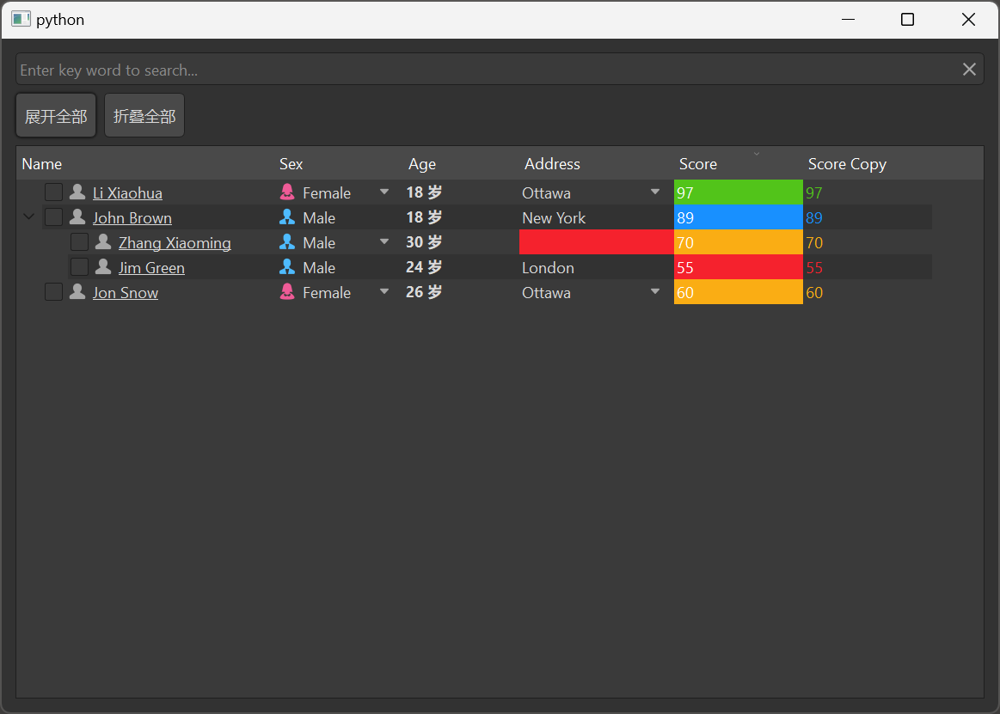

# MTreeView 树形视图

MTreeView 是一个树形视图组件，用于展示具有层级结构的数据。它基于 Qt 的 QTreeView 类，提供了更美观的样式和更好的交互体验，支持排序、筛选、展开/折叠等功能。

## 导入

```python
from dayu_widgets.item_view import MTreeView
```

## 代码示例

### 基本使用

MTreeView 需要与 MTableModel 和 MSortFilterModel 一起使用，以展示和管理数据。

```python
from dayu_widgets.item_view import MTreeView
from dayu_widgets.item_model import MTableModel
from dayu_widgets.item_model import MSortFilterModel

# 创建模型
model = MTableModel()
model.set_header_list([
    {"key": "name", "label": "名称"},
    {"key": "size", "label": "大小"},
    {"key": "type", "label": "类型"}
])

# 创建排序筛选模型
sort_filter_model = MSortFilterModel()
sort_filter_model.setSourceModel(model)

# 创建树形视图
tree_view = MTreeView()
tree_view.setModel(sort_filter_model)
tree_view.set_header_list([
    {"key": "name", "label": "名称"},
    {"key": "size", "label": "大小"},
    {"key": "type", "label": "类型"}
])

# 设置数据（树形结构）
model.set_data_list([
    {"name": "文档", "size": "-", "type": "文件夹", "children": [
        {"name": "报告.docx", "size": "24KB", "type": "Word文档"},
        {"name": "数据.xlsx", "size": "38KB", "type": "Excel表格"}
    ]},
    {"name": "图片", "size": "-", "type": "文件夹", "children": [
        {"name": "照片1.jpg", "size": "1.2MB", "type": "图片"},
        {"name": "照片2.jpg", "size": "1.5MB", "type": "图片"}
    ]},
    {"name": "音乐", "size": "-", "type": "文件夹", "children": [
        {"name": "歌曲1.mp3", "size": "4.2MB", "type": "音频"},
        {"name": "歌曲2.mp3", "size": "3.8MB", "type": "音频"}
    ]}
])
```

### 展开和折叠

MTreeView 提供了展开和折叠节点的方法。

```python
from dayu_widgets.item_view import MTreeView
from dayu_widgets.push_button import MPushButton

# 创建树形视图
tree_view = MTreeView()

# 创建展开和折叠按钮
expand_button = MPushButton("展开全部")
expand_button.clicked.connect(tree_view.expandAll)

collapse_button = MPushButton("折叠全部")
collapse_button.clicked.connect(tree_view.collapseAll)
```

### 搜索过滤

MTreeView 可以与 MLineEdit 结合使用，实现搜索过滤功能。

```python
from dayu_widgets.item_view import MTreeView
from dayu_widgets.item_model import MTableModel
from dayu_widgets.item_model import MSortFilterModel
from dayu_widgets.line_edit import MLineEdit

# 创建模型和视图
model = MTableModel()
sort_filter_model = MSortFilterModel()
sort_filter_model.setSourceModel(model)
tree_view = MTreeView()
tree_view.setModel(sort_filter_model)

# 创建搜索框
search_line_edit = MLineEdit().search().small()
search_line_edit.textChanged.connect(sort_filter_model.set_search_pattern)
```

### 完整示例



以下是一个完整的示例，展示了 MTreeView 的各种用法：

```python
# Import third-party modules
from qtpy import QtWidgets

# Import local modules
from dayu_widgets import dayu_theme
from dayu_widgets.field_mixin import MFieldMixin
from dayu_widgets.item_model import MSortFilterModel
from dayu_widgets.item_model import MTableModel
from dayu_widgets.item_view import MTreeView
from dayu_widgets.line_edit import MLineEdit
from dayu_widgets.push_button import MPushButton
import examples._mock_data as mock


class TreeViewExample(QtWidgets.QWidget, MFieldMixin):
    def __init__(self, parent=None):
        super(TreeViewExample, self).__init__(parent)
        self._init_ui()

    def _init_ui(self):
        model_1 = MTableModel()
        model_1.set_header_list(mock.header_list)
        model_sort = MSortFilterModel()
        model_sort.setSourceModel(model_1)

        tree_view = MTreeView()
        tree_view.setModel(model_sort)

        model_sort.set_header_list(mock.header_list)
        tree_view.set_header_list(mock.header_list)
        model_1.set_data_list(mock.tree_data_list)

        line_edit = MLineEdit().search().small()
        line_edit.textChanged.connect(model_sort.set_search_pattern)

        expand_button = MPushButton("展开全部")
        expand_button.clicked.connect(tree_view.expandAll)
        collapse_button = MPushButton("折叠全部")
        collapse_button.clicked.connect(tree_view.collapseAll)

        button_lay = QtWidgets.QHBoxLayout()
        button_lay.addWidget(expand_button)
        button_lay.addWidget(collapse_button)
        button_lay.addStretch()

        main_lay = QtWidgets.QVBoxLayout()
        main_lay.addWidget(line_edit)
        main_lay.addLayout(button_lay)
        main_lay.addWidget(tree_view)
        self.setLayout(main_lay)


if __name__ == "__main__":
    # Import local modules
    from dayu_widgets.qt import application

    with application() as app:
        test = TreeViewExample()
        dayu_theme.apply(test)
        test.show()
```

## API

### 构造函数

```python
MTreeView(parent=None)
```

| 参数 | 描述 | 类型 | 默认值 |
| --- | --- | --- | --- |
| `parent` | 父部件 | `QWidget` | `None` |

### 方法

| 方法 | 描述 | 参数 | 返回值 |
| --- | --- | --- | --- |
| `set_header_list(header_list)` | 设置表头列表 | `header_list`: 表头列表 | 无 |
| `enable_context_menu(enable)` | 启用右键菜单 | `enable`: 是否启用 | 无 |
| `slot_context_menu(point)` | 右键菜单槽函数 | `point`: 右键点击位置 | 无 |

### 信号

| 信号 | 描述 | 参数 |
| --- | --- | --- |
| `sig_context_menu` | 右键菜单信号 | `object`: 右键菜单数据 |

### 继承的方法

MTreeView 继承自 QTreeView，因此可以使用 QTreeView 的所有方法，例如：

- `setModel(model)`: 设置数据模型
- `expandAll()`: 展开所有节点
- `collapseAll()`: 折叠所有节点
- `setSelectionBehavior(behavior)`: 设置选择行为
- `setSelectionMode(mode)`: 设置选择模式
- `setSortingEnabled(enable)`: 设置是否启用排序
- 更多方法请参考 Qt 文档

## 常见问题

### 如何设置表头？

可以通过 `set_header_list` 方法设置表头，该方法接受一个列表，列表中的每个元素是一个字典，包含 `key` 和 `label` 等键：

```python
from dayu_widgets.item_view import MTreeView

# 创建树形视图
tree_view = MTreeView()

# 设置表头
tree_view.set_header_list([
    {"key": "name", "label": "名称"},
    {"key": "size", "label": "大小"},
    {"key": "type", "label": "类型"}
])
```

### 如何设置数据？

数据需要通过 MTableModel 的 `set_data_list` 方法设置，对于树形结构，需要使用 `children` 字段来表示子节点：

```python
from dayu_widgets.item_view import MTreeView
from dayu_widgets.item_model import MTableModel
from dayu_widgets.item_model import MSortFilterModel

# 创建模型
model = MTableModel()
model.set_header_list([
    {"key": "name", "label": "名称"},
    {"key": "size", "label": "大小"},
    {"key": "type", "label": "类型"}
])

# 创建排序筛选模型
sort_filter_model = MSortFilterModel()
sort_filter_model.setSourceModel(model)

# 创建树形视图
tree_view = MTreeView()
tree_view.setModel(sort_filter_model)
tree_view.set_header_list([
    {"key": "name", "label": "名称"},
    {"key": "size", "label": "大小"},
    {"key": "type", "label": "类型"}
])

# 设置数据（树形结构）
model.set_data_list([
    {"name": "文档", "size": "-", "type": "文件夹", "children": [
        {"name": "报告.docx", "size": "24KB", "type": "Word文档"},
        {"name": "数据.xlsx", "size": "38KB", "type": "Excel表格"}
    ]},
    {"name": "图片", "size": "-", "type": "文件夹", "children": [
        {"name": "照片1.jpg", "size": "1.2MB", "type": "图片"},
        {"name": "照片2.jpg", "size": "1.5MB", "type": "图片"}
    ]}
])
```

### 如何实现搜索过滤？

可以通过 MSortFilterModel 的 `set_search_pattern` 方法实现搜索过滤：

```python
from dayu_widgets.item_view import MTreeView
from dayu_widgets.item_model import MTableModel
from dayu_widgets.item_model import MSortFilterModel
from dayu_widgets.line_edit import MLineEdit

# 创建模型和视图
model = MTableModel()
sort_filter_model = MSortFilterModel()
sort_filter_model.setSourceModel(model)
tree_view = MTreeView()
tree_view.setModel(sort_filter_model)

# 创建搜索框
search_line_edit = MLineEdit().search().small()
search_line_edit.textChanged.connect(sort_filter_model.set_search_pattern)
```

### 如何使用 MItemViewSet 简化代码？

MItemViewSet 是一个封装了 MTreeView、MTableModel 和 MSortFilterModel 的组件，可以简化代码：

```python
from dayu_widgets.item_view_set import MItemViewSet
from dayu_widgets.push_button import MPushButton

# 创建树形视图集
item_view_set = MItemViewSet(view_type=MItemViewSet.TreeViewType)

# 设置表头
item_view_set.set_header_list([
    {"key": "name", "label": "名称"},
    {"key": "size", "label": "大小"},
    {"key": "type", "label": "类型"}
])

# 设置数据
item_view_set.setup_data([
    {"name": "文档", "size": "-", "type": "文件夹", "children": [
        {"name": "报告.docx", "size": "24KB", "type": "Word文档"},
        {"name": "数据.xlsx", "size": "38KB", "type": "Excel表格"}
    ]},
    {"name": "图片", "size": "-", "type": "文件夹", "children": [
        {"name": "照片1.jpg", "size": "1.2MB", "type": "图片"},
        {"name": "照片2.jpg", "size": "1.5MB", "type": "图片"}
    ]}
])

# 添加展开和折叠按钮
expand_button = MPushButton("展开全部")
expand_button.clicked.connect(item_view_set.item_view.expandAll)
item_view_set.insert_widget(expand_button)

collapse_button = MPushButton("折叠全部")
collapse_button.clicked.connect(item_view_set.item_view.collapseAll)
item_view_set.insert_widget(collapse_button)

# 启用搜索功能
item_view_set.searchable()
```
